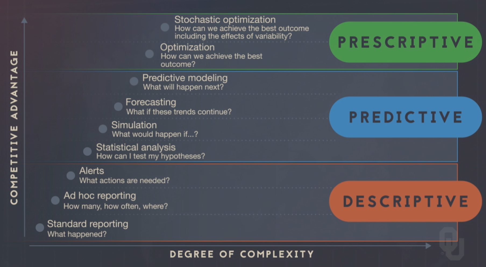

# Intro to Analytics

## Unit Objectives
1. Define the terms of "Analytics/Data Science" and the process encompassed
2. Explain why Data Scientists became a vital resource in businesses
3. Define the concept of Big Data and the dimensions related to it
4. Differentiate the concepts of Data and Knowledge

 

---

## 1. Define the terms of "Analytics/Data Science" and the process encompassed

  
