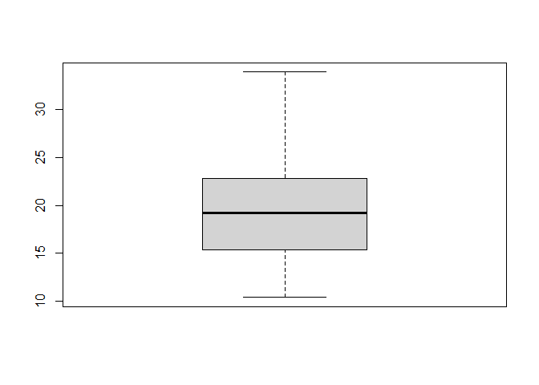
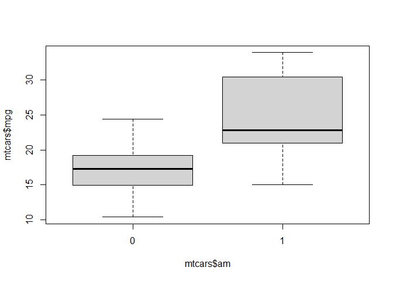

Introduction to R
================
Daniel Carpenter
August 22, 2022

-   <a href="#intro-to-r" id="toc-intro-to-r"><span
    class="toc-section-number">1</span> Intro to R</a>

# Intro to R

``` r
#script used in ISE 5103 class to introduce R


# mtcars is a data frame that is included with the R distribution
data(mtcars)  

# since this is an R packaged dataset, it comes with "help"
help(mtcars)
```

    starting httpd help server ... done

``` r
# lists the first few records
head(mtcars)  
```

                       mpg cyl disp  hp drat    wt  qsec vs am gear carb
    Mazda RX4         21.0   6  160 110 3.90 2.620 16.46  0  1    4    4
    Mazda RX4 Wag     21.0   6  160 110 3.90 2.875 17.02  0  1    4    4
    Datsun 710        22.8   4  108  93 3.85 2.320 18.61  1  1    4    1
    Hornet 4 Drive    21.4   6  258 110 3.08 3.215 19.44  1  0    3    1
    Hornet Sportabout 18.7   8  360 175 3.15 3.440 17.02  0  0    3    2
    Valiant           18.1   6  225 105 2.76 3.460 20.22  1  0    3    1

``` r
# lists the last few records
tail(mtcars) 
```

                    mpg cyl  disp  hp drat    wt qsec vs am gear carb
    Porsche 914-2  26.0   4 120.3  91 4.43 2.140 16.7  0  1    5    2
    Lotus Europa   30.4   4  95.1 113 3.77 1.513 16.9  1  1    5    2
    Ford Pantera L 15.8   8 351.0 264 4.22 3.170 14.5  0  1    5    4
    Ferrari Dino   19.7   6 145.0 175 3.62 2.770 15.5  0  1    5    6
    Maserati Bora  15.0   8 301.0 335 3.54 3.570 14.6  0  1    5    8
    Volvo 142E     21.4   4 121.0 109 4.11 2.780 18.6  1  1    4    2

``` r
# look at the "structure" of the object
str(mtcars)
```

    'data.frame':   32 obs. of  11 variables:
     $ mpg : num  21 21 22.8 21.4 18.7 18.1 14.3 24.4 22.8 19.2 ...
     $ cyl : num  6 6 4 6 8 6 8 4 4 6 ...
     $ disp: num  160 160 108 258 360 ...
     $ hp  : num  110 110 93 110 175 105 245 62 95 123 ...
     $ drat: num  3.9 3.9 3.85 3.08 3.15 2.76 3.21 3.69 3.92 3.92 ...
     $ wt  : num  2.62 2.88 2.32 3.21 3.44 ...
     $ qsec: num  16.5 17 18.6 19.4 17 ...
     $ vs  : num  0 0 1 1 0 1 0 1 1 1 ...
     $ am  : num  1 1 1 0 0 0 0 0 0 0 ...
     $ gear: num  4 4 4 3 3 3 3 4 4 4 ...
     $ carb: num  4 4 1 1 2 1 4 2 2 4 ...

``` r
# To retrieve data in a cell, 
# enter its row and column coordinates 
# in the single square bracket "[]" operator. 
mtcars[1,6]
```

    [1] 2.62

``` r
# to extract one or more rows of data -----------------

mtcars[7,]   # extracts the 7th row of data
```

                mpg cyl disp  hp drat   wt  qsec vs am gear carb
    Duster 360 14.3   8  360 245 3.21 3.57 15.84  0  0    3    4

``` r
mtcars[7:10,] # extracts the 7th-10th rows of data
```

                mpg cyl  disp  hp drat   wt  qsec vs am gear carb
    Duster 360 14.3   8 360.0 245 3.21 3.57 15.84  0  0    3    4
    Merc 240D  24.4   4 146.7  62 3.69 3.19 20.00  1  0    4    2
    Merc 230   22.8   4 140.8  95 3.92 3.15 22.90  1  0    4    2
    Merc 280   19.2   6 167.6 123 3.92 3.44 18.30  1  0    4    4

``` r
mtcars[c(3, 24),]  #extracts rows 3 and 24
```

                mpg cyl disp  hp drat   wt  qsec vs am gear carb
    Datsun 710 22.8   4  108  93 3.85 2.32 18.61  1  1    4    1
    Camaro Z28 13.3   8  350 245 3.73 3.84 15.41  0  0    3    4

``` r
mtcars[mtcars$mpg<15,]  # extracts rows where mpg < 15
```

                         mpg cyl disp  hp drat    wt  qsec vs am gear carb
    Duster 360          14.3   8  360 245 3.21 3.570 15.84  0  0    3    4
    Cadillac Fleetwood  10.4   8  472 205 2.93 5.250 17.98  0  0    3    4
    Lincoln Continental 10.4   8  460 215 3.00 5.424 17.82  0  0    3    4
    Chrysler Imperial   14.7   8  440 230 3.23 5.345 17.42  0  0    3    4
    Camaro Z28          13.3   8  350 245 3.73 3.840 15.41  0  0    3    4

``` r
# extracts rows where mpg > 15 and horsepower > 200
mtcars[mtcars$mpg>15 & mtcars$hp>200,]  
```

                    mpg cyl disp  hp drat   wt qsec vs am gear carb
    Ford Pantera L 15.8   8  351 264 4.22 3.17 14.5  0  1    5    4

``` r
#can also extract rows based on other vectors, e.g. a logical vector

# create a new logical vector that is TRUE if automatic, 
# and FALSE if standard transmission
L <- mtcars$am == 0 
L 
```

     [1] FALSE FALSE FALSE  TRUE  TRUE  TRUE  TRUE  TRUE  TRUE  TRUE  TRUE  TRUE
    [13]  TRUE  TRUE  TRUE  TRUE  TRUE FALSE FALSE FALSE  TRUE  TRUE  TRUE  TRUE
    [25]  TRUE FALSE FALSE FALSE FALSE FALSE FALSE FALSE

``` r
#use this to return only rows with automatic transmission
mtcars[L,]
```

                         mpg cyl  disp  hp drat    wt  qsec vs am gear carb
    Hornet 4 Drive      21.4   6 258.0 110 3.08 3.215 19.44  1  0    3    1
    Hornet Sportabout   18.7   8 360.0 175 3.15 3.440 17.02  0  0    3    2
    Valiant             18.1   6 225.0 105 2.76 3.460 20.22  1  0    3    1
    Duster 360          14.3   8 360.0 245 3.21 3.570 15.84  0  0    3    4
    Merc 240D           24.4   4 146.7  62 3.69 3.190 20.00  1  0    4    2
    Merc 230            22.8   4 140.8  95 3.92 3.150 22.90  1  0    4    2
    Merc 280            19.2   6 167.6 123 3.92 3.440 18.30  1  0    4    4
    Merc 280C           17.8   6 167.6 123 3.92 3.440 18.90  1  0    4    4
    Merc 450SE          16.4   8 275.8 180 3.07 4.070 17.40  0  0    3    3
    Merc 450SL          17.3   8 275.8 180 3.07 3.730 17.60  0  0    3    3
    Merc 450SLC         15.2   8 275.8 180 3.07 3.780 18.00  0  0    3    3
    Cadillac Fleetwood  10.4   8 472.0 205 2.93 5.250 17.98  0  0    3    4
    Lincoln Continental 10.4   8 460.0 215 3.00 5.424 17.82  0  0    3    4
    Chrysler Imperial   14.7   8 440.0 230 3.23 5.345 17.42  0  0    3    4
    Toyota Corona       21.5   4 120.1  97 3.70 2.465 20.01  1  0    3    1
    Dodge Challenger    15.5   8 318.0 150 2.76 3.520 16.87  0  0    3    2
    AMC Javelin         15.2   8 304.0 150 3.15 3.435 17.30  0  0    3    2
    Camaro Z28          13.3   8 350.0 245 3.73 3.840 15.41  0  0    3    4
    Pontiac Firebird    19.2   8 400.0 175 3.08 3.845 17.05  0  0    3    2

``` r
#and this to return only rows that do NOT have automatic transmission
mtcars[!L,]
```

                    mpg cyl  disp  hp drat    wt  qsec vs am gear carb
    Mazda RX4      21.0   6 160.0 110 3.90 2.620 16.46  0  1    4    4
    Mazda RX4 Wag  21.0   6 160.0 110 3.90 2.875 17.02  0  1    4    4
    Datsun 710     22.8   4 108.0  93 3.85 2.320 18.61  1  1    4    1
    Fiat 128       32.4   4  78.7  66 4.08 2.200 19.47  1  1    4    1
    Honda Civic    30.4   4  75.7  52 4.93 1.615 18.52  1  1    4    2
    Toyota Corolla 33.9   4  71.1  65 4.22 1.835 19.90  1  1    4    1
    Fiat X1-9      27.3   4  79.0  66 4.08 1.935 18.90  1  1    4    1
    Porsche 914-2  26.0   4 120.3  91 4.43 2.140 16.70  0  1    5    2
    Lotus Europa   30.4   4  95.1 113 3.77 1.513 16.90  1  1    5    2
    Ford Pantera L 15.8   8 351.0 264 4.22 3.170 14.50  0  1    5    4
    Ferrari Dino   19.7   6 145.0 175 3.62 2.770 15.50  0  1    5    6
    Maserati Bora  15.0   8 301.0 335 3.54 3.570 14.60  0  1    5    8
    Volvo 142E     21.4   4 121.0 109 4.11 2.780 18.60  1  1    4    2

``` r
mtcars[!L,]$mpg  # here is their mpg
```

     [1] 21.0 21.0 22.8 32.4 30.4 33.9 27.3 26.0 30.4 15.8 19.7 15.0 21.4

``` r
#you can also extract columns of data  ---------

mtcars[,1]
```

     [1] 21.0 21.0 22.8 21.4 18.7 18.1 14.3 24.4 22.8 19.2 17.8 16.4 17.3 15.2 10.4
    [16] 10.4 14.7 32.4 30.4 33.9 21.5 15.5 15.2 13.3 19.2 27.3 26.0 30.4 15.8 19.7
    [31] 15.0 21.4

``` r
x <- mtcars[,1]       # can save the results into a variable
head(x)
```

    [1] 21.0 21.0 22.8 21.4 18.7 18.1

``` r
x <- mtcars[,"mpg"]
head(x)
```

    [1] 21.0 21.0 22.8 21.4 18.7 18.1

``` r
x <- mtcars$mpg   # the $ is used to delineate the datframe and var name
head(x)
```

    [1] 21.0 21.0 22.8 21.4 18.7 18.1

``` r
x <- mtcars[,1:3]     # extracts the first 3 columns of data
head(x)
```

                       mpg cyl disp
    Mazda RX4         21.0   6  160
    Mazda RX4 Wag     21.0   6  160
    Datsun 710        22.8   4  108
    Hornet 4 Drive    21.4   6  258
    Hornet Sportabout 18.7   8  360
    Valiant           18.1   6  225

``` r
x <- mtcars[,c("mpg","hp")]   # extracts two specific columns of data
head(x)
```

                       mpg  hp
    Mazda RX4         21.0 110
    Mazda RX4 Wag     21.0 110
    Datsun 710        22.8  93
    Hornet 4 Drive    21.4 110
    Hornet Sportabout 18.7 175
    Valiant           18.1 105

``` r
x <- mtcars[1:5,2:4]    #extracts rows 1-5, and columns 2-4
head(x)
```

                      cyl disp  hp
    Mazda RX4           6  160 110
    Mazda RX4 Wag       6  160 110
    Datsun 710          4  108  93
    Hornet 4 Drive      6  258 110
    Hornet Sportabout   8  360 175

``` r
# returns the number of rows in mtcars
nrow(mtcars)
```

    [1] 32

``` r
# returns the number of columns in mtcars
ncol(mtcars) 
```

    [1] 11

``` r
#basic stats for each variable
summary(mtcars)  
```

          mpg             cyl             disp             hp       
     Min.   :10.40   Min.   :4.000   Min.   : 71.1   Min.   : 52.0  
     1st Qu.:15.43   1st Qu.:4.000   1st Qu.:120.8   1st Qu.: 96.5  
     Median :19.20   Median :6.000   Median :196.3   Median :123.0  
     Mean   :20.09   Mean   :6.188   Mean   :230.7   Mean   :146.7  
     3rd Qu.:22.80   3rd Qu.:8.000   3rd Qu.:326.0   3rd Qu.:180.0  
     Max.   :33.90   Max.   :8.000   Max.   :472.0   Max.   :335.0  
          drat             wt             qsec             vs        
     Min.   :2.760   Min.   :1.513   Min.   :14.50   Min.   :0.0000  
     1st Qu.:3.080   1st Qu.:2.581   1st Qu.:16.89   1st Qu.:0.0000  
     Median :3.695   Median :3.325   Median :17.71   Median :0.0000  
     Mean   :3.597   Mean   :3.217   Mean   :17.85   Mean   :0.4375  
     3rd Qu.:3.920   3rd Qu.:3.610   3rd Qu.:18.90   3rd Qu.:1.0000  
     Max.   :4.930   Max.   :5.424   Max.   :22.90   Max.   :1.0000  
           am              gear            carb      
     Min.   :0.0000   Min.   :3.000   Min.   :1.000  
     1st Qu.:0.0000   1st Qu.:3.000   1st Qu.:2.000  
     Median :0.0000   Median :4.000   Median :2.000  
     Mean   :0.4062   Mean   :3.688   Mean   :2.812  
     3rd Qu.:1.0000   3rd Qu.:4.000   3rd Qu.:4.000  
     Max.   :1.0000   Max.   :5.000   Max.   :8.000  

``` r
#and individual stats
mean(mtcars$mpg)
```

    [1] 20.09062

``` r
mad(mtcars$mpg)
```

    [1] 5.41149

``` r
sd(mtcars$mpg)
```

    [1] 6.026948

``` r
library()   #shows all installed packages

search()  #show all packages currently loaded in the library
```

     [1] ".GlobalEnv"        "tools:quarto"      "package:stats"    
     [4] "package:graphics"  "package:grDevices" "package:utils"    
     [7] "package:datasets"  "package:methods"   "Autoloads"        
    [10] "package:base"     

``` r
#to display all of the data that is available in loaded packages
data()


library(help = "stats")

#can also access help through the "packages" window

# the "?" command is a shortcut for getting help
?fivenum

fivenum(mtcars$mpg)   #Tukey's five number for mpg
```

    [1] 10.40 15.35 19.20 22.80 33.90

``` r
boxplot(mtcars$mpg)   #same values depicted on a boxplot
```



``` r
?boxplot   #get help for the boxplot function

#using the formula input
boxplot(mtcars$mpg ~ mtcars$am)
```



``` r
#the basic graphics package has several useful tools

# histograms
hist(mtcars$mpg)
```


``` r
hist(mtcars$hp)
```


``` r
#scatterplots
plot(mtcars$mpg ~ mtcars$hp)


#the basic packages are not enough!  
#install packages in the "Packages" window

#for example -- install the Hmisc package 

library(Hmisc)             # and load them as well...
```

    Warning: package 'Hmisc' was built under R version 4.1.3

    Loading required package: lattice
    Loading required package: survival
    Loading required package: Formula
    Loading required package: ggplot2

    Attaching package: 'Hmisc'

    The following objects are masked from 'package:base':

        format.pval, units


``` r
describe(mtcars)           # package Hmisc contains the "describe" function
```

    mtcars 

     11  Variables      32  Observations
    --------------------------------------------------------------------------------
    mpg 
           n  missing distinct     Info     Mean      Gmd      .05      .10 
          32        0       25    0.999    20.09    6.796    12.00    14.34 
         .25      .50      .75      .90      .95 
       15.43    19.20    22.80    30.09    31.30 

    lowest : 10.4 13.3 14.3 14.7 15.0, highest: 26.0 27.3 30.4 32.4 33.9
    --------------------------------------------------------------------------------
    cyl 
           n  missing distinct     Info     Mean      Gmd 
          32        0        3    0.866    6.188    1.948 
                                
    Value          4     6     8
    Frequency     11     7    14
    Proportion 0.344 0.219 0.438
    --------------------------------------------------------------------------------
    disp 
           n  missing distinct     Info     Mean      Gmd      .05      .10 
          32        0       27    0.999    230.7    142.5    77.35    80.61 
         .25      .50      .75      .90      .95 
      120.83   196.30   326.00   396.00   449.00 

    lowest :  71.1  75.7  78.7  79.0  95.1, highest: 360.0 400.0 440.0 460.0 472.0
    --------------------------------------------------------------------------------
    hp 
           n  missing distinct     Info     Mean      Gmd      .05      .10 
          32        0       22    0.997    146.7    77.04    63.65    66.00 
         .25      .50      .75      .90      .95 
       96.50   123.00   180.00   243.50   253.55 

    lowest :  52  62  65  66  91, highest: 215 230 245 264 335
    --------------------------------------------------------------------------------
    drat 
           n  missing distinct     Info     Mean      Gmd      .05      .10 
          32        0       22    0.997    3.597   0.6099    2.853    3.007 
         .25      .50      .75      .90      .95 
       3.080    3.695    3.920    4.209    4.314 

    lowest : 2.76 2.93 3.00 3.07 3.08, highest: 4.08 4.11 4.22 4.43 4.93
    --------------------------------------------------------------------------------
    wt 
           n  missing distinct     Info     Mean      Gmd      .05      .10 
          32        0       29    0.999    3.217    1.089    1.736    1.956 
         .25      .50      .75      .90      .95 
       2.581    3.325    3.610    4.048    5.293 

    lowest : 1.513 1.615 1.835 1.935 2.140, highest: 3.845 4.070 5.250 5.345 5.424
    --------------------------------------------------------------------------------
    qsec 
           n  missing distinct     Info     Mean      Gmd      .05      .10 
          32        0       30        1    17.85    2.009    15.05    15.53 
         .25      .50      .75      .90      .95 
       16.89    17.71    18.90    19.99    20.10 

    lowest : 14.50 14.60 15.41 15.50 15.84, highest: 19.90 20.00 20.01 20.22 22.90
    --------------------------------------------------------------------------------
    vs 
           n  missing distinct     Info      Sum     Mean      Gmd 
          32        0        2    0.739       14   0.4375   0.5081 

    --------------------------------------------------------------------------------
    am 
           n  missing distinct     Info      Sum     Mean      Gmd 
          32        0        2    0.724       13   0.4062    0.498 

    --------------------------------------------------------------------------------
    gear 
           n  missing distinct     Info     Mean      Gmd 
          32        0        3    0.841    3.688   0.7863 
                                
    Value          3     4     5
    Frequency     15    12     5
    Proportion 0.469 0.375 0.156
    --------------------------------------------------------------------------------
    carb 
           n  missing distinct     Info     Mean      Gmd 
          32        0        6    0.929    2.812    1.718 

    lowest : 1 2 3 4 6, highest: 2 3 4 6 8
                                                  
    Value          1     2     3     4     6     8
    Frequency      7    10     3    10     1     1
    Proportion 0.219 0.312 0.094 0.312 0.031 0.031
    --------------------------------------------------------------------------------
