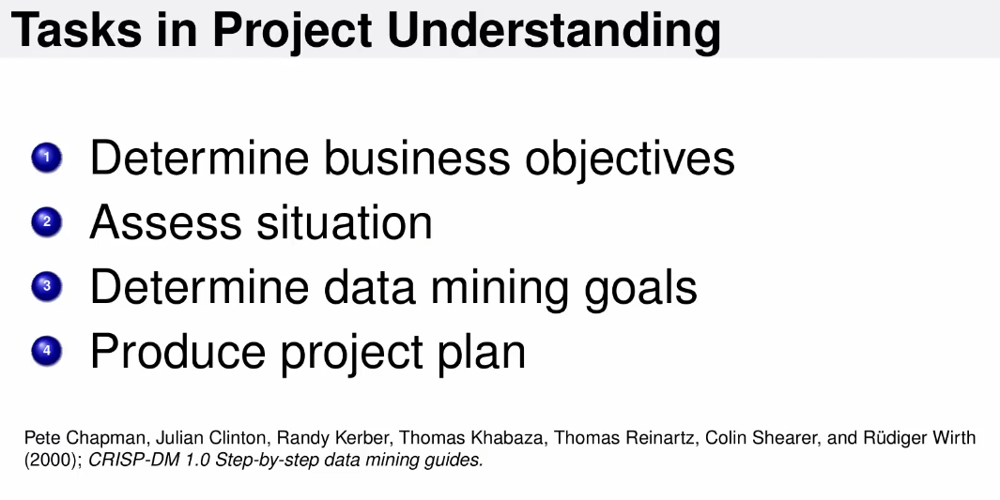
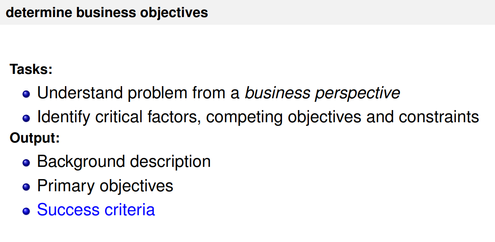
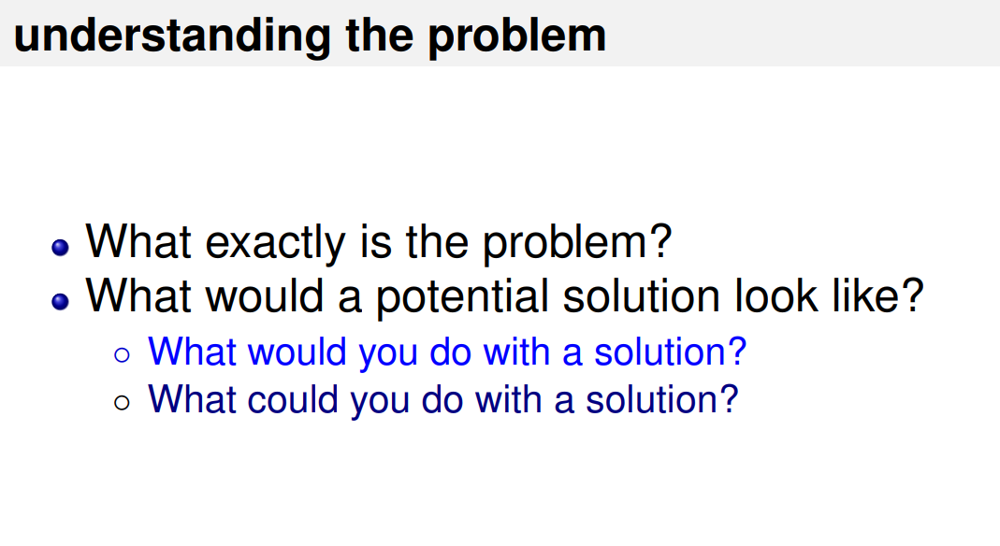
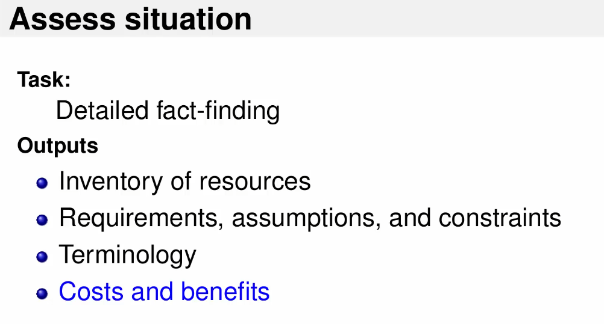
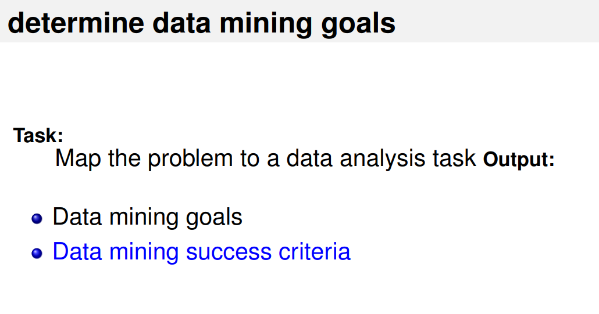
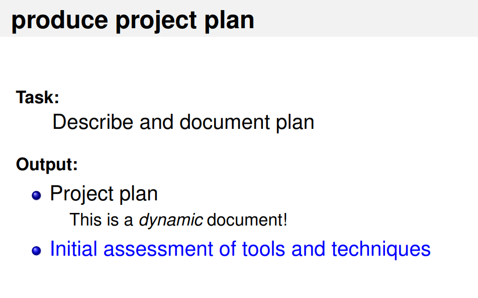

# Project Understanding
> 1st Stage of C-DM Model

## Steps
 

### 1. Determine Business Objectives
 
 

### 2. Assess Situation
 

### 3. Determine Data Mining Goals
 

### 4. Produce Project Plan
 
