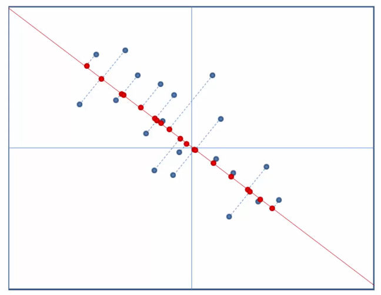
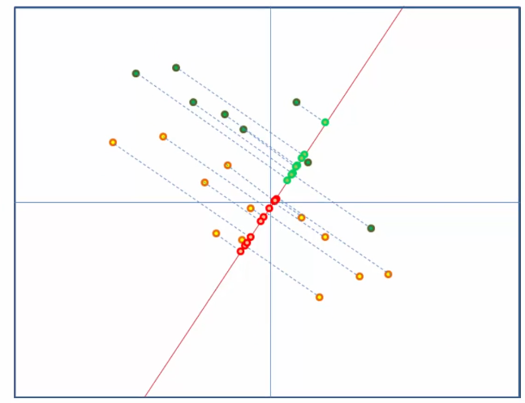

4+ More Dimension Reduction!
================
Daniel Carpenter

-   <a href="#objectives" id="toc-objectives">1 Objectives</a>
-   <a href="#why-is-large-dimensions-bad"
    id="toc-why-is-large-dimensions-bad">2 Why is Large Dimensions Bad?</a>
-   <a href="#goals-of-dimension-reduction"
    id="toc-goals-of-dimension-reduction">3 Goals of Dimension Reduction</a>
-   <a href="#overview-of-dim.-reduction"
    id="toc-overview-of-dim.-reduction">4 Overview of Dim. Reduction</a>

## Objectives

-   Explain how **Principal Component Analysis** works and outline the
    motivation of using dimension reduction techniques

-   Compare and contrast `PCA`, `LDA`, and `t-SNE`

-   Perform `PCA`, `LDA`, and `t-SNE` in **`R`** and **visualize** the
    results

-   **Interpret** dimension reduction results

## Why is Large Dimensions Bad?

-   Algorithms become meaningless

-   Algorithms could increase in size and complexity

-   Hard to visualize in more than 3 dimensions  

## Goals of Dimension Reduction

-   Feature: function of the original data

-   Feature Extraction: defining set of features that represent
    information important to analysis

## Overview of Dim. Reduction

-   Could be linear or non-linear

### Goals

|                    |                                                            |
|--------------------|------------------------------------------------------------|
| **Representation** | Represent the data accurately in a lower dimensional space |
| **Classification** | enhance the information in a lower dimension space         |

### Common Techniques

<table>
<colgroup>
<col style="width: 30%" />
<col style="width: 69%" />
</colgroup>
<tbody>
<tr class="odd">
<td><code>PCA</code> (Principal Component Analysis)</td>
<td>
Representation Method to preserve variance.

Project data onto a lower dimension using PCA:

Good for classification (divides dataset)
</td>
</tr>
<tr class="even">
<td><code>LDA</code> (Linear Discriminant Analysis)</td>
<td>
Classification that <strong>enhances separability</strong>

Useful when you already have classes of data. E.g. below could be for
Male and female

</td>
</tr>
</tbody>
</table>
