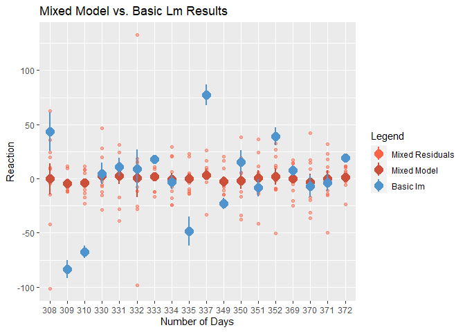
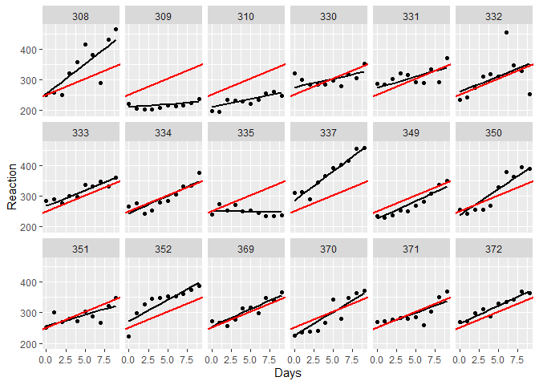
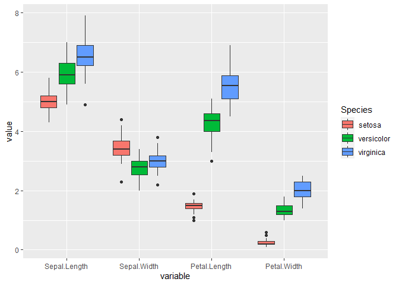
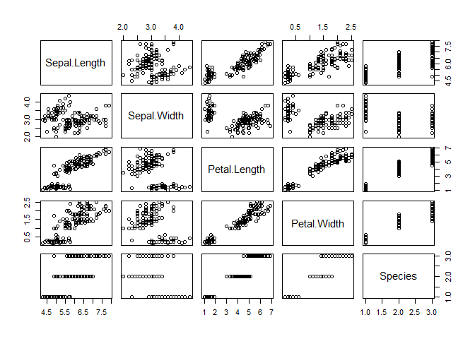
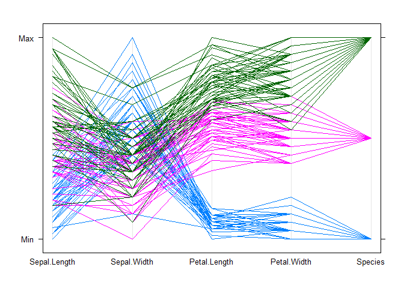
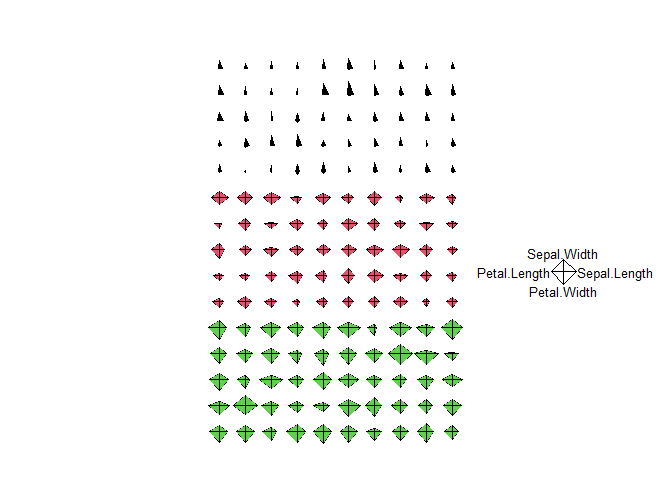
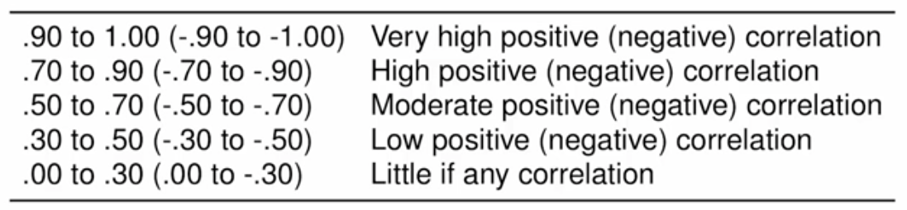
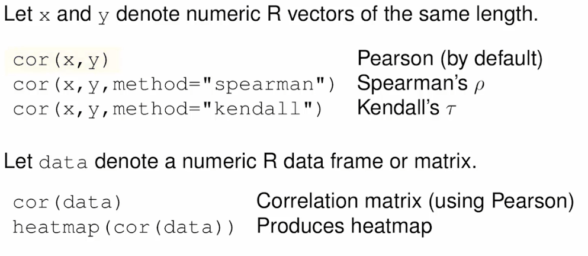
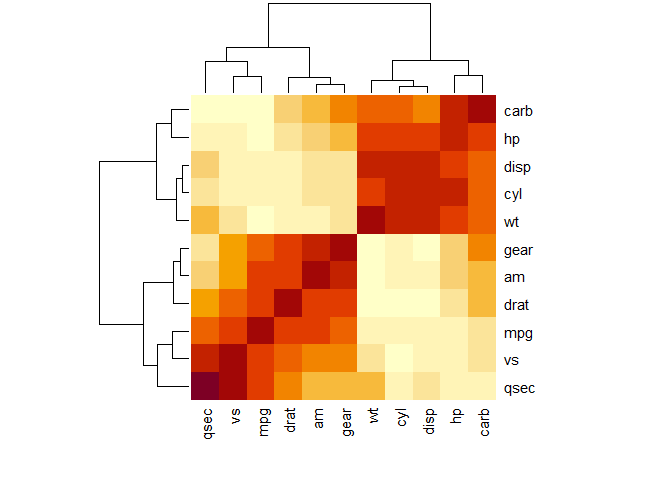

Data Understanding: 2nd Stage of C-DM Model
================
Daniel Carpenter

-   <a href="#resources" id="toc-resources"><span
    class="toc-section-number">1</span> Resources</a>
-   <a href="#data-quality" id="toc-data-quality"><span
    class="toc-section-number">2</span> Data Quality</a>
-   <a href="#visualization-in-r" id="toc-visualization-in-r"><span
    class="toc-section-number">3</span> Visualization in R</a>
    -   <a href="#exploring" id="toc-exploring"><span
        class="toc-section-number">3.1</span> Exploring</a>
    -   <a href="#mixed-models" id="toc-mixed-models"><span
        class="toc-section-number">3.2</span> Mixed Models</a>
    -   <a href="#ggplot-examples" id="toc-ggplot-examples"><span
        class="toc-section-number">3.3</span> <code>ggplot</code> Examples</a>
-   <a href="#correlation" id="toc-correlation"><span
    class="toc-section-number">4</span> Correlation</a>
    -   <a href="#corr-pearson-spearman-and-kendall"
        id="toc-corr-pearson-spearman-and-kendall"><span
        class="toc-section-number">4.1</span> Corr: Pearson, Spearman and
        Kendall</a>
    -   <a href="#in-r" id="toc-in-r"><span
        class="toc-section-number">4.2</span> In <code>R</code></a>
    -   <a href="#concordant-and-discordant-pairs"
        id="toc-concordant-and-discordant-pairs"><span
        class="toc-section-number">4.3</span> <code>Concordant</code> and
        <code>discordant</code> pairs</a>
-   <a href="#outliers" id="toc-outliers"><span
    class="toc-section-number">5</span> Outliers</a>
-   <a href="#missing-values" id="toc-missing-values"><span
    class="toc-section-number">6</span> Missing Values</a>
-   <a href="#principal-component-analysis-dimension-reduction"
    id="toc-principal-component-analysis-dimension-reduction"><span
    class="toc-section-number">7</span>
    <code>Principal Component Analysis</code> &amp;
    <code>dimension reduction</code></a>
-   <a href="#principal-component-analysis-in-r"
    id="toc-principal-component-analysis-in-r"><span
    class="toc-section-number">8</span> Principal Component Analysis in
    <code>R</code></a>

# Resources

-   [R for Data Science](https://r4ds.had.co.nz/)
-   [R Visualization](https://r-graph-gallery.com/index.html)
    -   [Visualization best
        practices](https://www.data-to-viz.com/caveats.html)
    -   [Animate ggplot](https://r-graph-gallery.com/animation.html)
    -   [Deciding on a
        visualization](https://www.data-to-viz.com/img/poster/poster_big.png)

<br> <br>

> Using visualization to understand the data  
> Reduce dimension of data for analysis

# Data Quality

Main elements to check for in dataset:

-   Accuracy *(errors)*
-   Completeness: *(selection bias)*
-   Timeliness *(Recency)*

<br>

# Visualization in R

Two Motivations of visuals:

## Exploring

Looking at data for

-   Outliers, highly skewed distributions
-   Correlations among variables
-   Truncated values; inexplicable values
-   Potential relationships and patterns

### Exploration based on number of datas

| Type                  | Visualization Options                                                         |
|-----------------------|-------------------------------------------------------------------------------|
| Univariate analyses   | descriptive statistics, frequency tables, histograms and densities, box plots |
| Bivariate analyses    | correlations and heatmaps, scatterplots, trends, cross tabulations            |
| Multivariate analyses | parallel plots, mosaic plots, regression, PCA, MDS, variable clustering       |

## Mixed Models

### What are Mixed Models?

-   Trade off between regression on multiple groups, and more meaningful
    aggregation
-   Looks at trends in groups and overall trend of data

### Visualizing Mixed Model: Plus fitted vs. Residuals

``` r
if (!require(lme4)) install.packages('lme4') # lmer function for mixed model
data(sleepstudy,package="lme4")

# Mixed linear model
mixed <- lmer(Reaction ~ Days + (1+Days|Subject), data=sleepstudy)
summary(mixed)
```

    Linear mixed model fit by REML ['lmerMod']
    Formula: Reaction ~ Days + (1 + Days | Subject)
       Data: sleepstudy

    REML criterion at convergence: 1743.6

    Scaled residuals: 
        Min      1Q  Median      3Q     Max 
    -3.9536 -0.4634  0.0231  0.4634  5.1793 

    Random effects:
     Groups   Name        Variance Std.Dev. Corr
     Subject  (Intercept) 612.10   24.741       
              Days         35.07    5.922   0.07
     Residual             654.94   25.592       
    Number of obs: 180, groups:  Subject, 18

    Fixed effects:
                Estimate Std. Error t value
    (Intercept)  251.405      6.825  36.838
    Days          10.467      1.546   6.771

    Correlation of Fixed Effects:
         (Intr)
    Days -0.138

``` r
sleepstudy$res_mix <- residuals(mixed) #residuals mixed model

# Basic linear model
linModel <- lm(data=sleepstudy, Reaction~Days)
summary(linModel)
```


    Call:
    lm(formula = Reaction ~ Days, data = sleepstudy)

    Residuals:
         Min       1Q   Median       3Q      Max 
    -110.848  -27.483    1.546   26.142  139.953 

    Coefficients:
                Estimate Std. Error t value Pr(>|t|)    
    (Intercept)  251.405      6.610  38.033  < 2e-16 ***
    Days          10.467      1.238   8.454 9.89e-15 ***
    ---
    Signif. codes:  0 '***' 0.001 '**' 0.01 '*' 0.05 '.' 0.1 ' ' 1

    Residual standard error: 47.71 on 178 degrees of freedom
    Multiple R-squared:  0.2865,    Adjusted R-squared:  0.2825 
    F-statistic: 71.46 on 1 and 178 DF,  p-value: 9.894e-15

``` r
# Capture fitted vs. residual data of linear model
sleepstudy$res <- residuals(linModel)
sleepstudy$fit <- predict(linModel)


# Compare results of mixed lm and basic lm
ggplot(sleepstudy, aes(x=Subject, y=res_mix)) +
  geom_point(aes(color = 'Mixed Residuals'),
             alpha = 0.5) +
  
  # Residuals of the new mixed model
  stat_summary(aes(color = 'Mixed Model'), size=1) +
  
  # Residuals of the old lm model
  stat_summary(aes(y=res, color='Basic lm'), size=1) +
  
  scale_color_manual(name='Legend',
                     breaks=c('Mixed Residuals', 'Mixed Model', 'Basic lm'),
                     
                     # Map the colors
                     values=c('Mixed Residuals' = 'tomato', 
                              'Mixed Model'     = 'tomato3', 
                              'Basic lm'        = 'steelblue3')) +
  
  labs(title = 'Mixed Model vs. Basic Lm Results',
       y     = 'Reaction',
       x     = 'Number of Days')
```

    No summary function supplied, defaulting to `mean_se()`
    No summary function supplied, defaulting to `mean_se()`



``` r
# Overall mean intercept and slope
mean_int <- fixef(mixed)[1] #mean intercept for the mixed model
mean_slope <- fixef(mixed)[2] #mean slope for the mixed model

sleepstudy$fit_mix <- predict(mixed) #fitted values from the mixed model

# Fitted vs actuals
ggplot(sleepstudy, aes(x=Days, y=Reaction)) +
  geom_point() +
  facet_wrap(~Subject, nrow=3) +
  
  # Line for fitted values of the mixed model
  geom_line(aes(y=fit_mix), size=.75) +
  
  # Fixed line of the overall slop and intercept
  geom_abline(intercept=mean_int, slope=mean_slope, color="red", size=.75)
```



## `ggplot` Examples

### Load data

### 

``` r
data(iris)     # make sure data is loaded   (the iris data is part of the standard R distribution)
head(iris)     # look at the first few records
```

      Sepal.Length Sepal.Width Petal.Length Petal.Width Species
    1          5.1         3.5          1.4         0.2  setosa
    2          4.9         3.0          1.4         0.2  setosa
    3          4.7         3.2          1.3         0.2  setosa
    4          4.6         3.1          1.5         0.2  setosa
    5          5.0         3.6          1.4         0.2  setosa
    6          5.4         3.9          1.7         0.4  setosa

``` r
# ?iris          # access 'help' on the iris data  

#perform a frequency count for the Species
table(iris$Species)
```


        setosa versicolor  virginica 
            50         50         50 

### box plots

``` r
boxplot(data=iris, Sepal.Length ~ Species,           # boxplot of Sepal.Length by Species 
        main = "Iris Sepal Length by Species ",      # main plot title
        xlab = "Species",                            # x-axis label   
        ylab = "Sepal Length (cm)")                  # y-axis label   
```


``` r
# if you want to save the plot as an image, you can 
# either use the "export" functionality in the Plots tab window in RStudio, 
# or you can use do this programmatically...  e.g. to save as a pdf use: pdf("filename.pdf")
# and then run the plot.  This redirects all graphics output to the pdf file.
# You can set the size (in inches) for the pdf output.
# To redirect back to the screen, turn off the "pdf device" using: dev.off()
# See example:


pdf("irisBoxplot.pdf",width=8, height=6)    #this will re-direct your graphic output to a pdf file

boxplot(data=iris, Sepal.Length ~ Species,           # boxplot of Sepal.Length by Species 
        main = "Iris Sepal Length by Species ",      # main plot title
        xlab = "Species",                            # x-axis label   
        ylab = "Sepal Length (cm)")                  # y-axis label   

dev.off()
```

    png 
      2 

### histograms and densities

``` r
#some very simple to code, quick and dirty histograms
# perfect for quickly exploring the data

par(mfrow=c(2,2))  #OPTIONAL: change the graphical parameters so the histograms are produced 4 to a page
#see ?par for more details on setting graphical parameters

hist(iris$Sepal.Length)
hist(iris$Sepal.Width)
hist(iris$Petal.Length)
hist(iris$Petal.Width)
```


``` r
#NOTE:  we could have made these look better, e.g. with better titles and labels


hist(iris$Sepal.Length, main = "Sepal Length", xlab = "Sepal Length")
hist(iris$Sepal.Width,  main = "Sepal Width", xlab = "Sepal Width")
hist(iris$Petal.Length, main = "Petal Length", xlab = "Petal Length")
hist(iris$Petal.Width,  main = "Petal Width", xlab = "Petal Width")
```


``` r
# but, usually when I am exploring the data, I will use the simple verison


par(mfrow=c(1,1))  #RESET graphical parameters to 1 plot per page


#for a final report or publication, I would use better graphics: ggplot2
#here is a basic example...
```

### `ggplot`

``` r
# ggplot2 is the "grammar of graphics" plot library and produces excellent graphics
library(ggplot2)

#qplot is one of the main functions in ggplot2 -- it is short for "quick plot"
#qplot allows you to do histograms, scatterplots, boxplots, line plots, etc.

qplot(data=iris, Petal.Length)
```

    `stat_bin()` using `bins = 30`. Pick better value with `binwidth`.


``` r
#or you can set several options to modify the output

qplot(data=iris, Petal.Length,                       #identify data & variable
      geom="histogram",                   #set the "geometry"
      binwidth=0.2,                       #option for histogram
      main= "Histogram for Petal Length", #title
      xlab = "Petal Length",              #x-axis label
      fill=I("blue"),                     #fill color
      alpha=I(0.45))                      #set fill transparency
```


``` r
#ggplot is the primary function in ggplot2
#it allows for much more control over the graphics than qplot does
```

### Density

``` r
#for the next chart, I want to produce a density

library(reshape2)  #this package allows us to reform the data from a "wide" format to a "long" format
iris2<- melt(iris)
```

    Using Species as id variables

``` r
#identify data and set the aesthetics         
ggplot(iris2[iris2$variable=="Petal.Length",], aes(x=value, fill=Species)) +
  geom_density(alpha=0.45) +        #set geometry and transparency    
  labs(x = "Petal Length",          #set x-label and title
       title = "Densities for Petal Length of Iris Species")
```


``` r
#we can also use gplot to produce more advanced boxplots
ggplot(iris2,aes(x=variable, y=value, fill=Species)) + geom_boxplot()
```



### Scatter

``` r
#scatter plots --------------------------------------

# create scatter plots for the numerical data in the iris data set
plot(iris)
```



``` r
# qplot and ggplot allow you to add many options and control many settings
# in graphs -- this can look quite confusing at first
# however, most of the parameter settings are optional and have defaults if not set
# the following bit of code might seem a bit overwhelming at first,
# but most of the complexity is related to setting up colors, sizes, styles, and labels


# using qplot a.k.a "quickplot" to produce scatter plot
qplot(data=iris, x=Sepal.Length,y=Sepal.Width,size=I(5)) +   # point size=5 
  theme_bw() +                                               # using black and white background theme
  labs(y = "Sepal Width (cm)",                               # x-axis labels    
       x = "Sepal Length (cm)")                              # y-axis labels
```


``` r
# using ggplot a.k.a "grammar of graphics plot" to produce scatter plot
ggplot(data=iris, aes(x=Sepal.Length,y=Sepal.Width)) +        # set data and aesthetics
  geom_point(aes(fill=Species),                               # add points (fill color based on "Species")
             colour="black",                                  # -- outline set to black
             pch=21,                                          # -- shape = 21, a filled circle
             size=5) +                                        # -- size = 5
  theme_bw() +                                                # using black and white background theme
  labs(y = "Sepal Width (cm)",                                # x-axis labels 
       x = "Sepal Length (cm)") +                             # x-axis labels    
  theme(legend.position = "none")                             # turn legend off
```


``` r
ggplot(data=iris, aes(x=Sepal.Length,y=Sepal.Width)) +  
  geom_point(aes(fill=Species), colour="black",pch=21, size=5) +
  theme_bw() +
  labs(y = "Sepal Width (cm)",
       x = "Sepal Length (cm)") +
  theme(legend.key=element_blank())                         # legend is on, but the outline is off
```


``` r
ggplot(data=iris, aes(x=Petal.Length,y=Petal.Width)) +  
  geom_point(aes(fill=Species),   
             alpha=I(.85),                               # alpha (i.e. opacity) is set to 0.85
             colour="black",pch=21, size=5) +
  theme_bw() +
  labs(y = "Petal Width (cm)",
       x = "Petal Length (cm)") +
  theme(legend.key=element_blank(),
        axis.title = element_text(size = 14))            # set axis title font size to 14
```


``` r
ggplot(data=iris, aes(x=Petal.Length,y=Petal.Width)) + 
  geom_point(aes(fill=Species), 
             alpha=I(.75),                               # alpha (i.e. opacity) is set to 0.75
             position = "jitter",                        # "jitter" the position of the points
             colour="black",pch=21, size=5) +
  theme_bw() +
  labs(y = "Petal Width (cm)",
       x = "Petal Length (cm)") +
  theme(legend.key=element_blank(),
        axis.title = element_text(size = 14))
```


``` r
# a "pairs" plot that incorporates densities, scatterplots, and correlations
```

### Interactive

``` r
library(GGally)   #adds some more functionality to ggplot2 -- including pairs and parallel plots


ggpairs(iris[, 1:5], lower=list(continuous="smooth", wrap=c(colour="blue")),
        diag=list(wrap=c(colour="blue")), 
        upper=list(wrap=list(corSize=6)), axisLabels='show')
```

    `stat_bin()` using `bins = 30`. Pick better value with `binwidth`.
    `stat_bin()` using `bins = 30`. Pick better value with `binwidth`.
    `stat_bin()` using `bins = 30`. Pick better value with `binwidth`.
    `stat_bin()` using `bins = 30`. Pick better value with `binwidth`.


### parallel plots

``` r
library(lattice)                                            #load the "lattice" library for parallel plots
parallelplot(~iris[1:5], data=iris,                         # create parallel plot of iris data;
             groups = Species,                            # use "Species" to define groups (and colors)
             horizontal.axis = FALSE)                                    # defaults to horizontal axis, set to vertical                           
```



``` r
#parallelplot help documentation -- the input is unfortunately a little different with the ~ symbol
# ?parallelplot


parallelplot(~iris[1:4] | Species, data = iris,             #same as above, except condition the plot by Species
             groups = Species,   
             horizontal.axis = FALSE, 
             scales = list(x = list(rot = 90)))            #and rotate the labels on the x-axis
```


``` r
# you can kind of go crazy with some of this stuff too...
# parallel plots + boxplots = maybe too messy to be useful?  let's see

# underlay univariate boxplots, add title, using a function from GGally
ggparcoord(data = iris,columns = c(1:4),groupColumn = 5,
           boxplot = TRUE,title = "Parallel Coord. Plot of Diamonds Data")
```


### Radar

``` r
#my embarassingly bad radar plot in R...
# install.packages("fmsb")
library(fmsb)
radarchart(iris[,1:4], maxmin=FALSE, centerzero=TRUE)
```


``` r
#my pitiful looking stars plot....
stars(iris[,1:4], radius=TRUE, key.loc = c(30,15), ncol=10, nrow= 15, col.stars = iris$Species)
```



<br>

# Correlation

-   Starting point for the analysis
-   Good for dimension reduction

<br>

## Corr: Pearson, Spearman and Kendall

| Name     | Use                         | Test                                                                                                                            |
|----------|-----------------------------|---------------------------------------------------------------------------------------------------------------------------------|
| Pearson  | Only *Linear* relationships | R is square root of R-Squared. <br> Note **VERY sensitive** to extreme values <br>  |
| Spearman | Both linear/non-linear      | Rank correlation for shotgun data. <br> More sensitive to few large values and descrepemses                                     |
| Kendall  |                             | Rank again, but degree of concordance                                                                                           |

<br>

## In `R`



### Heatmap

``` r
knitr::kable(cor(mtcars) ) # raw
```

|      |        mpg |        cyl |       disp |         hp |       drat |         wt |       qsec |         vs |         am |       gear |       carb |
|:-----|-----------:|-----------:|-----------:|-----------:|-----------:|-----------:|-----------:|-----------:|-----------:|-----------:|-----------:|
| mpg  |  1.0000000 | -0.8521620 | -0.8475514 | -0.7761684 |  0.6811719 | -0.8676594 |  0.4186840 |  0.6640389 |  0.5998324 |  0.4802848 | -0.5509251 |
| cyl  | -0.8521620 |  1.0000000 |  0.9020329 |  0.8324475 | -0.6999381 |  0.7824958 | -0.5912421 | -0.8108118 | -0.5226070 | -0.4926866 |  0.5269883 |
| disp | -0.8475514 |  0.9020329 |  1.0000000 |  0.7909486 | -0.7102139 |  0.8879799 | -0.4336979 | -0.7104159 | -0.5912270 | -0.5555692 |  0.3949769 |
| hp   | -0.7761684 |  0.8324475 |  0.7909486 |  1.0000000 | -0.4487591 |  0.6587479 | -0.7082234 | -0.7230967 | -0.2432043 | -0.1257043 |  0.7498125 |
| drat |  0.6811719 | -0.6999381 | -0.7102139 | -0.4487591 |  1.0000000 | -0.7124406 |  0.0912048 |  0.4402785 |  0.7127111 |  0.6996101 | -0.0907898 |
| wt   | -0.8676594 |  0.7824958 |  0.8879799 |  0.6587479 | -0.7124406 |  1.0000000 | -0.1747159 | -0.5549157 | -0.6924953 | -0.5832870 |  0.4276059 |
| qsec |  0.4186840 | -0.5912421 | -0.4336979 | -0.7082234 |  0.0912048 | -0.1747159 |  1.0000000 |  0.7445354 | -0.2298609 | -0.2126822 | -0.6562492 |
| vs   |  0.6640389 | -0.8108118 | -0.7104159 | -0.7230967 |  0.4402785 | -0.5549157 |  0.7445354 |  1.0000000 |  0.1683451 |  0.2060233 | -0.5696071 |
| am   |  0.5998324 | -0.5226070 | -0.5912270 | -0.2432043 |  0.7127111 | -0.6924953 | -0.2298609 |  0.1683451 |  1.0000000 |  0.7940588 |  0.0575344 |
| gear |  0.4802848 | -0.4926866 | -0.5555692 | -0.1257043 |  0.6996101 | -0.5832870 | -0.2126822 |  0.2060233 |  0.7940588 |  1.0000000 |  0.2740728 |
| carb | -0.5509251 |  0.5269883 |  0.3949769 |  0.7498125 | -0.0907898 |  0.4276059 | -0.6562492 | -0.5696071 |  0.0575344 |  0.2740728 |  1.0000000 |

``` r
heatmap(cor(mtcars))       # visual
```



<br>

## `Concordant` and `discordant` pairs

<br>

# Outliers

<br>

# Missing Values

<br>

# `Principal Component Analysis` & `dimension reduction`

<br>

# Principal Component Analysis in `R`

<br>
