Pricipal Component Analysis (PCA)
================
Daniel Carpenter

-   <a href="#overview" id="toc-overview"><span
    class="toc-section-number">1</span> Overview</a>
-   <a href="#math-behind-pca" id="toc-math-behind-pca"><span
    class="toc-section-number">2</span> Math Behind PCA</a>
-   <a href="#conceptual-example-of-pca"
    id="toc-conceptual-example-of-pca"><span
    class="toc-section-number">3</span> Conceptual Example of PCA</a>
-   <a href="#pca-example-in-r" id="toc-pca-example-in-r"><span
    class="toc-section-number">4</span> PCA Example in <code>R</code></a>

Reading: Applied Predictive Modeling: 3.3

## Overview

-   Relies on highly correlated data. Some of the data in redundant

-   Goal is to maintain the same variance as the upper level dimension

### Data Requirements

Data must be:

-   Z-score standardized. Can scale with `prcomp(data, scale = TRUE)`

-   Mean centered

-   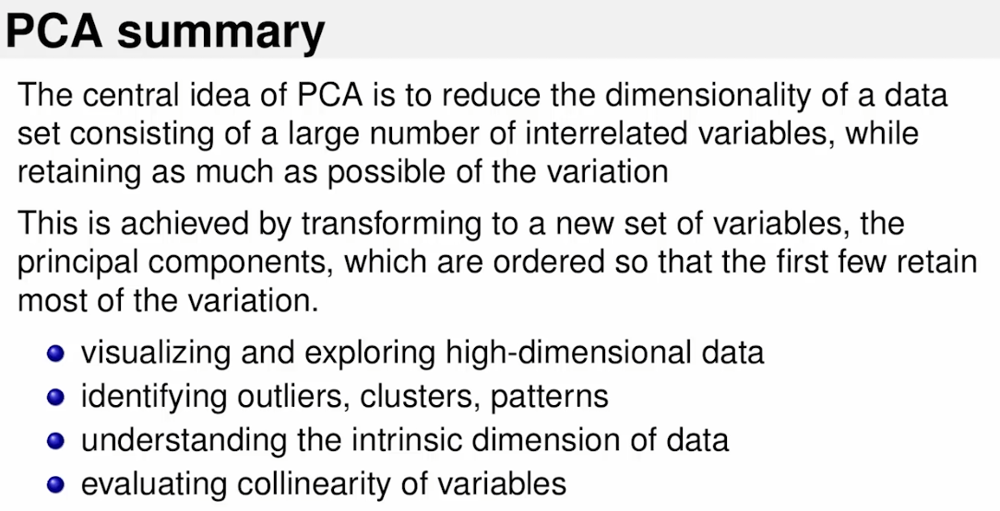

### Example 1: Rotation of Data

#### Goes from 2D to 1D on highly correlated data

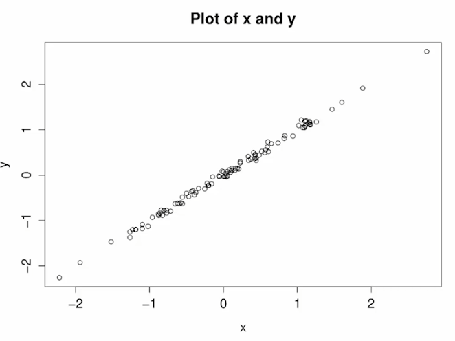

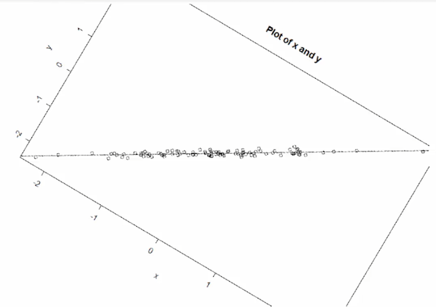

## Math Behind PCA

<table>
<colgroup>
<col style="width: 17%" />
<col style="width: 82%" />
</colgroup>
<tbody>
<tr class="odd">
<td>Variance</td>
<td>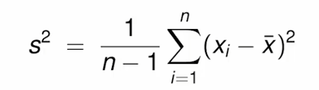</td>
</tr>
<tr class="even">
<td>Covariance Matrix</td>
<td>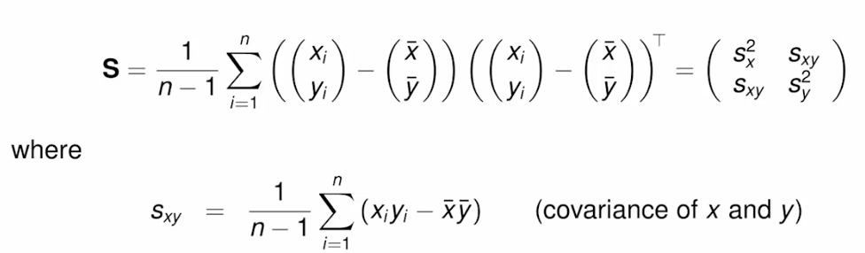</td>
</tr>
<tr class="odd">
<td>Solution to PCA</td>
<td><p>Make a judgement call on the % of variation that you contain.</p>
<ul>
<li><p>Why do you have to make the call?</p></li>
<li><p>Because maybe you need 2-3 variables for visualization, but 4
PC’s are given.</p></li>
<li><p>Adjusting <code>q</code> could give you <strong>less
variables</strong>, at the <strong>expense of the
representatives</strong></p></li>
</ul>
<p>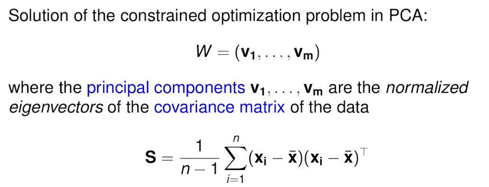</p>
<p>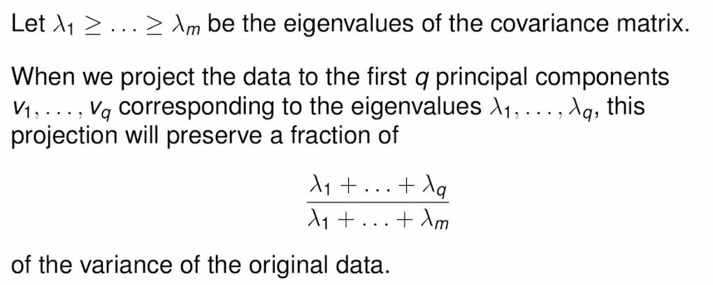</p></td>
</tr>
<tr class="even">
<td>Normalization</td>
<td><p>Each Attribute should contribute equally to the overall
variance</p>
<p></p></td>
</tr>
</tbody>
</table>

## Conceptual Example of PCA

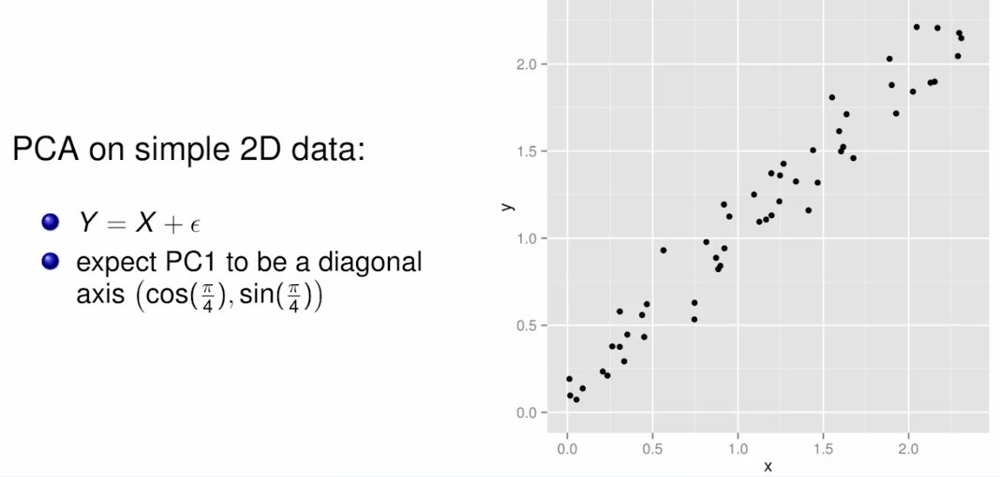

### Two possible principal components:

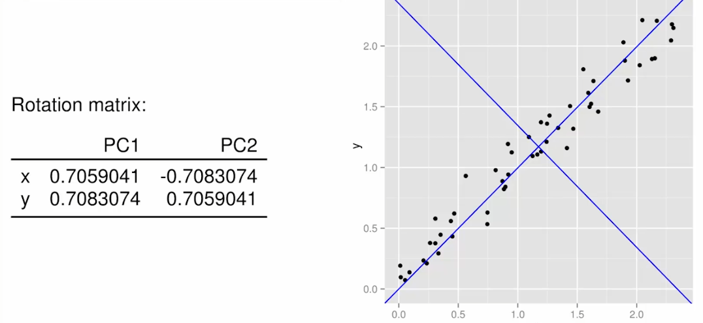

### How do the two PC’s perform?

-   PC 1 explains 99% of the variance

-   PC 2 explains 00% of the variance

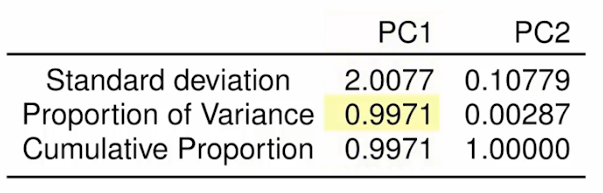

## PCA Example in `R`

``` r
library(datasets)
library(scatterplot3d)
library(rgl)
library(ggplot2)


#to install ggbiplot, first install and load "devtools"
#then download ggbiplot from CRAN then load
#----------------------------------------------------------
# install.packages("devtools")
# library(devtools)
# install_github("vqv/ggbiplot")
library(ggbiplot)
```

    Loading required package: plyr

    Loading required package: scales

    Loading required package: grid

``` r
x<-80*runif(1000)-40    #uniform random between -40 and 40
y<-40*runif(1000)-20    #uniform random between -20 and 40
z<-6*runif(1000)-3      #uniform random between -3 and 3


df<-data.frame(x,y,z)   #create df
df<-as.matrix(df)       #convert to matrix

scatterplot3d(df,xlim=c(-40,40),ylim=c(-40,40),zlim=c(-40,40))
```

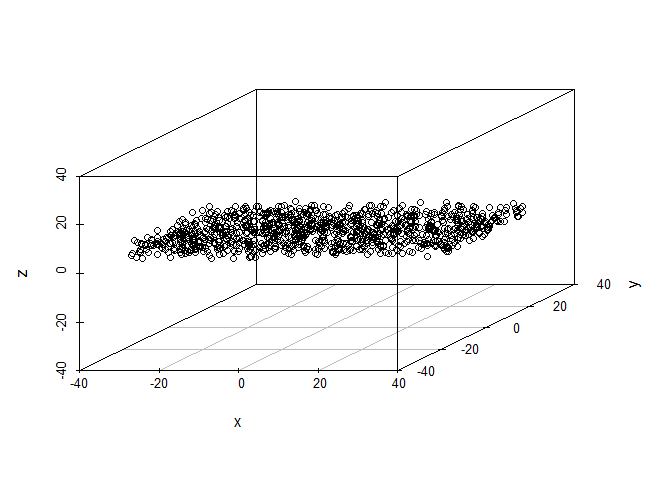

``` r
#notice the axes views --
plot3d(df, col="red", size=4, xlim=c(-40,40),ylim=c(-40,40),zlim=c(-40,40))

#what do you expect the eigenvectors to be?
pc<-prcomp(df,center=T)
pc
```

    Standard deviations (1, .., p=3):
    [1] 23.267051 11.487085  1.754263

    Rotation (n x k) = (3 x 3):
             PC1           PC2           PC3
    x 0.99985198 -0.0171663277 -0.0011574217
    y 0.01716593  0.9998525919 -0.0003541299
    z 0.00116333  0.0003342092  0.9999992675

``` r
summary(pc)
```

    Importance of components:
                               PC1     PC2     PC3
    Standard deviation     23.2671 11.4871 1.75426
    Proportion of Variance  0.8004  0.1951 0.00455
    Cumulative Proportion   0.8004  0.9954 1.00000

``` r
plot(pc)
```

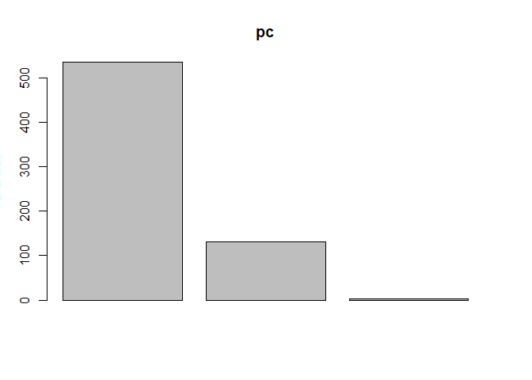

``` r
str(pc)    #look at component pieces of the prcomp obj
```

    List of 5
     $ sdev    : num [1:3] 23.27 11.49 1.75
     $ rotation: num [1:3, 1:3] 0.99985 0.01717 0.00116 -0.01717 0.99985 ...
      ..- attr(*, "dimnames")=List of 2
      .. ..$ : chr [1:3] "x" "y" "z"
      .. ..$ : chr [1:3] "PC1" "PC2" "PC3"
     $ center  : Named num [1:3] -0.0509 -0.322 -0.0641
      ..- attr(*, "names")= chr [1:3] "x" "y" "z"
     $ scale   : logi FALSE
     $ x       : num [1:1000, 1:3] -18.62 9.57 21.03 12.64 -21.21 ...
      ..- attr(*, "dimnames")=List of 2
      .. ..$ : NULL
      .. ..$ : chr [1:3] "PC1" "PC2" "PC3"
     - attr(*, "class")= chr "prcomp"

``` r
# ?prcomp    #notice defaults regarding centering and scaling

pc$rotation
```

             PC1           PC2           PC3
    x 0.99985198 -0.0171663277 -0.0011574217
    y 0.01716593  0.9998525919 -0.0003541299
    z 0.00116333  0.0003342092  0.9999992675

``` r
head(pc$x)
```

                PC1        PC2        PC3
    [1,] -18.620174  -9.409723 -1.8032447
    [2,]   9.568554   7.286573  0.3076658
    [3,]  21.026286  16.766349 -2.7092782
    [4,]  12.638230 -10.515107 -1.4185336
    [5,] -21.205887  -4.537647 -1.1944727
    [6,] -34.342231  -8.190175 -1.8873512

``` r
df2<-scale(df,scale=F)
mat<-df2%*%pc$rotation

mat[1:5,]
```

                PC1        PC2        PC3
    [1,] -18.620174  -9.409723 -1.8032447
    [2,]   9.568554   7.286573  0.3076658
    [3,]  21.026286  16.766349 -2.7092782
    [4,]  12.638230 -10.515107 -1.4185336
    [5,] -21.205887  -4.537647 -1.1944727

``` r
#for convenience:
newX<-pc$x[,1]
newY<-pc$x[,2]
newZ<-pc$x[,3]

scatterplot3d(newX,newZ,newY,xlim=c(-40,40),ylim=c(-40,40),zlim=c(-40,40),xlab="PC1",ylab="PC3",zlab="PC2")
```

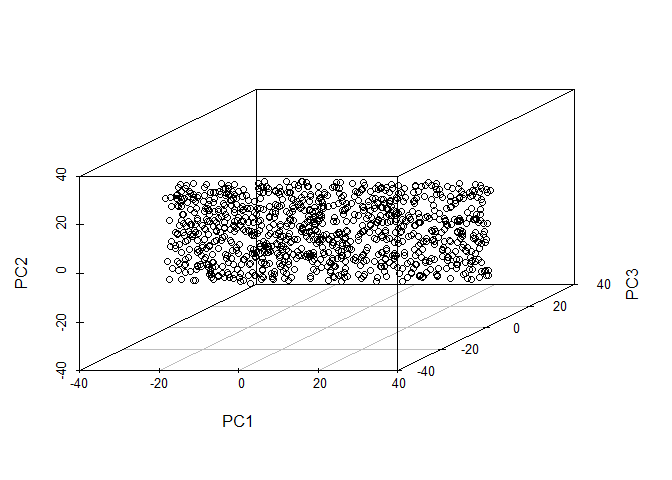

``` r
#now the 2D plots

plot(newX,newY,xlim=c(-40,40),ylim=c(-40,40))          #plot x vs y
```

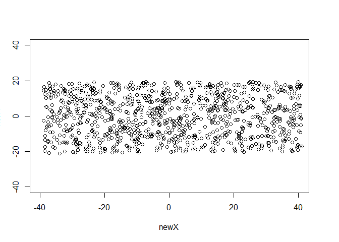

``` r
plot(newX,newZ,xlim=c(-40,40),ylim=c(-40,40))          #plot x vs z
```

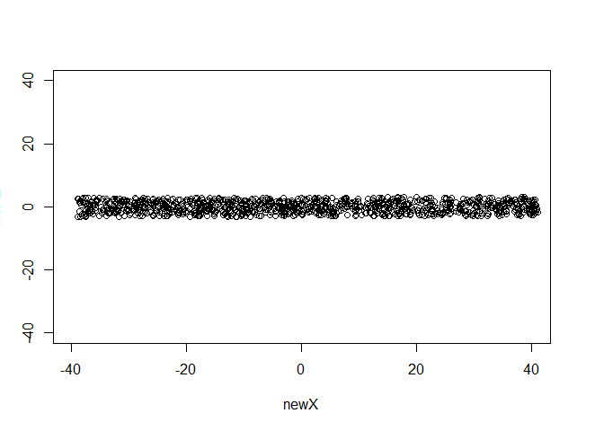

``` r
plot(newY,newZ,xlim=c(-40,40),ylim=c(-40,40))          #plot y vs z
```

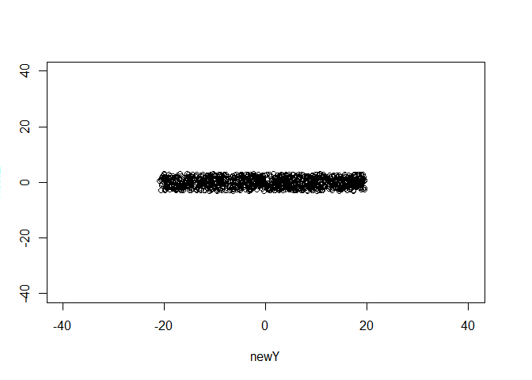

``` r
#now the biplots

biplot(pc)
```


``` r
ggbiplot(pc,circle=T,obs.scale=1,varname.size=20)
```


``` r
ggbiplot(pc,circle=T,choices=c(1,3),obs.scale=1,varname.size=20)
```

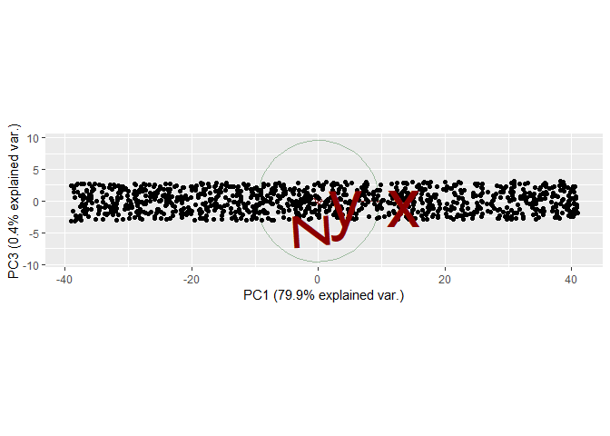

``` r
#re-run the above with the following inputs
x<-1*rnorm(1000)
y<-5*rnorm(1000)
z<-y+3*rnorm(1000)


#now for the example from lecture using the "state.x77" data

#let's see what we have to start with...

# ?state.x77

plot(state.x77[,8],state.x77[,2])
```

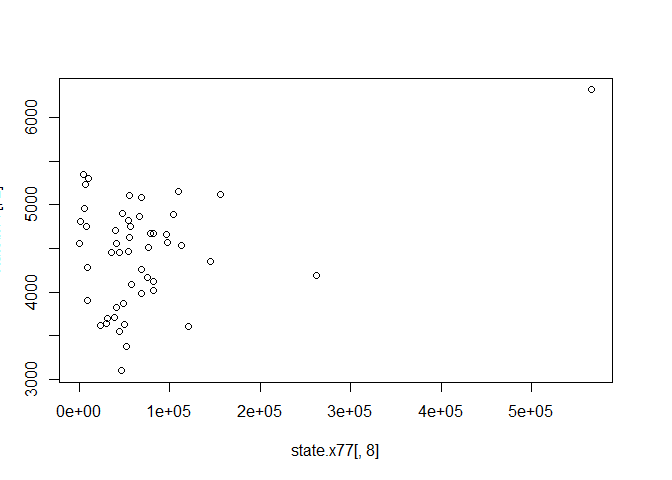

``` r
#PC with and without scaling...

prcomp(state.x77,scale=F)
```

    Standard deviations (1, .., p=8):
    [1] 8.532765e+04 4.465107e+03 5.591454e+02 4.640117e+01 6.043099e+00
    [6] 2.461524e+00 6.580129e-01 2.899911e-01

    Rotation (n x k) = (8 x 8):
                         PC1           PC2           PC3           PC4
    Population  1.182966e-03 -9.996005e-01  0.0278490777 -4.671254e-03
    Income      2.616550e-03 -2.796866e-02 -0.9991766328  2.821732e-02
    Illiteracy  5.518945e-07 -1.420515e-05  0.0005844687  7.100747e-03
    Life Exp   -1.688521e-06  1.928393e-05 -0.0010367078 -3.875966e-03
    Murder      9.881522e-06 -2.787128e-04  0.0027764911  2.816092e-02
    HS Grad     3.157288e-05  1.882545e-04 -0.0082661337 -2.784545e-02
    Frost       3.607163e-05  3.871630e-03 -0.0280421226 -9.987733e-01
    Area        9.999959e-01  1.255538e-03  0.0025827049 -3.168841e-05
                         PC5           PC6           PC7           PC8
    Population  3.349393e-04  1.386661e-04 -5.183454e-05 -2.191850e-05
    Income     -7.792882e-03 -1.119562e-04  3.850506e-05 -6.290403e-05
    Illiteracy -4.054743e-02 -3.091522e-02  2.550656e-02 -9.983480e-01
    Life Exp    1.193295e-01  2.855357e-01  9.508427e-01  1.057617e-02
    Murder     -2.386638e-01 -9.200852e-01  3.058552e-01  4.620107e-02
    HS Grad     9.622385e-01 -2.656351e-01 -4.075556e-02 -3.209925e-02
    Frost      -3.452920e-02 -1.986814e-02  6.252701e-03 -4.942864e-03
    Area       -6.558672e-06  1.882356e-05 -4.090819e-07  1.494594e-06

``` r
prcomp(state.x77,scale=T)
```

    Standard deviations (1, .., p=8):
    [1] 1.8970755 1.2774659 1.0544862 0.8411327 0.6201949 0.5544923 0.3800642
    [8] 0.3364338

    Rotation (n x k) = (8 x 8):
                       PC1         PC2         PC3         PC4          PC5
    Population  0.12642809  0.41087417 -0.65632546 -0.40938555  0.405946365
    Income     -0.29882991  0.51897884 -0.10035919 -0.08844658 -0.637586953
    Illiteracy  0.46766917  0.05296872  0.07089849  0.35282802  0.003525994
    Life Exp   -0.41161037 -0.08165611 -0.35993297  0.44256334  0.326599685
    Murder      0.44425672  0.30694934  0.10846751 -0.16560017 -0.128068739
    HS Grad    -0.42468442  0.29876662  0.04970850  0.23157412 -0.099264551
    Frost      -0.35741244 -0.15358409  0.38711447 -0.61865119  0.217363791
    Area       -0.03338461  0.58762446  0.51038499  0.20112550  0.498506338
                       PC6          PC7         PC8
    Population -0.01065617 -0.062158658 -0.21924645
    Income      0.46177023  0.009104712  0.06029200
    Illiteracy  0.38741578 -0.619800310 -0.33868838
    Life Exp    0.21908161 -0.256213054  0.52743331
    Murder     -0.32519611 -0.295043151  0.67825134
    HS Grad    -0.64464647 -0.393019181 -0.30724183
    Frost       0.21268413 -0.472013140  0.02834442
    Area        0.14836054  0.286260213  0.01320320

``` r
#let's look at the results in more detail...


state.pca<-prcomp(state.x77,scale=T)

summary(state.pca)
```

    Importance of components:
                              PC1    PC2    PC3     PC4     PC5     PC6     PC7
    Standard deviation     1.8971 1.2775 1.0545 0.84113 0.62019 0.55449 0.38006
    Proportion of Variance 0.4499 0.2040 0.1390 0.08844 0.04808 0.03843 0.01806
    Cumulative Proportion  0.4499 0.6539 0.7928 0.88128 0.92936 0.96780 0.98585
                               PC8
    Standard deviation     0.33643
    Proportion of Variance 0.01415
    Cumulative Proportion  1.00000

``` r
plot(state.pca)
```

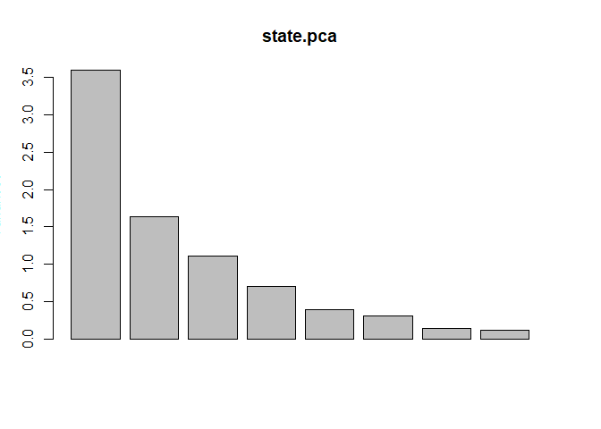

``` r
ggbiplot(state.pca)
```

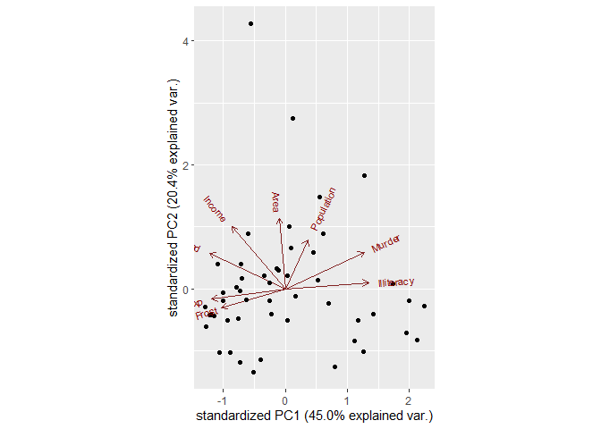

``` r
ggbiplot(state.pca,obs.scale = 1, var.scale = 1, 
         varname.size = 4, labels.size=10, circle = TRUE)
```

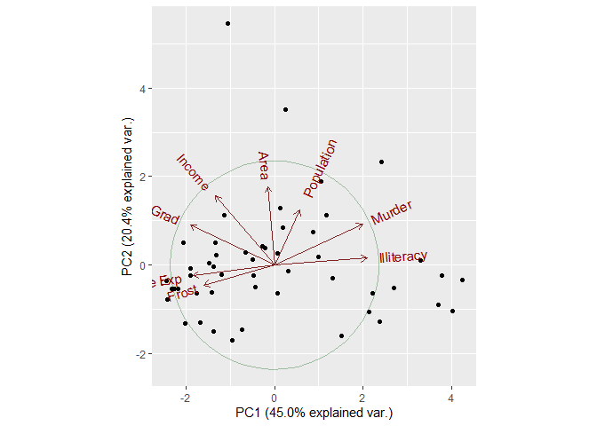

``` r
#PC1 distinguishes between cold states with educated, harmless,
#long-lived populations, and warm, ill-educated, short-lived, violent states. \\

#PC2 distinguishes big rich educated
#states from small poor ignorant states, which tend to be a bit warmer,
#and less murderous.
```
