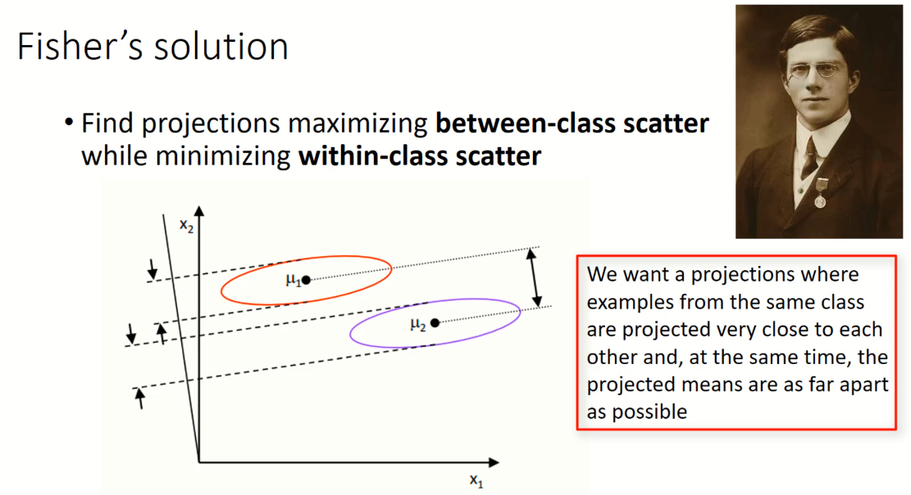
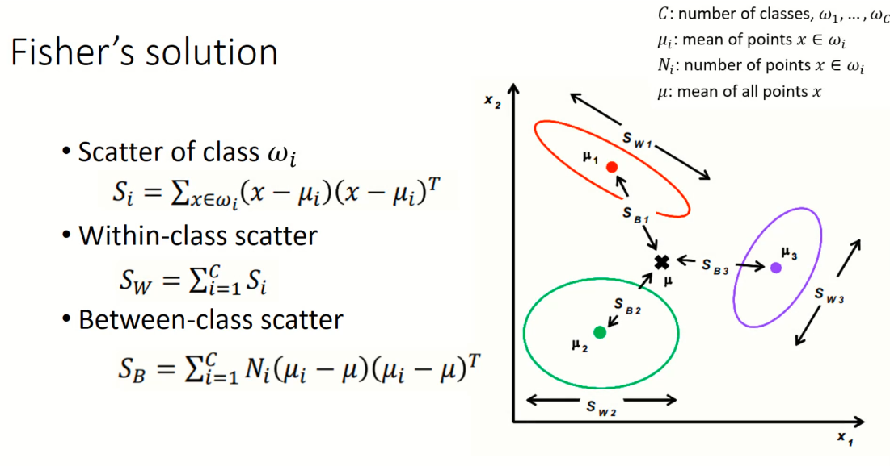
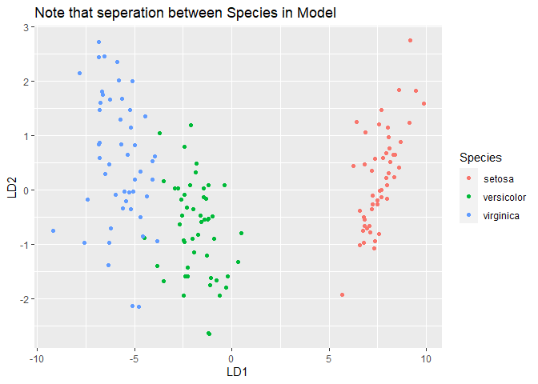

Linear Discriminant Analysis
================
Daniel Carpenter

-   <a href="#goals" id="toc-goals"><span
    class="toc-section-number">1</span> Goals</a>
-   <a href="#fisher-solution-math" id="toc-fisher-solution-math"><span
    class="toc-section-number">2</span> Fisher Solution (Math)</a>
-   <a href="#lda-in-r" id="toc-lda-in-r"><span
    class="toc-section-number">3</span> LDA in <code>R</code></a>

Reading: Applied Predictive Modeling: 3.3

## Goals

-   Discriminate between classes of information

## Fisher Solution (Math)

> Goal: Maximize the ratio of between and in class scatter

### Overview of Fisher





### How do you analyze the outcome?


## LDA in `R`

``` r
library(tidyverse) 
```

    ── Attaching packages ─────────────────────────────────────── tidyverse 1.3.2 ──
    ✔ ggplot2 3.3.6     ✔ purrr   0.3.4
    ✔ tibble  3.1.8     ✔ dplyr   1.0.9
    ✔ tidyr   1.2.0     ✔ stringr 1.4.1
    ✔ readr   2.1.2     ✔ forcats 0.5.2
    ── Conflicts ────────────────────────────────────────── tidyverse_conflicts() ──
    ✖ dplyr::filter() masks stats::filter()
    ✖ dplyr::lag()    masks stats::lag()

``` r
library(caret)
```

    Loading required package: lattice

    Attaching package: 'caret'

    The following object is masked from 'package:purrr':

        lift

``` r
library(MASS)
```


    Attaching package: 'MASS'

    The following object is masked from 'package:dplyr':

        select

``` r
# use the trusty old “iris” data for an example
data(iris)

# Mean center the data; ignores factor data
# SCaled for the SD to be 1
preproc.param <- iris %>% preProcess(method = c("center", "scale")) 

# Transform the data using the estimated parameters 
transformed <- preproc.param %>% predict(iris)

# Fit the model , '.' means *
lda.model <- lda(Species ~ ., data = transformed) 

# Note petals values are higher
# See that 99% of the explanatory power is within the first function
# LD2 does not do much.
print(lda.model)
```

    Call:
    lda(Species ~ ., data = transformed)

    Prior probabilities of groups:
        setosa versicolor  virginica 
     0.3333333  0.3333333  0.3333333 

    Group means:
               Sepal.Length Sepal.Width Petal.Length Petal.Width
    setosa       -1.0111914   0.8504137   -1.3006301  -1.2507035
    versicolor    0.1119073  -0.6592236    0.2843712   0.1661774
    virginica     0.8992841  -0.1911901    1.0162589   1.0845261

    Coefficients of linear discriminants:
                        LD1         LD2
    Sepal.Length  0.6867795  0.01995817
    Sepal.Width   0.6688251  0.94344183
    Petal.Length -3.8857950 -1.64511887
    Petal.Width  -2.1422387  2.16413593

    Proportion of trace:
       LD1    LD2 
    0.9912 0.0088 

``` r
predictions <- lda.model %>% predict(transformed) 

names(predictions)
```

    [1] "class"     "posterior" "x"        

``` r
tail(predictions$x)         # Predicted values
```

              LD1        LD2
    145 -6.847359  2.4289507
    146 -5.645003  1.6777173
    147 -5.179565 -0.3634750
    148 -4.967741  0.8211405
    149 -5.886145  2.3450905
    150 -4.683154  0.3320338

``` r
tail(predictions$posterior) # Posterior probabilities
```

              setosa   versicolor virginica
    145 4.048249e-46 2.524984e-07 0.9999997
    146 4.970070e-39 7.473361e-05 0.9999253
    147 4.616611e-36 5.898784e-03 0.9941012
    148 5.548962e-35 3.145874e-03 0.9968541
    149 1.613687e-40 1.257468e-05 0.9999874
    150 2.858012e-33 1.754229e-02 0.9824577

``` r
tail(predictions$class)     # Max of the posterior probs
```

    [1] virginica virginica virginica virginica virginica virginica
    Levels: setosa versicolor virginica

``` r
# How did the actual compare to the predicted
table(Original=iris$Species,Predicted=predictions$class)
```

                Predicted
    Original     setosa versicolor virginica
      setosa         50          0         0
      versicolor      0         48         2
      virginica       0          1        49

``` r
# On average how many successes did we have
mean(predictions$class==transformed$Species)
```

    [1] 0.98

``` r
# Now look at how the classification model does
lda.data <- cbind(transformed, predict(lda.model)$x)

# Visual representation
lda.data %>%
  ggplot(aes(LD1, LD2) ) +
  
    geom_point(aes(color = Species)) +
    
    ggtitle('Note that seperation between Species in Model')
```


