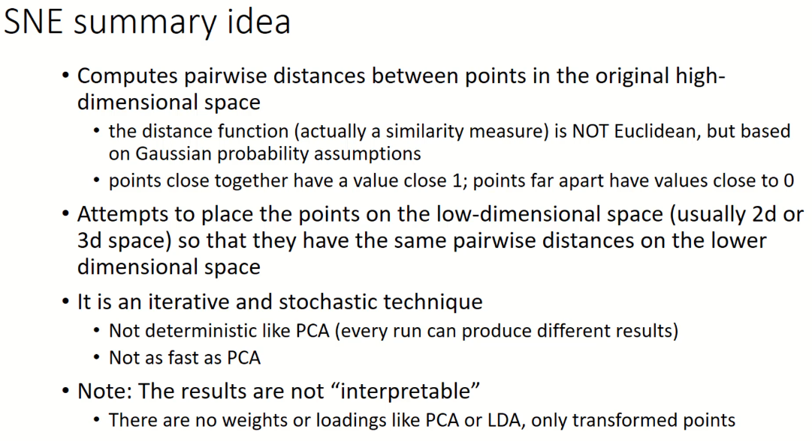
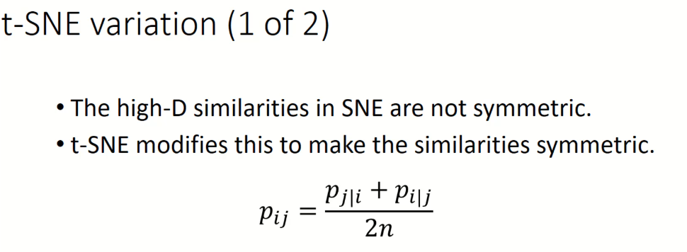
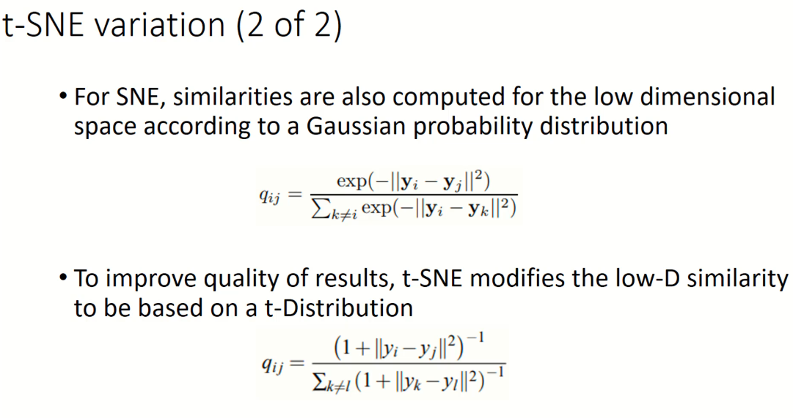
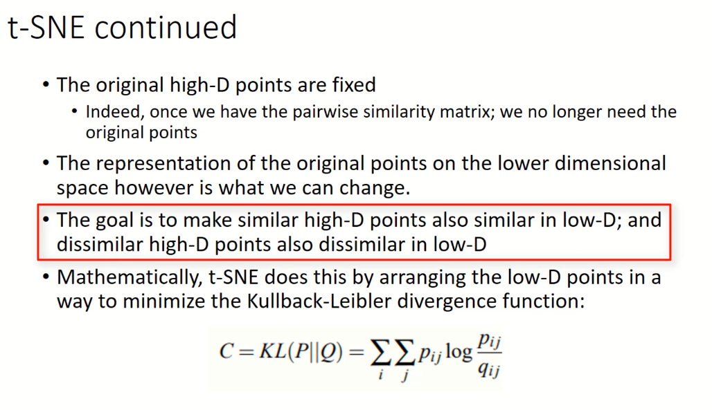
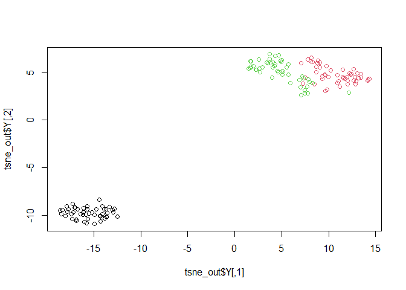
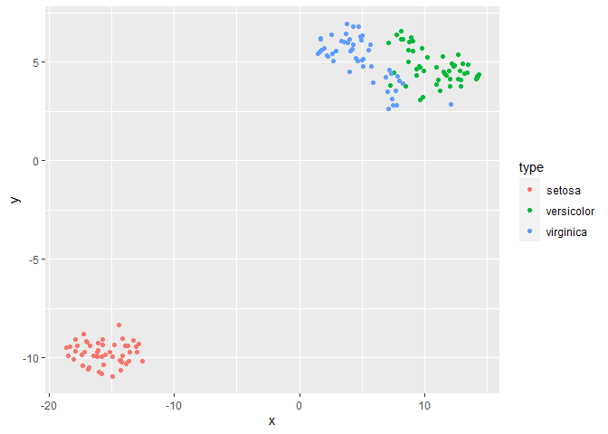
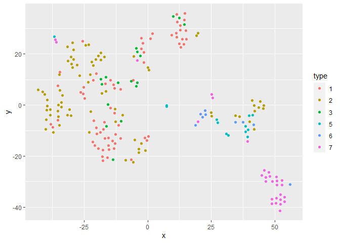

t-Distributed Stochastic Neighbor Embedding
================
Daniel Carpenter

-   <a href="#overview" id="toc-overview"><span
    class="toc-section-number">1</span> Overview</a>
-   <a href="#sne" id="toc-sne"><span class="toc-section-number">2</span>
    SNE</a>
-   <a href="#examples-in-r" id="toc-examples-in-r"><span
    class="toc-section-number">3</span> Examples in R</a>

## Overview

-   Specialization for Visualization

-   Non-linear

-   Unsupervised

-   Maps large datasets to 2-3 dimensions **for visualization**

## SNE

### Overview



### t-SNE







## Examples in R

``` r
# | cache: true
library(mlbench)
library(tidyverse)
```

    ── Attaching packages ─────────────────────────────────────── tidyverse 1.3.2 ──
    ✔ ggplot2 3.3.6     ✔ purrr   0.3.4
    ✔ tibble  3.1.8     ✔ dplyr   1.0.9
    ✔ tidyr   1.2.0     ✔ stringr 1.4.1
    ✔ readr   2.1.2     ✔ forcats 0.5.2
    ── Conflicts ────────────────────────────────────────── tidyverse_conflicts() ──
    ✖ dplyr::filter() masks stats::filter()
    ✖ dplyr::lag()    masks stats::lag()

``` r
library("Rtsne")

iris_unique <- unique(iris) # Remove duplicates
iris_matrix <- as.matrix(iris_unique[,1:4])

set.seed(42) # Set a seed if you want reproducible results

tsne_out <- Rtsne(iris_matrix) # Run TSNE

# ?Rtsne

# Base R: Show the objects in the 2D tsne representation
plot(tsne_out$Y,col=iris_unique$Species)
```



``` r
# ggplot:
df<-data.frame(x    = tsne_out$Y[,1],
               y    = tsne_out$Y[,2], 
               type = iris_unique$Species)

ggplot(data=df,aes(x=x,
                   y=y,
                   group=type,
                   color=type)) + 
  geom_point()
```



``` r
# From the mlbench package
data(Glass)
str(Glass)
```

    'data.frame':   214 obs. of  10 variables:
     $ RI  : num  1.52 1.52 1.52 1.52 1.52 ...
     $ Na  : num  13.6 13.9 13.5 13.2 13.3 ...
     $ Mg  : num  4.49 3.6 3.55 3.69 3.62 3.61 3.6 3.61 3.58 3.6 ...
     $ Al  : num  1.1 1.36 1.54 1.29 1.24 1.62 1.14 1.05 1.37 1.36 ...
     $ Si  : num  71.8 72.7 73 72.6 73.1 ...
     $ K   : num  0.06 0.48 0.39 0.57 0.55 0.64 0.58 0.57 0.56 0.57 ...
     $ Ca  : num  8.75 7.83 7.78 8.22 8.07 8.07 8.17 8.24 8.3 8.4 ...
     $ Ba  : num  0 0 0 0 0 0 0 0 0 0 ...
     $ Fe  : num  0 0 0 0 0 0.26 0 0 0 0.11 ...
     $ Type: Factor w/ 6 levels "1","2","3","5",..: 1 1 1 1 1 1 1 1 1 1 ...

``` r
# REmove duplicates
Glass<-Glass[!duplicated(Glass),]

summary(Glass$Type)
```

     1  2  3  5  6  7 
    69 76 17 13  9 29 

``` r
# Run the model
tsne_out <- Rtsne(Glass[,-10],
                  perplexity=12,
                  theta=0.0, 
                  max_iter = 3000) # Run TSNE

# Plot data
df<-data.frame(x    = tsne_out$Y[,1],
               y    = tsne_out$Y[,2], 
               type = Glass[,10])

ggplot(data=df,
       aes(x=x,
           y=y,
           group=type,
           color=type))+
  geom_point()
```


