PCA Applications
================
Daniel Carpenter

-   <a href="#overview" id="toc-overview"><span
    class="toc-section-number">1</span> Overview</a>
-   <a href="#r-example" id="toc-r-example"><span
    class="toc-section-number">2</span> R Example</a>

## Overview

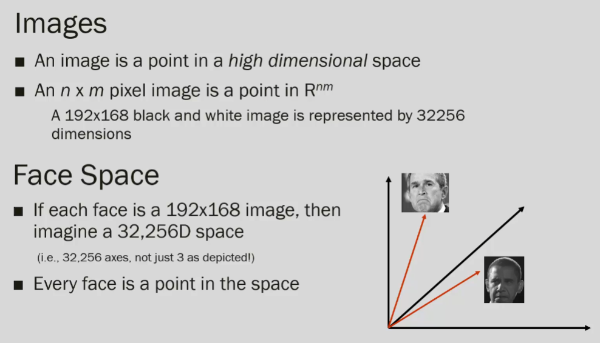

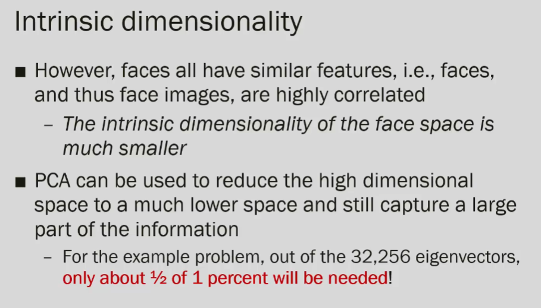

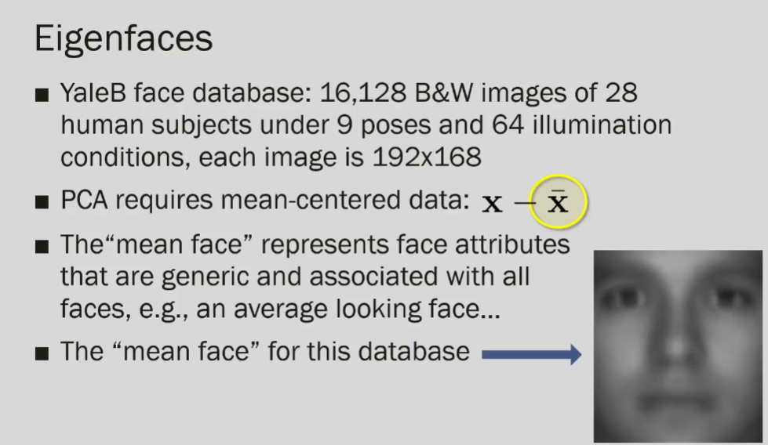

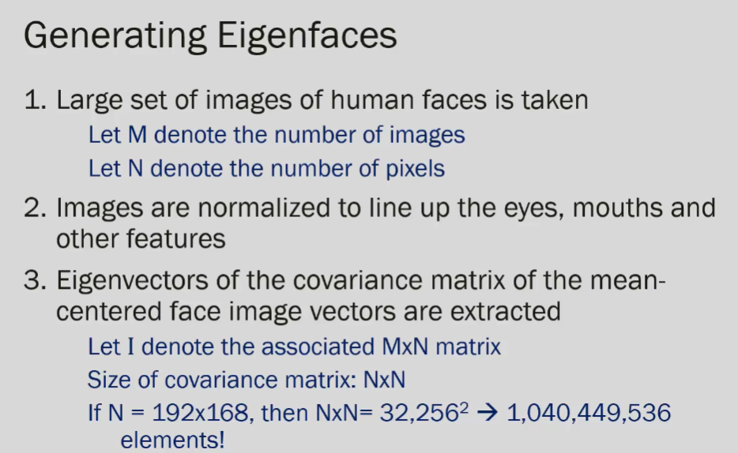

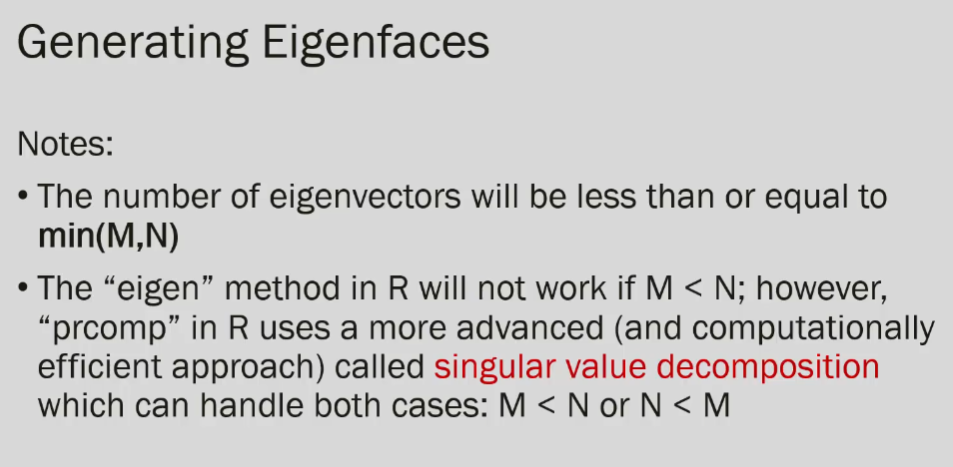

M = faces, n =gradient from 0-255

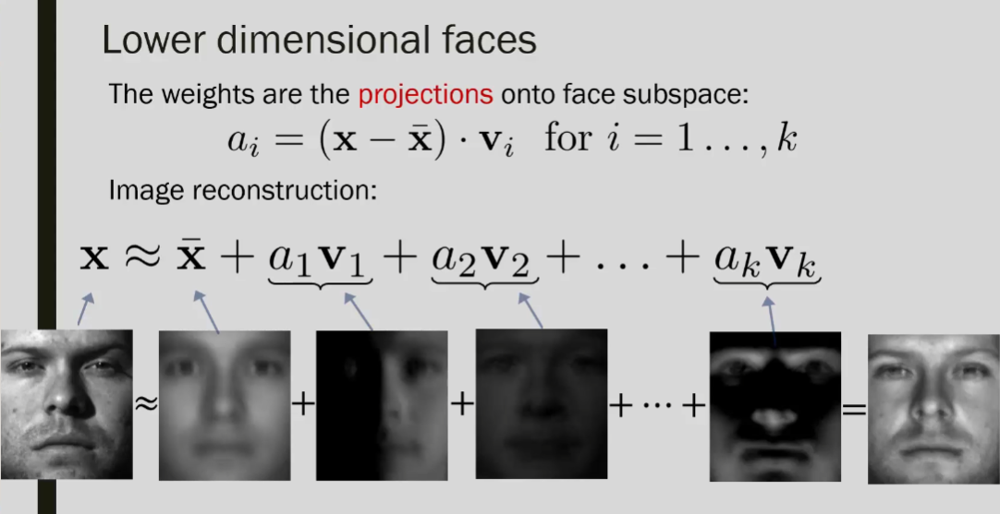

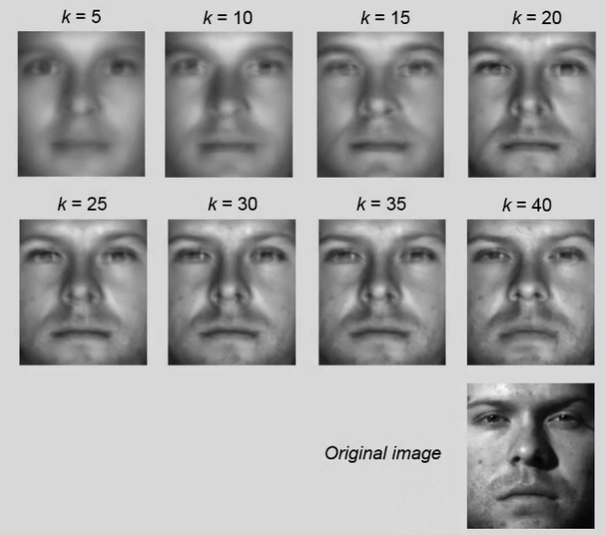

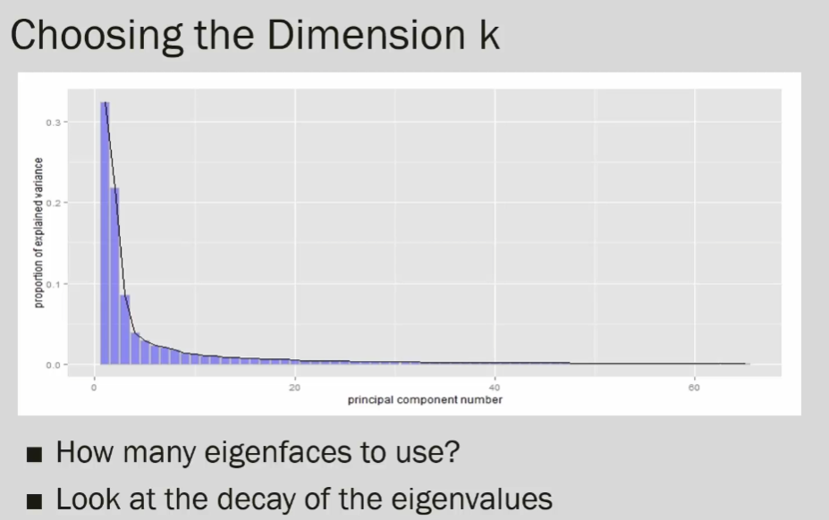

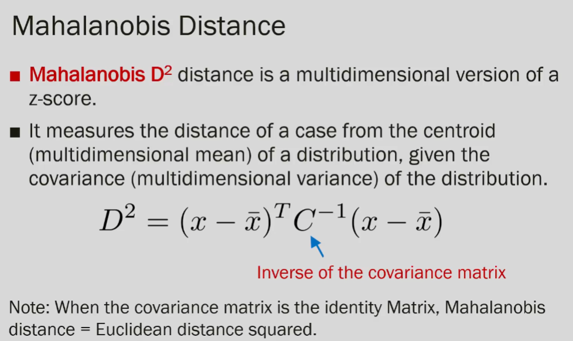

## R Example

``` r
# | cache: true

library(ggplot2)

#some multivariate normal data
x<-rnorm(1000, sd=15)
y<-0.55*x + rnorm(1000, sd=2.5)


#to make the plots easier to delimit
lowx<-ceiling(min(x))-1
highx<-ceiling(max(x))+1

myplot<-qplot(x,y)+xlim(lowx,highx)+ylim(lowx,highx)
myplot
```

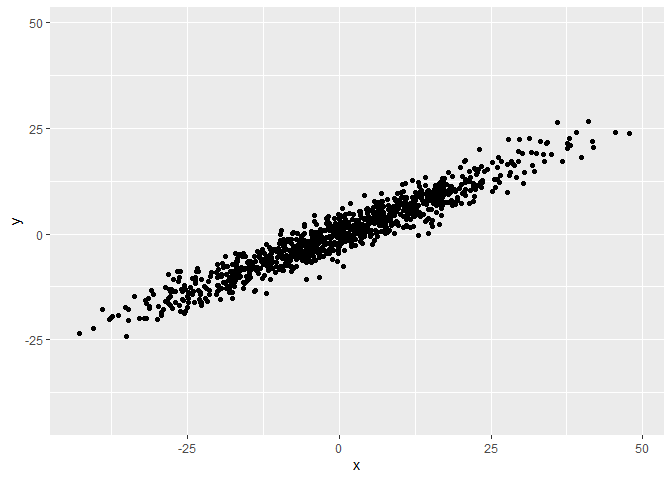

``` r
#put data into data frame
mat<-data.frame(x,y)

#covariance and inverse covariance matrices
(C=cov(mat))
```

             x         y
    x 237.8248 130.74398
    y 130.7440  78.16278

``` r
(Cinv<-solve(C))
```

                x           y
    x  0.05228072 -0.08745069
    y -0.08745069  0.15907381

``` r
#some test points
p1<-c(x=35,y=17)
p2<-c(x=8,y=23)
p3<-c(x=-36,y=-16)

mypoints<-data.frame(rbind(p1,p2,p3))
mypoints$name <- rownames(mypoints)

#plot points and test points
(p<-ggplot(mat, aes(x, y)) + 
  geom_point(color="black") + 
  geom_point(data = mypoints,color="red",size=5) +xlim(lowx,highx)+ylim(lowx,highx) +
  geom_text(data=mypoints, aes(label=name), color="blue", size=6, hjust=.5, vjust=2))
```

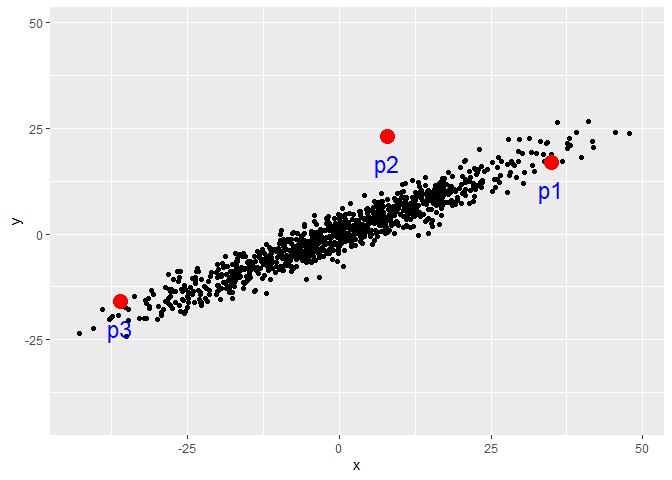

``` r
#define euclidean distance first
euc.dist <- function(x1, x2) sqrt(sum((x1 - x2) ^ 2))

#look at distances
(E1<-euc.dist(p1,p2))
```

    [1] 27.65863

``` r
# mahalanobis is a different distance value
(M1<- mahalanobis(p1,p2,C))
```

    [1] 72.17333

``` r
p+geom_text(x=25, y=30, label=round(E1,2),size=5, color="blue") +
  geom_text(x=25, y=25, label=round(M1,2),size=5, color="red")
```

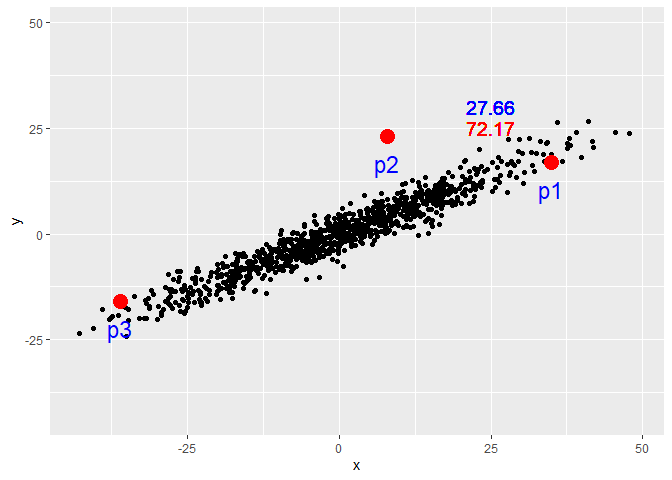

``` r
(E2<-euc.dist(p1,p3))
```

    [1] 78.29432

``` r
(M2<-mahalanobis(p1,p3,C))
```

    [1] 26.98455

``` r
p+geom_text(x=25, y=30, label=round(E1,2),size=5, color="blue") +
  geom_text(x=25, y=25, label=round(M1,2),size=5, color="red") +
  geom_text(x=0, y=-15, label=round(E2,2),size=5, color="blue") +
  geom_text(x=0, y=-20, label=round(M2,2),size=5, color="red")
```

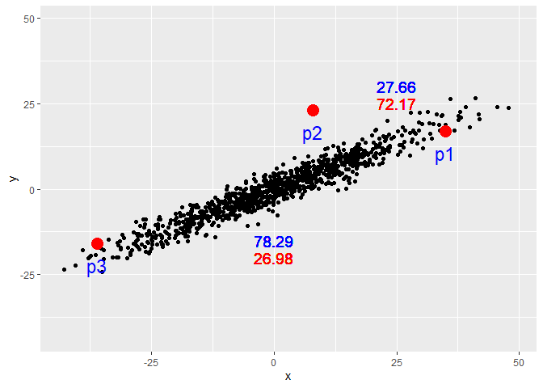

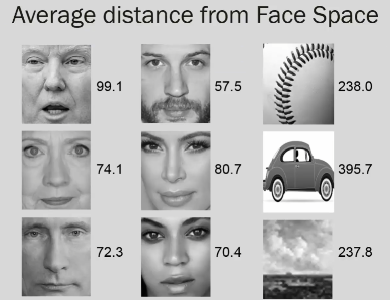
