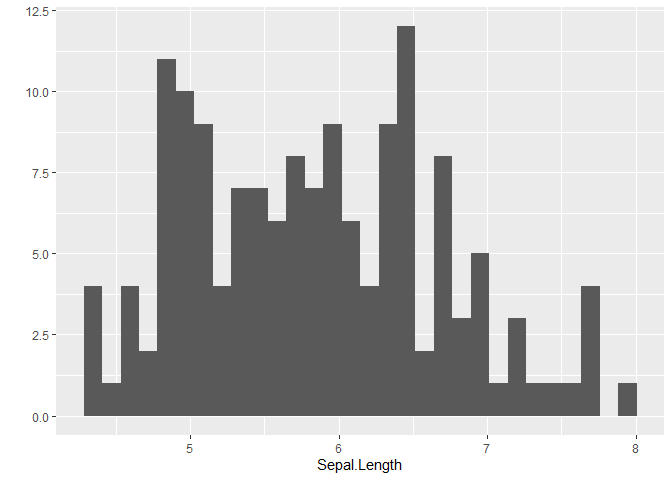

Example of Correlation, Outliers, Nulls, and PCA
================

-   <a href="#library" id="toc-library">Library</a>
-   <a href="#correlations" id="toc-correlations">Correlations</a>
-   <a href="#basic-ggplot" id="toc-basic-ggplot">Basic
    <code>ggplot</code></a>
-   <a href="#visualizing-outliers"
    id="toc-visualizing-outliers">Visualizing Outliers</a>
-   <a href="#understanding-missing-data"
    id="toc-understanding-missing-data">Understanding Missing Data</a>
-   <a href="#principal-component-analysis-using-mtcars"
    id="toc-principal-component-analysis-using-mtcars">Principal Component
    Analysis using <code>mtcars</code></a>

## Library

``` r
suppressMessages(library(tidyverse)) 
suppressMessages(library(MASS))      # Animals dataset
suppressMessages(library(ggbiplot))  # biplot or screeplot using ggplot
```

## Correlations

``` r
# Spearman coefficient
cor(mtcars$cyl, mtcars$mpg, method = 'spearman')
```

    [1] -0.9108013

``` r
# Plot like a plotter
qplot(data=iris, Sepal.Length)
```

    `stat_bin()` using `bins = 30`. Pick better value with `binwidth`.


## Basic `ggplot`

``` r
# GGplot
ggplot(data=iris, aes(x=Sepal.Length,y=Petal.Width)) + 
  geom_point(aes(fill=Species), 
             alpha=I(.75),                               
             position = "jitter",                        
             colour="black",pch=21, size=5) +
  theme_bw() +
  labs(y = "Petal Width (cm)",
       x = "Sepal Length (cm)") +
  theme(legend.key=element_blank(),
        axis.title = element_text(size = 14))
```



## Visualizing Outliers

``` r
# Outliers
head(MASS::Animals)
```

                        body brain
    Mountain beaver     1.35   8.1
    Cow               465.00 423.0
    Grey wolf          36.33 119.5
    Goat               27.66 115.0
    Guinea pig          1.04   5.5
    Dipliodocus     11700.00  50.0

``` r
Animals %>%
  ggplot(aes(x =1,
             y = brain)) +

  geom_boxplot() +
  geom_text(label = rownames(Animals))
```


## Understanding Missing Data

``` r
# Missingness Proportion
df <- mtcars %>%
  dplyr::select(mpg, cyl, hp, qsec)

# Make a missing value dataset
df$mpg[6:15]   <- NA # Make missing vals
df$hp[13:21]   <- NA 
df$qsec[10:18] <- NA

# For a subset of the dataset, what is the missingness proportion?
df.filtered <- df %>%
  filter(cyl == 4)

# See missingness of certain variables
sum(is.na(df.filtered$mpg))  / nrow(df.filtered)
```

    [1] 0.1818182

``` r
sum(is.na(df.filtered$hp))   / nrow(df.filtered)
```

    [1] 0.3636364

``` r
sum(is.na(df.filtered$qsec)) / nrow(df.filtered)
```

    [1] 0.09090909

## Principal Component Analysis using `mtcars`

### Run Analysis

``` r
# Conduct Principal COmponents
pc<-prcomp(mtcars,
           center = TRUE, # Mean centered  
           scale  = TRUE  # Z-SCore standardized
           )

# What does the data look like for pc's?
pc
```

    Standard deviations (1, .., p=11):
     [1] 2.5706809 1.6280258 0.7919579 0.5192277 0.4727061 0.4599958 0.3677798
     [8] 0.3505730 0.2775728 0.2281128 0.1484736

    Rotation (n x k) = (11 x 11):
                PC1         PC2         PC3          PC4         PC5         PC6
    mpg  -0.3625305  0.01612440 -0.22574419 -0.022540255  0.10284468 -0.10879743
    cyl   0.3739160  0.04374371 -0.17531118 -0.002591838  0.05848381  0.16855369
    disp  0.3681852 -0.04932413 -0.06148414  0.256607885  0.39399530 -0.33616451
    hp    0.3300569  0.24878402  0.14001476 -0.067676157  0.54004744  0.07143563
    drat -0.2941514  0.27469408  0.16118879  0.854828743  0.07732727  0.24449705
    wt    0.3461033 -0.14303825  0.34181851  0.245899314 -0.07502912 -0.46493964
    qsec -0.2004563 -0.46337482  0.40316904  0.068076532 -0.16466591 -0.33048032
    vs   -0.3065113 -0.23164699  0.42881517 -0.214848616  0.59953955  0.19401702
    am   -0.2349429  0.42941765 -0.20576657 -0.030462908  0.08978128 -0.57081745
    gear -0.2069162  0.46234863  0.28977993 -0.264690521  0.04832960 -0.24356284
    carb  0.2140177  0.41357106  0.52854459 -0.126789179 -0.36131875  0.18352168
                  PC7          PC8          PC9        PC10         PC11
    mpg   0.367723810 -0.754091423  0.235701617  0.13928524 -0.124895628
    cyl   0.057277736 -0.230824925  0.054035270 -0.84641949 -0.140695441
    disp  0.214303077  0.001142134  0.198427848  0.04937979  0.660606481
    hp   -0.001495989 -0.222358441 -0.575830072  0.24782351 -0.256492062
    drat  0.021119857  0.032193501 -0.046901228 -0.10149369 -0.039530246
    wt   -0.020668302 -0.008571929  0.359498251  0.09439426 -0.567448697
    qsec  0.050010522 -0.231840021 -0.528377185 -0.27067295  0.181361780
    vs   -0.265780836  0.025935128  0.358582624 -0.15903909  0.008414634
    am   -0.587305101 -0.059746952 -0.047403982 -0.17778541  0.029823537
    gear  0.605097617  0.336150240 -0.001735039 -0.21382515 -0.053507085
    carb -0.174603192 -0.395629107  0.170640677  0.07225950  0.319594676

### Visualize and Interpret PCA

#### Overview of the Variation Contained

``` r
# Visualize indivual proportion of variance, for each PC
plot(pc, 
     main = '\nTop 3 Principal Components Explain ~90% of the Variation\nin the Real Data',
     xlab = 'Principal Components (Ordered)')
```


``` r
# pc$rotation

# How much Cumulative variance do each PC hold?
summary(pc) 
```

    Importance of components:
                              PC1    PC2     PC3     PC4     PC5     PC6    PC7
    Standard deviation     2.5707 1.6280 0.79196 0.51923 0.47271 0.46000 0.3678
    Proportion of Variance 0.6008 0.2409 0.05702 0.02451 0.02031 0.01924 0.0123
    Cumulative Proportion  0.6008 0.8417 0.89873 0.92324 0.94356 0.96279 0.9751
                               PC8    PC9    PC10   PC11
    Standard deviation     0.35057 0.2776 0.22811 0.1485
    Proportion of Variance 0.01117 0.0070 0.00473 0.0020
    Cumulative Proportion  0.98626 0.9933 0.99800 1.0000

#### Representativeness for each Variable in Data Set

-   PC1 represents `mpg`, `disp`, and `cyl` very well since nearly
    parallel with x axis

-   PC2 doesn’t do AS good of a job as PC2 (expected since PC1 contains
    \~60% of the overall variation). However, it helps in representing
    `carb`, `gear`, and `qsec`

``` r
# Which PC's represent which variables?
  # E.g., PC1 represents carb and mpg well
ggbiplot(pc,
         obs.scale    = 1, 
         var.scale    = 1, 
         varname.size = 4, 
         labels.size  = 10, 
         circle       = TRUE) +
  
  # Add the names of the cars for context
  geom_text(label = rownames(mtcars), size = 3)
```


