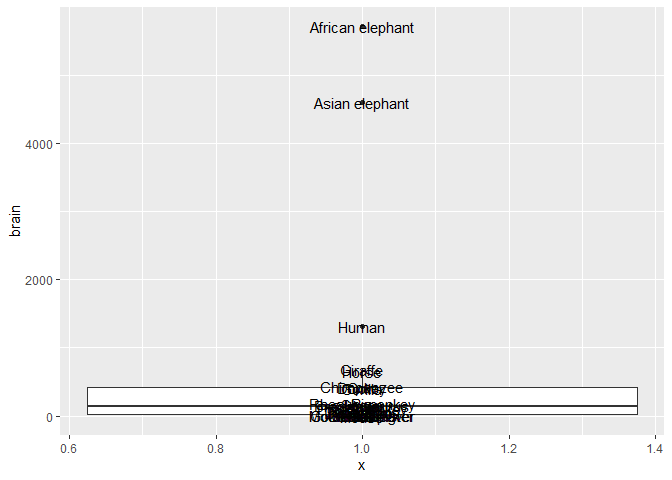

Example
================

``` r
library(tidyverse)
```

    -- Attaching packages --------------------------------------- tidyverse 1.3.1 --

    v ggplot2 3.3.5     v purrr   0.3.4
    v tibble  3.1.6     v dplyr   1.0.8
    v tidyr   1.2.0     v stringr 1.4.0
    v readr   2.1.2     v forcats 0.5.1

    -- Conflicts ------------------------------------------ tidyverse_conflicts() --
    x dplyr::filter() masks stats::filter()
    x dplyr::lag()    masks stats::lag()

``` r
# Spearman coefficient
cor(mtcars$cyl, mtcars$mpg, method = 'spearman')
```

    [1] -0.9108013

``` r
# Plot like a plotter
qplot(data=iris, Sepal.Length)
```

    `stat_bin()` using `bins = 30`. Pick better value with `binwidth`.


``` r
# GGplot
ggplot(data=iris, aes(x=Sepal.Length,y=Petal.Width)) + 
  geom_point(aes(fill=Species), 
             alpha=I(.75),                               
             position = "jitter",                        
             colour="black",pch=21, size=5) +
  theme_bw() +
  labs(y = "Petal Width (cm)",
       x = "Sepal Length (cm)") +
  theme(legend.key=element_blank(),
        axis.title = element_text(size = 14))
```


``` r
# Outliers
# library(MASS)
# 
# head(MASS::Animals)
# 
# Animals %>%
#   ggplot(aes(x =1,
#              y = brain)) +
#   
#   geom_boxplot() +
#   geom_text(label = rownames(Animals))
# 


# Missingness Proportion
df <- mtcars %>%
  select(mpg, cyl, hp, qsec)

df$mpg[6:15]   <- NA # Make missing vals
df$hp[13:21]   <- NA 
df$qsec[10:18] <- NA

df.filtered <- df %>%
  filter(cyl == 4)

sum(is.na(df.filtered$mpg)) / nrow(df.filtered)
```

    [1] 0.1818182

``` r
sum(is.na(df.filtered$hp)) / nrow(df.filtered)
```

    [1] 0.3636364

``` r
sum(is.na(df.filtered$qsec)) / nrow(df.filtered)
```

    [1] 0.09090909

``` r
# Principal COmponent analysis
pc<-prcomp(mtcars,center=T)
pc
```

    Standard deviations (1, .., p=11):
     [1] 136.5330479  38.1480776   3.0710166   1.3066508   0.9064862   0.6635411
     [7]   0.3085791   0.2859604   0.2506973   0.2106519   0.1984238

    Rotation (n x k) = (11 x 11):
                  PC1          PC2          PC3          PC4         PC5
    mpg  -0.038118199  0.009184847  0.982070847  0.047634784 -0.08832843
    cyl   0.012035150 -0.003372487 -0.063483942 -0.227991962  0.23872590
    disp  0.899568146  0.435372320  0.031442656 -0.005086826 -0.01073597
    hp    0.434784387 -0.899307303  0.025093049  0.035715638  0.01655194
    drat -0.002660077 -0.003900205  0.039724928 -0.057129357 -0.13332765
    wt    0.006239405  0.004861023 -0.084910258  0.127962867 -0.24354296
    qsec -0.006671270  0.025011743 -0.071670457  0.886472188 -0.21416101
    vs   -0.002729474  0.002198425  0.004203328  0.177123945 -0.01688851
    am   -0.001962644 -0.005793760  0.054806391 -0.135658793 -0.06270200
    gear -0.002604768 -0.011272462  0.048524372 -0.129913811 -0.27616440
    carb  0.005766010 -0.027779208 -0.102897231 -0.268931427 -0.85520810
                  PC6          PC7           PC8          PC9         PC10
    mpg  -0.143790084 -0.039239174  2.271040e-02 -0.002790139  0.030630361
    cyl  -0.793818050  0.425011021 -1.890403e-01  0.042677206  0.131718534
    disp  0.007424138  0.000582398 -5.841464e-04  0.003532713 -0.005399132
    hp    0.001653685 -0.002212538  4.748087e-06 -0.003734085  0.001862554
    drat  0.227229260  0.034847411 -9.385817e-01 -0.014131110  0.184102094
    wt   -0.127142296 -0.186558915  1.561907e-01 -0.390600261  0.829886844
    qsec -0.189564973  0.254844548 -1.028515e-01 -0.095914479 -0.204240658
    vs    0.102619063 -0.080788938 -2.132903e-03  0.684043835  0.303060724
    am    0.205217266  0.200858874 -2.273255e-02 -0.572372433 -0.162808201
    gear  0.334971103  0.801625551  2.174878e-01  0.156118559  0.203540645
    carb -0.283788381 -0.165474186  3.972219e-03  0.127583043 -0.239954748
                  PC11
    mpg  -0.0158569365
    cyl   0.1454453628
    disp  0.0009420262
    hp   -0.0021526102
    drat -0.0973818815
    wt   -0.0198581635
    qsec  0.0110677880
    vs    0.6256900918
    am    0.7331658036
    gear -0.1909325849
    carb  0.0557957968

``` r
plot(pc, main = 'Most can be contained within one variable')
```



``` r
pc$rotation
```

                  PC1          PC2          PC3          PC4         PC5
    mpg  -0.038118199  0.009184847  0.982070847  0.047634784 -0.08832843
    cyl   0.012035150 -0.003372487 -0.063483942 -0.227991962  0.23872590
    disp  0.899568146  0.435372320  0.031442656 -0.005086826 -0.01073597
    hp    0.434784387 -0.899307303  0.025093049  0.035715638  0.01655194
    drat -0.002660077 -0.003900205  0.039724928 -0.057129357 -0.13332765
    wt    0.006239405  0.004861023 -0.084910258  0.127962867 -0.24354296
    qsec -0.006671270  0.025011743 -0.071670457  0.886472188 -0.21416101
    vs   -0.002729474  0.002198425  0.004203328  0.177123945 -0.01688851
    am   -0.001962644 -0.005793760  0.054806391 -0.135658793 -0.06270200
    gear -0.002604768 -0.011272462  0.048524372 -0.129913811 -0.27616440
    carb  0.005766010 -0.027779208 -0.102897231 -0.268931427 -0.85520810
                  PC6          PC7           PC8          PC9         PC10
    mpg  -0.143790084 -0.039239174  2.271040e-02 -0.002790139  0.030630361
    cyl  -0.793818050  0.425011021 -1.890403e-01  0.042677206  0.131718534
    disp  0.007424138  0.000582398 -5.841464e-04  0.003532713 -0.005399132
    hp    0.001653685 -0.002212538  4.748087e-06 -0.003734085  0.001862554
    drat  0.227229260  0.034847411 -9.385817e-01 -0.014131110  0.184102094
    wt   -0.127142296 -0.186558915  1.561907e-01 -0.390600261  0.829886844
    qsec -0.189564973  0.254844548 -1.028515e-01 -0.095914479 -0.204240658
    vs    0.102619063 -0.080788938 -2.132903e-03  0.684043835  0.303060724
    am    0.205217266  0.200858874 -2.273255e-02 -0.572372433 -0.162808201
    gear  0.334971103  0.801625551  2.174878e-01  0.156118559  0.203540645
    carb -0.283788381 -0.165474186  3.972219e-03  0.127583043 -0.239954748
                  PC11
    mpg  -0.0158569365
    cyl   0.1454453628
    disp  0.0009420262
    hp   -0.0021526102
    drat -0.0973818815
    wt   -0.0198581635
    qsec  0.0110677880
    vs    0.6256900918
    am    0.7331658036
    gear -0.1909325849
    carb  0.0557957968

``` r
summary(pc) # Cumulative proportion
```

    Importance of components:
                               PC1      PC2     PC3     PC4     PC5     PC6    PC7
    Standard deviation     136.533 38.14808 3.07102 1.30665 0.90649 0.66354 0.3086
    Proportion of Variance   0.927  0.07237 0.00047 0.00008 0.00004 0.00002 0.0000
    Cumulative Proportion    0.927  0.99937 0.99984 0.99992 0.99996 0.99998 1.0000
                             PC8    PC9   PC10   PC11
    Standard deviation     0.286 0.2507 0.2107 0.1984
    Proportion of Variance 0.000 0.0000 0.0000 0.0000
    Cumulative Proportion  1.000 1.0000 1.0000 1.0000
