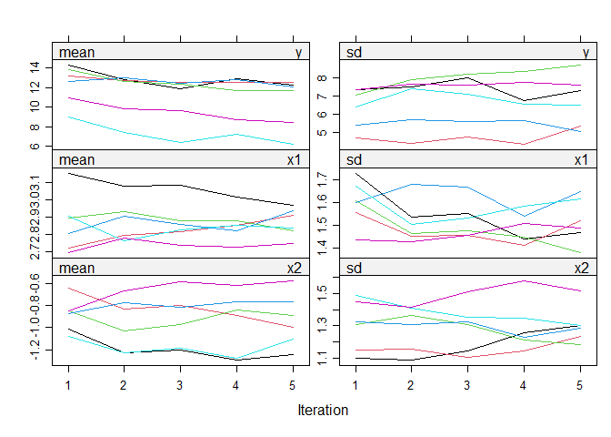
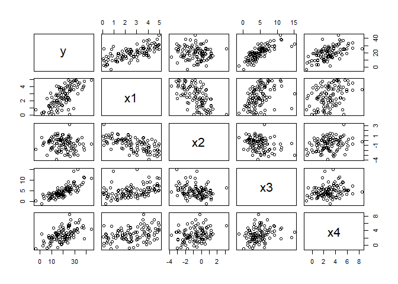
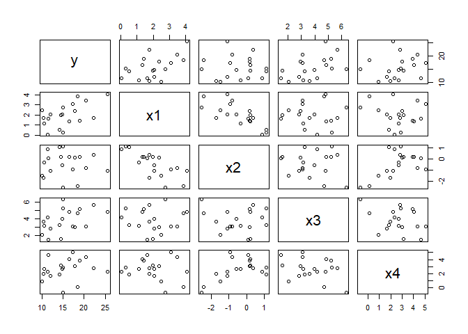

4+ More Dimension Reduction!
================
Daniel Carpenter

-   <a href="#deletion-and-indicators"
    id="toc-deletion-and-indicators"><span
    class="toc-section-number">1</span> Deletion and Indicators</a>
    -   <a href="#summary" id="toc-summary"><span
        class="toc-section-number">1.1</span> Summary</a>
    -   <a href="#single-imputation" id="toc-single-imputation"><span
        class="toc-section-number">1.2</span> Single Imputation</a>
    -   <a href="#multiple-imputation" id="toc-multiple-imputation"><span
        class="toc-section-number">1.3</span> Multiple Imputation</a>
    -   <a href="#maximum-likelihood" id="toc-maximum-likelihood"><span
        class="toc-section-number">1.4</span> Maximum Likelihood</a>
    -   <a href="#other-r-examples-of-missingness"
        id="toc-other-r-examples-of-missingness"><span
        class="toc-section-number">1.5</span> Other R Examples of
        Missingness</a>

# Deletion and Indicators

## Summary


## Single Imputation

### How to determine missingness cause?

> Example in R


| **MAR**  | Missing values in `y` depend on `x`, which x *is in* the data       |
|----------|---------------------------------------------------------------------|
| **MNAR** | Missing values in `y` depend on `y` (itself)                        |
| **MCAR** | Missing values in `y` depend on `z`, which `z` *is NOT* in the data |

### Handling Missingness - Basic/Simple Approaches

-   Note most imputation assumes MCAR or MAR

-   Can hurt the variance if not used well.

-   Nothing is perfect


<table>
<colgroup>
<col style="width: 16%" />
<col style="width: 34%" />
<col style="width: 32%" />
<col style="width: 17%" />
</colgroup>
<thead>
<tr class="header">
<th>Handling</th>
<th>Description</th>
<th>Implication</th>
<th>Example</th>
</tr>
</thead>
<tbody>
<tr class="odd">
<td>Listwise</td>
<td>Delete entire record if there are nulls</td>
<td>Less data</td>
<td><code>newdata &lt;- na.omit(mydata)</code></td>
</tr>
<tr class="even">
<td>Pairwise Deletion</td>
<td>Use all cases if available, for each column.</td>
<td>Hard to compare columns</td>
<td><code>mean(column,  na.rm=TRUE</code></td>
</tr>
<tr class="odd">
<td><p>Indicators</p>
<p><em>DO NOT USE THIS FOR MOST ANALYSIS</em></p></td>
<td>Create new binary <code>1/0</code> indicating missing values, or
could create new factor</td>
<td>Produces biased estimates since likely does not represent true
variance</td>
<td></td>
</tr>
<tr class="even">
<td>Single Value Imputation</td>
<td>Missing value changed with the mean, median</td>
<td>Produces biased estimates since likely does not represent
<em>true</em> variance</td>
<td></td>
</tr>
<tr class="odd">
<td>Stratified Imputation</td>
<td>Impute based on groupings</td>
<td>Less bad than single</td>
<td>Average income for male, females, etc.</td>
</tr>
</tbody>
</table>

### Handling Missingness - Predictive Approaches


| Handling                 | Description                                                               | Implication                                                                                                                                    | Example                        |
|--------------------------|---------------------------------------------------------------------------|------------------------------------------------------------------------------------------------------------------------------------------------|--------------------------------|
| Regression               | Build regression from non missing data. Then predict the values           | Trend is good, but it reduces error                                                                                                            |                                |
| Regression with Error    | Same as above, but include the `residual standard error` from model       | Still deflates variance, and cannot usually test success. Similar trend with realistic error, similar to original data. Does not restain range |                                |
| Predictive mean matching | Hybrid between regression, but also includes the range of current dataset | Better than prior, but can create ranges of variance that are incorrect.                                                                       |  |
| kNN                      | Uses distance calclulation to discover closest data to missing one        | Increased neighbors will be similar to mean imputation                                                                                         |  |

### Single Imputation in R

``` r
#Example of single imputation techniques for ISE 5103 Intelligent Data Analytics
#Charles Nicholson
#September 2015

#load appropriate libraries
library(VIM)
library(mice)


# CREATE A SET OF FAKE DATA  (y ~ x) ------------
x<-rexp(1000)
y<-0.5*rnorm(1000) + 0.5*x       
z<-runif(1000)

alpha<-runif(1000) # not included in dataframe
beta<-runif(1000)  # not included in dataframe

df<-data.frame(x,y,z)

xmax<-ceiling(max(df$x))
ymax<-ceiling(max(df$y))
ymin<-floor(min(df$y))


#scatterplot would look like this if there were NO MISSING INFORMATION
plot(df$x,df$y,ylim=c(ymin,ymax), xlim=c(0,xmax) , xlab="x", ylab="y")
```


``` r
# now lets create some missing values....
dfMiss <- df

dfMiss[df$y>1.30,"y"]<-NA           #MNAR
dfMiss[alpha<0.2,"z"]<-NA           #MCAR
dfMiss[beta>0.90,"y"]<-NA           #MCAR
dfMiss[df$x>2.65,"y"]<-NA           #MAR

missing <- is.na(dfMiss$y)
sum(missing)
```

    [1] 232

``` r
dfMiss$missing <- missing

#scatterplot now looks like this...
plot(dfMiss$x,dfMiss$y,ylim=c(ymin,ymax), xlim=c(0,xmax), xlab="x", ylab="y")
```


``` r
#imputaion by "hotdeck" --------------------------------------------------------
dfHD.imp <- dfMiss

#sample m values from from the non-missing data (with replacement)
hotdeck <- dfHD.imp[!missing,"y"]  # create sample pool

n <- length(hotdeck)    #size of sample pool
m <- sum(missing)    #how many samples do I need?

hotdeck <- hotdeck[sample(n,m,replace=TRUE)]

dfHD.imp[missing,"y"]<-hotdeck

plot(df$x,df$y,ylim=c(-1.3,4.25))    #plot of all data (no missings)
```


``` r
#plot data with hotdeck imputation -- imputed values in red
plot(dfHD.imp$x, dfHD.imp$y, col = factor(dfHD.imp$missing), ylim=c(ymin,ymax), xlim=c(0,xmax), xlab="x", ylab="y")
```


``` r
par(mfrow=c(2,1))   #setup graphics device to make two plots on the screen

hist(df$y, xlim=c(-1,xmax), main="All Data", xlab="x")   #histogram of all data
trueMV<-round(mean(df$y),3)                               
trueVar<-round(var(df$y),3)
abline(v = trueMV, col = "blue", lwd = 2)                    # add a line for the mean
text(4, 205, label=paste("Mean:",trueMV, "  Var:", trueVar)) # add text for mean and var

hist(dfHD.imp$y, xlim=c(-1,xmax), main="Hot Deck", xlab="x")
mv<-round(mean(dfHD.imp$y),3)
svar<-round(var(dfHD.imp$y),3)
abline(v = mv, col = "blue", lwd = 2)
text(4, 100, label=paste("Mean:",mv, "  Var:", svar))
```


``` r
par(mfrow=c(1,1))   # reset graphics device to the default 1 plot


#imputation by mean ---------------------------------------------------------

dfMean.imp<-dfMiss  #copy of the data with missings

dfMean.imp[missing,"y"]<-mean(dfMean.imp$y,na.rm=T)   #imputation by mean


par(mfrow=c(2,1))
hist(df$y, xlim=c(-1,xmax), main="All Data", xlab="x")
abline(v = trueMV, col = "blue", lwd = 2)
text(4, 205, label=paste("Mean:",trueMV, "  Var:", trueVar))

hist(dfMean.imp$y, xlim=c(-1,xmax), main="Mean Imputation", xlab="x")
mv<-round(mean(dfMean.imp$y),3)
svar<-round(var(dfMean.imp$y),3)
abline(v = mv, col = "blue", lwd = 2)
text(4, 205, label=paste("Mean:",mv, "  Var:", svar))
```


``` r
par(mfrow=c(1,1))

plot(dfMean.imp$x, dfMean.imp$y, col = factor(dfMean.imp$missing), ylim=c(ymin,ymax), xlim=c(0,xmax), xlab="x", ylab="y")
```


``` r
#imputation by "regression"  ---------------------------------------------

fit<-lm(dfMiss$y~dfMiss$x)    # fit a linear model to the data
f<-summary(fit)
print (f)  
```


    Call:
    lm(formula = dfMiss$y ~ dfMiss$x)

    Residuals:
         Min       1Q   Median       3Q      Max 
    -1.69438 -0.31201  0.00807  0.31616  1.17192 

    Coefficients:
                Estimate Std. Error t value Pr(>|t|)    
    (Intercept) -0.01975    0.02528  -0.781    0.435    
    dfMiss$x     0.42572    0.02658  16.014   <2e-16 ***
    ---
    Signif. codes:  0 '***' 0.001 '**' 0.01 '*' 0.05 '.' 0.1 ' ' 1

    Residual standard error: 0.4576 on 766 degrees of freedom
      (232 observations deleted due to missingness)
    Multiple R-squared:  0.2508,    Adjusted R-squared:  0.2499 
    F-statistic: 256.5 on 1 and 766 DF,  p-value: < 2.2e-16

``` r
str(f)
```

    List of 12
     $ call         : language lm(formula = dfMiss$y ~ dfMiss$x)
     $ terms        :Classes 'terms', 'formula'  language dfMiss$y ~ dfMiss$x
      .. ..- attr(*, "variables")= language list(dfMiss$y, dfMiss$x)
      .. ..- attr(*, "factors")= int [1:2, 1] 0 1
      .. .. ..- attr(*, "dimnames")=List of 2
      .. .. .. ..$ : chr [1:2] "dfMiss$y" "dfMiss$x"
      .. .. .. ..$ : chr "dfMiss$x"
      .. ..- attr(*, "term.labels")= chr "dfMiss$x"
      .. ..- attr(*, "order")= int 1
      .. ..- attr(*, "intercept")= int 1
      .. ..- attr(*, "response")= int 1
      .. ..- attr(*, ".Environment")=<environment: R_GlobalEnv> 
      .. ..- attr(*, "predvars")= language list(dfMiss$y, dfMiss$x)
      .. ..- attr(*, "dataClasses")= Named chr [1:2] "numeric" "numeric"
      .. .. ..- attr(*, "names")= chr [1:2] "dfMiss$y" "dfMiss$x"
     $ residuals    : Named num [1:768] 0.7 -0.959 0.3 0.218 0.406 ...
      ..- attr(*, "names")= chr [1:768] "2" "3" "4" "5" ...
     $ coefficients : num [1:2, 1:4] -0.0197 0.4257 0.0253 0.0266 -0.7812 ...
      ..- attr(*, "dimnames")=List of 2
      .. ..$ : chr [1:2] "(Intercept)" "dfMiss$x"
      .. ..$ : chr [1:4] "Estimate" "Std. Error" "t value" "Pr(>|t|)"
     $ aliased      : Named logi [1:2] FALSE FALSE
      ..- attr(*, "names")= chr [1:2] "(Intercept)" "dfMiss$x"
     $ sigma        : num 0.458
     $ df           : int [1:3] 2 766 2
     $ r.squared    : num 0.251
     $ adj.r.squared: num 0.25
     $ fstatistic   : Named num [1:3] 256 1 766
      ..- attr(*, "names")= chr [1:3] "value" "numdf" "dendf"
     $ cov.unscaled : num [1:2, 1:2] 0.00305 -0.00243 -0.00243 0.00338
      ..- attr(*, "dimnames")=List of 2
      .. ..$ : chr [1:2] "(Intercept)" "dfMiss$x"
      .. ..$ : chr [1:2] "(Intercept)" "dfMiss$x"
     $ na.action    : 'omit' Named int [1:232] 1 10 15 23 27 28 30 31 34 36 ...
      ..- attr(*, "names")= chr [1:232] "1" "10" "15" "23" ...
     - attr(*, "class")= chr "summary.lm"

``` r
c<-f[[4]]                     # extract the coefficients 
se<-f[[6]]                    # extract the model standard error

dfReg.imp <- dfMiss
dfReg.imp[missing,"y"]<- (c[1] + c[2]*dfReg.imp[missing,"x"])   #imputataion with regression


par(mfrow=c(2,1))
hist(df$y, xlim=c(-1,xmax), main="All Data", xlab="x")
abline(v = trueMV, col = "blue", lwd = 2)
text(4, 205, label=paste("Mean:",trueMV, "  Var:", trueVar))

hist(dfReg.imp$y, xlim=c(-1,xmax), main="Regression Imputation", xlab="x")
mv<-round(mean(dfReg.imp$y),3)
svar<-round(var(dfReg.imp$y),3)
abline(v = mv, col = "blue", lwd = 2)
text(4, 205, label=paste("Mean:",mv, "  Var:", svar))
```


``` r
par(mfrow=c(1,1))

plot(dfReg.imp$x, dfReg.imp$y, col = factor(dfReg.imp$missing),ylim=c(ymin,ymax), xlim=c(0,xmax), xlab="x", ylab="y")
```


``` r
# USE THE mice PACKAGE FOR Predictive Mean Matching (PMM) -----------------------
dfPMM.imp <- dfMiss

#imputation by PMM
dfPMM.imp[missing,"y"] <- mice.impute.pmm(dfPMM.imp$y, !dfPMM.imp$missing, dfPMM.imp$x)

plot(dfPMM.imp$x, dfPMM.imp$y, col = factor(dfPMM.imp$missing), ylim=c(ymin,ymax), xlim=c(0,xmax), xlab="x", ylab="y")
```


``` r
par(mfrow=c(2,1))
hist(df$y, xlim=c(-1,xmax),main="All Data", xlab="x")
abline(v = trueMV, col = "blue", lwd = 2)
text(4, 205, label=paste("Mean:",trueMV, "  Var:", trueVar))

hist(dfPMM.imp$y, xlim=c(-1,xmax), main="Predictive Mean Matching", xlab="x")
mv<-round(mean(dfPMM.imp$y),3)
svar<-round(var(dfPMM.imp$y),3)
abline(v = mv, col = "blue", lwd = 2)
text(4, 80, label=paste("Mean:",mv, "  Var:", svar))
```


``` r
par(mfrow=c(1,1))


#imputation by "regression" plus random error -------------------------

dfRegErr.imp <- dfReg.imp

#imputation by regression with error (remember that se = standard error of model)
dfRegErr.imp[missing,"y"] <- dfRegErr.imp[missing,"y"] + rnorm(sum(missing),0,se**2)

par(mfrow=c(2,1))
hist(df$y, xlim=c(-1,xmax), main="All Data", xlab="x")
abline(v = trueMV, col = "blue", lwd = 2)
text(4, 205, label=paste("Mean:",trueMV, "  Var:", trueVar))

hist(dfRegErr.imp$y, xlim=c(-1,xmax), main="Regression Imputation with Error", xlab="x")
mv<-round(mean(dfRegErr.imp$y),3)
svar<-round(var(dfRegErr.imp$y),3)
abline(v = mv, col = "blue", lwd = 2)
text(4, 205, label=paste("Mean:",mv, "  Var:", svar))
```


``` r
par(mfrow=c(1,1))

plot(dfRegErr.imp$x, dfRegErr.imp$y, col = factor(dfRegErr.imp$missing), ylim=c(ymin,ymax), xlim=c(0,xmax), xlab="x", ylab="y")
```


``` r
# k-nearest neighbor from VIM package (kNN imputation) ----------------------------

dfKNN.imp <- kNN(dfMiss[,1:3],k=5)
plot(dfKNN.imp$x, dfKNN.imp$y, col = factor(dfKNN.imp$y_imp), ylim=c(ymin,ymax), xlim=c(0,xmax), xlab="x", ylab="y")
```


``` r
par(mfrow=c(2,1))
hist(df$y, xlim=c(-1,xmax), main="All Data", xlab="x")
abline(v = trueMV, col = "blue", lwd = 2)
text(4, 205, label=paste("Mean:",trueMV, "  Var:", trueVar))

hist(dfKNN.imp$y, xlim=c(-1,xmax), main="k-Nearest Neighbor", xlab="x")
mv<-round(mean(dfKNN.imp$y),3)
svar<-round(var(dfKNN.imp$y),3)
abline(v = mv, col = "blue", lwd = 2)
text(4, 100, label=paste("Mean:",mv, "  Var:", svar))
```


``` r
par(mfrow=c(1,1))


# for fun, try kNN with 400 neighbors....  it takes a few seconds...

dfKNN400.imp <- kNN(dfMiss[,1:3],k=400)
plot(dfKNN400.imp$x, dfKNN400.imp$y, col = factor(dfKNN400.imp$y_imp), ylim=c(ymin,ymax), xlim=c(0,xmax), xlab="x", ylab="y")
```


``` r
#in summary...

par(mfrow = c(2,2))
plot(df$x,df$y,ylim=c(-1.3,4.25), main="All Data")
plot(dfMean.imp$x, dfMean.imp$y, col = factor(dfMean.imp$missing), main="Mean", ylim=c(ymin,ymax), xlim=c(0,xmax), xlab="x", ylab="y")
plot(dfHD.imp$x, dfHD.imp$y, col = factor(dfHD.imp$missing), main="Hot Deck", ylim=c(ymin,ymax), xlim=c(0,xmax), xlab="x", ylab="y")
plot(dfReg.imp$x, dfReg.imp$y, col = factor(dfReg.imp$missing), main="Regression", ylim=c(ymin,ymax), xlim=c(0,xmax), xlab="x", ylab="y")
```


``` r
plot(df$x,df$y,ylim=c(-1.3,4.25), main="All Data")
plot(dfPMM.imp$x, dfPMM.imp$y, col = factor(dfPMM.imp$missing),  main="Predictive Mean Matching",ylim=c(ymin,ymax), xlim=c(0,xmax), xlab="x", ylab="y")
plot(dfKNN.imp$x, dfKNN.imp$y, col = factor(dfKNN.imp$y_imp),  main="k-Nearest Neighbors", ylim=c(ymin,ymax), xlim=c(0,xmax), xlab="x", ylab="y")
plot(dfRegErr.imp$x, dfRegErr.imp$y, col = factor(dfRegErr.imp$missing) , main="Regression with Random Error",ylim=c(ymin,ymax), xlim=c(0,xmax), xlab="x", ylab="y")
```


## Multiple Imputation

### Steps


### Iterative Approach


## Maximum Likelihood


## Other R Examples of Missingness

``` r
#there are other methods as well, e.g.,

#Sequential imputation for missing values ----------------------- 
# need to install library rrcovNA first

library(rrcovNA)   

dfSeq.imp <- data.frame(impSeq(dfMiss[,1:3]))
dfSeq<-merge(dfSeq.imp,dfMiss[,c(1,4)],by.x="x", by.y="x")

par(mfrow=c(2,1))
hist(df$y, xlim=c(-1,xmax), main="All Data")
abline(v = trueMV, col = "blue", lwd = 2)
text(4, 205, label=paste("Mean:",trueMV, "  Var:", trueVar))

hist(dfSeq$y, xlim=c(-1,xmax), main="Sequential Imputation")
mv<-round(mean(dfSeq$y),3)
svar<-round(var(dfSeq$y),3)
abline(v = mv, col = "blue", lwd = 2)
text(4, 100, label=paste("Mean:",mv, "  Var:", svar))
```



``` r
par(mfrow=c(1,1))

plot(df$x,df$y,ylim=c(ymin,ymax), xlim=c(0,xmax), main="All Data", xlab="x", ylab="y")
```


``` r
plot(dfMiss$x,dfMiss$y,ylim=c(ymin,ymax), xlim=c(0,xmax), main="Data without Imputation", xlab="x", ylab="y")
```



``` r
plot(dfSeq$x,dfSeq$y,ylim=c(ymin,ymax), xlim=c(0,xmax), col = factor(dfSeq$missing), main="Sequential Imputation", xlab="x", ylab="y")
```


``` r
#robust sequential imputation ----------------------------------
dfSeq.imp <- data.frame(impSeqRob(dfMiss[,1:3]))
dfSeq<-merge(dfSeq.imp,dfMiss[,c(1,4)],by.x="x.x", by.y="x")

par(mfrow=c(2,1))
hist(df$y, xlim=c(-1,xmax), main="All Data")
abline(v = trueMV, col = "blue", lwd = 2)
text(4, 205, label=paste("Mean:",trueMV, "  Var:", trueVar))

hist(dfSeq$x.y, xlim=c(-1,xmax), main="Robust Sequential Imputation")
mv<-round(mean(dfSeq$x.y),3)
svar<-round(var(dfSeq$x.y),3)
abline(v = mv, col = "blue", lwd = 2)
text(4, 100, label=paste("Mean:",mv, "  Var:", svar))
```



``` r
par(mfrow=c(1,1))

plot(df$x,df$y,ylim=c(ymin,ymax), xlim=c(0,xmax), main="All Data", xlab="x", ylab="y")
```


``` r
plot(dfSeq$x.x,dfSeq$x.y,ylim=c(ymin,ymax), xlim=c(0,xmax), col = factor(dfSeq$missing), main="Robust Sequential Imputation", xlab="x", ylab="y")
```


