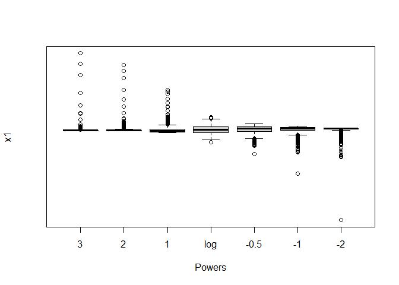
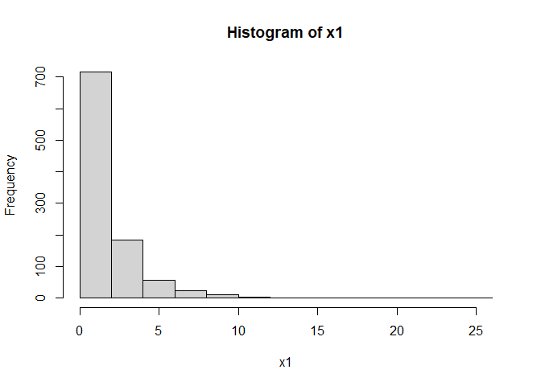
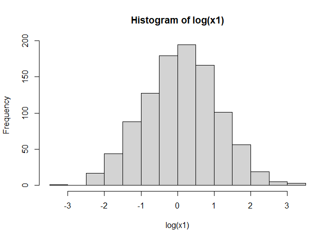
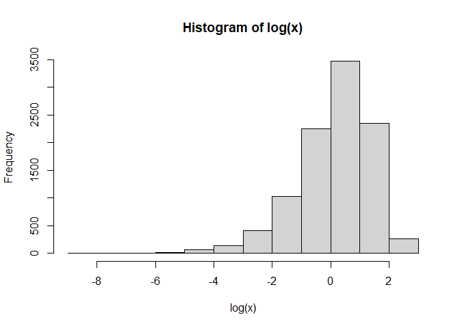
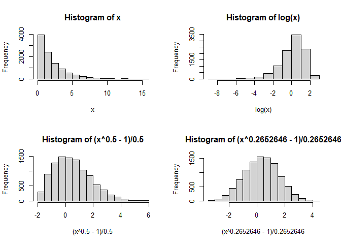

Feature Engineering
================
Daniel Carpenter

-   <a href="#standardize-data" id="toc-standardize-data"><span
    class="toc-section-number">1</span> Standardize Data</a>
-   <a href="#how-to-transform-skewness"
    id="toc-how-to-transform-skewness"><span
    class="toc-section-number">2</span> How to Transform Skewness</a>
-   <a href="#example-in-r" id="toc-example-in-r"><span
    class="toc-section-number">3</span> Example in R</a>

## Standardize Data

### Techniques


## How to Transform Skewness

> Approach 1: Take the `log` of the skewed variable


### Example 1 (Concepts)


## Example in R

``` r
# Example code to demonstrate skewed distribution transformations
# ISE 5103 Intelligent Data Analytics
# Charles Nicholson
# September 2015


library("car")        #<-- used to get Prestige dataset; and 'symbox' function
```

    Loading required package: carData

``` r
library("EnvStats")   #<-- used to get "boxcox" function
```


    Attaching package: 'EnvStats'

    The following object is masked from 'package:car':

        qqPlot

    The following objects are masked from 'package:stats':

        predict, predict.lm

    The following object is masked from 'package:base':

        print.default

``` r
data(Prestige)   #Prestige of Canadian Occupations based on Pineo-Porter prestige score
# ?Prestige

head(Prestige)
```

                        education income women prestige census type
    gov.administrators      13.11  12351 11.16     68.8   1113 prof
    general.managers        12.26  25879  4.02     69.1   1130 prof
    accountants             12.77   9271 15.70     63.4   1171 prof
    purchasing.officers     11.42   8865  9.11     56.8   1175 prof
    chemists                14.62   8403 11.68     73.5   2111 prof
    physicists              15.64  11030  5.13     77.6   2113 prof

``` r
hist(Prestige$income)        # distribution before transformation
```


``` r
boxplot(Prestige$income)     # boxplot before transformation
```


``` r
# symbox from the car package
# produces parallel boxplots for different values of lambda
symbox(Prestige$income, data=Prestige, powers=c(3,2,1,0,-0.5,-1,-2))
```


``` r
hist(log(Prestige$income))  # histogram of the log transformed Prestige$income variable
```


``` r
# can do the same thing on a more heavily skewed data sets
x1<-rlnorm(1000)                          #create lognormal distributed random data set                          
symbox(x1, powers=c(3,2,1,0,-0.5,-1,-2))  #and look at symbox output
```



``` r
hist(x1)
```



``` r
hist(log(x1))
```



``` r
x<-rexp(10000,rate=0.5)   # some more fake data... this time exponential

symbox(x, powers=c(3,2,1,0,-0.5,-1,-2))      #and look at symbox output
```


``` r
hist(x)
```


``` r
hist(log(x))
```



``` r
head(boxcox(x))     # produces a PPCC (probability plot correlation coefficient) value 
```

    $lambda
    [1] -2.0 -1.5 -1.0 -0.5  0.0  0.5  1.0  1.5  2.0

    $objective
    [1] 0.07707657 0.09860491 0.17978042 0.57420895 0.96979524 0.98564238 0.90046064
    [8] 0.77837618 0.64132502

    $objective.name
    [1] "PPCC"

    $optimize
    [1] FALSE

    $optimize.bounds
    lower upper 
       NA    NA 

    $eps
    [1] 2.220446e-16

``` r
              # for several values of lambda -- the highest PPCC value is the better lambda

par(mfrow=c(2,2))  # setup the output area to plot the histograms in 2 rows of 3 columns
                   # and then look at several options of transformations

hist(x)
hist(log(x))
hist((x**0.5-1)/0.5)  


# can use boxcox to search for the optimal lambda value
head(boxcox(x, optimize = TRUE, lambda=c(-3,3)))    # if optimize = TRUE, then you must tell the function the 
```

    $lambda
    [1] 0.2671363

    $objective
    [1] 0.9993702

    $objective.name
    [1] "PPCC"

    $optimize
    [1] TRUE

    $optimize.bounds
    lower upper 
       -3     3 

    $eps
    [1] 2.220446e-16

``` r
                                              # the search range, e.g. search on the interval (-3,3)

hist((x**0.2652646-1)/0.2652646)  
```



``` r
dev.off()   # turn off output device and reset the graphical parameters
```

    null device 
              1 

``` r
# optional piece to show how different power transforms affect the data ------------

# create vector of x-coordinates
x <- seq(from=0,to=4,by=.01)

# Use the command 'plot' to plot the first line. 
#   type = what type of plot should be drawn ("l" stands for lines)
#   lty = line type, lwd = line width, ylim = range on y-axis
plot(x, (x^(-1)-1)/(-1), col=1, lty=1, lwd=2, type="l", ylim=c(-4,6), 
     main="Family of powers and roots",xlab="x", ylab="x^{(p)}")

# Use the command 'lines' to add the other lines to the plot
lines(x, log(x), col=2, lty=2, lwd=2)
lines(x, (x-1)/1, col=3, lty=3, lwd=2)
lines(x, (x^2-1)/2, col=4, lty=4, lwd=2)
lines(x, (x^3-1)/3, col=5, lty=5, lwd=2)

# Add a legend:
legend(0,6,c("p=-1", "p=0 (log)", "p=1", "p=2", "p=3"), col=c(1,2,3,4,5), 
       lty=c(1,2,3,4,5), lwd=2)


# ------------------------------------------------------------------------------------
```
