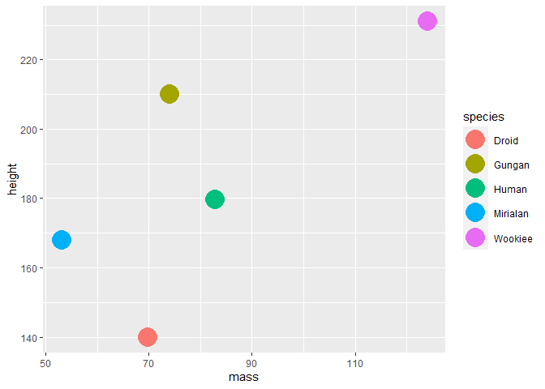

Data Wrangling in R
================
Daniel Carpenter

``` r
#ISE/DSA 5103 Demo to tidyr, dplyr, and magritter from the tidyverse
#Charles Nicholson, Ph.D.
#September 30, 2019
#Adpated from https://dplyr.tidyverse.org/


#load all of the packages associated with the tidyverse
#includes dplyr, tidyr, and magritter
library(tidyverse)
```

    ── Attaching packages ─────────────────────────────────────── tidyverse 1.3.2 ──
    ✔ ggplot2 3.3.6     ✔ purrr   0.3.4
    ✔ tibble  3.1.8     ✔ dplyr   1.0.9
    ✔ tidyr   1.2.0     ✔ stringr 1.4.1
    ✔ readr   2.1.2     ✔ forcats 0.5.2
    ── Conflicts ────────────────────────────────────────── tidyverse_conflicts() ──
    ✖ dplyr::filter() masks stats::filter()
    ✖ dplyr::lag()    masks stats::lag()

``` r
#data set for the example
data(starwars)

#take a quick look at the data...
head(starwars)
```

    # A tibble: 6 × 14
      name         height  mass hair_…¹ skin_…² eye_c…³ birth…⁴ sex   gender homew…⁵
      <chr>         <int> <dbl> <chr>   <chr>   <chr>     <dbl> <chr> <chr>  <chr>  
    1 Luke Skywal…    172    77 blond   fair    blue       19   male  mascu… Tatooi…
    2 C-3PO           167    75 <NA>    gold    yellow    112   none  mascu… Tatooi…
    3 R2-D2            96    32 <NA>    white,… red        33   none  mascu… Naboo  
    4 Darth Vader     202   136 none    white   yellow     41.9 male  mascu… Tatooi…
    5 Leia Organa     150    49 brown   light   brown      19   fema… femin… Aldera…
    6 Owen Lars       178   120 brown,… light   blue       52   male  mascu… Tatooi…
    # … with 4 more variables: species <chr>, films <list>, vehicles <list>,
    #   starships <list>, and abbreviated variable names ¹​hair_color, ²​skin_color,
    #   ³​eye_color, ⁴​birth_year, ⁵​homeworld

``` r
#an additional method for taking a quick look at the data
glimpse(starwars)
```

    Rows: 87
    Columns: 14
    $ name       <chr> "Luke Skywalker", "C-3PO", "R2-D2", "Darth Vader", "Leia Or…
    $ height     <int> 172, 167, 96, 202, 150, 178, 165, 97, 183, 182, 188, 180, 2…
    $ mass       <dbl> 77.0, 75.0, 32.0, 136.0, 49.0, 120.0, 75.0, 32.0, 84.0, 77.…
    $ hair_color <chr> "blond", NA, NA, "none", "brown", "brown, grey", "brown", N…
    $ skin_color <chr> "fair", "gold", "white, blue", "white", "light", "light", "…
    $ eye_color  <chr> "blue", "yellow", "red", "yellow", "brown", "blue", "blue",…
    $ birth_year <dbl> 19.0, 112.0, 33.0, 41.9, 19.0, 52.0, 47.0, NA, 24.0, 57.0, …
    $ sex        <chr> "male", "none", "none", "male", "female", "male", "female",…
    $ gender     <chr> "masculine", "masculine", "masculine", "masculine", "femini…
    $ homeworld  <chr> "Tatooine", "Tatooine", "Naboo", "Tatooine", "Alderaan", "T…
    $ species    <chr> "Human", "Droid", "Droid", "Human", "Human", "Human", "Huma…
    $ films      <list> <"The Empire Strikes Back", "Revenge of the Sith", "Return…
    $ vehicles   <list> <"Snowspeeder", "Imperial Speeder Bike">, <>, <>, <>, "Imp…
    $ starships  <list> <"X-wing", "Imperial shuttle">, <>, <>, "TIE Advanced x1",…

``` r
############ filter

#filter observations based on a criteria
starwars %>% 
  filter(species == "Droid")
```

    # A tibble: 6 × 14
      name   height  mass hair_color skin_color eye_c…¹ birth…² sex   gender homew…³
      <chr>   <int> <dbl> <chr>      <chr>      <chr>     <dbl> <chr> <chr>  <chr>  
    1 C-3PO     167    75 <NA>       gold       yellow      112 none  mascu… Tatooi…
    2 R2-D2      96    32 <NA>       white, bl… red          33 none  mascu… Naboo  
    3 R5-D4      97    32 <NA>       white, red red          NA none  mascu… Tatooi…
    4 IG-88     200   140 none       metal      red          15 none  mascu… <NA>   
    5 R4-P17     96    NA none       silver, r… red, b…      NA none  femin… <NA>   
    6 BB8        NA    NA none       none       black        NA none  mascu… <NA>   
    # … with 4 more variables: species <chr>, films <list>, vehicles <list>,
    #   starships <list>, and abbreviated variable names ¹​eye_color, ²​birth_year,
    #   ³​homeworld

``` r
#filter observations based on a criteria
starwars %>% filter(!is.na(gender)) 
```

    # A tibble: 83 × 14
       name        height  mass hair_…¹ skin_…² eye_c…³ birth…⁴ sex   gender homew…⁵
       <chr>        <int> <dbl> <chr>   <chr>   <chr>     <dbl> <chr> <chr>  <chr>  
     1 Luke Skywa…    172    77 blond   fair    blue       19   male  mascu… Tatooi…
     2 C-3PO          167    75 <NA>    gold    yellow    112   none  mascu… Tatooi…
     3 R2-D2           96    32 <NA>    white,… red        33   none  mascu… Naboo  
     4 Darth Vader    202   136 none    white   yellow     41.9 male  mascu… Tatooi…
     5 Leia Organa    150    49 brown   light   brown      19   fema… femin… Aldera…
     6 Owen Lars      178   120 brown,… light   blue       52   male  mascu… Tatooi…
     7 Beru White…    165    75 brown   light   blue       47   fema… femin… Tatooi…
     8 R5-D4           97    32 <NA>    white,… red        NA   none  mascu… Tatooi…
     9 Biggs Dark…    183    84 black   light   brown      24   male  mascu… Tatooi…
    10 Obi-Wan Ke…    182    77 auburn… fair    blue-g…    57   male  mascu… Stewjon
    # … with 73 more rows, 4 more variables: species <chr>, films <list>,
    #   vehicles <list>, starships <list>, and abbreviated variable names
    #   ¹​hair_color, ²​skin_color, ³​eye_color, ⁴​birth_year, ⁵​homeworld

``` r
############ select and select_if

#select certain columns
starwars %>% 
  select(name, height, mass, birth_year)
```

    # A tibble: 87 × 4
       name               height  mass birth_year
       <chr>               <int> <dbl>      <dbl>
     1 Luke Skywalker        172    77       19  
     2 C-3PO                 167    75      112  
     3 R2-D2                  96    32       33  
     4 Darth Vader           202   136       41.9
     5 Leia Organa           150    49       19  
     6 Owen Lars             178   120       52  
     7 Beru Whitesun lars    165    75       47  
     8 R5-D4                  97    32       NA  
     9 Biggs Darklighter     183    84       24  
    10 Obi-Wan Kenobi        182    77       57  
    # … with 77 more rows

``` r
#select columns with criteria
starwars %>% 
  select(name, ends_with("color"))
```

    # A tibble: 87 × 4
       name               hair_color    skin_color  eye_color
       <chr>              <chr>         <chr>       <chr>    
     1 Luke Skywalker     blond         fair        blue     
     2 C-3PO              <NA>          gold        yellow   
     3 R2-D2              <NA>          white, blue red      
     4 Darth Vader        none          white       yellow   
     5 Leia Organa        brown         light       brown    
     6 Owen Lars          brown, grey   light       blue     
     7 Beru Whitesun lars brown         light       blue     
     8 R5-D4              <NA>          white, red  red      
     9 Biggs Darklighter  black         light       brown    
    10 Obi-Wan Kenobi     auburn, white fair        blue-gray
    # … with 77 more rows

``` r
starwars %>% 
  select_if(is.numeric)
```

    # A tibble: 87 × 3
       height  mass birth_year
        <int> <dbl>      <dbl>
     1    172    77       19  
     2    167    75      112  
     3     96    32       33  
     4    202   136       41.9
     5    150    49       19  
     6    178   120       52  
     7    165    75       47  
     8     97    32       NA  
     9    183    84       24  
    10    182    77       57  
    # … with 77 more rows

``` r
starwars %>% 
  select_if(is.character)
```

    # A tibble: 87 × 8
       name               hair_color    skin_…¹ eye_c…² sex   gender homew…³ species
       <chr>              <chr>         <chr>   <chr>   <chr> <chr>  <chr>   <chr>  
     1 Luke Skywalker     blond         fair    blue    male  mascu… Tatooi… Human  
     2 C-3PO              <NA>          gold    yellow  none  mascu… Tatooi… Droid  
     3 R2-D2              <NA>          white,… red     none  mascu… Naboo   Droid  
     4 Darth Vader        none          white   yellow  male  mascu… Tatooi… Human  
     5 Leia Organa        brown         light   brown   fema… femin… Aldera… Human  
     6 Owen Lars          brown, grey   light   blue    male  mascu… Tatooi… Human  
     7 Beru Whitesun lars brown         light   blue    fema… femin… Tatooi… Human  
     8 R5-D4              <NA>          white,… red     none  mascu… Tatooi… Droid  
     9 Biggs Darklighter  black         light   brown   male  mascu… Tatooi… Human  
    10 Obi-Wan Kenobi     auburn, white fair    blue-g… male  mascu… Stewjon Human  
    # … with 77 more rows, and abbreviated variable names ¹​skin_color, ²​eye_color,
    #   ³​homeworld

``` r
############ select and filter

#combine filter and select columns
starwars %>% 
  filter(is.na(gender))  %>% 
  select(name, ends_with("color"))
```

    # A tibble: 4 × 4
      name           hair_color skin_color eye_color
      <chr>          <chr>      <chr>      <chr>    
    1 Ric Olié       brown      fair       blue     
    2 Quarsh Panaka  black      dark       brown    
    3 Sly Moore      none       pale       white    
    4 Captain Phasma unknown    unknown    unknown  

``` r
############ mutate and mutate_if and trasmute/transmute_if

#create new variables through transformation 
starwars %>% 
  mutate(bmi = mass / ((height / 100)  ^ 2)) %>%
  select(name:mass, bmi)
```

    # A tibble: 87 × 4
       name               height  mass   bmi
       <chr>               <int> <dbl> <dbl>
     1 Luke Skywalker        172    77  26.0
     2 C-3PO                 167    75  26.9
     3 R2-D2                  96    32  34.7
     4 Darth Vader           202   136  33.3
     5 Leia Organa           150    49  21.8
     6 Owen Lars             178   120  37.9
     7 Beru Whitesun lars    165    75  27.5
     8 R5-D4                  97    32  34.0
     9 Biggs Darklighter     183    84  25.1
    10 Obi-Wan Kenobi        182    77  23.2
    # … with 77 more rows

``` r
#create new variables through transformation 
starwars %>% 
  mutate(bmi = mass / ((height / 100)  ^ 2)) %>%
  mutate_if(is.numeric, scale) %>%
  select(name:mass, bmi)
```

    # A tibble: 87 × 4
       name               height[,1] mass[,1] bmi[,1]
       <chr>                   <dbl>    <dbl>   <dbl>
     1 Luke Skywalker        -0.0678  -0.120  -0.110 
     2 C-3PO                 -0.212   -0.132  -0.0939
     3 R2-D2                 -2.25    -0.385   0.0487
     4 Darth Vader            0.795    0.228   0.0233
     5 Leia Organa           -0.701   -0.285  -0.187 
     6 Owen Lars              0.105    0.134   0.106 
     7 Beru Whitesun lars    -0.269   -0.132  -0.0820
     8 R5-D4                 -2.22    -0.385   0.0357
     9 Biggs Darklighter      0.249   -0.0786 -0.127 
    10 Obi-Wan Kenobi         0.220   -0.120  -0.160 
    # … with 77 more rows

``` r
#selective mutation
starwars %>% 
  mutate(bmi = mass / ((height / 100)  ^ 2)) %>%
  transmute_if(is.numeric, scale) # drop everthing not calculated
```

    # A tibble: 87 × 4
       height[,1] mass[,1] birth_year[,1] bmi[,1]
            <dbl>    <dbl>          <dbl>   <dbl>
     1    -0.0678  -0.120          -0.443 -0.110 
     2    -0.212   -0.132           0.158 -0.0939
     3    -2.25    -0.385          -0.353  0.0487
     4     0.795    0.228          -0.295  0.0233
     5    -0.701   -0.285          -0.443 -0.187 
     6     0.105    0.134          -0.230  0.106 
     7    -0.269   -0.132          -0.262 -0.0820
     8    -2.22    -0.385          NA      0.0357
     9     0.249   -0.0786         -0.411 -0.127 
    10     0.220   -0.120          -0.198 -0.160 
    # … with 77 more rows

``` r
############ arrange

#sort the data
starwars %>% 
  arrange(desc(mass))
```

    # A tibble: 87 × 14
       name        height  mass hair_…¹ skin_…² eye_c…³ birth…⁴ sex   gender homew…⁵
       <chr>        <int> <dbl> <chr>   <chr>   <chr>     <dbl> <chr> <chr>  <chr>  
     1 Jabba Desi…    175  1358 <NA>    green-… orange    600   herm… mascu… Nal Hu…
     2 Grievous       216   159 none    brown,… green,…    NA   male  mascu… Kalee  
     3 IG-88          200   140 none    metal   red        15   none  mascu… <NA>   
     4 Darth Vader    202   136 none    white   yellow     41.9 male  mascu… Tatooi…
     5 Tarfful        234   136 brown   brown   blue       NA   male  mascu… Kashyy…
     6 Owen Lars      178   120 brown,… light   blue       52   male  mascu… Tatooi…
     7 Bossk          190   113 none    green   red        53   male  mascu… Trando…
     8 Chewbacca      228   112 brown   unknown blue      200   male  mascu… Kashyy…
     9 Jek Tono P…    180   110 brown   fair    blue       NA   male  mascu… Bestin…
    10 Dexter Jet…    198   102 none    brown   yellow     NA   male  mascu… Ojom   
    # … with 77 more rows, 4 more variables: species <chr>, films <list>,
    #   vehicles <list>, starships <list>, and abbreviated variable names
    #   ¹​hair_color, ²​skin_color, ³​eye_color, ⁴​birth_year, ⁵​homeworld

``` r
##sorting based on new variables created
starwars %>% 
  mutate(bmi = mass / ((height / 100)  ^ 2)) %>%
  select(name:mass, bmi) %>%
  arrange(desc(bmi))
```

    # A tibble: 87 × 4
       name                  height  mass   bmi
       <chr>                  <int> <dbl> <dbl>
     1 Jabba Desilijic Tiure    175  1358 443. 
     2 Dud Bolt                  94    45  50.9
     3 Yoda                      66    17  39.0
     4 Owen Lars                178   120  37.9
     5 IG-88                    200   140  35  
     6 R2-D2                     96    32  34.7
     7 Grievous                 216   159  34.1
     8 R5-D4                     97    32  34.0
     9 Jek Tono Porkins         180   110  34.0
    10 Darth Vader              202   136  33.3
    # … with 77 more rows

``` r
############ group_by and summarize commands

#group by and summarization
starwars %>% 
  group_by(homeworld) %>%
  summarize(n = n()) %>%
  arrange(desc(n))
```

    # A tibble: 49 × 2
       homeworld     n
       <chr>     <int>
     1 Naboo        11
     2 Tatooine     10
     3 <NA>         10
     4 Alderaan      3
     5 Coruscant     3
     6 Kamino        3
     7 Corellia      2
     8 Kashyyyk      2
     9 Mirial        2
    10 Ryloth        2
    # … with 39 more rows

``` r
#group by and summarization
#filtering to make sure that mass and species are not missing
starwars %>% 
  drop_na(mass, species)  %>%
  group_by(species) %>%
  summarise(
    n = n(),
    mass = mean(mass, na.rm = TRUE)
  ) 
```

    # A tibble: 31 × 3
       species       n  mass
       <chr>     <int> <dbl>
     1 Aleena        1  15  
     2 Besalisk      1 102  
     3 Cerean        1  82  
     4 Clawdite      1  55  
     5 Droid         4  69.8
     6 Dug           1  40  
     7 Ewok          1  20  
     8 Geonosian     1  80  
     9 Gungan        2  74  
    10 Human        22  82.8
    # … with 21 more rows

``` r
#group by and summarization with pre and post-filtering
starwars %>%
  drop_na(mass, species)  %>%
  group_by(species) %>%
  summarise(
    n = n(),
    mass = mean(mass, na.rm = TRUE)
  ) %>%
  filter(n > 1,
         mass > 40) %>% 
  arrange(desc(mass))
```

    # A tibble: 5 × 3
      species      n  mass
      <chr>    <int> <dbl>
    1 Wookiee      2 124  
    2 Human       22  82.8
    3 Gungan       2  74  
    4 Droid        4  69.8
    5 Mirialan     2  53.1

``` r
############ use with ggplot as well

#and connect it to ggplot if you like
starwars %>%
  drop_na(mass, species)  %>%
  group_by(species) %>%
  summarize(
    n = n(),
    height = mean(height, na.rm=TRUE),
    mass = mean(mass, na.rm = TRUE)
  ) %>%
  filter(n > 1,
         mass > 40) %>% 
     ggplot(aes(mass,height,color=species)) + geom_point(size=8)
```



``` r
############ gather and spread

#demonstrate reshaping data using gather...

#multiple characteristics per character on each line
starwars %>% 
  select(name, ends_with("color"))
```

    # A tibble: 87 × 4
       name               hair_color    skin_color  eye_color
       <chr>              <chr>         <chr>       <chr>    
     1 Luke Skywalker     blond         fair        blue     
     2 C-3PO              <NA>          gold        yellow   
     3 R2-D2              <NA>          white, blue red      
     4 Darth Vader        none          white       yellow   
     5 Leia Organa        brown         light       brown    
     6 Owen Lars          brown, grey   light       blue     
     7 Beru Whitesun lars brown         light       blue     
     8 R5-D4              <NA>          white, red  red      
     9 Biggs Darklighter  black         light       brown    
    10 Obi-Wan Kenobi     auburn, white fair        blue-gray
    # … with 77 more rows

``` r
#now, one characteristic per character on each line
starwars %>% 
  select(name, ends_with("color")) %>%
  gather(key = "attribute", value="color", -name)
```

    # A tibble: 261 × 3
       name               attribute  color        
       <chr>              <chr>      <chr>        
     1 Luke Skywalker     hair_color blond        
     2 C-3PO              hair_color <NA>         
     3 R2-D2              hair_color <NA>         
     4 Darth Vader        hair_color none         
     5 Leia Organa        hair_color brown        
     6 Owen Lars          hair_color brown, grey  
     7 Beru Whitesun lars hair_color brown        
     8 R5-D4              hair_color <NA>         
     9 Biggs Darklighter  hair_color black        
    10 Obi-Wan Kenobi     hair_color auburn, white
    # … with 251 more rows

``` r
#now, one characteristic per character on each line (sorted)
starwars %>% 
  select(name, ends_with("color")) %>%
  gather(key = "attribute", value="color", -name) %>%
  arrange(name)
```

    # A tibble: 261 × 3
       name             attribute  color       
       <chr>            <chr>      <chr>       
     1 Ackbar           hair_color none        
     2 Ackbar           skin_color brown mottle
     3 Ackbar           eye_color  orange      
     4 Adi Gallia       hair_color none        
     5 Adi Gallia       skin_color dark        
     6 Adi Gallia       eye_color  blue        
     7 Anakin Skywalker hair_color blond       
     8 Anakin Skywalker skin_color fair        
     9 Anakin Skywalker eye_color  blue        
    10 Arvel Crynyd     hair_color brown       
    # … with 251 more rows

``` r
#now, one characteristic per character on each line (sorted and stored as dataframe)
temp<-starwars %>% 
  select(name, ends_with("color")) %>%
  gather(key = "attribute", value="color", -name) %>%
  arrange(name)

#the new data frame
temp
```

    # A tibble: 261 × 3
       name             attribute  color       
       <chr>            <chr>      <chr>       
     1 Ackbar           hair_color none        
     2 Ackbar           skin_color brown mottle
     3 Ackbar           eye_color  orange      
     4 Adi Gallia       hair_color none        
     5 Adi Gallia       skin_color dark        
     6 Adi Gallia       eye_color  blue        
     7 Anakin Skywalker hair_color blond       
     8 Anakin Skywalker skin_color fair        
     9 Anakin Skywalker eye_color  blue        
    10 Arvel Crynyd     hair_color brown       
    # … with 251 more rows

``` r
#we can spread the gathered data back out...
temp %>% 
  spread (key = "attribute", value="color") %>%
  arrange(name)
```

    # A tibble: 87 × 4
       name                eye_color hair_color skin_color         
       <chr>               <chr>     <chr>      <chr>              
     1 Ackbar              orange    none       brown mottle       
     2 Adi Gallia          blue      none       dark               
     3 Anakin Skywalker    blue      blond      fair               
     4 Arvel Crynyd        brown     brown      fair               
     5 Ayla Secura         hazel     none       blue               
     6 Bail Prestor Organa brown     black      tan                
     7 Barriss Offee       blue      black      yellow             
     8 BB8                 black     none       none               
     9 Ben Quadinaros      orange    none       grey, green, yellow
    10 Beru Whitesun lars  blue      brown      light              
    # … with 77 more rows
