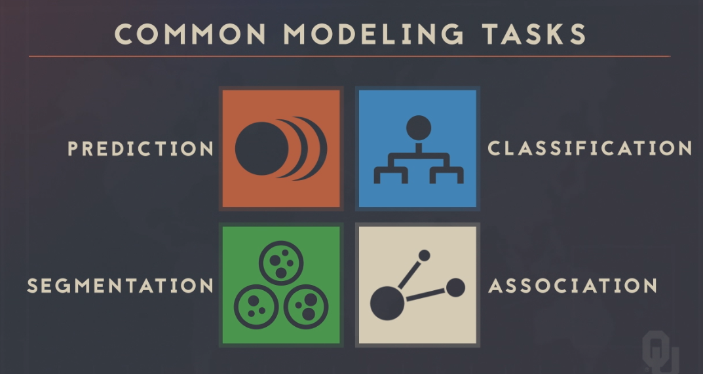
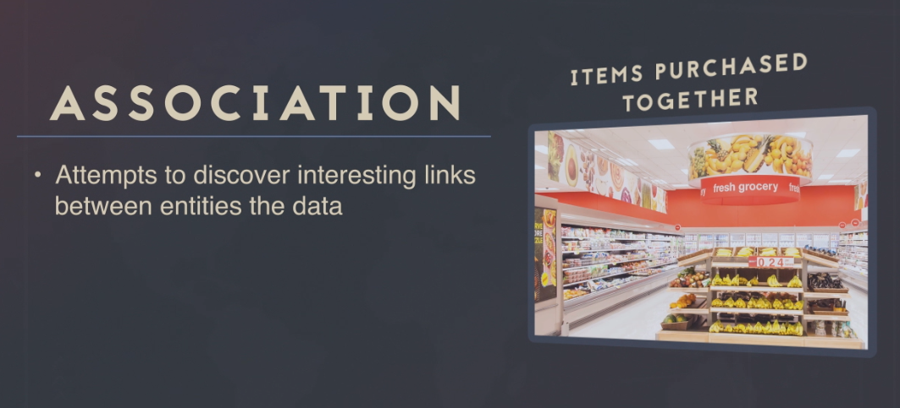

Modeling
================
Daniel Carpenter

-   <a href="#objectives" id="toc-objectives">1 Objectives</a>
-   <a href="#overview" id="toc-overview">2 Overview</a>

## Objectives

-   Supervised vs. Unsupervised Learning

-   Evaluate the technical performance of regression-based prediction
    models using tools such as Mean Absolute Error, RMSE, and Adjusted
    R^2

-   Use data strategies such as cross-validation and bootstrapping for
    model tuning and for assessing generalizable performance

## Overview

### Complementary Product Association

