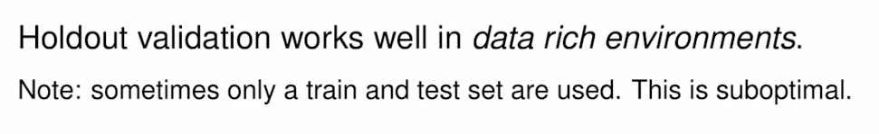

Modeling
================
Daniel Carpenter

-   <a href="#objectives" id="toc-objectives">1 Objectives</a>
-   <a href="#overview" id="toc-overview">2 Overview</a>
-   <a href="#prediction" id="toc-prediction">3 Prediction</a>
-   <a href="#classification" id="toc-classification">4 Classification</a>
-   <a href="#overfitting" id="toc-overfitting">5 Overfitting</a>
-   <a href="#testing-data" id="toc-testing-data">6 Testing Data</a>
-   <a href="#predictions-on-data" id="toc-predictions-on-data">7 Predictions on Data</a>

## Objectives

-   Supervised vs. Unsupervised Learning

-   Evaluate the technical performance of regression-based prediction
    models using tools such as Mean Absolute Error, RMSE, and Adjusted
    R^2

-   Use data strategies such as cross-validation and bootstrapping for
    model tuning and for assessing generalizable performance

## Overview

## Prediction

> Predict continuous data

## Classification

> Try to predict non-continuous data

### Supervised Learning

> Goal is either inference or prediction

### Unsupervised Modeling

## Overfitting

## Testing Data

### Holdout Validation

> Single iteration

### K-Fold Cross Validation

> Holdout validation just multiple times

### Bootstrap Sampling

## Predictions on Data

`caret` package streamlines the modeling process into similar function
conventions
