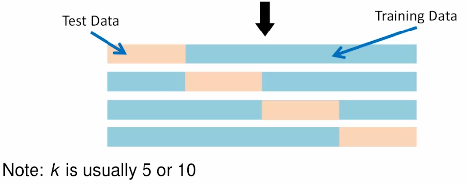

Modeling
================
Daniel Carpenter

-   <a href="#objectives" id="toc-objectives"><span
    class="toc-section-number">1</span> Objectives</a>
-   <a href="#overview" id="toc-overview"><span
    class="toc-section-number">2</span> Overview</a>
-   <a href="#prediction" id="toc-prediction"><span
    class="toc-section-number">3</span> Prediction</a>
-   <a href="#classification" id="toc-classification"><span
    class="toc-section-number">4</span> Classification</a>
-   <a href="#overfitting" id="toc-overfitting"><span
    class="toc-section-number">5</span> Overfitting</a>
-   <a href="#testing-data" id="toc-testing-data"><span
    class="toc-section-number">6</span> Testing Data</a>
-   <a href="#predictions-on-data" id="toc-predictions-on-data"><span
    class="toc-section-number">7</span> Predictions on Data</a>
-   <a href="#modeling-example-with-caret"
    id="toc-modeling-example-with-caret"><span
    class="toc-section-number">8</span> Modeling Example with
    <code>caret</code></a>

## Objectives

-   Supervised vs. Unsupervised Learning

-   Evaluate the technical performance of regression-based prediction
    models using tools such as Mean Absolute Error, RMSE, and Adjusted
    R^2

-   Use data strategies such as cross-validation and bootstrapping for
    model tuning and for assessing generalizable performance

## Overview


## Prediction

> Predict continuous data

## Classification

> Try to predict non-continuous data


### Supervised Learning

> Goal is either inference or prediction


### Unsupervised Modeling


## Overfitting


## Testing Data


### Holdout Validation

> Single iteration


### K-Fold Cross Validation

> Holdout validation just multiple times



### Bootstrap Sampling


## Predictions on Data


`caret` package streamlines the modeling process into similar function
conventions

## Modeling Example with `caret`

``` r
library(caret)
```

    Loading required package: ggplot2

    Loading required package: lattice

``` r
library(AppliedPredictiveModeling)
library(tidyverse)
```

    ── Attaching packages
    ───────────────────────────────────────
    tidyverse 1.3.2 ──

    ✔ tibble  3.1.8     ✔ dplyr   1.0.9
    ✔ tidyr   1.2.0     ✔ stringr 1.4.1
    ✔ readr   2.1.2     ✔ forcats 0.5.2
    ✔ purrr   0.3.4     
    ── Conflicts ────────────────────────────────────────── tidyverse_conflicts() ──
    ✖ dplyr::filter() masks stats::filter()
    ✖ dplyr::lag()    masks stats::lag()
    ✖ purrr::lift()   masks caret::lift()

``` r
data(concrete,package="AppliedPredictiveModeling")

?concrete
```

    starting httpd help server ... done

``` r
# Compressive Strength of Concrete from Yeh (1998)
# 
# Data that can be used to model compressive strength of concrete formulations
# as a functions of their ingredients and age.
#
# From: http://archive.ics.uci.edu/ml/datasets/Concrete+Compressive+Strength
#
# "Concrete is the most important material in civil engineering. The 
# concrete compressive strength is a highly nonlinear function of age and 
# ingredients. These ingredients include cement, blast furnace slag, fly ash, 
# water, superplasticizer, coarse aggregate, and fine aggregate."

# Cement (component 1) -- quantitative -- kg in a m3 mixture -- Input Variable
# Blast Furnace Slag (component 2) -- quantitative -- kg in a m3 mixture -- Input Variable
# Fly Ash (component 3) -- quantitative -- kg in a m3 mixture -- Input Variable
# Water (component 4) -- quantitative -- kg in a m3 mixture -- Input Variable
# Superplasticizer (component 5) -- quantitative -- kg in a m3 mixture -- Input Variable
# Coarse Aggregate (component 6) -- quantitative -- kg in a m3 mixture -- Input Variable
# Fine Aggregate (component 7) -- quantitative -- kg in a m3 mixture -- Input Variable
# Age -- quantitative -- Day (1~365) -- Input Variable
# Concrete compressive strength -- quantitative -- MPa -- Output Variable 


glimpse(concrete)
```

    Rows: 1,030
    Columns: 9
    $ Cement              <dbl> 540.0, 540.0, 332.5, 332.5, 198.6, 266.0, 380.0, 3…
    $ BlastFurnaceSlag    <dbl> 0.0, 0.0, 142.5, 142.5, 132.4, 114.0, 95.0, 95.0, …
    $ FlyAsh              <dbl> 0, 0, 0, 0, 0, 0, 0, 0, 0, 0, 0, 0, 0, 0, 0, 0, 0,…
    $ Water               <dbl> 162, 162, 228, 228, 192, 228, 228, 228, 228, 228, …
    $ Superplasticizer    <dbl> 2.5, 2.5, 0.0, 0.0, 0.0, 0.0, 0.0, 0.0, 0.0, 0.0, …
    $ CoarseAggregate     <dbl> 1040.0, 1055.0, 932.0, 932.0, 978.4, 932.0, 932.0,…
    $ FineAggregate       <dbl> 676.0, 676.0, 594.0, 594.0, 825.5, 670.0, 594.0, 5…
    $ Age                 <int> 28, 28, 270, 365, 360, 90, 365, 28, 28, 28, 90, 28…
    $ CompressiveStrength <dbl> 79.99, 61.89, 40.27, 41.05, 44.30, 47.03, 43.70, 3…

``` r
#train command -- can access several models
#              -- performs resampling
#              -- performs hyperparameter tuning (when available)

# the "lm" model does not have any hyperparameters

fit <- train(CompressiveStrength~.,
             data=concrete,
             method="lm")

fit
```

    Linear Regression 

    1030 samples
       8 predictor

    No pre-processing
    Resampling: Bootstrapped (25 reps) 
    Summary of sample sizes: 1030, 1030, 1030, 1030, 1030, 1030, ... 
    Resampling results:

      RMSE      Rsquared   MAE     
      10.57121  0.5994311  8.347026

    Tuning parameter 'intercept' was held constant at a value of TRUE

``` r
fit$finalModel
```


    Call:
    lm(formula = .outcome ~ ., data = dat)

    Coefficients:
         (Intercept)            Cement  BlastFurnaceSlag            FlyAsh  
           -23.33121           0.11980           0.10387           0.08793  
               Water  Superplasticizer   CoarseAggregate     FineAggregate  
            -0.14992           0.29222           0.01809           0.02019  
                 Age  
             0.11422  

``` r
#you can adjust the resampling parameters using "trainControl"


fitControl <- trainControl(method="cv",number=5)

fit <- train(CompressiveStrength~.,
             data=concrete,
             method="lm",
             trControl=fitControl)
fit
```

    Linear Regression 

    1030 samples
       8 predictor

    No pre-processing
    Resampling: Cross-Validated (5 fold) 
    Summary of sample sizes: 824, 823, 824, 824, 825 
    Resampling results:

      RMSE      Rsquared   MAE     
      10.46165  0.6123215  8.289379

    Tuning parameter 'intercept' was held constant at a value of TRUE

``` r
#if you wish to also train hyperparameters...
# (1) make sure you know what hyperparameters are available to tune
# (2) either use the default parameter search, or
# (3) more likely setup your own search parameters


# the lasso model has hyperparameters
# look for the correct "method" and parameter names on:
# https://topepo.github.io/caret/available-models.html


#method name is "lasso" and parameter name is "fraction"


#using default training values

fit <- train(CompressiveStrength~.,
             data=concrete,
             method="lasso",
             trControl=fitControl)

fit
```

    The lasso 

    1030 samples
       8 predictor

    No pre-processing
    Resampling: Cross-Validated (5 fold) 
    Summary of sample sizes: 822, 826, 825, 823, 824 
    Resampling results across tuning parameters:

      fraction  RMSE      Rsquared   MAE      
      0.1       15.00674  0.3435557  12.118682
      0.5       11.25174  0.5774486   9.093951
      0.9       10.47115  0.6099787   8.326503

    RMSE was used to select the optimal model using the smallest value.
    The final value used for the model was fraction = 0.9.

``` r
plot(fit)
```


``` r
#or change the metric you want to plot

plot(fit, metric = "Rsquared")
```


``` r
#expanding the  default parameter search some

fit <- train(CompressiveStrength~.,
             data=concrete,
             method="lasso",
             trControl=fitControl,
             tuneLength = 10)

fit
```

    The lasso 

    1030 samples
       8 predictor

    No pre-processing
    Resampling: Cross-Validated (5 fold) 
    Summary of sample sizes: 825, 822, 825, 824, 824 
    Resampling results across tuning parameters:

      fraction   RMSE      Rsquared   MAE      
      0.1000000  15.05032  0.3291629  12.149984
      0.1888889  13.88007  0.4368472  11.220527
      0.2777778  12.94422  0.4983227  10.487277
      0.3666667  12.14416  0.5444440   9.850540
      0.4555556  11.51187  0.5665504   9.313891
      0.5444444  11.07010  0.5816910   8.938308
      0.6333333  10.80740  0.5920424   8.706487
      0.7222222  10.59623  0.6026674   8.499720
      0.8111111  10.49571  0.6071787   8.386437
      0.9000000  10.46799  0.6085292   8.337192

    RMSE was used to select the optimal model using the smallest value.
    The final value used for the model was fraction = 0.9.

``` r
#specifying exactly the hyperparameter values to use with "expand.grid"

lassoGrid <- expand.grid(fraction=seq(0.7,0.99,length=100))

fit <- train(CompressiveStrength~.,
             data=concrete,
             method="lasso",
             trControl=fitControl,
             tuneGrid=lassoGrid)
fit
```

    The lasso 

    1030 samples
       8 predictor

    No pre-processing
    Resampling: Cross-Validated (5 fold) 
    Summary of sample sizes: 825, 824, 826, 823, 822 
    Resampling results across tuning parameters:

      fraction   RMSE      Rsquared   MAE     
      0.7000000  10.63330  0.6038913  8.522634
      0.7029293  10.62749  0.6041620  8.516903
      0.7058586  10.62180  0.6044265  8.511219
      0.7087879  10.61621  0.6046847  8.505714
      0.7117172  10.61073  0.6049367  8.500372
      0.7146465  10.60537  0.6051826  8.495118
      0.7175758  10.60011  0.6054224  8.489950
      0.7205051  10.59496  0.6056563  8.484795
      0.7234343  10.58993  0.6058842  8.479639
      0.7263636  10.58500  0.6061062  8.474577
      0.7292929  10.58019  0.6063224  8.469799
      0.7322222  10.57549  0.6065329  8.465022
      0.7351515  10.57089  0.6067372  8.460293
      0.7380808  10.56641  0.6069360  8.455633
      0.7410101  10.56204  0.6071292  8.451182
      0.7439394  10.55778  0.6073169  8.446794
      0.7468687  10.55363  0.6074991  8.442407
      0.7497980  10.54959  0.6076759  8.438113
      0.7527273  10.54565  0.6078474  8.433900
      0.7556566  10.54182  0.6080136  8.429757
      0.7585859  10.53810  0.6081746  8.425716
      0.7615152  10.53449  0.6083303  8.421958
      0.7644444  10.53100  0.6084810  8.418450
      0.7673737  10.52762  0.6086265  8.414963
      0.7703030  10.52435  0.6087671  8.411480
      0.7732323  10.52120  0.6089021  8.408118
      0.7761616  10.51817  0.6090312  8.404770
      0.7790909  10.51526  0.6091556  8.401523
      0.7820202  10.51245  0.6092751  8.398361
      0.7849495  10.50977  0.6093899  8.395310
      0.7878788  10.50719  0.6095000  8.392304
      0.7908081  10.50473  0.6096055  8.389298
      0.7937374  10.50252  0.6096979  8.386515
      0.7966667  10.50062  0.6097732  8.384053
      0.7995960  10.49883  0.6098442  8.381868
      0.8025253  10.49714  0.6099110  8.379863
      0.8054545  10.49549  0.6099623  8.377798
      0.8083838  10.49385  0.6100057  8.375744
      0.8113131  10.49225  0.6100470  8.373761
      0.8142424  10.49073  0.6100844  8.371828
      0.8171717  10.48929  0.6101181  8.369895
      0.8201010  10.48777  0.6101544  8.367843
      0.8230303  10.48632  0.6101874  8.366017
      0.8259596  10.48538  0.6101960  8.364821
      0.8288889  10.48467  0.6101926  8.363901
      0.8318182  10.48402  0.6101867  8.362982
      0.8347475  10.48312  0.6101950  8.361892
      0.8376768  10.48176  0.6102279  8.360536
      0.8406061  10.48070  0.6102493  8.359161
      0.8435354  10.47994  0.6102597  8.357750
      0.8464646  10.47920  0.6102687  8.356339
      0.8493939  10.47849  0.6102762  8.354928
      0.8523232  10.47782  0.6102822  8.353518
      0.8552525  10.47718  0.6102868  8.352107
      0.8581818  10.47657  0.6102900  8.350696
      0.8611111  10.47599  0.6102918  8.349285
      0.8640404  10.47545  0.6102921  8.347874
      0.8669697  10.47493  0.6102911  8.346552
      0.8698990  10.47445  0.6102886  8.345239
      0.8728283  10.47400  0.6102848  8.343946
      0.8757576  10.47334  0.6103244  8.342788
      0.8786869  10.47268  0.6103681  8.341648
      0.8816162  10.47204  0.6104105  8.340508
      0.8845455  10.47148  0.6104418  8.339445
      0.8874747  10.47128  0.6104267  8.338692
      0.8904040  10.47111  0.6104103  8.337939
      0.8933333  10.47096  0.6103927  8.337185
      0.8962626  10.47084  0.6103739  8.336432
      0.8991919  10.47075  0.6103538  8.335679
      0.9021212  10.47068  0.6103325  8.334925
      0.9050505  10.47053  0.6103290  8.334104
      0.9079798  10.47014  0.6103642  8.333143
      0.9109091  10.46977  0.6103984  8.332181
      0.9138384  10.46941  0.6104316  8.331220
      0.9167677  10.46906  0.6104638  8.330258
      0.9196970  10.46873  0.6104950  8.329296
      0.9226263  10.46841  0.6105252  8.328335
      0.9255556  10.46811  0.6105545  8.327373
      0.9284848  10.46782  0.6105827  8.326412
      0.9314141  10.46755  0.6106100  8.325450
      0.9343434  10.46729  0.6106364  8.324488
      0.9372727  10.46705  0.6106617  8.323527
      0.9402020  10.46681  0.6106861  8.322577
      0.9431313  10.46660  0.6107095  8.321659
      0.9460606  10.46639  0.6107319  8.320742
      0.9489899  10.46621  0.6107533  8.319828
      0.9519192  10.46603  0.6107738  8.318921
      0.9548485  10.46587  0.6107933  8.318043
      0.9577778  10.46573  0.6108119  8.317167
      0.9607071  10.46559  0.6108295  8.316292
      0.9636364  10.46548  0.6108461  8.315424
      0.9665657  10.46537  0.6108617  8.314565
      0.9694949  10.46528  0.6108764  8.313709
      0.9724242  10.46521  0.6108902  8.312852
      0.9753535  10.46515  0.6109030  8.311996
      0.9782828  10.46510  0.6109148  8.311139
      0.9812121  10.46507  0.6109257  8.310285
      0.9841414  10.46505  0.6109356  8.309447
      0.9870707  10.46505  0.6109446  8.308609
      0.9900000  10.46506  0.6109526  8.307774

    RMSE was used to select the optimal model using the smallest value.
    The final value used for the model was fraction = 0.9870707.

``` r
plot(fit)
```


``` r
#now for a too complicated model

#specifying exactly the hyperparameter values to use with "expand.grid"

lassoGrid <- expand.grid(fraction=seq(0.35,0.95,length=30))

fit <- train(CompressiveStrength~.*.,   #<-- notice the change!
              data=concrete,
             method="lasso",
             trControl=fitControl,
             tuneGrid=lassoGrid)
fit
```

    The lasso 

    1030 samples
       8 predictor

    No pre-processing
    Resampling: Cross-Validated (5 fold) 
    Summary of sample sizes: 824, 825, 824, 823, 824 
    Resampling results across tuning parameters:

      fraction   RMSE      Rsquared   MAE     
      0.3500000  8.852756  0.7207549  6.915859
      0.3706897  8.837152  0.7217596  6.910047
      0.3913793  8.822744  0.7226909  6.904409
      0.4120690  8.809024  0.7235825  6.898883
      0.4327586  8.795748  0.7244410  6.894738
      0.4534483  8.784323  0.7251845  6.891835
      0.4741379  8.773977  0.7258748  6.889982
      0.4948276  8.764452  0.7265166  6.888449
      0.5155172  8.755770  0.7270887  6.887280
      0.5362069  8.747175  0.7276455  6.884930
      0.5568966  8.738598  0.7281731  6.882047
      0.5775862  8.730795  0.7286422  6.879541
      0.5982759  8.726890  0.7288817  6.879194
      0.6189655  8.724490  0.7290380  6.879516
      0.6396552  8.723135  0.7291308  6.880094
      0.6603448  8.721826  0.7292279  6.880309
      0.6810345  8.720996  0.7292978  6.880866
      0.7017241  8.720865  0.7293237  6.882144
      0.7224138  8.721329  0.7293148  6.883820
      0.7431034  8.722289  0.7292774  6.886038
      0.7637931  8.724540  0.7291690  6.888835
      0.7844828  8.728436  0.7289572  6.892619
      0.8051724  8.732562  0.7287372  6.896685
      0.8258621  8.736381  0.7285438  6.900138
      0.8465517  8.740221  0.7283552  6.904328
      0.8672414  8.743139  0.7281961  6.908208
      0.8879310  8.746291  0.7280182  6.912145
      0.9086207  8.749534  0.7278360  6.915792
      0.9293103  8.753051  0.7276382  6.919881
      0.9500000  8.756411  0.7274458  6.923949

    RMSE was used to select the optimal model using the smallest value.
    The final value used for the model was fraction = 0.7017241.

``` r
plot(fit)
```


``` r
#some models have multiple parameters to train
#e.g., elasticnet: method = "enet", parameters: fraction, lambda

enetGrid <- expand.grid(lambda=seq(0,.15,length=5),
                        fraction=seq(0.45,.9,length=30))


fit <- train(CompressiveStrength~.*.,
             data=concrete,
             method="enet",
             trControl=fitControl,
             tuneGrid=enetGrid)
fit
```

    Elasticnet 

    1030 samples
       8 predictor

    No pre-processing
    Resampling: Cross-Validated (5 fold) 
    Summary of sample sizes: 823, 824, 824, 823, 826 
    Resampling results across tuning parameters:

      lambda  fraction   RMSE       Rsquared   MAE     
      0.0000  0.4500000   8.580570  0.7386518  6.748823
      0.0000  0.4655172   8.572836  0.7391286  6.745740
      0.0000  0.4810345   8.565801  0.7395629  6.743839
      0.0000  0.4965517   8.558800  0.7399886  6.741639
      0.0000  0.5120690   8.552139  0.7403932  6.739667
      0.0000  0.5275862   8.546022  0.7407654  6.738058
      0.0000  0.5431034   8.540453  0.7411053  6.736717
      0.0000  0.5586207   8.535361  0.7414166  6.735997
      0.0000  0.5741379   8.530384  0.7417194  6.735308
      0.0000  0.5896552   8.525819  0.7419939  6.735487
      0.0000  0.6051724   8.521640  0.7422313  6.736045
      0.0000  0.6206897   8.519550  0.7423552  6.737639
      0.0000  0.6362069   8.517858  0.7424553  6.739376
      0.0000  0.6517241   8.516589  0.7425248  6.741065
      0.0000  0.6672414   8.515952  0.7425506  6.743643
      0.0000  0.6827586   8.515399  0.7425699  6.746258
      0.0000  0.6982759   8.515029  0.7425798  6.748949
      0.0000  0.7137931   8.515040  0.7425708  6.751629
      0.0000  0.7293103   8.516385  0.7424880  6.754636
      0.0000  0.7448276   8.517816  0.7424010  6.757565
      0.0000  0.7603448   8.519673  0.7422893  6.760976
      0.0000  0.7758621   8.521674  0.7421691  6.764477
      0.0000  0.7913793   8.523897  0.7420381  6.768325
      0.0000  0.8068966   8.526498  0.7418875  6.772549
      0.0000  0.8224138   8.529334  0.7417238  6.776845
      0.0000  0.8379310   8.532371  0.7415486  6.781140
      0.0000  0.8534483   8.535568  0.7413647  6.785463
      0.0000  0.8689655   8.538994  0.7411665  6.789766
      0.0000  0.8844828   8.542716  0.7409478  6.793883
      0.0000  0.9000000   8.547286  0.7406760  6.798122
      0.0375  0.4500000   9.526155  0.6844747  7.594638
      0.0375  0.4655172   9.463398  0.6868926  7.523863
      0.0375  0.4810345   9.407082  0.6891533  7.459330
      0.0375  0.4965517   9.359848  0.6910557  7.400130
      0.0375  0.5120690   9.319646  0.6928395  7.349861
      0.0375  0.5275862   9.284005  0.6945871  7.304941
      0.0375  0.5431034   9.253365  0.6962213  7.268158
      0.0375  0.5586207   9.230264  0.6975938  7.241618
      0.0375  0.5741379   9.207989  0.6989146  7.217806
      0.0375  0.5896552   9.188546  0.7000920  7.195618
      0.0375  0.6051724   9.167675  0.7014246  7.172858
      0.0375  0.6206897   9.148041  0.7027047  7.150734
      0.0375  0.6362069   9.130857  0.7038407  7.129771
      0.0375  0.6517241   9.115748  0.7048600  7.109630
      0.0375  0.6672414   9.103053  0.7057455  7.092802
      0.0375  0.6827586   9.091892  0.7065061  7.080365
      0.0375  0.6982759   9.081501  0.7072216  7.071081
      0.0375  0.7137931   9.071895  0.7078798  7.063280
      0.0375  0.7293103   9.062594  0.7085067  7.056307
      0.0375  0.7448276   9.053684  0.7091101  7.049414
      0.0375  0.7603448   9.045190  0.7096918  7.043382
      0.0375  0.7758621   9.037471  0.7102246  7.038560
      0.0375  0.7913793   9.031081  0.7106728  7.034513
      0.0375  0.8068966   9.025392  0.7110773  7.030315
      0.0375  0.8224138   9.020037  0.7114625  7.026180
      0.0375  0.8379310   9.014962  0.7118252  7.022025
      0.0375  0.8534483   9.009969  0.7121731  7.017788
      0.0375  0.8689655   9.005011  0.7125196  7.013394
      0.0375  0.8844828   9.000303  0.7128492  7.009057
      0.0375  0.9000000   8.995970  0.7131534  7.005072
      0.0750  0.4500000   9.881725  0.6705248  7.949026
      0.0750  0.4655172   9.793146  0.6735428  7.866434
      0.0750  0.4810345   9.713067  0.6761622  7.788421
      0.0750  0.4965517   9.641454  0.6784338  7.714570
      0.0750  0.5120690   9.578438  0.6804963  7.646336
      0.0750  0.5275862   9.521469  0.6825913  7.582288
      0.0750  0.5431034   9.468958  0.6847753  7.522667
      0.0750  0.5586207   9.421771  0.6867930  7.467446
      0.0750  0.5741379   9.380358  0.6886041  7.416334
      0.0750  0.5896552   9.346324  0.6901716  7.371450
      0.0750  0.6051724   9.316190  0.6917555  7.330900
      0.0750  0.6206897   9.290187  0.6932455  7.296421
      0.0750  0.6362069   9.270942  0.6944233  7.268377
      0.0750  0.6517241   9.256977  0.6953904  7.247576
      0.0750  0.6672414   9.241913  0.6964710  7.227638
      0.0750  0.6827586   9.226361  0.6975536  7.209446
      0.0750  0.6982759   9.212277  0.6985479  7.192896
      0.0750  0.7137931   9.197691  0.6996016  7.176191
      0.0750  0.7293103   9.182530  0.7007150  7.159273
      0.0750  0.7448276   9.169073  0.7017358  7.142937
      0.0750  0.7603448   9.157211  0.7026708  7.127941
      0.0750  0.7758621   9.147146  0.7034946  7.115381
      0.0750  0.7913793   9.137931  0.7042075  7.105569
      0.0750  0.8068966   9.129391  0.7048805  7.096893
      0.0750  0.8224138   9.121128  0.7055158  7.088912
      0.0750  0.8379310   9.113020  0.7061350  7.081333
      0.0750  0.8534483   9.105878  0.7066897  7.074864
      0.0750  0.8689655   9.099792  0.7071764  7.069048
      0.0750  0.8844828   9.094566  0.7076009  7.063300
      0.0750  0.9000000   9.089642  0.7080061  7.057761
      0.1125  0.4500000  10.077836  0.6617503  8.132037
      0.1125  0.4655172   9.981269  0.6652552  8.043744
      0.1125  0.4810345   9.891750  0.6683832  7.959404
      0.1125  0.4965517   9.809819  0.6711469  7.880317
      0.1125  0.5120690   9.734934  0.6736119  7.807084
      0.1125  0.5275862   9.666695  0.6758672  7.737314
      0.1125  0.5431034   9.605921  0.6779179  7.670297
      0.1125  0.5586207   9.551688  0.6799178  7.609476
      0.1125  0.5741379   9.501661  0.6819814  7.553204
      0.1125  0.5896552   9.456153  0.6839818  7.500681
      0.1125  0.6051724   9.416209  0.6857938  7.450564
      0.1125  0.6206897   9.382392  0.6874066  7.405679
      0.1125  0.6362069   9.354652  0.6888360  7.365929
      0.1125  0.6517241   9.330120  0.6902949  7.329593
      0.1125  0.6672414   9.310514  0.6915802  7.299629
      0.1125  0.6827586   9.295629  0.6926771  7.275706
      0.1125  0.6982759   9.284653  0.6936192  7.256784
      0.1125  0.7137931   9.275590  0.6945161  7.240405
      0.1125  0.7293103   9.264258  0.6955346  7.223813
      0.1125  0.7448276   9.254212  0.6965121  7.209137
      0.1125  0.7603448   9.243494  0.6974529  7.195448
      0.1125  0.7758621   9.234274  0.6983129  7.182511
      0.1125  0.7913793   9.222758  0.6993166  7.168637
      0.1125  0.8068966   9.211798  0.7002973  7.155739
      0.1125  0.8224138   9.202283  0.7012041  7.144136
      0.1125  0.8379310   9.194027  0.7019785  7.134407
      0.1125  0.8534483   9.186546  0.7026719  7.126217
      0.1125  0.8689655   9.179410  0.7033287  7.118598
      0.1125  0.8844828   9.172703  0.7039378  7.111547
      0.1125  0.9000000   9.167201  0.7044629  7.105638
      0.1500  0.4500000  10.183177  0.6570082  8.229038
      0.1500  0.4655172  10.089217  0.6597766  8.145690
      0.1500  0.4810345   9.996381  0.6631128  8.061127
      0.1500  0.4965517   9.910246  0.6661160  7.978808
      0.1500  0.5120690   9.830742  0.6688210  7.901063
      0.1500  0.5275862   9.757770  0.6713014  7.828254
      0.1500  0.5431034   9.690989  0.6736004  7.758409
      0.1500  0.5586207   9.631016  0.6756712  7.693310
      0.1500  0.5741379   9.578109  0.6775908  7.633816
      0.1500  0.5896552   9.530310  0.6794867  7.578372
      0.1500  0.6051724   9.485867  0.6814973  7.526437
      0.1500  0.6206897   9.446876  0.6833335  7.477349
      0.1500  0.6362069   9.413658  0.6849940  7.432775
      0.1500  0.6517241   9.385827  0.6865060  7.392904
      0.1500  0.6672414   9.363568  0.6878601  7.356503
      0.1500  0.6827586   9.347146  0.6890283  7.326610
      0.1500  0.6982759   9.332719  0.6901981  7.301277
      0.1500  0.7137931   9.320761  0.6913150  7.280364
      0.1500  0.7293103   9.312351  0.6922859  7.263065
      0.1500  0.7448276   9.306796  0.6931661  7.248189
      0.1500  0.7603448   9.301064  0.6940701  7.234242
      0.1500  0.7758621   9.294125  0.6950354  7.220285
      0.1500  0.7913793   9.288554  0.6959374  7.208269
      0.1500  0.8068966   9.283452  0.6967878  7.198099
      0.1500  0.8224138   9.277483  0.6976128  7.188665
      0.1500  0.8379310   9.270948  0.6984776  7.178865
      0.1500  0.8534483   9.263169  0.6993950  7.167806
      0.1500  0.8689655   9.256631  0.7001562  7.158900
      0.1500  0.8844828   9.250736  0.7008512  7.150993
      0.1500  0.9000000   9.244999  0.7015067  7.143906

    RMSE was used to select the optimal model using the smallest value.
    The final values used for the model were fraction = 0.6982759 and lambda = 0.

``` r
plot(fit)
```


``` r
#if there are two hyperparameters to be trained, you can look at the
# "level" plot to see what are good combinations of the values

plot(fit, plotType="level")
```


