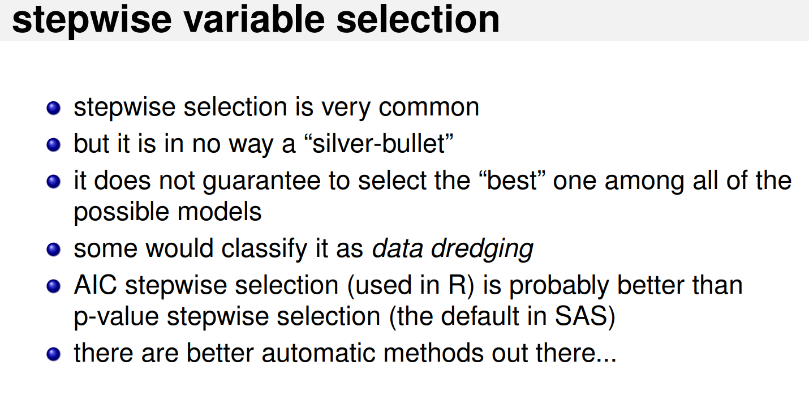

OLS
================
Daniel Carpenter

-   <a href="#simplifying-model" id="toc-simplifying-model"><span
    class="toc-section-number">1</span> Simplifying Model</a>

## Simplifying Model

### Stepwise Variable Selection

> add and eliminate vars as needed
>
> *NOTE MAY BE MISLEADING!!!!*




``` r
library(MASS) # stepAIC funciton

data(LifeCycleSavings)

# Basic model with a TON of interaction terms
fit4<-lm(data=LifeCycleSavings, sr ~ pop15 * pop75 * dpi * ddpi)
summary(fit4) # see model output
```


    Call:
    lm(formula = sr ~ pop15 * pop75 * dpi * ddpi, data = LifeCycleSavings)

    Residuals:
       Min     1Q Median     3Q    Max 
    -7.242 -2.584 -0.210  1.747  7.554 

    Coefficients:
                           Estimate Std. Error t value Pr(>|t|)
    (Intercept)          -0.0882202 44.6522904  -0.002    0.998
    pop15                 0.0819510  1.0771182   0.076    0.940
    pop75                 8.5513275 17.4312432   0.491    0.627
    dpi                  -0.0061387  0.0415464  -0.148    0.883
    ddpi                  4.5959209 14.1652647   0.324    0.748
    pop15:pop75          -0.1674024  0.4723558  -0.354    0.725
    pop15:dpi             0.0003742  0.0010810   0.346    0.731
    pop75:dpi             0.0025893  0.0137749   0.188    0.852
    pop15:ddpi           -0.0523640  0.3289468  -0.159    0.874
    pop75:ddpi           -1.7296781  4.9887381  -0.347    0.731
    dpi:ddpi              0.0051729  0.0116381   0.444    0.660
    pop15:pop75:dpi      -0.0001962  0.0003976  -0.493    0.625
    pop15:pop75:ddpi      0.0145471  0.1203934   0.121    0.905
    pop15:dpi:ddpi       -0.0002277  0.0003090  -0.737    0.466
    pop75:dpi:ddpi       -0.0022005  0.0041709  -0.528    0.601
    pop15:pop75:dpi:ddpi  0.0001109  0.0001244   0.891    0.379

    Residual standard error: 3.942 on 34 degrees of freedom
    Multiple R-squared:  0.463, Adjusted R-squared:  0.2261 
    F-statistic: 1.954 on 15 and 34 DF,  p-value: 0.05229

``` r
# Create a recomeded model using stepwise from the iteration
fit5 <- stepAIC(fit4, direction="both")
```

    Start:  AIC=149.88
    sr ~ pop15 * pop75 * dpi * ddpi

                           Df Sum of Sq    RSS    AIC
    - pop15:pop75:dpi:ddpi  1    12.345 540.57 149.03
    <none>                              528.23 149.88

    Step:  AIC=149.03
    sr ~ pop15 + pop75 + dpi + ddpi + pop15:pop75 + pop15:dpi + pop75:dpi + 
        pop15:ddpi + pop75:ddpi + dpi:ddpi + pop15:pop75:dpi + pop15:pop75:ddpi + 
        pop15:dpi:ddpi + pop75:dpi:ddpi

                           Df Sum of Sq    RSS    AIC
    - pop15:dpi:ddpi        1    1.5616 542.14 147.18
    - pop15:pop75:dpi       1   18.9880 559.56 148.76
    <none>                              540.57 149.03
    - pop75:dpi:ddpi        1   24.0875 564.66 149.21
    - pop15:pop75:ddpi      1   26.0400 566.61 149.38
    + pop15:pop75:dpi:ddpi  1   12.3452 528.23 149.88

    Step:  AIC=147.17
    sr ~ pop15 + pop75 + dpi + ddpi + pop15:pop75 + pop15:dpi + pop75:dpi + 
        pop15:ddpi + pop75:ddpi + dpi:ddpi + pop15:pop75:dpi + pop15:pop75:ddpi + 
        pop75:dpi:ddpi

                       Df Sum of Sq    RSS    AIC
    - pop15:pop75:dpi   1   17.9359 560.07 146.80
    <none>                          542.14 147.18
    - pop15:pop75:ddpi  1   24.5183 566.65 147.39
    - pop75:dpi:ddpi    1   24.6014 566.74 147.39
    + pop15:dpi:ddpi    1    1.5616 540.57 149.03

    Step:  AIC=146.8
    sr ~ pop15 + pop75 + dpi + ddpi + pop15:pop75 + pop15:dpi + pop75:dpi + 
        pop15:ddpi + pop75:ddpi + dpi:ddpi + pop15:pop75:ddpi + pop75:dpi:ddpi

                       Df Sum of Sq    RSS    AIC
    - pop15:dpi         1    0.1413 560.21 144.81
    - pop15:pop75:ddpi  1   12.4275 572.50 145.90
    - pop75:dpi:ddpi    1   17.2281 577.30 146.32
    <none>                          560.07 146.80
    + pop15:pop75:dpi   1   17.9359 542.14 147.18
    + pop15:dpi:ddpi    1    0.5095 559.56 148.76

    Step:  AIC=144.81
    sr ~ pop15 + pop75 + dpi + ddpi + pop15:pop75 + pop75:dpi + pop15:ddpi + 
        pop75:ddpi + dpi:ddpi + pop15:pop75:ddpi + pop75:dpi:ddpi

                       Df Sum of Sq    RSS    AIC
    - pop15:pop75:ddpi  1   13.7636 573.98 144.03
    - pop75:dpi:ddpi    1   17.3429 577.56 144.34
    <none>                          560.21 144.81
    + pop15:dpi         1    0.1413 560.07 146.80

    Step:  AIC=144.03
    sr ~ pop15 + pop75 + dpi + ddpi + pop15:pop75 + pop75:dpi + pop15:ddpi + 
        pop75:ddpi + dpi:ddpi + pop75:dpi:ddpi

                       Df Sum of Sq    RSS    AIC
    - pop15:ddpi        1    2.6210 576.60 142.26
    - pop75:dpi:ddpi    1    4.3962 578.37 142.41
    - pop15:pop75       1    6.0957 580.07 142.56
    <none>                          573.98 144.03
    + pop15:pop75:ddpi  1   13.7636 560.21 144.81
    + pop15:dpi         1    1.4773 572.50 145.90

    Step:  AIC=142.26
    sr ~ pop15 + pop75 + dpi + ddpi + pop15:pop75 + pop75:dpi + pop75:ddpi + 
        dpi:ddpi + pop75:dpi:ddpi

                     Df Sum of Sq    RSS    AIC
    - pop75:dpi:ddpi  1    2.2860 578.88 140.45
    - pop15:pop75     1    7.8937 584.49 140.94
    <none>                        576.60 142.26
    + pop15:ddpi      1    2.6210 573.98 144.03
    + pop15:dpi       1    0.1329 576.46 144.24

    Step:  AIC=140.45
    sr ~ pop15 + pop75 + dpi + ddpi + pop15:pop75 + pop75:dpi + pop75:ddpi + 
        dpi:ddpi

                     Df Sum of Sq    RSS    AIC
    - pop75:ddpi      1     6.546 585.43 139.02
    - pop15:pop75     1     9.910 588.79 139.30
    - pop75:dpi       1    10.734 589.62 139.37
    <none>                        578.88 140.45
    - dpi:ddpi        1    44.067 622.95 142.12
    + pop75:dpi:ddpi  1     2.286 576.60 142.26
    + pop15:ddpi      1     0.511 578.37 142.41
    + pop15:dpi       1     0.020 578.86 142.45

    Step:  AIC=139.02
    sr ~ pop15 + pop75 + dpi + ddpi + pop15:pop75 + pop75:dpi + dpi:ddpi

                  Df Sum of Sq    RSS    AIC
    - pop75:dpi    1    10.168 595.60 137.88
    - pop15:pop75  1    12.249 597.68 138.05
    <none>                     585.43 139.02
    - dpi:ddpi     1    41.092 626.52 140.41
    + pop75:ddpi   1     6.546 578.88 140.45
    + pop15:ddpi   1     0.318 585.11 140.99
    + pop15:dpi    1     0.131 585.30 141.00

    Step:  AIC=137.88
    sr ~ pop15 + pop75 + dpi + ddpi + pop15:pop75 + dpi:ddpi

                  Df Sum of Sq    RSS    AIC
    - pop15:pop75  1     2.958 598.55 136.12
    <none>                     595.60 137.88
    + pop75:dpi    1    10.168 585.43 139.02
    + pop75:ddpi   1     5.980 589.62 139.37
    + pop15:dpi    1     5.241 590.36 139.44
    - dpi:ddpi     1    45.223 640.82 139.54
    + pop15:ddpi   1     0.149 595.45 139.87

    Step:  AIC=136.12
    sr ~ pop15 + pop75 + dpi + ddpi + dpi:ddpi

                  Df Sum of Sq    RSS    AIC
    - pop75        1    16.708 615.26 135.50
    <none>                     598.55 136.12
    + pop75:ddpi   1     7.623 590.93 137.48
    + pop15:pop75  1     2.958 595.60 137.88
    + pop75:dpi    1     0.877 597.68 138.05
    + pop15:dpi    1     0.063 598.49 138.12
    + pop15:ddpi   1     0.014 598.54 138.12
    - dpi:ddpi     1    52.158 650.71 138.30
    - pop15        1    63.923 662.48 139.20

    Step:  AIC=135.5
    sr ~ pop15 + dpi + ddpi + dpi:ddpi

                 Df Sum of Sq    RSS    AIC
    <none>                    615.26 135.50
    + pop75       1    16.708 598.55 136.12
    + pop15:dpi   1     0.491 614.77 137.46
    + pop15:ddpi  1     0.002 615.26 137.50
    - pop15       1    58.171 673.43 138.02
    - dpi:ddpi    1    70.686 685.95 138.94

``` r
# fit5$anova  # display results
summary(fit5) # see model output
```


    Call:
    lm(formula = sr ~ pop15 + dpi + ddpi + dpi:ddpi, data = LifeCycleSavings)

    Residuals:
        Min      1Q  Median      3Q     Max 
    -7.6393 -2.7889 -0.0436  2.5328 10.7488 

    Coefficients:
                  Estimate Std. Error t value Pr(>|t|)    
    (Intercept) 16.5287997  4.3729241   3.780 0.000459 ***
    pop15       -0.2023669  0.0981090  -2.063 0.044943 *  
    dpi         -0.0027411  0.0011774  -2.328 0.024457 *  
    ddpi         0.0462479  0.2439993   0.190 0.850521    
    dpi:ddpi     0.0008171  0.0003593   2.274 0.027802 *  
    ---
    Signif. codes:  0 '***' 0.001 '**' 0.01 '*' 0.05 '.' 0.1 ' ' 1

    Residual standard error: 3.698 on 45 degrees of freedom
    Multiple R-squared:  0.3745,    Adjusted R-squared:  0.3189 
    F-statistic: 6.736 on 4 and 45 DF,  p-value: 0.0002452

``` r
# Check the recomendeded model
AIC(fit5)
```

    [1] 279.3952

``` r
BIC(fit5)
```

    [1] 290.8673
