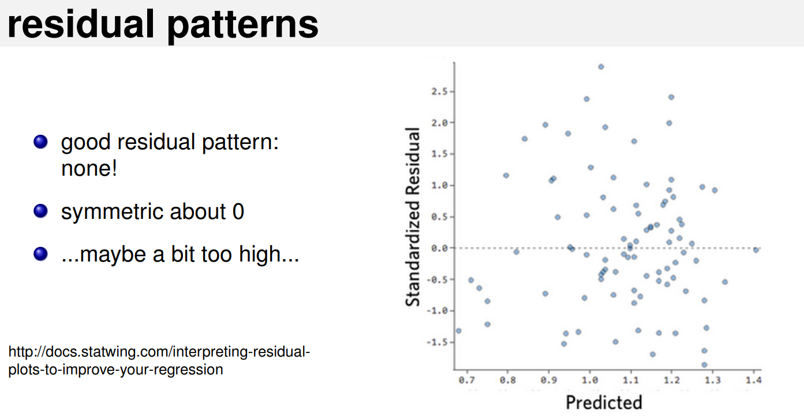
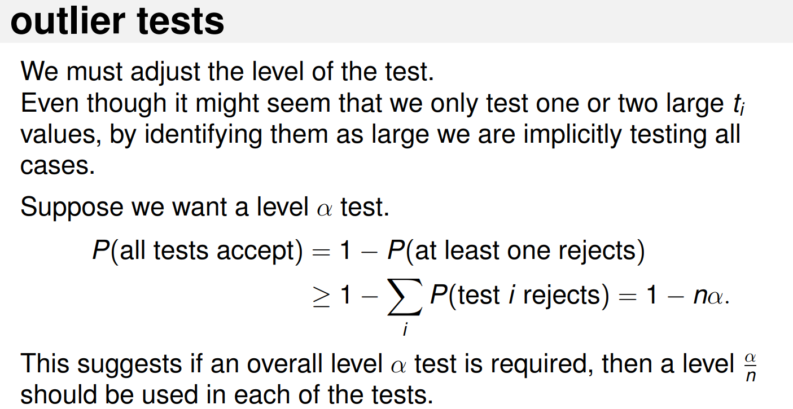

OLS
================
Daniel Carpenter

-   <a href="#diagnostics-and-bias" id="toc-diagnostics-and-bias"><span
    class="toc-section-number">1</span> Diagnostics and Bias</a>
-   <a href="#methods" id="toc-methods"><span
    class="toc-section-number">2</span> Methods</a>
    -   <a href="#plotting-actuals-vs.-prediction"
        id="toc-plotting-actuals-vs.-prediction"><span
        class="toc-section-number">2.1</span> Plotting Actuals
        vs. Prediction</a>
-   <a href="#bias-patterns-with-residuals"
    id="toc-bias-patterns-with-residuals"><span
    class="toc-section-number">3</span> Bias Patterns with Residuals</a>
    -   <a href="#no-pattern" id="toc-no-pattern"><span
        class="toc-section-number">3.1</span> No Pattern</a>
    -   <a href="#heteroskedasticity-increasing-variance"
        id="toc-heteroskedasticity-increasing-variance"><span
        class="toc-section-number">3.2</span> Heteroskedasticity: Increasing
        variance</a>
    -   <a href="#high-unbalance-on-residual-axis"
        id="toc-high-unbalance-on-residual-axis"><span
        class="toc-section-number">3.3</span> High Unbalance on
        <strong><em>Residual</em></strong> axis</a>
    -   <a href="#non-linear" id="toc-non-linear"><span
        class="toc-section-number">3.4</span> Non-Linear</a>
    -   <a href="#outlier" id="toc-outlier"><span
        class="toc-section-number">3.5</span> Outlier</a>
    -   <a href="#high-unbalance-on-predicted-axis"
        id="toc-high-unbalance-on-predicted-axis"><span
        class="toc-section-number">3.6</span> High Unbalance on Predicted
        Axis</a>
-   <a href="#examples-of-bias-and-overcoming-in-r"
    id="toc-examples-of-bias-and-overcoming-in-r"><span
    class="toc-section-number">4</span> Examples of Bias and Overcoming in
    <code>R</code></a>
    -   <a href="#fit-data" id="toc-fit-data"><span
        class="toc-section-number">4.1</span> Fit data</a>
    -   <a href="#heteroskedasticity-non-constant-variance"
        id="toc-heteroskedasticity-non-constant-variance"><span
        class="toc-section-number">4.2</span> Heteroskedasticity (Non-Constant
        Variance)</a>
    -   <a href="#normality" id="toc-normality"><span
        class="toc-section-number">4.3</span> Normality</a>
    -   <a href="#leverage" id="toc-leverage"><span
        class="toc-section-number">4.4</span> Leverage</a>
    -   <a href="#studentized-residuals" id="toc-studentized-residuals"><span
        class="toc-section-number">4.5</span> Studentized Residuals</a>
    -   <a href="#outliers" id="toc-outliers"><span
        class="toc-section-number">4.6</span> Outliers</a>
    -   <a href="#influencer" id="toc-influencer"><span
        class="toc-section-number">4.7</span> Influencer</a>
    -   <a href="#multi-collinearity" id="toc-multi-collinearity"><span
        class="toc-section-number">4.8</span> Multi-collinearity</a>
-   <a href="#classification" id="toc-classification"><span
    class="toc-section-number">5</span> Classification</a>

## Diagnostics and Bias


## Methods

### Plotting Actuals vs. Prediction


## Bias Patterns with Residuals

### No Pattern



### Heteroskedasticity: Increasing variance


### High Unbalance on ***Residual*** axis


### Non-Linear


### Outlier


### High Unbalance on Predicted Axis


## Examples of Bias and Overcoming in `R`

### Fit data

``` r
library(car)      #for some extra diagnostic tools
```

    Loading required package: carData

``` r
library(ggplot2)  #for plotting


#example using the LifeCycleSavings data
data(LifeCycleSavings)

#basic linear model
fit<-lm(data=LifeCycleSavings,sr ~ pop15 + pop75 + dpi + ddpi)
summary(fit)
```


    Call:
    lm(formula = sr ~ pop15 + pop75 + dpi + ddpi, data = LifeCycleSavings)

    Residuals:
        Min      1Q  Median      3Q     Max 
    -8.2422 -2.6857 -0.2488  2.4280  9.7509 

    Coefficients:
                  Estimate Std. Error t value Pr(>|t|)    
    (Intercept) 28.5660865  7.3545161   3.884 0.000334 ***
    pop15       -0.4611931  0.1446422  -3.189 0.002603 ** 
    pop75       -1.6914977  1.0835989  -1.561 0.125530    
    dpi         -0.0003369  0.0009311  -0.362 0.719173    
    ddpi         0.4096949  0.1961971   2.088 0.042471 *  
    ---
    Signif. codes:  0 '***' 0.001 '**' 0.01 '*' 0.05 '.' 0.1 ' ' 1

    Residual standard error: 3.803 on 45 degrees of freedom
    Multiple R-squared:  0.3385,    Adjusted R-squared:  0.2797 
    F-statistic: 5.756 on 4 and 45 DF,  p-value: 0.0007904

### Heteroskedasticity (Non-Constant Variance)

``` r
#test for non-constant variance
# Test for heteroskedasticity
ncvTest(fit)
```

    Non-constant Variance Score Test 
    Variance formula: ~ fitted.values 
    Chisquare = 2.274365, Df = 1, p = 0.13153

``` r
#residual plot
plot(fit$fitted.values,fit$residuals, col = "black", pch = 21, bg = "red") 
abline(h=0)
```


``` r
#histogram of residuals
qplot(fit$resid) + geom_histogram(binwidth=2)
```

    `stat_bin()` using `bins = 30`. Pick better value with `binwidth`.


### Normality

``` r
#qq plot of residuals
qqnorm(fit$resid)
qqline(fit$resid)
```


``` r
# partial residual plots
par(mfrow=c(2,2))
plot(LifeCycleSavings$pop15,fit$residuals, col = "black", pch = 21, bg = "red") 
abline(h=0)
plot(LifeCycleSavings$pop75,fit$residuals, col = "black", pch = 21, bg = "red") 
abline(h=0)
plot(LifeCycleSavings$dpi,fit$residuals, col = "black", pch = 21, bg = "red") 
abline(h=0)
plot(LifeCycleSavings$ddpi,fit$residuals, col = "black", pch = 21, bg = "red") 
abline(h=0)
```


``` r
dev.off()
```

    null device 
              1 

### Leverage


``` r
#index leverage plot
plot(hatvalues(fit),col = "black", pch = 21, bg = "red")      #index plot of leverages
abline(h=2*5/50)
```


``` r
hatvalues(fit)[hatvalues(fit)>0.2]
```

          Ireland         Japan United States         Libya 
        0.2122363     0.2233099     0.3336880     0.5314568 

``` r
#plot residuals vs. hatvalues
plot(hatvalues(fit),fit$residuals,col = "black", pch = 21, bg = "red")    #leverages and residuals
abline(h=0,v=2*5/50)
```


``` r
#standardized residuals (index plot) ----- 
plot(rstandard(fit),col = "black", pch = 21, bg = "red")      # index standardized residual plot
abline(h=c(-2,2), lty = 2)

#we can interactively identify points
identify(1:50,rstandard(fit),labels=names(fit$fitted.values))  #interactive click and identify points
```


    integer(0)

``` r
#standardized residuals vs. fitted values ----- 
plot(fit$fitted.values,rstandard(fit),col = "black", pch = 21, bg = "red")      #standardized residuals and fitted values
abline(h=c(-2,2), lty = 2)

identify(fit$fitted.values,rstandard(fit),labels=names(fit$fitted.values))
```


    integer(0)

### Studentized Residuals


``` r
# studentized residuals vs. fitted values ---------
plot(fit$fitted.values,rstudent(fit),col = "black", pch = 21, bg = "red")      #standardized residuals and fitted values
abline(h=c(-2,2), lty = 2)                                                     # FYI -- in this case it looks almost the same as the previous plot
identify(fit$fitted.values,rstandard(fit),labels=names(fit$fitted.values))
```


    integer(0)

### Outliers




``` r
#outlier test from car package
outlierTest(fit)
```

    No Studentized residuals with Bonferroni p < 0.05
    Largest |rstudent|:
           rstudent unadjusted p-value Bonferroni p
    Zambia 2.853558          0.0065667      0.32833

``` r
#studentized residals vs. Cook's D
plot(cooks.distance(fit),rstudent(fit),col = "black", pch = 21, bg = "red")
```


``` r
# automatic plots from R for linear models
plot(fit)
```


### Influencer


``` r
# several influence measures
influence.measures(fit)
```

    Influence measures of
         lm(formula = sr ~ pop15 + pop75 + dpi + ddpi, data = LifeCycleSavings) :

                     dfb.1_ dfb.pp15 dfb.pp75  dfb.dpi  dfb.ddpi   dffit cov.r
    Australia       0.01232 -0.01044 -0.02653  0.04534 -0.000159  0.0627 1.193
    Austria        -0.01005  0.00594  0.04084 -0.03672 -0.008182  0.0632 1.268
    Belgium        -0.06416  0.05150  0.12070 -0.03472 -0.007265  0.1878 1.176
    Bolivia         0.00578 -0.01270 -0.02253  0.03185  0.040642 -0.0597 1.224
    Brazil          0.08973 -0.06163 -0.17907  0.11997  0.068457  0.2646 1.082
    Canada          0.00541 -0.00675  0.01021 -0.03531 -0.002649 -0.0390 1.328
    Chile          -0.19941  0.13265  0.21979 -0.01998  0.120007 -0.4554 0.655
    China           0.02112 -0.00573 -0.08311  0.05180  0.110627  0.2008 1.150
    Colombia        0.03910 -0.05226 -0.02464  0.00168  0.009084 -0.0960 1.167
    Costa Rica     -0.23367  0.28428  0.14243  0.05638 -0.032824  0.4049 0.968
    Denmark        -0.04051  0.02093  0.04653  0.15220  0.048854  0.3845 0.934
    Ecuador         0.07176 -0.09524 -0.06067  0.01950  0.047786 -0.1695 1.139
    Finland        -0.11350  0.11133  0.11695 -0.04364 -0.017132 -0.1464 1.203
    France         -0.16600  0.14705  0.21900 -0.02942  0.023952  0.2765 1.226
    Germany        -0.00802  0.00822  0.00835 -0.00697 -0.000293 -0.0152 1.226
    Greece         -0.14820  0.16394  0.02861  0.15713 -0.059599 -0.2811 1.140
    Guatamala       0.01552 -0.05485  0.00614  0.00585  0.097217 -0.2305 1.085
    Honduras       -0.00226  0.00984 -0.01020  0.00812 -0.001887  0.0482 1.186
    Iceland         0.24789 -0.27355 -0.23265 -0.12555  0.184698 -0.4768 0.866
    India           0.02105 -0.01577 -0.01439 -0.01374 -0.018958  0.0381 1.202
    Ireland        -0.31001  0.29624  0.48156 -0.25733 -0.093317  0.5216 1.268
    Italy           0.06619 -0.07097  0.00307 -0.06999 -0.028648  0.1388 1.162
    Japan           0.63987 -0.65614 -0.67390  0.14610  0.388603  0.8597 1.085
    Korea          -0.16897  0.13509  0.21895  0.00511 -0.169492 -0.4303 0.870
    Luxembourg     -0.06827  0.06888  0.04380 -0.02797  0.049134 -0.1401 1.196
    Malta           0.03652 -0.04876  0.00791 -0.08659  0.153014  0.2386 1.128
    Norway          0.00222 -0.00035 -0.00611 -0.01594 -0.001462 -0.0522 1.168
    Netherlands     0.01395 -0.01674 -0.01186  0.00433  0.022591  0.0366 1.229
    New Zealand    -0.06002  0.06510  0.09412 -0.02638 -0.064740  0.1469 1.134
    Nicaragua      -0.01209  0.01790  0.00972 -0.00474 -0.010467  0.0397 1.174
    Panama          0.02828 -0.05334  0.01446 -0.03467 -0.007889 -0.1775 1.067
    Paraguay       -0.23227  0.16416  0.15826  0.14361  0.270478 -0.4655 0.873
    Peru           -0.07182  0.14669  0.09148 -0.08585 -0.287184  0.4811 0.831
    Philippines    -0.15707  0.22681  0.15743 -0.11140 -0.170674  0.4884 0.818
    Portugal       -0.02140  0.02551 -0.00380  0.03991 -0.028011 -0.0690 1.233
    South Africa    0.02218 -0.02030 -0.00672 -0.02049 -0.016326  0.0343 1.195
    South Rhodesia  0.14390 -0.13472 -0.09245 -0.06956 -0.057920  0.1607 1.313
    Spain          -0.03035  0.03131  0.00394  0.03512  0.005340 -0.0526 1.208
    Sweden          0.10098 -0.08162 -0.06166 -0.25528 -0.013316 -0.4526 1.086
    Switzerland     0.04323 -0.04649 -0.04364  0.09093 -0.018828  0.1903 1.147
    Turkey         -0.01092 -0.01198  0.02645  0.00161  0.025138 -0.1445 1.100
    Tunisia         0.07377 -0.10500 -0.07727  0.04439  0.103058 -0.2177 1.131
    United Kingdom  0.04671 -0.03584 -0.17129  0.12554  0.100314 -0.2722 1.189
    United States   0.06910 -0.07289  0.03745 -0.23312 -0.032729 -0.2510 1.655
    Venezuela      -0.05083  0.10080 -0.03366  0.11366 -0.124486  0.3071 1.095
    Zambia          0.16361 -0.07917 -0.33899  0.09406  0.228232  0.7482 0.512
    Jamaica         0.10958 -0.10022 -0.05722 -0.00703 -0.295461 -0.3456 1.200
    Uruguay        -0.13403  0.12880  0.02953  0.13132  0.099591 -0.2051 1.187
    Libya           0.55074 -0.48324 -0.37974 -0.01937 -1.024477 -1.1601 2.091
    Malaysia        0.03684 -0.06113  0.03235 -0.04956 -0.072294 -0.2126 1.113
                     cook.d    hat inf
    Australia      8.04e-04 0.0677    
    Austria        8.18e-04 0.1204    
    Belgium        7.15e-03 0.0875    
    Bolivia        7.28e-04 0.0895    
    Brazil         1.40e-02 0.0696    
    Canada         3.11e-04 0.1584    
    Chile          3.78e-02 0.0373   *
    China          8.16e-03 0.0780    
    Colombia       1.88e-03 0.0573    
    Costa Rica     3.21e-02 0.0755    
    Denmark        2.88e-02 0.0627    
    Ecuador        5.82e-03 0.0637    
    Finland        4.36e-03 0.0920    
    France         1.55e-02 0.1362    
    Germany        4.74e-05 0.0874    
    Greece         1.59e-02 0.0966    
    Guatamala      1.07e-02 0.0605    
    Honduras       4.74e-04 0.0601    
    Iceland        4.35e-02 0.0705    
    India          2.97e-04 0.0715    
    Ireland        5.44e-02 0.2122    
    Italy          3.92e-03 0.0665    
    Japan          1.43e-01 0.2233    
    Korea          3.56e-02 0.0608    
    Luxembourg     3.99e-03 0.0863    
    Malta          1.15e-02 0.0794    
    Norway         5.56e-04 0.0479    
    Netherlands    2.74e-04 0.0906    
    New Zealand    4.38e-03 0.0542    
    Nicaragua      3.23e-04 0.0504    
    Panama         6.33e-03 0.0390    
    Paraguay       4.16e-02 0.0694    
    Peru           4.40e-02 0.0650    
    Philippines    4.52e-02 0.0643    
    Portugal       9.73e-04 0.0971    
    South Africa   2.41e-04 0.0651    
    South Rhodesia 5.27e-03 0.1608    
    Spain          5.66e-04 0.0773    
    Sweden         4.06e-02 0.1240    
    Switzerland    7.33e-03 0.0736    
    Turkey         4.22e-03 0.0396    
    Tunisia        9.56e-03 0.0746    
    United Kingdom 1.50e-02 0.1165    
    United States  1.28e-02 0.3337   *
    Venezuela      1.89e-02 0.0863    
    Zambia         9.66e-02 0.0643   *
    Jamaica        2.40e-02 0.1408    
    Uruguay        8.53e-03 0.0979    
    Libya          2.68e-01 0.5315   *
    Malaysia       9.11e-03 0.0652    

``` r
# influence plot from car 
influencePlot(fit)
```


                     StudRes        Hat      CookD
    Chile         -2.3134295 0.03729796 0.03781324
    Japan          1.6032158 0.22330989 0.14281625
    United States -0.3546151 0.33368800 0.01284481
    Zambia         2.8535583 0.06433163 0.09663275
    Libya         -1.0893033 0.53145676 0.26807042

``` r
# residual plots from car package
residualPlots(fit)
```


               Test stat Pr(>|Test stat|)
    pop15         0.9787           0.3331
    pop75         1.0695           0.2907
    dpi          -0.9299           0.3575
    ddpi         -1.2629           0.2133
    Tukey test    1.5631           0.1180

### Multi-collinearity


``` r
#variation inflation factor from car package
vif(fit)
```

       pop15    pop75      dpi     ddpi 
    5.937661 6.629105 2.884369 1.074309 

## Classification


Misclassification Rate


Misclassifcation Rate

Not very informative


Kappa Statistic


Confusion Matrix


Predicting Classes


ROC Curve


