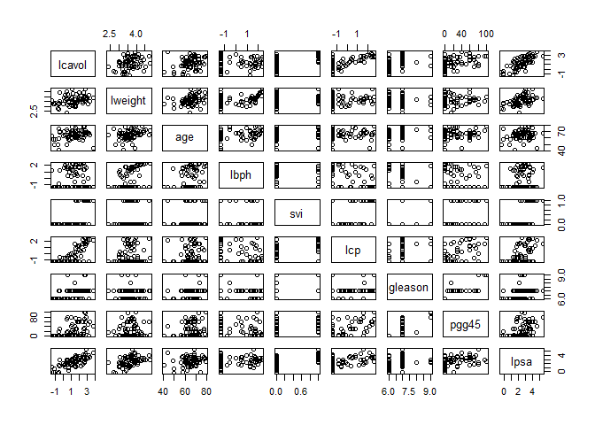
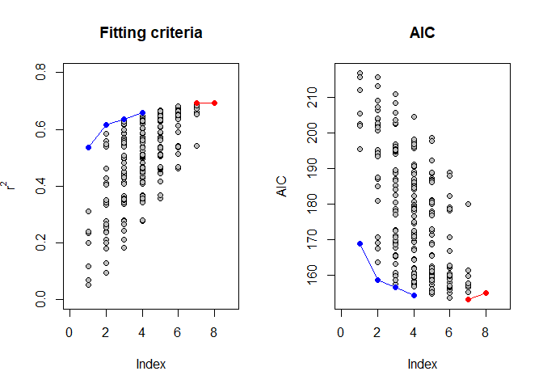

MARS
================
Daniel Carpenter

> LASSO

``` r
# STAT 849, Theory and Applied Regression and ANOVA I
#  Fifteenth discussion, 12-14-2012
#  TA: Guilherme Ludwig
#  with minor edits by Charles Nicholson (cnicholson@ou.edu)
#
# Do yourself a favor and buy this book (Amazon has it on sale every now and then):
# http://www-stat.stanford.edu/~tibs/ElemStatLearn/
#
# The following dataset is from Hastie, Tibshirani and Friedman (2009), from a study 
# by Stamey et al. (1989) of prostate cancer, measuring the correlation between the level 
# of a prostate-specific antigen and some covariates. The covariates are
#
# * lcavol  : log-cancer volume
# * lweight : log-prostate weight
# * age     : age of patient
# * lbhp    : log-amount of benign hyperplasia
# * svi     : seminal vesicle invasion
# * lcp     : log-capsular penetration
# * gleason : Gleason Score, check http://en.wikipedia.org/wiki/Gleason_Grading_System
# * pgg45   : percent of Gleason scores 4 or 5
#
# And lpsa is the response variable, log-psa.


url <- "http://web.stanford.edu/~hastie/ElemStatLearn/datasets/prostate.data"
str(pcancer <- read.table(url, header=TRUE))
```

    'data.frame':   97 obs. of  10 variables:
     $ lcavol : num  -0.58 -0.994 -0.511 -1.204 0.751 ...
     $ lweight: num  2.77 3.32 2.69 3.28 3.43 ...
     $ age    : int  50 58 74 58 62 50 64 58 47 63 ...
     $ lbph   : num  -1.39 -1.39 -1.39 -1.39 -1.39 ...
     $ svi    : int  0 0 0 0 0 0 0 0 0 0 ...
     $ lcp    : num  -1.39 -1.39 -1.39 -1.39 -1.39 ...
     $ gleason: int  6 6 7 6 6 6 6 6 6 6 ...
     $ pgg45  : int  0 0 20 0 0 0 0 0 0 0 ...
     $ lpsa   : num  -0.431 -0.163 -0.163 -0.163 0.372 ...
     $ train  : logi  TRUE TRUE TRUE TRUE TRUE TRUE ...

``` r
# There's a training sub-dataset that we will focus on. Later, we will try to predict
# the values of the remaining observations.

head(pcancer)
```

          lcavol  lweight age      lbph svi       lcp gleason pgg45       lpsa
    1 -0.5798185 2.769459  50 -1.386294   0 -1.386294       6     0 -0.4307829
    2 -0.9942523 3.319626  58 -1.386294   0 -1.386294       6     0 -0.1625189
    3 -0.5108256 2.691243  74 -1.386294   0 -1.386294       7    20 -0.1625189
    4 -1.2039728 3.282789  58 -1.386294   0 -1.386294       6     0 -0.1625189
    5  0.7514161 3.432373  62 -1.386294   0 -1.386294       6     0  0.3715636
    6 -1.0498221 3.228826  50 -1.386294   0 -1.386294       6     0  0.7654678
      train
    1  TRUE
    2  TRUE
    3  TRUE
    4  TRUE
    5  TRUE
    6  TRUE

``` r
train <- pcancer[which(pcancer$train),1:9]
calibrate <- pcancer[-which(pcancer$train),1:9]

# The data looks like this

plot(train)
```



``` r
# Of course, given that this is a biological dataset, the covariates are correlated

round(cor(train),3)
```

            lcavol lweight   age   lbph    svi    lcp gleason  pgg45  lpsa
    lcavol   1.000   0.300 0.286  0.063  0.593  0.692   0.426  0.483 0.733
    lweight  0.300   1.000 0.317  0.437  0.181  0.157   0.024  0.074 0.485
    age      0.286   0.317 1.000  0.287  0.129  0.173   0.366  0.276 0.228
    lbph     0.063   0.437 0.287  1.000 -0.139 -0.089   0.033 -0.030 0.263
    svi      0.593   0.181 0.129 -0.139  1.000  0.671   0.307  0.481 0.557
    lcp      0.692   0.157 0.173 -0.089  0.671  1.000   0.476  0.663 0.489
    gleason  0.426   0.024 0.366  0.033  0.307  0.476   1.000  0.757 0.342
    pgg45    0.483   0.074 0.276 -0.030  0.481  0.663   0.757  1.000 0.448
    lpsa     0.733   0.485 0.228  0.263  0.557  0.489   0.342  0.448 1.000

``` r
# We fit a linear model and now focus on fixing multicollinearity
model.ls <- lm(lpsa ~ ., data=train)
coef(model.ls)
```

     (Intercept)       lcavol      lweight          age         lbph          svi 
     0.429170133  0.576543185  0.614020004 -0.019001022  0.144848082  0.737208645 
             lcp      gleason        pgg45 
    -0.206324227 -0.029502884  0.009465162 

``` r
rss.ls <- sum(model.ls$resid^2)/model.ls$df.residual    #compute the mean of residual sum of squares

library(car)
```

    Loading required package: carData

``` r
vif(model.ls)   #look at VIF scores
```

      lcavol  lweight      age     lbph      svi      lcp  gleason    pgg45 
    2.318496 1.472295 1.356604 1.383429 2.045313 3.117451 2.644480 3.313288 

``` r
# no individual VIF score is extremely bad, but the overall average is high enough that we might be concerned


# #######################
# # STEPWISE REGRESSION # 
# #######################


#backwards vs. forwards 


model.backward <- step(model.ls, direction="backward")
```

    Start:  AIC=-37.13
    lpsa ~ lcavol + lweight + age + lbph + svi + lcp + gleason + 
        pgg45

              Df Sum of Sq    RSS     AIC
    - gleason  1    0.0109 29.437 -39.103
    <none>                 29.426 -37.128
    - age      1    0.9886 30.415 -36.914
    - pgg45    1    1.5322 30.959 -35.727
    - lcp      1    1.7683 31.195 -35.218
    - lbph     1    2.1443 31.571 -34.415
    - svi      1    3.0934 32.520 -32.430
    - lweight  1    3.8390 33.265 -30.912
    - lcavol   1   14.6102 44.037 -12.118

    Step:  AIC=-39.1
    lpsa ~ lcavol + lweight + age + lbph + svi + lcp + pgg45

              Df Sum of Sq    RSS     AIC
    <none>                 29.437 -39.103
    - age      1    1.1025 30.540 -38.639
    - lcp      1    1.7583 31.196 -37.216
    - lbph     1    2.1354 31.573 -36.411
    - pgg45    1    2.3755 31.813 -35.903
    - svi      1    3.1665 32.604 -34.258
    - lweight  1    4.0048 33.442 -32.557
    - lcavol   1   14.8873 44.325 -13.681

``` r
summary(model.backward)
```


    Call:
    lm(formula = lpsa ~ lcavol + lweight + age + lbph + svi + lcp + 
        pgg45, data = train)

    Residuals:
         Min       1Q   Median       3Q      Max 
    -1.65425 -0.34471 -0.05615  0.44380  1.48952 

    Coefficients:
                 Estimate Std. Error t value Pr(>|t|)    
    (Intercept)  0.259062   1.025170   0.253   0.8014    
    lcavol       0.573930   0.105069   5.462 9.88e-07 ***
    lweight      0.619209   0.218560   2.833   0.0063 ** 
    age         -0.019480   0.013105  -1.486   0.1425    
    lbph         0.144426   0.069812   2.069   0.0430 *  
    svi          0.741781   0.294451   2.519   0.0145 *  
    lcp         -0.205417   0.109424  -1.877   0.0654 .  
    pgg45        0.008945   0.004099   2.182   0.0331 *  
    ---
    Signif. codes:  0 '***' 0.001 '**' 0.01 '*' 0.05 '.' 0.1 ' ' 1

    Residual standard error: 0.7064 on 59 degrees of freedom
    Multiple R-squared:  0.6943,    Adjusted R-squared:  0.658 
    F-statistic: 19.14 on 7 and 59 DF,  p-value: 4.496e-13

``` r
rss.backward <- sum(model.backward$resid^2)/model.backward$df.residual

# So backward selection using AIC drops "gleason" from the model. The final AIC
# is -39.103.
#
# Note that for scope, the formula ~. means "as current model". Forward selection
# is poorly explained in R...
# Foward selection starts with an empty model and adds variables up to the "scope" model

scope <- list(upper=~lcavol+lweight+age+lbph+svi+lcp+gleason+pgg45, lower=~.)
model.forward <- step(lm(lpsa ~ 1, data=train), scope, direction="forward")
```

    Start:  AIC=26.29
    lpsa ~ 1

              Df Sum of Sq    RSS      AIC
    + lcavol   1    51.753 44.529 -23.3736
    + svi      1    29.859 66.422   3.4199
    + lcp      1    23.042 73.239   9.9657
    + lweight  1    22.668 73.614  10.3071
    + pgg45    1    19.328 76.953  13.2799
    + gleason  1    11.290 84.992  19.9368
    + lbph     1     6.657 89.625  23.4930
    + age      1     4.989 91.292  24.7279
    <none>                 96.281  26.2931

    Step:  AIC=-23.37
    lpsa ~ lcavol

              Df Sum of Sq    RSS     AIC
    + lweight  1    7.4367 37.092 -33.617
    + lbph     1    4.5363 39.992 -28.572
    + svi      1    2.2160 42.313 -24.794
    <none>                 44.529 -23.374
    + pgg45    1    1.1055 43.423 -23.058
    + gleason  1    0.1045 44.424 -21.531
    + lcp      1    0.0610 44.468 -21.465
    + age      1    0.0329 44.496 -21.423

    Step:  AIC=-33.62
    lpsa ~ lcavol + lweight

              Df Sum of Sq    RSS     AIC
    + svi      1   2.18410 34.908 -35.683
    + pgg45    1   1.65781 35.434 -34.680
    <none>                 37.092 -33.617
    + lbph     1   1.07668 36.015 -33.590
    + gleason  1   0.43335 36.658 -32.404
    + age      1   0.27462 36.817 -32.115
    + lcp      1   0.00206 37.090 -31.621

    Step:  AIC=-35.68
    lpsa ~ lcavol + lweight + svi

              Df Sum of Sq    RSS     AIC
    + lbph     1   2.09275 32.815 -37.825
    <none>                 34.908 -35.683
    + pgg45    1   0.83360 34.074 -35.302
    + lcp      1   0.63405 34.274 -34.911
    + gleason  1   0.30106 34.607 -34.263
    + age      1   0.19562 34.712 -34.059

    Step:  AIC=-37.83
    lpsa ~ lcavol + lweight + svi + lbph

              Df Sum of Sq    RSS     AIC
    <none>                 32.815 -37.825
    + pgg45    1   0.74555 32.069 -37.365
    + age      1   0.53056 32.284 -36.917
    + lcp      1   0.49216 32.323 -36.838
    + gleason  1   0.17815 32.637 -36.190

``` r
?step
```

    starting httpd help server ...

     done

``` r
rss.forward <- sum(model.forward$resid^2)/model.forward$df.residual

# So we conclude that forward selection using AIC keeps lcavol, lweight, svi and lbph.
# The AIC is -37.825.
#
# Note that the paths are arbitrary and such model selection procedures are called 
# "myopic" sometimes, unlike Lasso Regression which has the "Oracle" property. 

#For example, we may compute R^2 and AICs for all possible subsets.

r2 <- list()
AICs <- list()
for(i in 1:8){
    indexes <- combn(8,i)  #combn(n,r) produces a list of all combinations: n choose r
    currentr2 <- NULL
    currentAIC <- NULL
    for(j in 1:dim(indexes)[2]){
        temp.model <- lm(lpsa ~ ., data=train[,c(indexes[,j], 9)])
        currentr2[j] <- summary(temp.model)$r.squared
        currentAIC[j] <- AIC(temp.model)
        }
    r2[[i]] <- currentr2
    AICs[[i]] <- currentAIC
    }

# let me find the corresponding r^2 and AIC entries for the paths chosen by
# backward and forward elimination... this code is a bit clumsy but it gets
# what we need.

compare <- function(set){
    s <- length(set)
    temp <- combn(8,s)
    check <- NULL
    for(i in 1:dim(temp)[2]){
        check[i] <- all(temp[,i]==set)
    }
    return(which(check))
}

backward <- compare(c(1:6,8))
forward <- c(compare(1), compare(1:2), compare(c(1,2,5)), compare(c(1,2,4,5)))

r2.b <- c(r2[[7]][backward], r2[[8]])
r2.f <- c(r2[[1]][forward[1]], r2[[2]][forward[2]], r2[[3]][forward[3]], r2[[4]][forward[4]])
AICs.b <- c(AICs[[7]][backward], AICs[[8]])
AICs.f <- c(AICs[[1]][forward[1]], AICs[[2]][forward[2]], AICs[[3]][forward[3]], AICs[[4]][forward[4]])

# We now can take a look at how backward/forward performs!

layout(matrix(1:2, ncol=2))
plot(0, xlim=c(0,9), ylim=c(0,0.8), type="n", ylab=expression(r^2), main="Fitting criteria")
for(i in 1:8){
    points(rep(i, length(r2[[i]])), r2[[i]], pch=21, bg="Grey")
    }
points(7:8, r2.b, bg="Red", col="Red", pch=21, type="o")
points(1:4, r2.f, bg="Blue", col="Blue", pch=21, type="o")
plot(0, xlim=c(0,9), ylim=c(153,217), type="n", ylab="AIC", main="AIC")
for(i in 1:8){
    points(rep(i, length(AICs[[i]])), AICs[[i]], pch=21, bg="Grey")
    }
points(7:8, AICs.b, bg="Red", col="Red", pch=21, type="o")
points(1:4, AICs.f, bg="Blue", col="Blue", pch=21, type="o")

# ####################
# # RIDGE REGRESSION # 
# ####################

library(ggplot2)
```



``` r
library(car)
library(MASS)

dev.off()  #reset the graphics window
```

    null device 
              1 

``` r
model.ridge <- lm.ridge(lpsa ~ ., data=train, 
                        lambda = seq(0,10,0.1))  #ridge regression is run for several values of lambda

str(model.ridge)
```

    List of 9
     $ coef  : num [1:8, 1:101] 0.711 0.29 -0.141 0.21 0.307 ...
      ..- attr(*, "dimnames")=List of 2
      .. ..$ : chr [1:8] "lcavol" "lweight" "age" "lbph" ...
      .. ..$ : chr [1:101] " 0.0" " 0.1" " 0.2" " 0.3" ...
     $ scales: Named num [1:8] 1.233 0.473 7.446 1.453 0.417 ...
      ..- attr(*, "names")= chr [1:8] "lcavol" "lweight" "age" "lbph" ...
     $ Inter : int 1
     $ lambda: num [1:101] 0 0.1 0.2 0.3 0.4 0.5 0.6 0.7 0.8 0.9 ...
     $ ym    : num 2.45
     $ xm    : Named num [1:8] 1.3135 3.6261 64.7463 0.0714 0.2239 ...
      ..- attr(*, "names")= chr [1:8] "lcavol" "lweight" "age" "lbph" ...
     $ GCV   : Named num [1:101] 0.00845 0.00845 0.00844 0.00843 0.00843 ...
      ..- attr(*, "names")= chr [1:101] " 0.0" " 0.1" " 0.2" " 0.3" ...
     $ kHKB  : num 3.36
     $ kLW   : num 3.05
     - attr(*, "class")= chr "ridgelm"

``` r
# The optimal lambda is given by

qplot(model.ridge$lambda,model.ridge$GCV )        # plots generalized cross validated error (GCV) vs the tuning parameter  
which.min(model.ridge$GCV)   # identifies the value for lambda with the smallest associated GCV
```

     4.9 
      50 

``` r
lambda.ridge <- seq(0,10,0.1)[which.min(model.ridge$GCV)]   #save the value of optimal lambda for future use


# the optimal lambda value is 4.9

#here are all of the coefficients for every lambda value  -- too much info!
coef(model.ridge)
```

                          lcavol   lweight         age      lbph       svi
     0.0  0.4291701328 0.5765432 0.6140200 -0.01900102 0.1448481 0.7372086
     0.1  0.4188957785 0.5743516 0.6138685 -0.01890171 0.1447107 0.7357937
     0.2  0.4088317410 0.5721865 0.6137099 -0.01880306 0.1445732 0.7343912
     0.3  0.3989721491 0.5700475 0.6135446 -0.01870508 0.1444353 0.7330007
     0.4  0.3893113417 0.5679341 0.6133726 -0.01860776 0.1442973 0.7316223
     0.5  0.3798438585 0.5658456 0.6131943 -0.01851110 0.1441591 0.7302556
     0.6  0.3705644319 0.5637816 0.6130097 -0.01841508 0.1440206 0.7289006
     0.7  0.3614679783 0.5617415 0.6128191 -0.01831970 0.1438820 0.7275571
     0.8  0.3525495907 0.5597250 0.6126227 -0.01822496 0.1437432 0.7262249
     0.9  0.3438045310 0.5577314 0.6124205 -0.01813085 0.1436043 0.7249038
     1.0  0.3352282231 0.5557605 0.6122128 -0.01803737 0.1434652 0.7235937
     1.1  0.3268162465 0.5538117 0.6119998 -0.01794450 0.1433259 0.7222944
     1.2  0.3185643294 0.5518846 0.6117816 -0.01785224 0.1431866 0.7210057
     1.3  0.3104683430 0.5499788 0.6115583 -0.01776059 0.1430471 0.7197276
     1.4  0.3025242956 0.5480939 0.6113301 -0.01766954 0.1429076 0.7184599
     1.5  0.2947283272 0.5462295 0.6110971 -0.01757909 0.1427679 0.7172024
     1.6  0.2870767042 0.5443852 0.6108595 -0.01748923 0.1426282 0.7159549
     1.7  0.2795658143 0.5425607 0.6106174 -0.01739995 0.1424884 0.7147175
     1.8  0.2721921619 0.5407555 0.6103709 -0.01731125 0.1423485 0.7134898
     1.9  0.2649523635 0.5389693 0.6101201 -0.01722313 0.1422086 0.7122717
     2.0  0.2578431432 0.5372018 0.6098652 -0.01713557 0.1420686 0.7110632
     2.1  0.2508613289 0.5354527 0.6096063 -0.01704858 0.1419286 0.7098641
     2.2  0.2440038479 0.5337215 0.6093435 -0.01696215 0.1417886 0.7086742
     2.3  0.2372677235 0.5320081 0.6090769 -0.01687627 0.1416485 0.7074935
     2.4  0.2306500713 0.5303120 0.6088066 -0.01679093 0.1415084 0.7063218
     2.5  0.2241480954 0.5286331 0.6085327 -0.01670614 0.1413684 0.7051590
     2.6  0.2177590857 0.5269709 0.6082553 -0.01662189 0.1412283 0.7040050
     2.7  0.2114804142 0.5253251 0.6079745 -0.01653817 0.1410882 0.7028596
     2.8  0.2053095322 0.5236957 0.6076905 -0.01645497 0.1409481 0.7017228
     2.9  0.1992439676 0.5220821 0.6074032 -0.01637231 0.1408081 0.7005943
     3.0  0.1932813216 0.5204842 0.6071128 -0.01629015 0.1406681 0.6994742
     3.1  0.1874192666 0.5189017 0.6068193 -0.01620852 0.1405281 0.6983623
     3.2  0.1816555434 0.5173344 0.6065229 -0.01612739 0.1403881 0.6972584
     3.3  0.1759879588 0.5157820 0.6062237 -0.01604677 0.1402482 0.6961625
     3.4  0.1704143831 0.5142442 0.6059216 -0.01596664 0.1401084 0.6950745
     3.5  0.1649327482 0.5127209 0.6056168 -0.01588701 0.1399686 0.6939943
     3.6  0.1595410452 0.5112118 0.6053094 -0.01580787 0.1398288 0.6929217
     3.7  0.1542373224 0.5097166 0.6049995 -0.01572922 0.1396892 0.6918567
     3.8  0.1490196835 0.5082351 0.6046870 -0.01565105 0.1395496 0.6907992
     3.9  0.1438862853 0.5067672 0.6043721 -0.01557336 0.1394100 0.6897490
     4.0  0.1388353362 0.5053126 0.6040548 -0.01549614 0.1392706 0.6887061
     4.1  0.1338650945 0.5038711 0.6037352 -0.01541939 0.1391312 0.6876704
     4.2  0.1289738666 0.5024425 0.6034134 -0.01534311 0.1389919 0.6866418
     4.3  0.1241600051 0.5010266 0.6030895 -0.01526728 0.1388528 0.6856202
     4.4  0.1194219079 0.4996232 0.6027634 -0.01519191 0.1387137 0.6846055
     4.5  0.1147580162 0.4982322 0.6024352 -0.01511700 0.1385747 0.6835976
     4.6  0.1101668132 0.4968532 0.6021051 -0.01504253 0.1384358 0.6825965
     4.7  0.1056468228 0.4954862 0.6017730 -0.01496851 0.1382970 0.6816020
     4.8  0.1011966082 0.4941310 0.6014390 -0.01489493 0.1381584 0.6806140
     4.9  0.0968147705 0.4927874 0.6011032 -0.01482179 0.1380199 0.6796326
     5.0  0.0924999480 0.4914552 0.6007656 -0.01474908 0.1378814 0.6786575
     5.1  0.0882508143 0.4901343 0.6004263 -0.01467679 0.1377431 0.6776888
     5.2  0.0840660777 0.4888245 0.6000853 -0.01460494 0.1376050 0.6767264
     5.3  0.0799444797 0.4875256 0.5997426 -0.01453350 0.1374669 0.6757701
     5.4  0.0758847945 0.4862375 0.5993983 -0.01446249 0.1373290 0.6748199
     5.5  0.0718858274 0.4849600 0.5990525 -0.01439189 0.1371913 0.6738757
     5.6  0.0679464142 0.4836930 0.5987052 -0.01432170 0.1370536 0.6729375
     5.7  0.0640654201 0.4824363 0.5983564 -0.01425191 0.1369161 0.6720051
     5.8  0.0602417387 0.4811898 0.5980062 -0.01418253 0.1367788 0.6710786
     5.9  0.0564742915 0.4799534 0.5976546 -0.01411356 0.1366416 0.6701577
     6.0  0.0527620268 0.4787269 0.5973017 -0.01404497 0.1365046 0.6692426
     6.1  0.0491039186 0.4775101 0.5969474 -0.01397679 0.1363677 0.6683331
     6.2  0.0454989664 0.4763029 0.5965919 -0.01390899 0.1362309 0.6674290
     6.3  0.0419461942 0.4751053 0.5962352 -0.01384158 0.1360944 0.6665305
     6.4  0.0384446495 0.4739171 0.5958773 -0.01377455 0.1359579 0.6656374
     6.5  0.0349934030 0.4727380 0.5955182 -0.01370791 0.1358217 0.6647496
     6.6  0.0315915477 0.4715681 0.5951579 -0.01364164 0.1356856 0.6638671
     6.7  0.0282381982 0.4704073 0.5947966 -0.01357575 0.1355496 0.6629898
     6.8  0.0249324904 0.4692553 0.5944343 -0.01351022 0.1354139 0.6621176
     6.9  0.0216735804 0.4681120 0.5940709 -0.01344507 0.1352783 0.6612506
     7.0  0.0184606444 0.4669774 0.5937065 -0.01338028 0.1351429 0.6603886
     7.1  0.0152928775 0.4658514 0.5933411 -0.01331585 0.1350076 0.6595315
     7.2  0.0121694940 0.4647338 0.5929748 -0.01325178 0.1348725 0.6586794
     7.3  0.0090897260 0.4636245 0.5926076 -0.01318807 0.1347377 0.6578322
     7.4  0.0060528236 0.4625234 0.5922395 -0.01312471 0.1346029 0.6569898
     7.5  0.0030580538 0.4614305 0.5918705 -0.01306170 0.1344684 0.6561521
     7.6  0.0001047005 0.4603455 0.5915007 -0.01299904 0.1343341 0.6553192
     7.7 -0.0028079361 0.4592685 0.5911302 -0.01293672 0.1341999 0.6544909
     7.8 -0.0056805403 0.4581992 0.5907588 -0.01287474 0.1340659 0.6536672
     7.9 -0.0085137809 0.4571377 0.5903867 -0.01281311 0.1339321 0.6528481
     8.0 -0.0113083116 0.4560838 0.5900139 -0.01275181 0.1337985 0.6520335
     8.1 -0.0140647719 0.4550374 0.5896404 -0.01269084 0.1336651 0.6512233
     8.2 -0.0167837869 0.4539984 0.5892662 -0.01263020 0.1335318 0.6504175
     8.3 -0.0194659682 0.4529668 0.5888913 -0.01256990 0.1333988 0.6496161
     8.4 -0.0221119139 0.4519424 0.5885158 -0.01250991 0.1332660 0.6488190
     8.5 -0.0247222090 0.4509252 0.5881397 -0.01245025 0.1331333 0.6480261
     8.6 -0.0272974260 0.4499151 0.5877630 -0.01239091 0.1330009 0.6472375
     8.7 -0.0298381250 0.4489119 0.5873857 -0.01233189 0.1328686 0.6464530
     8.8 -0.0323448543 0.4479157 0.5870079 -0.01227319 0.1327365 0.6456727
     8.9 -0.0348181500 0.4469263 0.5866296 -0.01221480 0.1326047 0.6448964
     9.0 -0.0372585375 0.4459436 0.5862507 -0.01215671 0.1324730 0.6441242
     9.1 -0.0396665306 0.4449676 0.5858714 -0.01209894 0.1323415 0.6433560
     9.2 -0.0420426325 0.4439982 0.5854916 -0.01204147 0.1322103 0.6425918
     9.3 -0.0443873360 0.4430353 0.5851113 -0.01198431 0.1320792 0.6418314
     9.4 -0.0467011234 0.4420789 0.5847306 -0.01192744 0.1319484 0.6410750
     9.5 -0.0489844673 0.4411288 0.5843495 -0.01187088 0.1318177 0.6403223
     9.6 -0.0512378303 0.4401850 0.5839680 -0.01181461 0.1316873 0.6395735
     9.7 -0.0534616657 0.4392474 0.5835861 -0.01175863 0.1315570 0.6388284
     9.8 -0.0556564176 0.4383160 0.5832038 -0.01170295 0.1314270 0.6380870
     9.9 -0.0578225210 0.4373906 0.5828212 -0.01164755 0.1312971 0.6373494
    10.0 -0.0599604021 0.4364713 0.5824383 -0.01159245 0.1311675 0.6366153
                 lcp       gleason       pgg45
     0.0 -0.20632423 -0.0295028842 0.009465162
     0.1 -0.20384492 -0.0280133950 0.009392968
     0.2 -0.20140219 -0.0265571510 0.009322177
     0.3 -0.19899522 -0.0251331641 0.009252753
     0.4 -0.19662324 -0.0237404825 0.009184658
     0.5 -0.19428547 -0.0223781886 0.009117857
     0.6 -0.19198118 -0.0210453981 0.009052317
     0.7 -0.18970966 -0.0197412583 0.008988003
     0.8 -0.18747021 -0.0184649470 0.008924885
     0.9 -0.18526215 -0.0172156706 0.008862931
     1.0 -0.18308483 -0.0159926636 0.008802112
     1.1 -0.18093761 -0.0147951872 0.008742399
     1.2 -0.17881987 -0.0136225279 0.008683765
     1.3 -0.17673101 -0.0124739970 0.008626181
     1.4 -0.17467044 -0.0113489289 0.008569622
     1.5 -0.17263760 -0.0102466810 0.008514063
     1.6 -0.17063193 -0.0091666319 0.008459479
     1.7 -0.16865290 -0.0081081813 0.008405847
     1.8 -0.16669997 -0.0070707488 0.008353143
     1.9 -0.16477264 -0.0060537730 0.008301346
     2.0 -0.16287042 -0.0050567110 0.008250433
     2.1 -0.16099281 -0.0040790376 0.008200384
     2.2 -0.15913936 -0.0031202446 0.008151178
     2.3 -0.15730959 -0.0021798403 0.008102796
     2.4 -0.15550307 -0.0012573485 0.008055218
     2.5 -0.15371936 -0.0003523083 0.008008427
     2.6 -0.15195804  0.0005357267 0.007962404
     2.7 -0.15021868  0.0014071890 0.007917131
     2.8 -0.14850089  0.0022624973 0.007872592
     2.9 -0.14680428  0.0031020575 0.007828771
     3.0 -0.14512846  0.0039262629 0.007785650
     3.1 -0.14347306  0.0047354949 0.007743215
     3.2 -0.14183771  0.0055301231 0.007701451
     3.3 -0.14022206  0.0063105059 0.007660342
     3.4 -0.13862576  0.0070769910 0.007619875
     3.5 -0.13704846  0.0078299156 0.007580036
     3.6 -0.13548985  0.0085696068 0.007540811
     3.7 -0.13394960  0.0092963821 0.007502187
     3.8 -0.13242738  0.0100105497 0.007464151
     3.9 -0.13092290  0.0107124086 0.007426691
     4.0 -0.12943585  0.0114022493 0.007389795
     4.1 -0.12796593  0.0120803535 0.007353451
     4.2 -0.12651287  0.0127469953 0.007317647
     4.3 -0.12507637  0.0134024404 0.007282373
     4.4 -0.12365616  0.0140469475 0.007247618
     4.5 -0.12225198  0.0146807674 0.007213370
     4.6 -0.12086356  0.0153041441 0.007179621
     4.7 -0.11949065  0.0159173149 0.007146359
     4.8 -0.11813299  0.0165205101 0.007113574
     4.9 -0.11679033  0.0171139540 0.007081258
     5.0 -0.11546245  0.0176978643 0.007049402
     5.1 -0.11414909  0.0182724531 0.007017995
     5.2 -0.11285004  0.0188379264 0.006987029
     5.3 -0.11156507  0.0193944848 0.006956496
     5.4 -0.11029395  0.0199423233 0.006926388
     5.5 -0.10903648  0.0204816318 0.006896695
     5.6 -0.10779243  0.0210125951 0.006867410
     5.7 -0.10656160  0.0215353928 0.006838526
     5.8 -0.10534380  0.0220502002 0.006810034
     5.9 -0.10413882  0.0225571875 0.006781928
     6.0 -0.10294646  0.0230565207 0.006754199
     6.1 -0.10176654  0.0235483615 0.006726842
     6.2 -0.10059887  0.0240328673 0.006699849
     6.3 -0.09944327  0.0245101913 0.006673212
     6.4 -0.09829955  0.0249804828 0.006646927
     6.5 -0.09716755  0.0254438876 0.006620986
     6.6 -0.09604709  0.0259005472 0.006595383
     6.7 -0.09493800  0.0263506001 0.006570112
     6.8 -0.09384012  0.0267941808 0.006545167
     6.9 -0.09275328  0.0272314208 0.006520542
     7.0 -0.09167733  0.0276624480 0.006496231
     7.1 -0.09061211  0.0280873872 0.006472229
     7.2 -0.08955746  0.0285063603 0.006448531
     7.3 -0.08851324  0.0289194859 0.006425130
     7.4 -0.08747930  0.0293268798 0.006402023
     7.5 -0.08645549  0.0297286550 0.006379203
     7.6 -0.08544168  0.0301249217 0.006356665
     7.7 -0.08443772  0.0305157875 0.006334406
     7.8 -0.08344348  0.0309013573 0.006312419
     7.9 -0.08245882  0.0312817334 0.006290701
     8.0 -0.08148362  0.0316570159 0.006269247
     8.1 -0.08051774  0.0320273023 0.006248052
     8.2 -0.07956105  0.0323926878 0.006227112
     8.3 -0.07861344  0.0327532656 0.006206422
     8.4 -0.07767478  0.0331091262 0.006185979
     8.5 -0.07674494  0.0334603586 0.006165779
     8.6 -0.07582382  0.0338070491 0.006145817
     8.7 -0.07491130  0.0341492826 0.006126089
     8.8 -0.07400726  0.0344871415 0.006106592
     8.9 -0.07311159  0.0348207066 0.006087322
     9.0 -0.07222418  0.0351500568 0.006068275
     9.1 -0.07134493  0.0354752691 0.006049447
     9.2 -0.07047373  0.0357964190 0.006030836
     9.3 -0.06961046  0.0361135799 0.006012437
     9.4 -0.06875505  0.0364268238 0.005994247
     9.5 -0.06790737  0.0367362211 0.005976263
     9.6 -0.06706733  0.0370418405 0.005958481
     9.7 -0.06623484  0.0373437493 0.005940899
     9.8 -0.06540980  0.0376420131 0.005923513
     9.9 -0.06459212  0.0379366963 0.005906320
    10.0 -0.06378170  0.0382278616 0.005889317

``` r
# We can plot the coefficients and see how they vary as a function of lambda

colors <- rainbow(8)

matplot(seq(0,10,0.1), coef(model.ridge)[,-1], xlim=c(0,11), type="l",xlab=expression(lambda), 
    ylab=expression(hat(beta)), col=colors, lty=1, lwd=2, main="Ridge coefficients")
abline(v=lambda.ridge, lty=2)
abline(h=0, lty=2)
text(rep(10, 9), coef(model.ridge)[length(seq(0,10,0.1)),-1], colnames(train)[-9], pos=4, col=colors)

beta.ridge <- coef(model.ridge)[which.min(model.ridge$GCV),]
resid.ridge <- train$lpsa - beta.ridge[1] - as.matrix(train[,1:8])%*%beta.ridge[2:9]

# To find df
d <- svd(as.matrix(train[,1:8]))$d
df <- 67 - sum(d^2/(lambda.ridge+d^2))

rss.ridge <- sum(resid.ridge^2)/df     #compute the mean RSS for ridge regression ()

# ####################
# # LASSO REGRESSION # 
# ####################
#
# In Lasso Regression, the coefficients are penalized by the L1 norm. The 
# optimal value for lambda is chosen by cross-validation.


library(lars)
```

    Loaded lars 1.3

``` r
# the method "lars" has a slightly different interface than "lm" -- there is no formula input
# instead we supply a matrix of predictors and a vector of target values 

y <- as.numeric(train[,9])      #target variable
x <- as.matrix(train[,1:8])     #predictors


model.lasso <- lars(x, y, type="lasso")
plot(model.lasso)
model.lasso$lambda
```

    [1] 7.1939462 3.7172742 2.9403866 1.7305064 1.7002813 0.4933166 0.3711651
    [8] 0.0403451

``` r
summary(model.lasso)
```

    LARS/LASSO
    Call: lars(x = x, y = y, type = "lasso")
      Df    Rss       Cp
    0  1 96.281 124.7727
    1  2 58.347  52.0025
    2  3 50.391  38.3213
    3  4 40.271  20.3741
    4  5 40.012  21.8653
    5  6 32.738   9.5274
    6  7 32.069  10.2082
    7  8 29.468   7.0828
    8  9 29.426   9.0000

``` r
lambda.lasso <- c(model.lasso$lambda,0)
beta <- coef(model.lasso)

str(model.lasso)
```

    List of 16
     $ call      : language lars(x = x, y = y, type = "lasso")
     $ type      : chr "LASSO"
     $ df        : Named num [1:9] 1 2 3 4 5 6 7 8 9
      ..- attr(*, "names")= chr [1:9] "Intercept" "" "" "" ...
     $ lambda    : num [1:8] 7.19 3.72 2.94 1.73 1.7 ...
     $ R2        : Named num [1:9] 0 0.394 0.477 0.582 0.584 ...
      ..- attr(*, "names")= chr [1:9] "0" "1" "2" "3" ...
     $ RSS       : Named num [1:9] 96.3 58.3 50.4 40.3 40 ...
      ..- attr(*, "names")= chr [1:9] "0" "1" "2" "3" ...
     $ Cp        : Named num [1:9] 124.8 52 38.3 20.4 21.9 ...
      ..- attr(*, "names")= chr [1:9] "0" "1" "2" "3" ...
      ..- attr(*, "sigma2")= Named num 0.507
      .. ..- attr(*, "names")= chr "8"
      ..- attr(*, "n")= int 67
     $ actions   :List of 8
      ..$ : Named int 1
      .. ..- attr(*, "names")= chr "lcavol"
      ..$ : Named int 2
      .. ..- attr(*, "names")= chr "lweight"
      ..$ : Named int 5
      .. ..- attr(*, "names")= chr "svi"
      ..$ : Named int 4
      .. ..- attr(*, "names")= chr "lbph"
      ..$ : Named int 8
      .. ..- attr(*, "names")= chr "pgg45"
      ..$ : Named int 3
      .. ..- attr(*, "names")= chr "age"
      ..$ : Named int 6
      .. ..- attr(*, "names")= chr "lcp"
      ..$ : Named int 7
      .. ..- attr(*, "names")= chr "gleason"
     $ entry     : num [1:8] 1 2 6 4 3 7 8 5
     $ Gamrat    : num [1:8] 0.4833 0.209 0.4115 0.0175 0.7099 ...
     $ arc.length: num [1:8] 3.4767 0.9635 1.6191 0.0477 2.0006 ...
     $ Gram      : num [1:8, 1:8] 1 0.3002 0.2863 0.0632 0.5929 ...
      ..- attr(*, "dimnames")=List of 2
      .. ..$ : chr [1:8] "lcavol" "lweight" "age" "lbph" ...
      .. ..$ : chr [1:8] "lcavol" "lweight" "age" "lbph" ...
     $ beta      : num [1:9, 1:8] 0 0.344 0.404 0.451 0.452 ...
      ..- attr(*, "dimnames")=List of 2
      .. ..$ : chr [1:9] "0" "1" "2" "3" ...
      .. ..$ : chr [1:8] "lcavol" "lweight" "age" "lbph" ...
      ..- attr(*, "scaled:scale")= num [1:8] 10.09 3.87 60.95 11.89 3.41 ...
     $ mu        : num 2.45
     $ normx     : num [1:8] 10.09 3.87 60.95 11.89 3.41 ...
     $ meanx     : Named num [1:8] 1.3135 3.6261 64.7463 0.0714 0.2239 ...
      ..- attr(*, "names")= chr [1:8] "lcavol" "lweight" "age" "lbph" ...
     - attr(*, "class")= chr "lars"

``` r
colors <- rainbow(8)

matplot(lambda.lasso, beta, xlim=c(8,-2), type="o", pch=20, xlab=expression(lambda), 
    ylab=expression(hat(beta)), col=colors)
text(rep(-0, 9), beta[9,], colnames(x), pos=4, col=colors)
abline(v=lambda.lasso[4], lty=2)
abline(h=0, lty=2)


# I'll keep the lambda=1.7305 betas

beta.lasso <- beta[4,]
resid.lasso <- train$lpsa - predict(model.lasso, as.matrix(train[,1:8]), s=4, type="fit")$fit
rss.lasso <- sum(resid.lasso^2)/(67-4)


#################
#side note:
 
#there are many ways to run LASSO, etc.

#for example -- this above example did not use any CV
# we can use cv.lars to help:

cvlas<-cv.lars(x,y,type="lasso",mode="fraction")
cvlas
```

    $index
      [1] 0.00000000 0.01010101 0.02020202 0.03030303 0.04040404 0.05050505
      [7] 0.06060606 0.07070707 0.08080808 0.09090909 0.10101010 0.11111111
     [13] 0.12121212 0.13131313 0.14141414 0.15151515 0.16161616 0.17171717
     [19] 0.18181818 0.19191919 0.20202020 0.21212121 0.22222222 0.23232323
     [25] 0.24242424 0.25252525 0.26262626 0.27272727 0.28282828 0.29292929
     [31] 0.30303030 0.31313131 0.32323232 0.33333333 0.34343434 0.35353535
     [37] 0.36363636 0.37373737 0.38383838 0.39393939 0.40404040 0.41414141
     [43] 0.42424242 0.43434343 0.44444444 0.45454545 0.46464646 0.47474747
     [49] 0.48484848 0.49494949 0.50505051 0.51515152 0.52525253 0.53535354
     [55] 0.54545455 0.55555556 0.56565657 0.57575758 0.58585859 0.59595960
     [61] 0.60606061 0.61616162 0.62626263 0.63636364 0.64646465 0.65656566
     [67] 0.66666667 0.67676768 0.68686869 0.69696970 0.70707071 0.71717172
     [73] 0.72727273 0.73737374 0.74747475 0.75757576 0.76767677 0.77777778
     [79] 0.78787879 0.79797980 0.80808081 0.81818182 0.82828283 0.83838384
     [85] 0.84848485 0.85858586 0.86868687 0.87878788 0.88888889 0.89898990
     [91] 0.90909091 0.91919192 0.92929293 0.93939394 0.94949495 0.95959596
     [97] 0.96969697 0.97979798 0.98989899 1.00000000

    $cv
      [1] 1.5436198 1.5018173 1.4611045 1.4214813 1.3829476 1.3455035 1.3091491
      [8] 1.2738842 1.2397089 1.2066232 1.1746271 1.1437206 1.1139037 1.0851763
     [15] 1.0589409 1.0341700 1.0105155 0.9881977 0.9673571 0.9484592 0.9306128
     [22] 0.9124131 0.8948057 0.8772158 0.8591256 0.8414220 0.8243995 0.8082087
     [29] 0.7925499 0.7770664 0.7623580 0.7483706 0.7349572 0.7230993 0.7125653
     [36] 0.7035218 0.6949678 0.6868952 0.6793766 0.6724701 0.6660352 0.6598276
     [43] 0.6539233 0.6483006 0.6438062 0.6392751 0.6339951 0.6291227 0.6246581
     [50] 0.6206011 0.6168650 0.6131351 0.6094759 0.6061406 0.6032054 0.6013541
     [57] 0.6013666 0.6017082 0.6023421 0.6032447 0.6037412 0.6042735 0.6050221
     [64] 0.6049841 0.6042639 0.6036032 0.6023227 0.6011073 0.5999669 0.5989015
     [71] 0.5979111 0.5969957 0.5962450 0.5956043 0.5950333 0.5945318 0.5940999
     [78] 0.5937886 0.5937329 0.5937478 0.5938333 0.5939893 0.5942159 0.5946207
     [85] 0.5952560 0.5959598 0.5967320 0.5975728 0.5984820 0.5993893 0.6002613
     [92] 0.6012135 0.6022330 0.6033438 0.6045922 0.6059162 0.6073229 0.6088145
     [99] 0.6103758 0.6120068

    $cv.error
      [1] 0.34663199 0.33703634 0.32757588 0.31825156 0.30906448 0.30001586
      [7] 0.29110712 0.28233981 0.27371572 0.26523685 0.25690546 0.24872407
     [13] 0.24069553 0.23282305 0.22531738 0.21801402 0.21082222 0.20369718
     [19] 0.19669099 0.19014319 0.18384870 0.17829710 0.17318965 0.16847485
     [25] 0.16417869 0.16005891 0.15604737 0.15209887 0.14829067 0.14474539
     [31] 0.14138957 0.13816716 0.13492653 0.13176273 0.12879657 0.12605451
     [37] 0.12344141 0.12096952 0.11867168 0.11660328 0.11467258 0.11291458
     [43] 0.11134360 0.10982711 0.10834007 0.10688333 0.10525028 0.10371953
     [49] 0.10229578 0.10098374 0.09977933 0.09863994 0.09762353 0.09670226
     [55] 0.09587077 0.09552211 0.09577508 0.09591614 0.09587324 0.09597660
     [61] 0.09602922 0.09608816 0.09618350 0.09605673 0.09586258 0.09568152
     [67] 0.09565470 0.09564815 0.09565823 0.09568515 0.09572916 0.09579053
     [73] 0.09586274 0.09595137 0.09605999 0.09618891 0.09633845 0.09648840
     [79] 0.09658520 0.09670384 0.09684467 0.09700802 0.09719424 0.09743663
     [85] 0.09774910 0.09808123 0.09843334 0.09880575 0.09919877 0.09957829
     [91] 0.09992686 0.10029954 0.10069128 0.10108894 0.10147096 0.10186640
     [97] 0.10227771 0.10270503 0.10314966 0.10361201

    $mode
    [1] "fraction"

``` r
opt.frac <- min(cvlas$cv) + sd(cvlas$cv) 
opt.frac <- cvlas$index[which(cvlas$cv < opt.frac)[1]]
lasso.path <- lars(x, y, type = "lasso")
summary(lasso.path)
```

    LARS/LASSO
    Call: lars(x = x, y = y, type = "lasso")
      Df    Rss       Cp
    0  1 96.281 124.7727
    1  2 58.347  52.0025
    2  3 50.391  38.3213
    3  4 40.271  20.3741
    4  5 40.012  21.8653
    5  6 32.738   9.5274
    6  7 32.069  10.2082
    7  8 29.468   7.0828
    8  9 29.426   9.0000

``` r
lasso.fit <- predict.lars(lasso.path, type = "coefficients", mode = "fraction", s = opt.frac)
coef(lasso.fit)
```

       lcavol   lweight       age      lbph       svi       lcp   gleason     pgg45 
    0.4018943 0.1498973 0.0000000 0.0000000 0.0000000 0.0000000 0.0000000 0.0000000 

``` r
#or a function that might even be easier (from the glmnet package)
library(glmnet)
```

    Loading required package: Matrix

    Loaded glmnet 4.1-4

``` r
cvfit = cv.glmnet(x, y)
plot(cvfit)
cvfit
```


    Call:  cv.glmnet(x = x, y = y) 

    Measure: Mean-Squared Error 

         Lambda Index Measure     SE Nonzero
    min 0.01466    45  0.5943 0.1049       7
    1se 0.21771    16  0.6937 0.1269       3

``` r
# #########################
# # PARTIAL LEAST SQUARES #
# #########################
#
# Partial Least Squares is pretty much like principal components regression, but
# we use information from Y to select weights for the principal components of X.

library(pls)
```


    Attaching package: 'pls'

    The following object is masked from 'package:stats':

        loadings

``` r
model.pls <- plsr(lpsa ~ ., 8, data = train, method = "oscorespls", validation = "CV")
summary(model.pls)
```

    Data:   X dimension: 67 8 
        Y dimension: 67 1
    Fit method: oscorespls
    Number of components considered: 8

    VALIDATION: RMSEP
    Cross-validated using 10 random segments.
           (Intercept)  1 comps  2 comps  3 comps  4 comps  5 comps  6 comps
    CV           1.217    1.095    1.081   0.8377   0.7629   0.7890   0.7883
    adjCV        1.217    1.093    1.082   0.8336   0.7563   0.7842   0.7817
           7 comps  8 comps
    CV      0.7931   0.7919
    adjCV   0.7858   0.7846

    TRAINING: % variance explained
          1 comps  2 comps  3 comps  4 comps  5 comps  6 comps  7 comps  8 comps
    X       93.83    99.27    99.68    99.74    99.93    99.97    99.99   100.00
    lpsa    20.59    25.36    58.92    66.65    67.44    69.09    69.41    69.44

``` r
plot(model.pls)

plot(model.pls, ncomp = 1, asp = 1, line = TRUE)
plot(model.pls, ncomp = 2, asp = 1, line = TRUE)
plot(model.pls, ncomp = 3, asp = 1, line = TRUE)
plot(model.pls, ncomp = 4, asp = 1, line = TRUE)
plot(model.pls, ncomp = 8, asp = 1, line = TRUE)

plot(RMSEP(model.pls),legendpos="topright")

# I'm eyeballing CV here, but fitting 4 components should be enough. So I'll update
# the model

model.pls <- plsr(lpsa ~ .,4, data = train, method = "oscorespls")


plot(model.pls, plottype = "scores", comps = 1:3)

beta.pls <- drop(coef(model.pls))
resid.pls <- drop(model.pls$resid)[,4]
rss.pls <- sum(resid.pls^2)/(67-4)


# #########################
# # COMPARISON OF FITTING #
# #########################
#
# This is as straightforward as it gets:

rss.ls
```

    [1] 0.5073515

``` r
rss.backward
```

    [1] 0.4989373

``` r
rss.forward
```

    [1] 0.5292741

``` r
rss.ridge
```

    [1] 0.4988402

``` r
rss.lasso
```

    [1] 0.6392156

``` r
rss.pls
```

    [1] 0.5096299

``` r
# ############################
# # COMPARISON OF PREDICTION #
# ############################
#
# We can also compare with the predicition dataset we saved from before. In this case

y.new <- calibrate$lpsa

pss.ls <- sum((y.new - predict(model.ls, calibrate[,1:8]))^2)
pss.backward <- sum((y.new - predict(model.backward, calibrate[,1:8]))^2)
pss.forward <- sum((y.new - predict(model.forward, calibrate[,1:8]))^2)
pss.ridge <- sum((y.new - beta.ridge[1] - as.matrix(calibrate[,1:8])%*%beta.ridge[2:9])^2)
pss.lasso <- sum((y.new - predict(model.lasso, as.matrix(calibrate[,1:8]), s=4, type="fit")$fit)^2)
pss.pls <- sum((y.new - drop(predict(model.pls, calibrate[,1:8], 4)))^2)

pss.ls
```

    [1] 15.63822

``` r
pss.backward
```

    [1] 15.4954

``` r
pss.forward
```

    [1] 13.68996

``` r
pss.ridge
```

    [1] 14.8323

``` r
pss.lasso
```

    [1] 14.39656

``` r
pss.pls
```

    [1] 15.82095

``` r
# In this case Forward AIC-stepwise Regression did the best job at predicting, followed by Lasso, then 
# Ridge regression.
```
