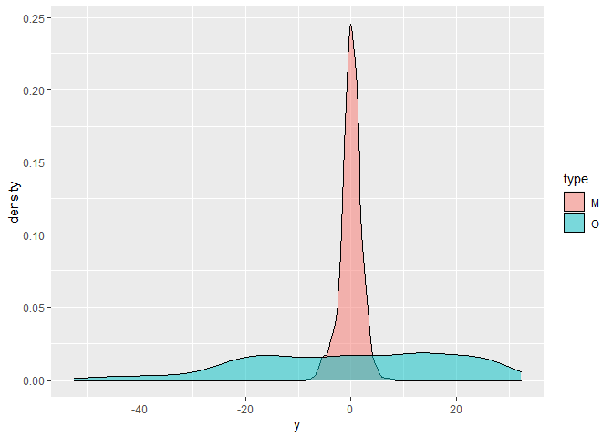

MARS
================
Daniel Carpenter

> MARS is great for piece-wise regression


``` r
#example of multiadaptive regression splines (MARS) for ISE/DSA 5103
#author: Charles Nicholson
#date: 10/23/2017

#library for mars is of course, earth
library(earth)
```

    Loading required package: Formula

    Loading required package: plotmo

    Loading required package: plotrix

    Loading required package: TeachingDemos

``` r
library(tidyverse)
```

    ── Attaching packages
    ───────────────────────────────────────
    tidyverse 1.3.2 ──

    ✔ ggplot2 3.3.6     ✔ purrr   0.3.4
    ✔ tibble  3.1.8     ✔ dplyr   1.0.9
    ✔ tidyr   1.2.0     ✔ stringr 1.4.1
    ✔ readr   2.1.2     ✔ forcats 0.5.2
    ── Conflicts ────────────────────────────────────────── tidyverse_conflicts() ──
    ✖ dplyr::filter() masks stats::filter()
    ✖ dplyr::lag()    masks stats::lag()

``` r
library(ggplot2)  #for pretty graphs
library(rgl)      #for rotating graphics library
```


    Attaching package: 'rgl'

    The following object is masked from 'package:plotrix':

        mtext3d

``` r
#let's create some really simple data to observe the impact 
#of using mars instead of OLS


n<-1000 #number of observations to create

#create data frame with two variables, x and y
#x is uniform random and y is normally distributed
df<-data.frame(x=9*runif(n), y= 1.2*rnorm(n))

#kind of relationship expected for OLS
df$y = df$y - 4*df$x
#and the relationship looks like this
ggplot(data=df, aes(x=x,y=y)) + geom_point() 
```


``` r
summary(olsFit<-lm(y~x,data=df))
```


    Call:
    lm(formula = y ~ x, data = df)

    Residuals:
        Min      1Q  Median      3Q     Max 
    -3.7073 -0.8188  0.0298  0.8684  4.3300 

    Coefficients:
                Estimate Std. Error t value Pr(>|t|)    
    (Intercept)  0.12167    0.07902    1.54    0.124    
    x           -4.01349    0.01488 -269.74   <2e-16 ***
    ---
    Signif. codes:  0 '***' 0.001 '**' 0.01 '*' 0.05 '.' 0.1 ' ' 1

    Residual standard error: 1.234 on 998 degrees of freedom
    Multiple R-squared:  0.9865,    Adjusted R-squared:  0.9865 
    F-statistic: 7.276e+04 on 1 and 998 DF,  p-value: < 2.2e-16

``` r
#now make things complicated, by adding a "bend" in the data
df<-data.frame(x=9*runif(n), y= 1.2*rnorm(n))

#sort the data frame by x and then create some logical vectors
#to help us create some "bends" in our theoretical model
df <- df[order(df$x),]  
s1 <- df$x<4                 #x= 0 to 4 will have one slope
s2 <- df$x>=4 & df$x<9       #x= 4 to 9 will have different slope

#and here are the "bends" in the relationship of y ~ x
df[s1,"y"] <- df[s1,"y"] - 4*df[s1,"x"] 
df[s2,"y"] <- df[s2,"y"] + 17*(df[s2,"x"]-max(df[s1,"x"]))+df[which.max(df[s1,"x"]),"y"]

#and the relationship looks like this
ggplot(data=df, aes(x=x,y=y)) + geom_point() + ylim(-30, 75)
```


``` r
#so, what will OLS do with this?
olsFit<-lm(y~x,data=df)
summary(olsFit)  #<- a simple relationship, y = 6*x - 12
```


    Call:
    lm(formula = y ~ x, data = df)

    Residuals:
         Min       1Q   Median       3Q      Max 
    -26.3867 -10.8817   0.5283  11.3020  27.4511 

    Coefficients:
                Estimate Std. Error t value Pr(>|t|)    
    (Intercept) -25.4128     0.8174  -31.09   <2e-16 ***
    x             8.4875     0.1594   53.25   <2e-16 ***
    ---
    Signif. codes:  0 '***' 0.001 '**' 0.01 '*' 0.05 '.' 0.1 ' ' 1

    Residual standard error: 13.28 on 998 degrees of freedom
    Multiple R-squared:  0.7397,    Adjusted R-squared:  0.7394 
    F-statistic:  2835 on 1 and 998 DF,  p-value: < 2.2e-16

``` r
olsResults = data.frame(x=df$x, y=olsFit$fitted.values)

ggplot(data=olsResults, aes(x=x,y=y)) + geom_line(color="blue",size=2) +
      geom_point(data=df, aes(y=y), alpha=1) +   ylim(-30, 75)
```


``` r
hist(olsFit$residuals)
```


``` r
plot(olsFit)  #<- and these are wacky!
```


``` r
#so let's try mars
marsFit <- earth(y~x,data=df)
summary(marsFit, style="pmax")  #look at that r^2 value!  0.99+
```

    Call: earth(formula=y~x, data=df)

    y =
      -15.73044
      +  4.030765 * pmax(0, 3.897089 -        x) 
      +   17.0239 * pmax(0,        x - 3.897089) 

    Selected 3 of 3 terms, and 1 of 1 predictors
    Termination condition: RSq changed by less than 0.001 at 3 terms
    Importance: x
    Number of terms at each degree of interaction: 1 2 (additive model)
    GCV 1.444918    RSS 1430.505    GRSq 0.9978666    RSq 0.9978837

``` r
marsResults = data.frame(x=df$x, y=marsFit$fitted.values)

#and how did it obtain such a high r^2?

#(Intercept)    -16.215392
#h(4.03407-x)     4.022613     #for x < 4, the slope is -4
#h(x-4.03407)    16.983535     #for x > 4, the slope is 17

ggplot(data=marsResults, aes(x=x,y=y)) + geom_line(color="red",size=3) +
  geom_line(data=olsResults, aes(x=x,y=y), color="blue",size=2,alpha=.25) +
  geom_point(data=df, aes(y=y), alpha=0.25)
```


``` r
hist(marsFit$residuals)
```


``` r
#######

#let's add a few more "bends" in the data to make sure we
#know how to interpret the coefficients

#x is uniform random and y is normally distributed
df<-data.frame(x=15*runif(n), y= 1.2*rnorm(n))

#sort the data frame by x and then create some logical vectors
#to help us create some "bends" in our theoretical model
df <- df[order(df$x),]  
s1 <- df$x<4                 #x= 0 to 4 will have one slope
s2 <- df$x>=4 & df$x<9       #x= 4 to 9 will have different slope
s3 <- df$x>=9 & df$x <= 12   #x= 9 to 12 will have different slope
s4 <- df$x>12                #x= 12+ will have different slope

#and here are the "bends" in the relationship of y ~ x
df[s1,"y"] <- df[s1,"y"] - 4*df[s1,"x"] 
df[s2,"y"] <- df[s2,"y"] + 17*(df[s2,"x"]-max(df[s1,"x"]))+df[which.max(df[s1,"x"]),"y"]
df[s3,"y"] <- df[s3,"y"] + max(df[s2,"y"])
df[s4,"y"] <- df[s4,"y"] - 15*(df[s4,"x"] - max(df[s3,"x"]))+df[length(df[s1,1])+length(df[s2,1])+which.max(df[s3,"x"]),"y"]

#and the relationship looks like this
# ggplot(data=df,aes(x,y)) + geom_p

#so, what will OLS do with this?
olsFit<-lm(y~x,data=df)
summary(olsFit)  #<- a simple relationship
```


    Call:
    lm(formula = y ~ x, data = df)

    Residuals:
        Min      1Q  Median      3Q     Max 
    -52.503 -14.512   1.242  15.191  32.264 

    Coefficients:
                Estimate Std. Error t value Pr(>|t|)    
    (Intercept) -14.8077     1.1543  -12.83   <2e-16 ***
    x             6.0675     0.1351   44.91   <2e-16 ***
    ---
    Signif. codes:  0 '***' 0.001 '**' 0.01 '*' 0.05 '.' 0.1 ' ' 1

    Residual standard error: 18.64 on 998 degrees of freedom
    Multiple R-squared:  0.669, Adjusted R-squared:  0.6686 
    F-statistic:  2017 on 1 and 998 DF,  p-value: < 2.2e-16

``` r
hist(olsFit$residuals)
```


``` r
plot(olsFit)  #<- and these are still wacky!
```


``` r
#so let's try mars again
marsFit <- earth(y~x,data=df)
summary(marsFit, style="pmax")  #again! look at that r^2 value!  0.99+
```

    Call: earth(formula=y~x, data=df)

    y =
      -60.10043
      +   18.4403 * pmax(0,        x - 3.453425) 
      +  4.606935 * pmax(0,        x - 5.837677) 
      -  17.86968 * pmax(0,        x - 9.079408) 
      +  5.387478 * pmax(0, 11.44229 -        x) 
      -  4.903885 * pmax(0,        x - 11.44229) 
      -  15.38958 * pmax(0,        x - 11.97768) 

    Selected 7 of 7 terms, and 1 of 1 predictors
    Termination condition: RSq changed by less than 0.001 at 7 terms
    Importance: x
    Number of terms at each degree of interaction: 1 6 (additive model)
    GCV 3.832843    RSS 3733.837    GRSq 0.996349    RSq 0.9964362

``` r
#and how did it do it?  look at the transformations of the variable x
#note (1) i rearranged these; (2) the numbers will be slightly differnt for you

#h(11.3692-x)     5.487042    ##<-- for all values less then 11.3; slope is -5.8
#h(x-3.44954)    18.215368    ##<-- for all values greater than 3.5, slope is 18-5.8 = 12.2
#h(x-5.80209)     4.831484    ##<-- but if also greater than 4.8, slope is 12.2+4.8 = 17  ****
#h(x-9.11266)   -18.267027    ##<-- but if also greater than 9, slope is 17-18 = -1  ***
#h(x-11.3692)    -2.870003    ##<-- but if greater than 11.3, slope is -1-2 = -3
#h(x-11.902)    -16.935078    ##<-- and if greater than 11.9, slope is -3-17 = -20  ***

plotmo(marsFit)  #this is what the transformation essentially looks like
```


``` r
plot(marsFit)#in bottom left quadrant, you can see that the first slope is a bit too aggressive 
```


``` r
                #estimated at -5.8 instead of -4; otherwise, the residuals have very little pattern


#and we kick OLS butt

#and then look at overlay of fitted values
#blue is MARS; gray is OLS
qplot(df$y, olsFit$fitted.values)+geom_point(color="gray")+
  geom_point(aes(y=marsFit$fitted.values),color="blue")+
  ylab("fitted values")
```


``` r
#residuals
fivenum(olsFit$residuals)
```

           298        460        765        872        520 
    -52.503362 -14.555528   1.242293  15.201439  32.264340 

``` r
fivenum(marsFit$residuals)
```

    [1] -7.1295703 -1.0539599  0.0428511  1.1992211  7.0081921

``` r
#and then look at overlay of residuals values
#blue is MARS; gray is OLS
qplot(df$y, olsFit$residuals)+geom_point(color="gray")+
  geom_point(aes(y=marsFit$residuals),color="blue")+
  ylab("residuals")
```


``` r
#look at overlay of density of residuals for OLS and MARS
dat1<-data.frame(y=marsFit$residuals,type=rep("M",length(marsFit$residuals)))

dat <- rbind(data.frame(y=marsFit$residuals,type=rep("M",length(marsFit$residuals))),
             data.frame(y=olsFit$residuals,type=rep("O",length(olsFit$residuals))))

ggplot(dat, aes(x = y, fill = type)) + geom_density(alpha = 0.5)
```



``` r
#so let's add a little more...
#how about another variable: x1 and x2 as predictors of y
df<-data.frame(x1=15*runif(5000), x2=3*runif(5000), y= 1.2*rnorm(5000))
df <- df[order(df$x1),]

s1 <- df$x1<4
s2 <- df$x1>=4 & df$x1<9
s3 <- df$x1>=9 & df$x1 <= 12
s4 <- df$x1>12

df[s1,"y"] <- df[s1,"y"] - 4*df[s1,"x1"] 
df[s2,"y"] <- df[s2,"y"] + 17*(df[s2,"x1"]-max(df[s1,"x1"]))+df[which.max(df[s1,"x1"]),"y"]
df[s3,"y"] <- df[s3,"y"] + max(df[s2,"y"])
df[s4,"y"] <- df[s4,"y"] - 15*(df[s4,"x1"] - max(df[s3,"x1"]))+df[length(df[s1,1])+length(df[s2,1])+which.max(df[s3,"x1"]),"y"]

df <- df[order(df$x2),]
s5 <- df$x2 < 1.5
s6 <- df$x2 >= 1.5

df[s5,"y"] <- df[s5,"y"] - 20*df[s5,"x2"] 
val <- which.max(df[s5,"x2"])
df[s6,"y"] <- df[s6,"y"] + 20*(df[s6,"x2"]-max(df[s5,"x2"]))-30


qplot(df$x1,df$y)
```


``` r
qplot(df$x2,df$y)
```


``` r
plot3d(df)

olsFit<-lm(y~x1+x2,data=df)
summary(olsFit)
```


    Call:
    lm(formula = y ~ x1 + x2, data = df)

    Residuals:
        Min      1Q  Median      3Q     Max 
    -63.319 -15.289   0.829  16.173  46.230 

    Coefficients:
                 Estimate Std. Error t value Pr(>|t|)    
    (Intercept) -28.32319    0.79557 -35.601   <2e-16 ***
    x1            6.07357    0.06895  88.091   <2e-16 ***
    x2           -0.11273    0.34809  -0.324    0.746    
    ---
    Signif. codes:  0 '***' 0.001 '**' 0.01 '*' 0.05 '.' 0.1 ' ' 1

    Residual standard error: 21.31 on 4997 degrees of freedom
    Multiple R-squared:  0.6083,    Adjusted R-squared:  0.6082 
    F-statistic:  3881 on 2 and 4997 DF,  p-value: < 2.2e-16

``` r
hist(olsFit$residuals)
```


``` r
plot(olsFit)
```


``` r
#plot the 3d data,
plot3d(df$x1, df$x2, df$y, type = "s", col = "red", size = .3)

#get the function for the OLS plane
coefs <- coef(olsFit)
a <- coefs["x1"]
b <- coefs["x2"]
c <- -1
d <- coefs["(Intercept)"]

#plot it on the 3d data
planes3d(a, b, c, d, alpha = 0.5)


#now for MARS again
marsFit <- earth(y~x1+x2,data=df)

summary(marsFit)
```

    Call: earth(formula=y~x1+x2, data=df)

                  coefficients
    (Intercept)     -89.641580
    h(x1-3.39543)    18.732734
    h(x1-5.70897)     4.186423
    h(x1-9.11582)   -18.026348
    h(11.3732-x1)     5.389503
    h(x1-11.3732)    -4.391307
    h(x1-11.993)    -15.480237
    h(1.48744-x2)    20.279195
    h(x2-1.48744)    19.721131

    Selected 9 of 9 terms, and 2 of 2 predictors
    Termination condition: RSq changed by less than 0.001 at 9 terms
    Importance: x1, x2
    Number of terms at each degree of interaction: 1 8 (additive model)
    GCV 3.559776    RSS 17678.05    GRSq 0.9969294    RSq 0.9969491

``` r
plotmo(marsFit)
```

     plotmo grid:    x1       x2
               7.327619 1.543312


``` r
plot(marsFit)
```


``` r
#a helper function for some plotting...
my_surface <- function(mod, xlim, ylim, n=100, ...) { 
  x1 <- seq(xlim[1], xlim[2], length=n)
  x2 <- seq(ylim[1], ylim[2], length=n)
  
  f <- function(x1, x2)
    predict(mod,newdata=data.frame(x1,x2))
  
  z = outer(x1,x2,f)
  surface3d(x1, x2, z, ...)
}

#plot it
plot3d(df$x1, df$x2, df$y, type = "s", col = "red", size = .3)
my_surface(mod=marsFit, xlim=c(0,15), ylim=c(0,3),alpha=.5 )


#look at overlay of density of residuals for OLS and MARS
dat1<-data.frame(y=marsFit$residuals,type=rep("M",length(marsFit$residuals)))

dat <- rbind(data.frame(y=marsFit$residuals,type=rep("M",length(marsFit$residuals))),
             data.frame(y=olsFit$residuals,type=rep("O",length(olsFit$residuals))))

ggplot(dat, aes(x = y, fill = type)) + geom_density(alpha = 0.5)
```


``` r
#so let's add a little more...
#how about another variable: x1 and x2 as predictors of y
#and an interaction term!
df<-data.frame(x1=15*runif(5000), x2=3*runif(5000), y= 1.2*rnorm(5000))
df <- df[order(df$x1),]

s1 <- df$x1<4
s2 <- df$x1>=4 & df$x1<9
s3 <- df$x1>=9 & df$x1 <= 12
s4 <- df$x1>12

df[s1,"y"] <- df[s1,"y"] - 4*df[s1,"x1"] 
df[s2,"y"] <- df[s2,"y"] + 17*(df[s2,"x1"]-max(df[s1,"x1"]))+df[which.max(df[s1,"x1"]),"y"]
df[s3,"y"] <- df[s3,"y"] + max(df[s2,"y"])
df[s4,"y"] <- df[s4,"y"] - 15*(df[s4,"x1"] - max(df[s3,"x1"]))+df[length(df[s1,1])+length(df[s2,1])+which.max(df[s3,"x1"]),"y"]

df <- df[order(df$x2),]
s5 <- df$x2 < 1.5
s6 <- df$x2 >= 1.5
s7 <- df$x2 <1.25 & df$x1 > 11

df[s5,"y"] <- df[s5,"y"] - 20*df[s5,"x2"] 
val <- which.max(df[s5,"x2"])
df[s6,"y"] <- df[s6,"y"] + 20*(df[s6,"x2"]-max(df[s5,"x2"]))-30

df[s7,"y"] <- df[s7,"y"] + 5*df[s7,"x1"]*df[s7,"x2"]

qplot(df$x1,df$y)
```


``` r
qplot(df$x2,df$y)
```


``` r
plot3d(df)


#OLS model
olsFit<-lm(y~x1*x2,data=df)  #OLS including the interaction term
summary(olsFit)
```


    Call:
    lm(formula = y ~ x1 * x2, data = df)

    Residuals:
        Min      1Q  Median      3Q     Max 
    -78.829 -14.078   1.469  14.551  65.734 

    Coefficients:
                 Estimate Std. Error t value Pr(>|t|)    
    (Intercept) -42.37094    1.24275 -34.095  < 2e-16 ***
    x1            9.51588    0.14458  65.819  < 2e-16 ***
    x2            5.83388    0.71731   8.133 5.24e-16 ***
    x1:x2        -1.33380    0.08218 -16.229  < 2e-16 ***
    ---
    Signif. codes:  0 '***' 0.001 '**' 0.01 '*' 0.05 '.' 0.1 ' ' 1

    Residual standard error: 22.17 on 4996 degrees of freedom
    Multiple R-squared:  0.6901,    Adjusted R-squared:  0.6899 
    F-statistic:  3708 on 3 and 4996 DF,  p-value: < 2.2e-16

``` r
#and let's look at prediction surfaces
plot3d(df$x1, df$x2, df$y, type = "s", col = "red", size = .3)
my_surface(olsFit, xlim=c(0,15), ylim=c(0,3),alpha=.5 )

#MARS model
marsFit <- earth(y~x1+x2,data=df,degree=2)
summary(marsFit, style= "pmax")
```

    Call: earth(formula=y~x1+x2, data=df, degree=2)

    y =
      -113.8735
      +    22.2549 * pmax(0,        x1 -  3.276288) 
      +   1.926426 * pmax(0,        x1 -  8.922509) 
      +   6.823736 * pmax(0,  12.06175 -        x1) 
      -   26.36295 * pmax(0,        x1 -  12.06175) 
      +   33.64255 * pmax(0,        x2 -  1.448981) 
      +   20.34028 * pmax(0,  1.719617 -        x2) 
      -   13.86605 * pmax(0,        x2 -  1.719617) 
      +  0.2067398 * pmax(0,        x1 -  3.276288) * pmax(0,        x2 - 0.7974917) 
      +   14.13243 * pmax(0,        x1 -  8.922509) * pmax(0,        x2 -  1.010114) 
      -   14.14168 * pmax(0,        x1 -  8.922509) * pmax(0,  1.010114 -        x2) 
      +    77.9275 * pmax(0,        x1 -  8.922509) * pmax(0,        x2 -  1.410696) 
      -   85.38844 * pmax(0,        x1 -  8.922509) * pmax(0,        x2 -  1.148516) 
      -   7.421931 * pmax(0,        x1 -  8.989019) * pmax(0,        x2 -  1.719617) 

    Selected 14 of 16 terms, and 2 of 2 predictors
    Termination condition: Reached nk 21
    Importance: x1, x2
    Number of terms at each degree of interaction: 1 7 6
    GCV 31.40983    RSS 154951.8    GRSq 0.9801961    RSq 0.9804528

``` r
plotmo(marsFit)
```

     plotmo grid:    x1       x2
               7.560635 1.509895


``` r
plot(marsFit)
```


``` r
#and let's look at prediction surfaces
plot3d(df$x1, df$x2, df$y, type = "s", col = "red", size = .3)
my_surface(marsFit, xlim=c(0,15), ylim=c(0,3),alpha=.5 )


#look at overlay of density of residuals for OLS and MARS
dat1<-data.frame(y=marsFit$residuals,type=rep("M",length(marsFit$residuals)))

dat <- rbind(data.frame(y=marsFit$residuals,type=rep("M",length(marsFit$residuals))),
             data.frame(y=olsFit$residuals,type=rep("O",length(olsFit$residuals))))

ggplot(dat, aes(x = y, fill = type)) + geom_density(alpha = 0.5)
```


``` r
#now for some real data

library(mlbench)
data("BostonHousing2")

BH2<-BostonHousing2  #renamed the data frame to reduce my typing...  i'm lazy like that...


#scaling the numeric data the old-fashioned way (before "tidyverse")
ind <- sapply(BH2, is.numeric)
BH2[ind] <- lapply(BH2[ind], scale)

#fit OLS model on some of the features
olsFit<-lm(cmedv~.-medv-town-tract-lon-lat,data=BH2)  #OLS including the interaction term
summary(olsFit)
```


    Call:
    lm(formula = cmedv ~ . - medv - town - tract - lon - lat, data = BH2)

    Residuals:
         Min       1Q   Median       3Q      Max 
    -1.69514 -0.29304 -0.05828  0.20089  2.84594 

    Coefficients:
                 Estimate Std. Error t value Pr(>|t|)    
    (Intercept) -0.020277   0.023659  -0.857 0.391842    
    crim        -0.099485   0.030511  -3.261 0.001189 ** 
    zn           0.121217   0.034555   3.508 0.000493 ***
    indus        0.017373   0.045534   0.382 0.702970    
    chas1        0.293147   0.092990   3.152 0.001718 ** 
    nox         -0.223909   0.047772  -4.687 3.59e-06 ***
    rm           0.289963   0.031693   9.149  < 2e-16 ***
    age          0.001762   0.040133   0.044 0.964989    
    dis         -0.344400   0.045330  -7.598 1.53e-13 ***
    rad          0.288050   0.062351   4.620 4.91e-06 ***
    tax         -0.233191   0.068405  -3.409 0.000706 ***
    ptratio     -0.217837   0.030569  -7.126 3.70e-12 ***
    b            0.091755   0.026466   3.467 0.000573 ***
    lstat       -0.412701   0.039088 -10.558  < 2e-16 ***
    ---
    Signif. codes:  0 '***' 0.001 '**' 0.01 '*' 0.05 '.' 0.1 ' ' 1

    Residual standard error: 0.5122 on 492 degrees of freedom
    Multiple R-squared:  0.7444,    Adjusted R-squared:  0.7377 
    F-statistic: 110.2 on 13 and 492 DF,  p-value: < 2.2e-16

``` r
hist(olsFit$residuals)
```


``` r
plot(olsFit)
```


``` r
#fit MARS model on same features + 3 degrees of interactions + 5-fold CV
marsFit <- earth(cmedv~.-medv-town-tract-lon-lat,
                data=BH2,
                degree=3,nk=50,pmethod="cv",nfold=5,ncross=5)
summary(marsFit)
```

    Call: earth(formula=cmedv~.-medv-town-tract-lon-lat, data=BH2, pmethod="cv",
                degree=3, nfold=5, ncross=5, nk=50)

                                                             coefficients
    (Intercept)                                                  0.352047
    h(0.208315-rm)                                               2.400638
    h(rm-0.208315)                                               0.784003
    h(-1.15797-dis)                                             33.736869
    h(dis- -1.15797)                                            -0.076994
    h(-0.752178-rad)                                            -1.818472
    h(rad- -0.752178)                                            0.079325
    h(-1.09315-tax)                                              2.850350
    h(tax- -1.09315)                                            -0.197563
    h(-0.914859-lstat)                                           1.153497
    h(lstat- -0.914859)                                         -0.323626
    h(lstat-1.3243)                                              0.540520
    h(1.36614-nox) * h(lstat- -0.914859)                         0.045554
    h(nox-1.36614) * h(lstat- -0.914859)                         0.301926
    h(rm-0.208315) * h(age-0.665217)                             0.971897
    h(rm-0.208315) * h(0.665217-age)                             0.186966
    h(0.206892-rm) * h(dis- -1.15797)                          -11.876705
    h(rm-0.206892) * h(dis- -1.15797)                           -0.093942
    h(0.208315-rm) * h(dis- -0.937519)                          11.772483
    h(0.208315-rm) * h(-0.937519-dis)                          -11.149479
    h(0.989679-rm) * h(tax- -1.09315)                            0.100216
    h(rm-0.989679) * h(tax- -1.09315)                           -0.389483
    h(rm-0.208315) * h(ptratio-0.0667298)                       -0.331431
    h(rm-0.208315) * h(0.0667298-ptratio)                        0.082977
    h(0.0577323-age) * h(dis- -1.15797)                         -0.027754
    h(age-0.0577323) * h(dis- -1.15797)                         -0.243562
    h(-0.47321-dis) * h(lstat- -0.914859)                       -0.720573
    h(dis- -0.47321) * h(lstat- -0.914859)                      -0.140201
    h(tax- -1.09315) * h(b-0.237428)                            -0.088365
    h(-0.600682-tax) * h(-0.914859-lstat)                       -0.551359
    h(tax- -0.600682) * h(-0.914859-lstat)                       2.880560
    h(0.51645-crim) * h(0.208315-rm) * h(-0.937519-dis)         -2.113722
    h(crim-0.51645) * h(0.208315-rm) * h(-0.937519-dis)         -0.303542
    h(1.36614-nox) * h(dis- -0.955945) * h(lstat- -0.914859)     0.024695
    h(1.36614-nox) * h(-0.955945-dis) * h(lstat- -0.914859)      2.230530
    h(0.511789-nox) * h(tax- -1.09315) * h(0.237428-b)          -0.237682
    h(nox-0.511789) * h(tax- -1.09315) * h(0.237428-b)          -0.051665
    h(1.36614-nox) * h(ptratio-1.1753) * h(lstat- -0.914859)     1.509831
    h(1.36614-nox) * h(1.1753-ptratio) * h(lstat- -0.914859)     0.066379
    h(rm-0.208315) * h(age-0.665217) * h(dis- -0.939276)        -1.909942
    h(rm-0.208315) * h(age-0.665217) * h(-0.939276-dis)         23.061428
    h(rm-0.208315) * h(dis- -1.07771) * h(ptratio-0.0667298)     0.129343
    h(rm-0.208315) * h(-1.07771-dis) * h(ptratio-0.0667298)    -41.442401
    h(0.0577323-age) * h(dis- -1.15797) * h(rad- -0.522484)      0.032045
    h(0.0577323-age) * h(dis- -1.15797) * h(-0.522484-rad)       0.218874
    h(tax- -1.09315) * h(b-0.237428) * h(lstat- -1.00308)       -0.075702
    h(tax- -1.09315) * h(b-0.237428) * h(-1.00308-lstat)       -10.623667

    Selected 47 of 48 terms, and 10 of 13 predictors (pmethod="cv")
    Termination condition: Reached nk 50
    Importance: rm, lstat, dis, tax, age, nox, b, ptratio, rad, crim, ...
    Number of terms at each degree of interaction: 1 11 19 16
    GRSq 0.9225148  RSq 0.9537869  mean.oof.RSq 0.8319283 (sd 0.0834)

    pmethod="backward" would have selected:
        33 terms 9 preds,  GRSq 0.9300837  RSq 0.9504808  mean.oof.RSq 0.6904925

``` r
summary(marsFit)
```

    Call: earth(formula=cmedv~.-medv-town-tract-lon-lat, data=BH2, pmethod="cv",
                degree=3, nfold=5, ncross=5, nk=50)

                                                             coefficients
    (Intercept)                                                  0.352047
    h(0.208315-rm)                                               2.400638
    h(rm-0.208315)                                               0.784003
    h(-1.15797-dis)                                             33.736869
    h(dis- -1.15797)                                            -0.076994
    h(-0.752178-rad)                                            -1.818472
    h(rad- -0.752178)                                            0.079325
    h(-1.09315-tax)                                              2.850350
    h(tax- -1.09315)                                            -0.197563
    h(-0.914859-lstat)                                           1.153497
    h(lstat- -0.914859)                                         -0.323626
    h(lstat-1.3243)                                              0.540520
    h(1.36614-nox) * h(lstat- -0.914859)                         0.045554
    h(nox-1.36614) * h(lstat- -0.914859)                         0.301926
    h(rm-0.208315) * h(age-0.665217)                             0.971897
    h(rm-0.208315) * h(0.665217-age)                             0.186966
    h(0.206892-rm) * h(dis- -1.15797)                          -11.876705
    h(rm-0.206892) * h(dis- -1.15797)                           -0.093942
    h(0.208315-rm) * h(dis- -0.937519)                          11.772483
    h(0.208315-rm) * h(-0.937519-dis)                          -11.149479
    h(0.989679-rm) * h(tax- -1.09315)                            0.100216
    h(rm-0.989679) * h(tax- -1.09315)                           -0.389483
    h(rm-0.208315) * h(ptratio-0.0667298)                       -0.331431
    h(rm-0.208315) * h(0.0667298-ptratio)                        0.082977
    h(0.0577323-age) * h(dis- -1.15797)                         -0.027754
    h(age-0.0577323) * h(dis- -1.15797)                         -0.243562
    h(-0.47321-dis) * h(lstat- -0.914859)                       -0.720573
    h(dis- -0.47321) * h(lstat- -0.914859)                      -0.140201
    h(tax- -1.09315) * h(b-0.237428)                            -0.088365
    h(-0.600682-tax) * h(-0.914859-lstat)                       -0.551359
    h(tax- -0.600682) * h(-0.914859-lstat)                       2.880560
    h(0.51645-crim) * h(0.208315-rm) * h(-0.937519-dis)         -2.113722
    h(crim-0.51645) * h(0.208315-rm) * h(-0.937519-dis)         -0.303542
    h(1.36614-nox) * h(dis- -0.955945) * h(lstat- -0.914859)     0.024695
    h(1.36614-nox) * h(-0.955945-dis) * h(lstat- -0.914859)      2.230530
    h(0.511789-nox) * h(tax- -1.09315) * h(0.237428-b)          -0.237682
    h(nox-0.511789) * h(tax- -1.09315) * h(0.237428-b)          -0.051665
    h(1.36614-nox) * h(ptratio-1.1753) * h(lstat- -0.914859)     1.509831
    h(1.36614-nox) * h(1.1753-ptratio) * h(lstat- -0.914859)     0.066379
    h(rm-0.208315) * h(age-0.665217) * h(dis- -0.939276)        -1.909942
    h(rm-0.208315) * h(age-0.665217) * h(-0.939276-dis)         23.061428
    h(rm-0.208315) * h(dis- -1.07771) * h(ptratio-0.0667298)     0.129343
    h(rm-0.208315) * h(-1.07771-dis) * h(ptratio-0.0667298)    -41.442401
    h(0.0577323-age) * h(dis- -1.15797) * h(rad- -0.522484)      0.032045
    h(0.0577323-age) * h(dis- -1.15797) * h(-0.522484-rad)       0.218874
    h(tax- -1.09315) * h(b-0.237428) * h(lstat- -1.00308)       -0.075702
    h(tax- -1.09315) * h(b-0.237428) * h(-1.00308-lstat)       -10.623667

    Selected 47 of 48 terms, and 10 of 13 predictors (pmethod="cv")
    Termination condition: Reached nk 50
    Importance: rm, lstat, dis, tax, age, nox, b, ptratio, rad, crim, ...
    Number of terms at each degree of interaction: 1 11 19 16
    GRSq 0.9225148  RSq 0.9537869  mean.oof.RSq 0.8319283 (sd 0.0834)

    pmethod="backward" would have selected:
        33 terms 9 preds,  GRSq 0.9300837  RSq 0.9504808  mean.oof.RSq 0.6904925

``` r
plotmo(marsFit)
```

    Error : variables 'tract', 'lon', 'lat', 'medv', 'crim', 'zn', 'indus', 'nox', 'rm', 'age', 'dis', 'rad', 'tax', 'ptratio', 'b', 'lstat' were specified with different types from the fit
    Continuing anyway, first few rows of modelframe are
           town     tract        lon        lat       medv       crim         zn
    1 Cambridge 0.5022651 0.04626642 0.02686564 -0.1449159 -0.3902803 -0.4872402
    2 Cambridge 0.5022651 0.04626642 0.02686564 -0.1449159 -0.3902803 -0.4872402
    3 Cambridge 0.5022651 0.04626642 0.02686564 -0.1449159 -0.3902803 -0.4872402
    4 Cambridge 0.5022651 0.04626642 0.02686564 -0.1449159 -0.3902803 -0.4872402
    5 Cambridge 0.5022651 0.04626642 0.02686564 -0.1449159 -0.3902803 -0.4872402
    6 Cambridge 0.5022651 0.04626642 0.02686564 -0.1449159 -0.3902803 -0.4872402
           indus chas        nox        rm       age        dis        rad
    1 -0.2108898    0 -0.1440749 -3.876413 0.3170678 -0.2790473 -0.5224844
    2 -0.2108898    0 -0.1440749 -3.724823 0.3170678 -0.2790473 -0.5224844
    3 -0.2108898    0 -0.1440749 -3.573232 0.3170678 -0.2790473 -0.5224844
    4 -0.2108898    0 -0.1440749 -3.421641 0.3170678 -0.2790473 -0.5224844
    5 -0.2108898    0 -0.1440749 -3.270051 0.3170678 -0.2790473 -0.5224844
    6 -0.2108898    0 -0.1440749 -3.118460 0.3170678 -0.2790473 -0.5224844
             tax   ptratio         b      lstat
    1 -0.4642132 0.2745872 0.3808097 -0.1810744
    2 -0.4642132 0.2745872 0.3808097 -0.1810744
    3 -0.4642132 0.2745872 0.3808097 -0.1810744
    4 -0.4642132 0.2745872 0.3808097 -0.1810744
    5 -0.4642132 0.2745872 0.3808097 -0.1810744
    6 -0.4642132 0.2745872 0.3808097 -0.1810744
    Error : variables 'tract', 'lon', 'lat', 'medv', 'crim', 'zn', 'indus', 'nox', 'rm', 'age', 'dis', 'rad', 'tax', 'ptratio', 'b', 'lstat' were specified with different types from the fit
    Continuing anyway, first few rows of modelframe are
           town     tract        lon        lat       medv       crim         zn
    1 Cambridge 0.5022651 0.04626642 0.02686564 -0.1449159 -0.3902803 -0.4872402
    2 Cambridge 0.5022651 0.04626642 0.02686564 -0.1449159 -0.3902803 -0.4872402
    3 Cambridge 0.5022651 0.04626642 0.02686564 -0.1449159 -0.3902803 -0.4872402
    4 Cambridge 0.5022651 0.04626642 0.02686564 -0.1449159 -0.3902803 -0.4872402
    5 Cambridge 0.5022651 0.04626642 0.02686564 -0.1449159 -0.3902803 -0.4872402
    6 Cambridge 0.5022651 0.04626642 0.02686564 -0.1449159 -0.3902803 -0.4872402
           indus chas        nox         rm       age        dis        rad
    1 -0.2108898    0 -0.1440749 -0.1083583 0.3170678 -1.2658165 -0.5224844
    2 -0.2108898    0 -0.1440749 -0.1083583 0.3170678 -1.1592366 -0.5224844
    3 -0.2108898    0 -0.1440749 -0.1083583 0.3170678 -1.0526566 -0.5224844
    4 -0.2108898    0 -0.1440749 -0.1083583 0.3170678 -0.9460766 -0.5224844
    5 -0.2108898    0 -0.1440749 -0.1083583 0.3170678 -0.8394966 -0.5224844
    6 -0.2108898    0 -0.1440749 -0.1083583 0.3170678 -0.7329167 -0.5224844
             tax   ptratio         b      lstat
    1 -0.4642132 0.2745872 0.3808097 -0.1810744
    2 -0.4642132 0.2745872 0.3808097 -0.1810744
    3 -0.4642132 0.2745872 0.3808097 -0.1810744
    4 -0.4642132 0.2745872 0.3808097 -0.1810744
    5 -0.4642132 0.2745872 0.3808097 -0.1810744
    6 -0.4642132 0.2745872 0.3808097 -0.1810744
    Error : variables 'tract', 'lon', 'lat', 'medv', 'crim', 'zn', 'indus', 'nox', 'rm', 'age', 'dis', 'rad', 'tax', 'ptratio', 'b', 'lstat' were specified with different types from the fit
    Continuing anyway, first few rows of modelframe are
           town     tract        lon        lat       medv       crim         zn
    1 Cambridge 0.5022651 0.04626642 0.02686564 -0.1449159 -0.3902803 -0.4872402
    2 Cambridge 0.5022651 0.04626642 0.02686564 -0.1449159 -0.3902803 -0.4872402
    3 Cambridge 0.5022651 0.04626642 0.02686564 -0.1449159 -0.3902803 -0.4872402
    4 Cambridge 0.5022651 0.04626642 0.02686564 -0.1449159 -0.3902803 -0.4872402
    5 Cambridge 0.5022651 0.04626642 0.02686564 -0.1449159 -0.3902803 -0.4872402
    6 Cambridge 0.5022651 0.04626642 0.02686564 -0.1449159 -0.3902803 -0.4872402
           indus chas        nox         rm       age        dis        rad
    1 -0.2108898    0 -0.1440749 -0.1083583 0.3170678 -0.2790473 -0.9818712
    2 -0.2108898    0 -0.1440749 -0.1083583 0.3170678 -0.2790473 -0.9279636
    3 -0.2108898    0 -0.1440749 -0.1083583 0.3170678 -0.2790473 -0.8740559
    4 -0.2108898    0 -0.1440749 -0.1083583 0.3170678 -0.2790473 -0.8201483
    5 -0.2108898    0 -0.1440749 -0.1083583 0.3170678 -0.2790473 -0.7662407
    6 -0.2108898    0 -0.1440749 -0.1083583 0.3170678 -0.2790473 -0.7123330
             tax   ptratio         b      lstat
    1 -0.4642132 0.2745872 0.3808097 -0.1810744
    2 -0.4642132 0.2745872 0.3808097 -0.1810744
    3 -0.4642132 0.2745872 0.3808097 -0.1810744
    4 -0.4642132 0.2745872 0.3808097 -0.1810744
    5 -0.4642132 0.2745872 0.3808097 -0.1810744
    6 -0.4642132 0.2745872 0.3808097 -0.1810744
    Error : variables 'tract', 'lon', 'lat', 'medv', 'crim', 'zn', 'indus', 'nox', 'rm', 'age', 'dis', 'rad', 'tax', 'ptratio', 'b', 'lstat' were specified with different types from the fit
    Continuing anyway, first few rows of modelframe are
           town     tract        lon        lat       medv       crim         zn
    1 Cambridge 0.5022651 0.04626642 0.02686564 -0.1449159 -0.3902803 -0.4872402
    2 Cambridge 0.5022651 0.04626642 0.02686564 -0.1449159 -0.3902803 -0.4872402
    3 Cambridge 0.5022651 0.04626642 0.02686564 -0.1449159 -0.3902803 -0.4872402
    4 Cambridge 0.5022651 0.04626642 0.02686564 -0.1449159 -0.3902803 -0.4872402
    5 Cambridge 0.5022651 0.04626642 0.02686564 -0.1449159 -0.3902803 -0.4872402
    6 Cambridge 0.5022651 0.04626642 0.02686564 -0.1449159 -0.3902803 -0.4872402
           indus chas        nox         rm       age        dis        rad
    1 -0.2108898    0 -0.1440749 -0.1083583 0.3170678 -0.2790473 -0.5224844
    2 -0.2108898    0 -0.1440749 -0.1083583 0.3170678 -0.2790473 -0.5224844
    3 -0.2108898    0 -0.1440749 -0.1083583 0.3170678 -0.2790473 -0.5224844
    4 -0.2108898    0 -0.1440749 -0.1083583 0.3170678 -0.2790473 -0.5224844
    5 -0.2108898    0 -0.1440749 -0.1083583 0.3170678 -0.2790473 -0.5224844
    6 -0.2108898    0 -0.1440749 -0.1083583 0.3170678 -0.2790473 -0.5224844
             tax   ptratio         b      lstat
    1 -1.3126910 0.2745872 0.3808097 -0.1810744
    2 -1.2492398 0.2745872 0.3808097 -0.1810744
    3 -1.1857886 0.2745872 0.3808097 -0.1810744
    4 -1.1223375 0.2745872 0.3808097 -0.1810744
    5 -1.0588863 0.2745872 0.3808097 -0.1810744
    6 -0.9954351 0.2745872 0.3808097 -0.1810744
    Error : variables 'tract', 'lon', 'lat', 'medv', 'crim', 'zn', 'indus', 'nox', 'rm', 'age', 'dis', 'rad', 'tax', 'ptratio', 'b', 'lstat' were specified with different types from the fit
    Continuing anyway, first few rows of modelframe are
           town     tract        lon        lat       medv       crim         zn
    1 Cambridge 0.5022651 0.04626642 0.02686564 -0.1449159 -0.3902803 -0.4872402
    2 Cambridge 0.5022651 0.04626642 0.02686564 -0.1449159 -0.3902803 -0.4872402
    3 Cambridge 0.5022651 0.04626642 0.02686564 -0.1449159 -0.3902803 -0.4872402
    4 Cambridge 0.5022651 0.04626642 0.02686564 -0.1449159 -0.3902803 -0.4872402
    5 Cambridge 0.5022651 0.04626642 0.02686564 -0.1449159 -0.3902803 -0.4872402
    6 Cambridge 0.5022651 0.04626642 0.02686564 -0.1449159 -0.3902803 -0.4872402
           indus chas        nox         rm       age        dis        rad
    1 -0.2108898    0 -0.1440749 -0.1083583 0.3170678 -0.2790473 -0.5224844
    2 -0.2108898    0 -0.1440749 -0.1083583 0.3170678 -0.2790473 -0.5224844
    3 -0.2108898    0 -0.1440749 -0.1083583 0.3170678 -0.2790473 -0.5224844
    4 -0.2108898    0 -0.1440749 -0.1083583 0.3170678 -0.2790473 -0.5224844
    5 -0.2108898    0 -0.1440749 -0.1083583 0.3170678 -0.2790473 -0.5224844
    6 -0.2108898    0 -0.1440749 -0.1083583 0.3170678 -0.2790473 -0.5224844
             tax   ptratio         b     lstat
    1 -0.4642132 0.2745872 0.3808097 -1.529613
    2 -0.4642132 0.2745872 0.3808097 -1.426044
    3 -0.4642132 0.2745872 0.3808097 -1.322476
    4 -0.4642132 0.2745872 0.3808097 -1.218907
    5 -0.4642132 0.2745872 0.3808097 -1.115338
    6 -0.4642132 0.2745872 0.3808097 -1.011769
    Error : variables 'tract', 'lon', 'lat', 'medv', 'crim', 'zn', 'indus', 'nox', 'rm', 'age', 'dis', 'rad', 'tax', 'ptratio', 'b', 'lstat' were specified with different types from the fit
    Continuing anyway, first few rows of modelframe are
           town     tract        lon        lat       medv       crim         zn
    1 Cambridge 0.5022651 0.04626642 0.02686564 -0.1449159 -0.3902803 -0.4872402
    2 Cambridge 0.5022651 0.04626642 0.02686564 -0.1449159 -0.3902803 -0.4872402
    3 Cambridge 0.5022651 0.04626642 0.02686564 -0.1449159 -0.3902803 -0.4872402
    4 Cambridge 0.5022651 0.04626642 0.02686564 -0.1449159 -0.3902803 -0.4872402
    5 Cambridge 0.5022651 0.04626642 0.02686564 -0.1449159 -0.3902803 -0.4872402
    6 Cambridge 0.5022651 0.04626642 0.02686564 -0.1449159 -0.3902803 -0.4872402
           indus chas        nox         rm       age        dis        rad
    1 -0.2108898    0 -1.4644327 -0.1083583 0.3170678 -0.2790473 -0.5224844
    2 -0.2108898    0 -1.2436918 -0.1083583 0.3170678 -0.2790473 -0.5224844
    3 -0.2108898    0 -1.0229508 -0.1083583 0.3170678 -0.2790473 -0.5224844
    4 -0.2108898    0 -0.8022099 -0.1083583 0.3170678 -0.2790473 -0.5224844
    5 -0.2108898    0 -0.5814689 -0.1083583 0.3170678 -0.2790473 -0.5224844
    6 -0.2108898    0 -0.3607280 -0.1083583 0.3170678 -0.2790473 -0.5224844
             tax   ptratio         b     lstat
    1 -0.4642132 0.2745872 0.3808097 -1.529613
    2 -0.4642132 0.2745872 0.3808097 -1.529613
    3 -0.4642132 0.2745872 0.3808097 -1.529613
    4 -0.4642132 0.2745872 0.3808097 -1.529613
    5 -0.4642132 0.2745872 0.3808097 -1.529613
    6 -0.4642132 0.2745872 0.3808097 -1.529613
    Error : variables 'tract', 'lon', 'lat', 'medv', 'crim', 'zn', 'indus', 'nox', 'rm', 'age', 'dis', 'rad', 'tax', 'ptratio', 'b', 'lstat' were specified with different types from the fit
    Continuing anyway, first few rows of modelframe are
           town     tract        lon        lat       medv       crim         zn
    1 Cambridge 0.5022651 0.04626642 0.02686564 -0.1449159 -0.3902803 -0.4872402
    2 Cambridge 0.5022651 0.04626642 0.02686564 -0.1449159 -0.3902803 -0.4872402
    3 Cambridge 0.5022651 0.04626642 0.02686564 -0.1449159 -0.3902803 -0.4872402
    4 Cambridge 0.5022651 0.04626642 0.02686564 -0.1449159 -0.3902803 -0.4872402
    5 Cambridge 0.5022651 0.04626642 0.02686564 -0.1449159 -0.3902803 -0.4872402
    6 Cambridge 0.5022651 0.04626642 0.02686564 -0.1449159 -0.3902803 -0.4872402
           indus chas        nox        rm       age        dis        rad
    1 -0.2108898    0 -0.1440749 -3.876413 -2.333128 -0.2790473 -0.5224844
    2 -0.2108898    0 -0.1440749 -3.485469 -2.333128 -0.2790473 -0.5224844
    3 -0.2108898    0 -0.1440749 -3.094525 -2.333128 -0.2790473 -0.5224844
    4 -0.2108898    0 -0.1440749 -2.703580 -2.333128 -0.2790473 -0.5224844
    5 -0.2108898    0 -0.1440749 -2.312636 -2.333128 -0.2790473 -0.5224844
    6 -0.2108898    0 -0.1440749 -1.921691 -2.333128 -0.2790473 -0.5224844
             tax   ptratio         b      lstat
    1 -0.4642132 0.2745872 0.3808097 -0.1810744
    2 -0.4642132 0.2745872 0.3808097 -0.1810744
    3 -0.4642132 0.2745872 0.3808097 -0.1810744
    4 -0.4642132 0.2745872 0.3808097 -0.1810744
    5 -0.4642132 0.2745872 0.3808097 -0.1810744
    6 -0.4642132 0.2745872 0.3808097 -0.1810744
    Error : variables 'tract', 'lon', 'lat', 'medv', 'crim', 'zn', 'indus', 'nox', 'rm', 'age', 'dis', 'rad', 'tax', 'ptratio', 'b', 'lstat' were specified with different types from the fit
    Continuing anyway, first few rows of modelframe are
           town     tract        lon        lat       medv       crim         zn
    1 Cambridge 0.5022651 0.04626642 0.02686564 -0.1449159 -0.3902803 -0.4872402
    2 Cambridge 0.5022651 0.04626642 0.02686564 -0.1449159 -0.3902803 -0.4872402
    3 Cambridge 0.5022651 0.04626642 0.02686564 -0.1449159 -0.3902803 -0.4872402
    4 Cambridge 0.5022651 0.04626642 0.02686564 -0.1449159 -0.3902803 -0.4872402
    5 Cambridge 0.5022651 0.04626642 0.02686564 -0.1449159 -0.3902803 -0.4872402
    6 Cambridge 0.5022651 0.04626642 0.02686564 -0.1449159 -0.3902803 -0.4872402
           indus chas        nox        rm       age       dis        rad
    1 -0.2108898    0 -0.1440749 -3.876413 0.3170678 -1.265817 -0.5224844
    2 -0.2108898    0 -0.1440749 -3.485469 0.3170678 -1.265817 -0.5224844
    3 -0.2108898    0 -0.1440749 -3.094525 0.3170678 -1.265817 -0.5224844
    4 -0.2108898    0 -0.1440749 -2.703580 0.3170678 -1.265817 -0.5224844
    5 -0.2108898    0 -0.1440749 -2.312636 0.3170678 -1.265817 -0.5224844
    6 -0.2108898    0 -0.1440749 -1.921691 0.3170678 -1.265817 -0.5224844
             tax   ptratio         b      lstat
    1 -0.4642132 0.2745872 0.3808097 -0.1810744
    2 -0.4642132 0.2745872 0.3808097 -0.1810744
    3 -0.4642132 0.2745872 0.3808097 -0.1810744
    4 -0.4642132 0.2745872 0.3808097 -0.1810744
    5 -0.4642132 0.2745872 0.3808097 -0.1810744
    6 -0.4642132 0.2745872 0.3808097 -0.1810744
    Error : variables 'tract', 'lon', 'lat', 'medv', 'crim', 'zn', 'indus', 'nox', 'rm', 'age', 'dis', 'rad', 'tax', 'ptratio', 'b', 'lstat' were specified with different types from the fit
    Continuing anyway, first few rows of modelframe are
           town     tract        lon        lat       medv       crim         zn
    1 Cambridge 0.5022651 0.04626642 0.02686564 -0.1449159 -0.3902803 -0.4872402
    2 Cambridge 0.5022651 0.04626642 0.02686564 -0.1449159 -0.3902803 -0.4872402
    3 Cambridge 0.5022651 0.04626642 0.02686564 -0.1449159 -0.3902803 -0.4872402
    4 Cambridge 0.5022651 0.04626642 0.02686564 -0.1449159 -0.3902803 -0.4872402
    5 Cambridge 0.5022651 0.04626642 0.02686564 -0.1449159 -0.3902803 -0.4872402
    6 Cambridge 0.5022651 0.04626642 0.02686564 -0.1449159 -0.3902803 -0.4872402
           indus chas        nox        rm       age        dis        rad
    1 -0.2108898    0 -0.1440749 -3.876413 0.3170678 -0.2790473 -0.5224844
    2 -0.2108898    0 -0.1440749 -3.485469 0.3170678 -0.2790473 -0.5224844
    3 -0.2108898    0 -0.1440749 -3.094525 0.3170678 -0.2790473 -0.5224844
    4 -0.2108898    0 -0.1440749 -2.703580 0.3170678 -0.2790473 -0.5224844
    5 -0.2108898    0 -0.1440749 -2.312636 0.3170678 -0.2790473 -0.5224844
    6 -0.2108898    0 -0.1440749 -1.921691 0.3170678 -0.2790473 -0.5224844
            tax   ptratio         b      lstat
    1 -1.312691 0.2745872 0.3808097 -0.1810744
    2 -1.312691 0.2745872 0.3808097 -0.1810744
    3 -1.312691 0.2745872 0.3808097 -0.1810744
    4 -1.312691 0.2745872 0.3808097 -0.1810744
    5 -1.312691 0.2745872 0.3808097 -0.1810744
    6 -1.312691 0.2745872 0.3808097 -0.1810744
    Error : variables 'tract', 'lon', 'lat', 'medv', 'crim', 'zn', 'indus', 'nox', 'rm', 'age', 'dis', 'rad', 'tax', 'ptratio', 'b', 'lstat' were specified with different types from the fit
    Continuing anyway, first few rows of modelframe are
           town     tract        lon        lat       medv       crim         zn
    1 Cambridge 0.5022651 0.04626642 0.02686564 -0.1449159 -0.3902803 -0.4872402
    2 Cambridge 0.5022651 0.04626642 0.02686564 -0.1449159 -0.3902803 -0.4872402
    3 Cambridge 0.5022651 0.04626642 0.02686564 -0.1449159 -0.3902803 -0.4872402
    4 Cambridge 0.5022651 0.04626642 0.02686564 -0.1449159 -0.3902803 -0.4872402
    5 Cambridge 0.5022651 0.04626642 0.02686564 -0.1449159 -0.3902803 -0.4872402
    6 Cambridge 0.5022651 0.04626642 0.02686564 -0.1449159 -0.3902803 -0.4872402
           indus chas        nox        rm       age        dis        rad
    1 -0.2108898    0 -0.1440749 -3.876413 0.3170678 -0.2790473 -0.5224844
    2 -0.2108898    0 -0.1440749 -3.485469 0.3170678 -0.2790473 -0.5224844
    3 -0.2108898    0 -0.1440749 -3.094525 0.3170678 -0.2790473 -0.5224844
    4 -0.2108898    0 -0.1440749 -2.703580 0.3170678 -0.2790473 -0.5224844
    5 -0.2108898    0 -0.1440749 -2.312636 0.3170678 -0.2790473 -0.5224844
    6 -0.2108898    0 -0.1440749 -1.921691 0.3170678 -0.2790473 -0.5224844
             tax   ptratio         b      lstat
    1 -0.4642132 -2.704703 0.3808097 -0.1810744
    2 -0.4642132 -2.704703 0.3808097 -0.1810744
    3 -0.4642132 -2.704703 0.3808097 -0.1810744
    4 -0.4642132 -2.704703 0.3808097 -0.1810744
    5 -0.4642132 -2.704703 0.3808097 -0.1810744
    6 -0.4642132 -2.704703 0.3808097 -0.1810744
    Error : variables 'tract', 'lon', 'lat', 'medv', 'crim', 'zn', 'indus', 'nox', 'rm', 'age', 'dis', 'rad', 'tax', 'ptratio', 'b', 'lstat' were specified with different types from the fit
    Continuing anyway, first few rows of modelframe are
           town     tract        lon        lat       medv       crim         zn
    1 Cambridge 0.5022651 0.04626642 0.02686564 -0.1449159 -0.3902803 -0.4872402
    2 Cambridge 0.5022651 0.04626642 0.02686564 -0.1449159 -0.3902803 -0.4872402
    3 Cambridge 0.5022651 0.04626642 0.02686564 -0.1449159 -0.3902803 -0.4872402
    4 Cambridge 0.5022651 0.04626642 0.02686564 -0.1449159 -0.3902803 -0.4872402
    5 Cambridge 0.5022651 0.04626642 0.02686564 -0.1449159 -0.3902803 -0.4872402
    6 Cambridge 0.5022651 0.04626642 0.02686564 -0.1449159 -0.3902803 -0.4872402
           indus chas        nox         rm       age       dis        rad
    1 -0.2108898    0 -0.1440749 -0.1083583 -2.333128 -1.265817 -0.5224844
    2 -0.2108898    0 -0.1440749 -0.1083583 -2.151575 -1.265817 -0.5224844
    3 -0.2108898    0 -0.1440749 -0.1083583 -1.970021 -1.265817 -0.5224844
    4 -0.2108898    0 -0.1440749 -0.1083583 -1.788467 -1.265817 -0.5224844
    5 -0.2108898    0 -0.1440749 -0.1083583 -1.606914 -1.265817 -0.5224844
    6 -0.2108898    0 -0.1440749 -0.1083583 -1.425360 -1.265817 -0.5224844
             tax   ptratio         b      lstat
    1 -0.4642132 0.2745872 0.3808097 -0.1810744
    2 -0.4642132 0.2745872 0.3808097 -0.1810744
    3 -0.4642132 0.2745872 0.3808097 -0.1810744
    4 -0.4642132 0.2745872 0.3808097 -0.1810744
    5 -0.4642132 0.2745872 0.3808097 -0.1810744
    6 -0.4642132 0.2745872 0.3808097 -0.1810744
    Error : variables 'tract', 'lon', 'lat', 'medv', 'crim', 'zn', 'indus', 'nox', 'rm', 'age', 'dis', 'rad', 'tax', 'ptratio', 'b', 'lstat' were specified with different types from the fit
    Continuing anyway, first few rows of modelframe are
           town     tract        lon        lat       medv       crim         zn
    1 Cambridge 0.5022651 0.04626642 0.02686564 -0.1449159 -0.3902803 -0.4872402
    2 Cambridge 0.5022651 0.04626642 0.02686564 -0.1449159 -0.3902803 -0.4872402
    3 Cambridge 0.5022651 0.04626642 0.02686564 -0.1449159 -0.3902803 -0.4872402
    4 Cambridge 0.5022651 0.04626642 0.02686564 -0.1449159 -0.3902803 -0.4872402
    5 Cambridge 0.5022651 0.04626642 0.02686564 -0.1449159 -0.3902803 -0.4872402
    6 Cambridge 0.5022651 0.04626642 0.02686564 -0.1449159 -0.3902803 -0.4872402
           indus chas        nox         rm       age        dis        rad
    1 -0.2108898    0 -0.1440749 -0.1083583 0.3170678 -1.2658165 -0.5224844
    2 -0.2108898    0 -0.1440749 -0.1083583 0.3170678 -0.9909524 -0.5224844
    3 -0.2108898    0 -0.1440749 -0.1083583 0.3170678 -0.7160882 -0.5224844
    4 -0.2108898    0 -0.1440749 -0.1083583 0.3170678 -0.4412241 -0.5224844
    5 -0.2108898    0 -0.1440749 -0.1083583 0.3170678 -0.1663600 -0.5224844
    6 -0.2108898    0 -0.1440749 -0.1083583 0.3170678  0.1085042 -0.5224844
             tax   ptratio         b     lstat
    1 -0.4642132 0.2745872 0.3808097 -1.529613
    2 -0.4642132 0.2745872 0.3808097 -1.529613
    3 -0.4642132 0.2745872 0.3808097 -1.529613
    4 -0.4642132 0.2745872 0.3808097 -1.529613
    5 -0.4642132 0.2745872 0.3808097 -1.529613
    6 -0.4642132 0.2745872 0.3808097 -1.529613
    Error : variables 'tract', 'lon', 'lat', 'medv', 'crim', 'zn', 'indus', 'nox', 'rm', 'age', 'dis', 'rad', 'tax', 'ptratio', 'b', 'lstat' were specified with different types from the fit
    Continuing anyway, first few rows of modelframe are
           town     tract        lon        lat       medv       crim         zn
    1 Cambridge 0.5022651 0.04626642 0.02686564 -0.1449159 -0.3902803 -0.4872402
    2 Cambridge 0.5022651 0.04626642 0.02686564 -0.1449159 -0.3902803 -0.4872402
    3 Cambridge 0.5022651 0.04626642 0.02686564 -0.1449159 -0.3902803 -0.4872402
    4 Cambridge 0.5022651 0.04626642 0.02686564 -0.1449159 -0.3902803 -0.4872402
    5 Cambridge 0.5022651 0.04626642 0.02686564 -0.1449159 -0.3902803 -0.4872402
    6 Cambridge 0.5022651 0.04626642 0.02686564 -0.1449159 -0.3902803 -0.4872402
           indus chas        nox         rm       age        dis        rad
    1 -0.2108898    0 -0.1440749 -0.1083583 0.3170678 -0.2790473 -0.5224844
    2 -0.2108898    0 -0.1440749 -0.1083583 0.3170678 -0.2790473 -0.5224844
    3 -0.2108898    0 -0.1440749 -0.1083583 0.3170678 -0.2790473 -0.5224844
    4 -0.2108898    0 -0.1440749 -0.1083583 0.3170678 -0.2790473 -0.5224844
    5 -0.2108898    0 -0.1440749 -0.1083583 0.3170678 -0.2790473 -0.5224844
    6 -0.2108898    0 -0.1440749 -0.1083583 0.3170678 -0.2790473 -0.5224844
             tax   ptratio         b      lstat
    1 -1.3126910 0.2745872 -3.903331 -0.1810744
    2 -1.1490538 0.2745872 -3.903331 -0.1810744
    3 -0.9854165 0.2745872 -3.903331 -0.1810744
    4 -0.8217793 0.2745872 -3.903331 -0.1810744
    5 -0.6581421 0.2745872 -3.903331 -0.1810744
    6 -0.4945048 0.2745872 -3.903331 -0.1810744
    Error : variables 'tract', 'lon', 'lat', 'medv', 'crim', 'zn', 'indus', 'nox', 'rm', 'age', 'dis', 'rad', 'tax', 'ptratio', 'b', 'lstat' were specified with different types from the fit
    Continuing anyway, first few rows of modelframe are
           town     tract        lon        lat       medv       crim         zn
    1 Cambridge 0.5022651 0.04626642 0.02686564 -0.1449159 -0.3902803 -0.4872402
    2 Cambridge 0.5022651 0.04626642 0.02686564 -0.1449159 -0.3902803 -0.4872402
    3 Cambridge 0.5022651 0.04626642 0.02686564 -0.1449159 -0.3902803 -0.4872402
    4 Cambridge 0.5022651 0.04626642 0.02686564 -0.1449159 -0.3902803 -0.4872402
    5 Cambridge 0.5022651 0.04626642 0.02686564 -0.1449159 -0.3902803 -0.4872402
    6 Cambridge 0.5022651 0.04626642 0.02686564 -0.1449159 -0.3902803 -0.4872402
           indus chas        nox         rm       age        dis        rad
    1 -0.2108898    0 -0.1440749 -0.1083583 0.3170678 -0.2790473 -0.5224844
    2 -0.2108898    0 -0.1440749 -0.1083583 0.3170678 -0.2790473 -0.5224844
    3 -0.2108898    0 -0.1440749 -0.1083583 0.3170678 -0.2790473 -0.5224844
    4 -0.2108898    0 -0.1440749 -0.1083583 0.3170678 -0.2790473 -0.5224844
    5 -0.2108898    0 -0.1440749 -0.1083583 0.3170678 -0.2790473 -0.5224844
    6 -0.2108898    0 -0.1440749 -0.1083583 0.3170678 -0.2790473 -0.5224844
             tax   ptratio         b     lstat
    1 -1.3126910 0.2745872 0.3808097 -1.529613
    2 -1.1490538 0.2745872 0.3808097 -1.529613
    3 -0.9854165 0.2745872 0.3808097 -1.529613
    4 -0.8217793 0.2745872 0.3808097 -1.529613
    5 -0.6581421 0.2745872 0.3808097 -1.529613
    6 -0.4945048 0.2745872 0.3808097 -1.529613
     plotmo grid:    town     tract        lon        lat       medv       crim
                Cambridge 0.5022651 0.04626642 0.02686564 -0.1449159 -0.3902803
             zn      indus chas        nox         rm       age        dis
     -0.4872402 -0.2108898    0 -0.1440749 -0.1083583 0.3170678 -0.2790473
            rad        tax   ptratio         b      lstat
     -0.5224844 -0.4642132 0.2745872 0.3808097 -0.1810744


``` r
plot(marsFit)
```


``` r
#prepare some data for plotting
plotDf <- data.frame(BH2$cmedv, olsFit$fitted.values, marsFit$fitted.values, 
                     olsFit$residuals, marsFit$residuals) %>% 
          rename(marsPred=cmedv, actual=BH2.cmedv, olsPred=olsFit.fitted.values,
                olsResiduals=olsFit.residuals, marsResiduals=cmedv.1)

#and plot results
ggplot(data=plotDf, aes(x=actual, y=olsPred)) +geom_point(alpha=0.4,color="blue")+
  geom_point(aes(y=marsPred),color="red", alpha=.6)+
  ylab("fitted values")+geom_abline(intercept = 0, slope = 1)
```


``` r
ggplot(data=plotDf, aes(x=actual, y=olsResiduals)) +geom_point(alpha=0.4,color="blue")+
  geom_point(aes(y=marsResiduals),color="red", alpha=.6)+
  ylab("residuals")+geom_hline(yintercept = 0)
```


``` r
#look at overlay of density of residuals for OLS and MARS
dat1<-data.frame(y=marsFit$residuals,type=rep("M",length(marsFit$residuals)))

str(marsFit$residuals)
```

     num [1:506, 1] 0.0724 0.0451 0.1962 -0.1468 0.3433 ...
     - attr(*, "dimnames")=List of 2
      ..$ : NULL
      ..$ : chr "cmedv"

``` r
dat <- rbind(data.frame(cmedv=marsFit$residuals,type=rep("M",length(marsFit$residuals))),
             data.frame(cmedv=olsFit$residuals,type=rep("O",length(olsFit$residuals))))

ggplot(dat, aes(x = cmedv, fill = type)) + geom_density(alpha = 0.5)
```


``` r
#you can also use "caret" with MARS, e.g.,
library(caret)
```

    Loading required package: lattice

    Attaching package: 'caret'

    The following object is masked from 'package:purrr':

        lift

``` r
MARSfit2 <- train(data=BH2, cmedv~.-medv-town-tract-lon-lat,
                  method="earth",
                  trControl=trainControl(method = "cv",number = 5),
                  tuneGrid=expand.grid(degree = 1:3, nprune=c(10,20,30)))
MARSfit2
```

    Multivariate Adaptive Regression Spline 

    506 samples
     18 predictor

    No pre-processing
    Resampling: Cross-Validated (5 fold) 
    Summary of sample sizes: 405, 405, 403, 405, 406 
    Resampling results across tuning parameters:

      degree  nprune  RMSE       Rsquared   MAE      
      1       10      0.4207668  0.8260369  0.2878177
      1       20      0.4022924  0.8384843  0.2790275
      1       30      0.4022924  0.8384843  0.2790275
      2       10      0.4377979  0.8142344  0.2955481
      2       20      0.4159277  0.8351418  0.2691224
      2       30      0.4133303  0.8374323  0.2687400
      3       10      0.4266750  0.8224950  0.2801990
      3       20      0.4100349  0.8389024  0.2592925
      3       30      0.4051162  0.8417627  0.2581618

    RMSE was used to select the optimal model using the smallest value.
    The final values used for the model were nprune = 20 and degree = 1.

``` r
plotmo(MARSfit2$finalModel)
```

     plotmo grid:    crim         zn      indus chas1        nox         rm
               -0.3902803 -0.4872402 -0.2108898     0 -0.1440749 -0.1083583
           age        dis        rad        tax   ptratio         b      lstat
     0.3170678 -0.2790473 -0.5224844 -0.4642132 0.2745872 0.3808097 -0.1810744


