Regression Variants
================
Daniel Carpenter

-   <a href="#ols-issues" id="toc-ols-issues">1 OLS Issues</a>
-   <a href="#robust-regression" id="toc-robust-regression">2 <code>Robust Regression</code></a>
-   <a href="#pcr" id="toc-pcr">3
    <code>PCR</code></a>
-   <a href="#pls" id="toc-pls">4
    <code>PLS</code></a>
-   <a href="#penalty-approaches" id="toc-penalty-approaches">5 Penalty Approaches</a>
    -   <a href="#ridge-regression" id="toc-ridge-regression">5.1 Ridge Regression</a>
    -   <a href="#lasso" id="toc-lasso">5.2 LASSO</a>
    -   <a href="#elastic-net-regression" id="toc-elastic-net-regression">5.3 Elastic Net Regression</a>
-   <a href="#svm" id="toc-svm">6
    <code>SVM</code></a>

## OLS Issues

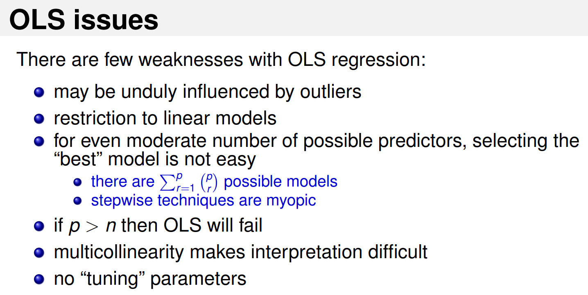

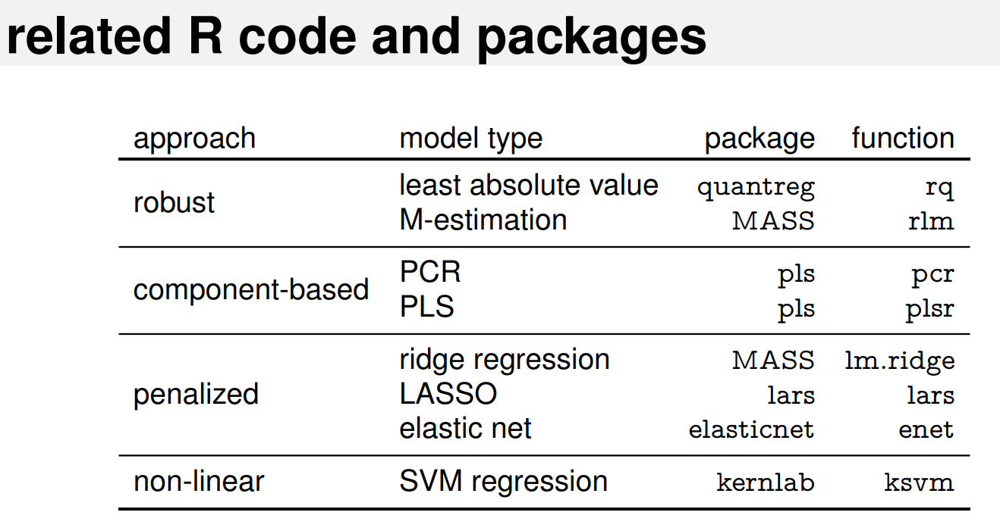

## `Robust Regression`

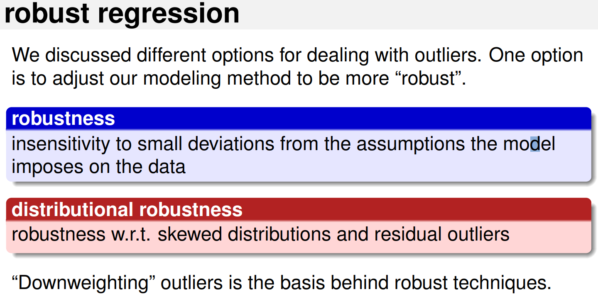

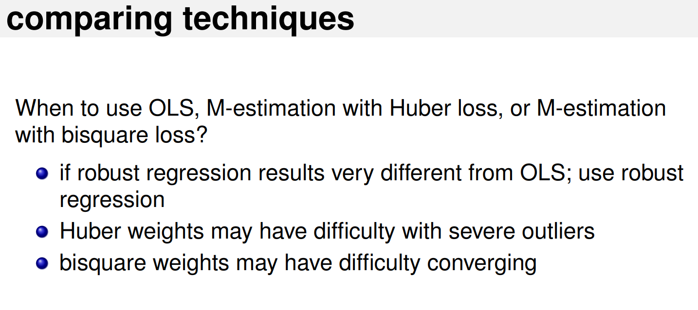

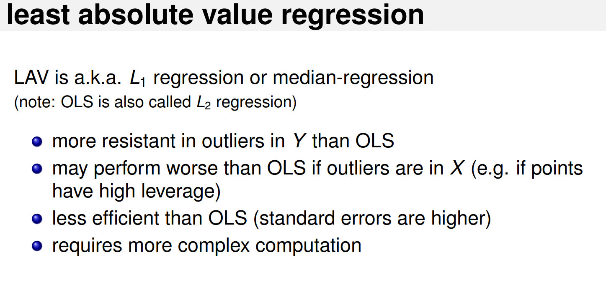

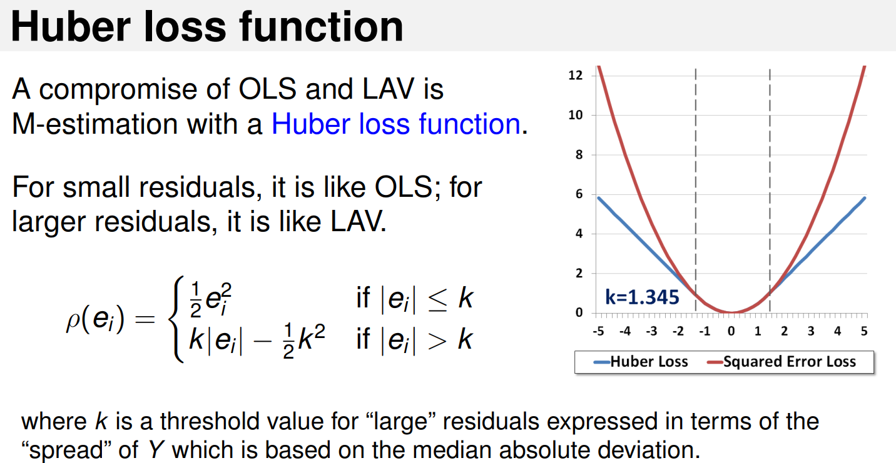

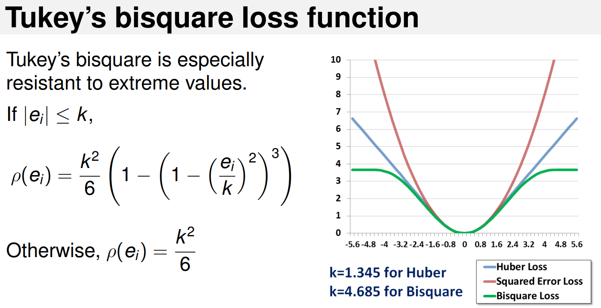

## `PCR`

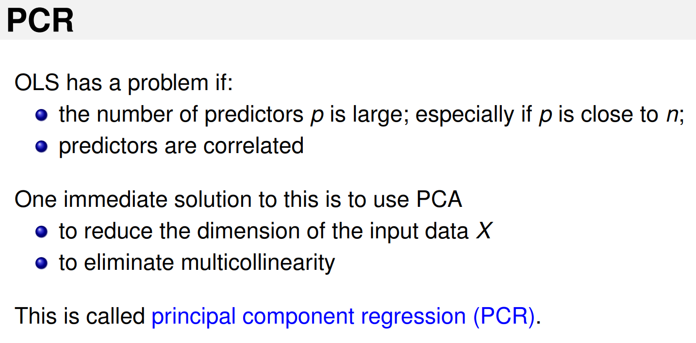

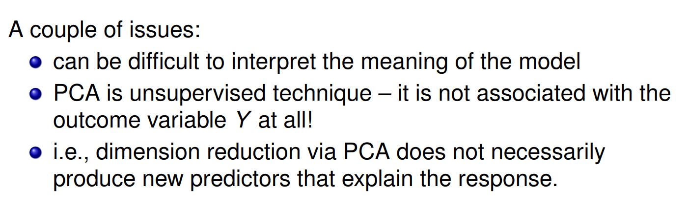

## `PLS`

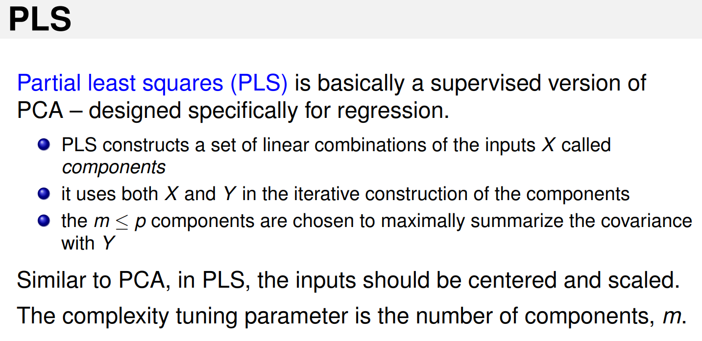

## Penalty Approaches

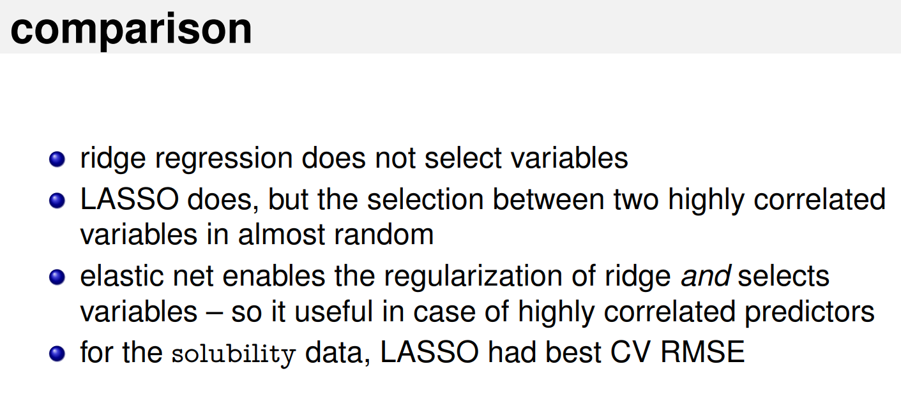

### Ridge Regression

> Penalization approach for overcoming overfitting

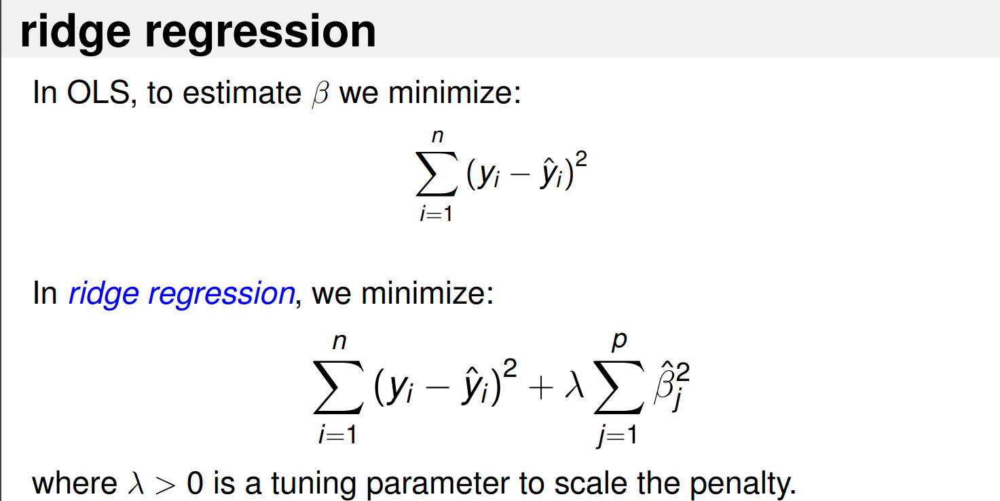

### LASSO

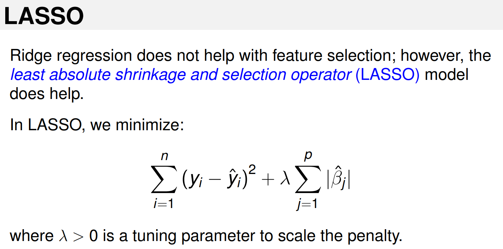

### Elastic Net Regression

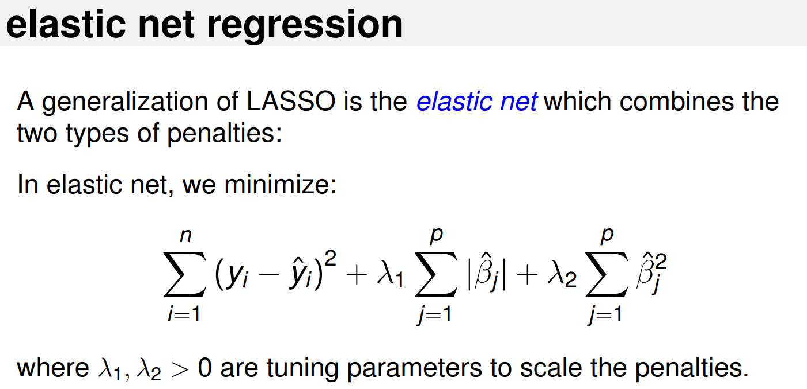

## `SVM`

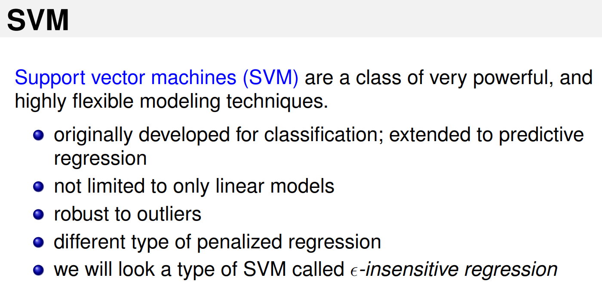

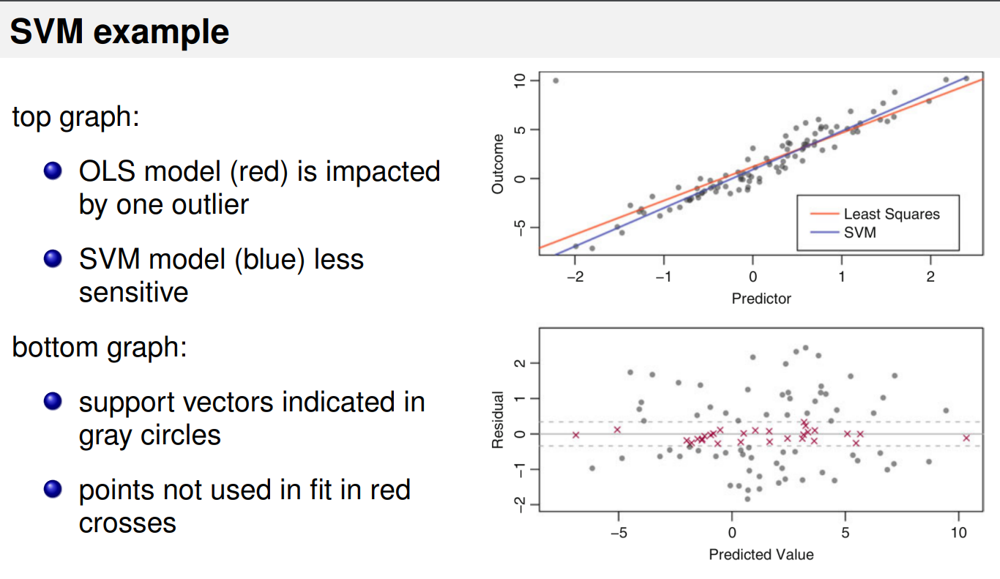

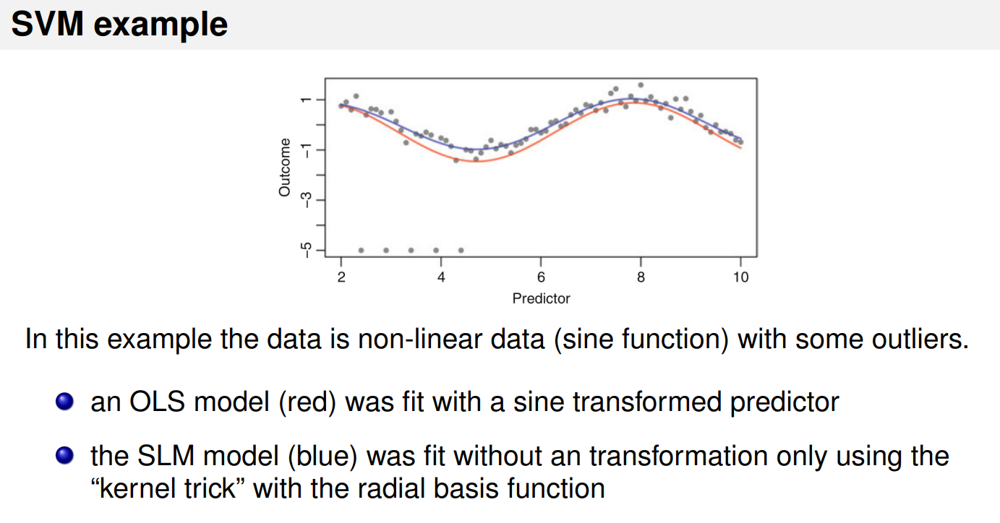
