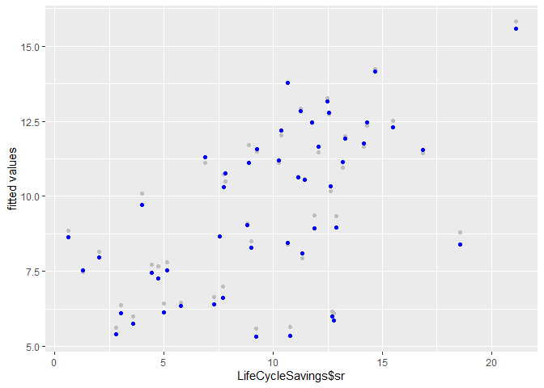
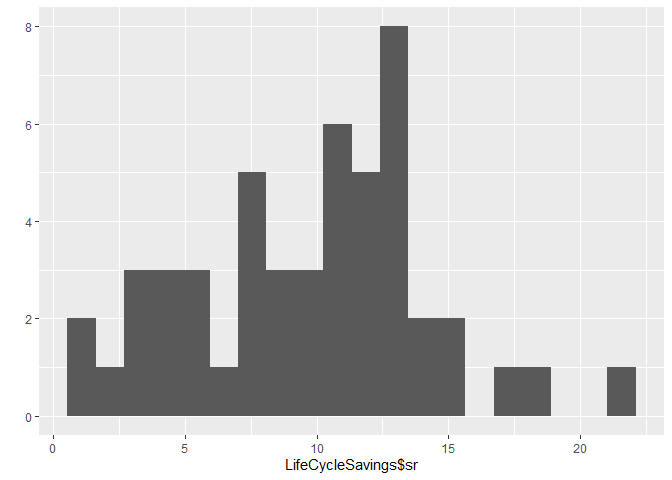
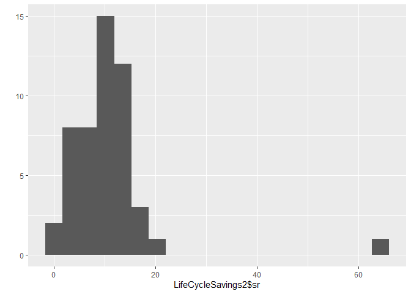
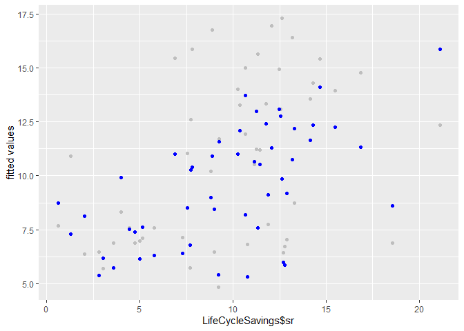
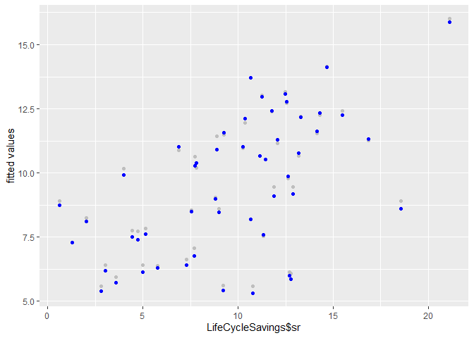

Robust Regression
================
Daniel Carpenter

``` r
#robust regression
library(ggplot2)  #for pretty plots

#we will use the LifeCycleSavings data from the package "datasets"
library(MASS) # stepAIC funciton
data(LifeCycleSavings)

head(LifeCycleSavings)
```

                 sr pop15 pop75     dpi ddpi
    Australia 11.43 29.35  2.87 2329.68 2.87
    Austria   12.07 23.32  4.41 1507.99 3.93
    Belgium   13.17 23.80  4.43 2108.47 3.82
    Bolivia    5.75 41.89  1.67  189.13 0.22
    Brazil    12.88 42.19  0.83  728.47 4.56
    Canada     8.79 31.72  2.85 2982.88 2.43

``` r
olsFit<-lm(data=LifeCycleSavings,sr ~ pop15 + pop75 + dpi + ddpi)
summary(olsFit)
```


    Call:
    lm(formula = sr ~ pop15 + pop75 + dpi + ddpi, data = LifeCycleSavings)

    Residuals:
        Min      1Q  Median      3Q     Max 
    -8.2422 -2.6857 -0.2488  2.4280  9.7509 

    Coefficients:
                  Estimate Std. Error t value Pr(>|t|)    
    (Intercept) 28.5660865  7.3545161   3.884 0.000334 ***
    pop15       -0.4611931  0.1446422  -3.189 0.002603 ** 
    pop75       -1.6914977  1.0835989  -1.561 0.125530    
    dpi         -0.0003369  0.0009311  -0.362 0.719173    
    ddpi         0.4096949  0.1961971   2.088 0.042471 *  
    ---
    Signif. codes:  0 '***' 0.001 '**' 0.01 '*' 0.05 '.' 0.1 ' ' 1

    Residual standard error: 3.803 on 45 degrees of freedom
    Multiple R-squared:  0.3385,    Adjusted R-squared:  0.2797 
    F-statistic: 5.756 on 4 and 45 DF,  p-value: 0.0007904

``` r
#Coefficients:
#(Intercept)     pop15      pop75      dpi      ddpi 
#28.5661        -0.4612    -1.6915   -0.0003   0.4097


#now with robust regression
library(MASS)  #for M-estimation method of robust regression: rlm

?rlm
```

    starting httpd help server ... done

``` r
#-----first, huber loss function-------
huberFit <- rlm(data=LifeCycleSavings,sr ~ pop15 + pop75 + dpi + ddpi)
summary(huberFit)
```


    Call: rlm(formula = sr ~ pop15 + pop75 + dpi + ddpi, data = LifeCycleSavings)
    Residuals:
        Min      1Q  Median      3Q     Max 
    -8.1046 -2.4371 -0.2859  2.3428 10.0370 

    Coefficients:
                Value   Std. Error t value
    (Intercept) 28.9447  7.6019     3.8075
    pop15       -0.4735  0.1495    -3.1669
    pop75       -1.6554  1.1201    -1.4779
    dpi         -0.0004  0.0010    -0.3665
    ddpi         0.3850  0.2028     1.8987

    Residual standard error: 3.523 on 45 degrees of freedom

``` r
str(huberFit)
```

    List of 21
     $ coefficients : Named num [1:5] 28.944715 -0.473481 -1.655373 -0.000353 0.385042
      ..- attr(*, "names")= chr [1:5] "(Intercept)" "pop15" "pop75" "dpi" ...
     $ residuals    : Named num [1:50] 0.85 0.486 2.1 -0.614 3.787 ...
      ..- attr(*, "names")= chr [1:50] "Australia" "Austria" "Belgium" "Bolivia" ...
     $ wresid       : Named num [1:50] 0.85 0.486 2.1 -0.614 3.787 ...
      ..- attr(*, "names")= chr [1:50] "Australia" "Austria" "Belgium" "Bolivia" ...
     $ effects      : Named num [1:50] -66.58 -14.88 6.85 -3.46 -7.35 ...
      ..- attr(*, "names")= chr [1:50] "(Intercept)" "pop15" "pop75" "dpi" ...
     $ rank         : int 5
     $ fitted.values: Named num [1:50] 10.58 11.58 11.07 6.36 9.09 ...
      ..- attr(*, "names")= chr [1:50] "Australia" "Austria" "Belgium" "Bolivia" ...
     $ assign       : int [1:5] 0 1 2 3 4
     $ qr           :List of 5
      ..$ qr   : num [1:50, 1:5] -6.89 0.145 0.145 0.145 0.145 ...
      .. ..- attr(*, "assign")= int [1:5] 0 1 2 3 4
      .. ..- attr(*, "dimnames")=List of 2
      .. .. ..$ : chr [1:50] "Australia" "Austria" "Belgium" "Bolivia" ...
      .. .. ..$ : chr [1:5] "(Intercept)" "pop15" "pop75" "dpi" ...
      ..$ qraux: num [1:5] 1.15 1.17 1.17 1.16 1.05
      ..$ pivot: int [1:5] 1 2 3 4 5
      ..$ tol  : num 1e-07
      ..$ rank : int 5
      ..- attr(*, "class")= chr "qr"
     $ df.residual  : logi NA
     $ w            : num [1:50] 1 1 1 1 1 ...
     $ s            : num 3.52
     $ psi          :function (u, k = 1.345, deriv = 0)  
     $ k2           : num 1.34
     $ weights      : num [1:50] 1 1 1 1 1 1 1 1 1 1 ...
     $ conv         : num [1:6] 0.037057 0.00915 0.002827 0.00064 0.000161 ...
     $ converged    : logi TRUE
     $ x            : num [1:50, 1:5] 1 1 1 1 1 1 1 1 1 1 ...
      ..- attr(*, "dimnames")=List of 2
      .. ..$ : chr [1:50] "Australia" "Austria" "Belgium" "Bolivia" ...
      .. ..$ : chr [1:5] "(Intercept)" "pop15" "pop75" "dpi" ...
      ..- attr(*, "assign")= int [1:5] 0 1 2 3 4
     $ call         : language rlm(formula = sr ~ pop15 + pop75 + dpi + ddpi, data = LifeCycleSavings)
     $ terms        :Classes 'terms', 'formula'  language sr ~ pop15 + pop75 + dpi + ddpi
      .. ..- attr(*, "variables")= language list(sr, pop15, pop75, dpi, ddpi)
      .. ..- attr(*, "factors")= int [1:5, 1:4] 0 1 0 0 0 0 0 1 0 0 ...
      .. .. ..- attr(*, "dimnames")=List of 2
      .. .. .. ..$ : chr [1:5] "sr" "pop15" "pop75" "dpi" ...
      .. .. .. ..$ : chr [1:4] "pop15" "pop75" "dpi" "ddpi"
      .. ..- attr(*, "term.labels")= chr [1:4] "pop15" "pop75" "dpi" "ddpi"
      .. ..- attr(*, "order")= int [1:4] 1 1 1 1
      .. ..- attr(*, "intercept")= int 1
      .. ..- attr(*, "response")= int 1
      .. ..- attr(*, ".Environment")=<environment: R_GlobalEnv> 
      .. ..- attr(*, "predvars")= language list(sr, pop15, pop75, dpi, ddpi)
      .. ..- attr(*, "dataClasses")= Named chr [1:5] "numeric" "numeric" "numeric" "numeric" ...
      .. .. ..- attr(*, "names")= chr [1:5] "sr" "pop15" "pop75" "dpi" ...
     $ xlevels      : Named list()
     $ model        :'data.frame':  50 obs. of  5 variables:
      ..$ sr   : num [1:50] 11.43 12.07 13.17 5.75 12.88 ...
      ..$ pop15: num [1:50] 29.4 23.3 23.8 41.9 42.2 ...
      ..$ pop75: num [1:50] 2.87 4.41 4.43 1.67 0.83 2.85 1.34 0.67 1.06 1.14 ...
      ..$ dpi  : num [1:50] 2330 1508 2108 189 728 ...
      ..$ ddpi : num [1:50] 2.87 3.93 3.82 0.22 4.56 2.43 2.67 6.51 3.08 2.8 ...
      ..- attr(*, "terms")=Classes 'terms', 'formula'  language sr ~ pop15 + pop75 + dpi + ddpi
      .. .. ..- attr(*, "variables")= language list(sr, pop15, pop75, dpi, ddpi)
      .. .. ..- attr(*, "factors")= int [1:5, 1:4] 0 1 0 0 0 0 0 1 0 0 ...
      .. .. .. ..- attr(*, "dimnames")=List of 2
      .. .. .. .. ..$ : chr [1:5] "sr" "pop15" "pop75" "dpi" ...
      .. .. .. .. ..$ : chr [1:4] "pop15" "pop75" "dpi" "ddpi"
      .. .. ..- attr(*, "term.labels")= chr [1:4] "pop15" "pop75" "dpi" "ddpi"
      .. .. ..- attr(*, "order")= int [1:4] 1 1 1 1
      .. .. ..- attr(*, "intercept")= int 1
      .. .. ..- attr(*, "response")= int 1
      .. .. ..- attr(*, ".Environment")=<environment: R_GlobalEnv> 
      .. .. ..- attr(*, "predvars")= language list(sr, pop15, pop75, dpi, ddpi)
      .. .. ..- attr(*, "dataClasses")= Named chr [1:5] "numeric" "numeric" "numeric" "numeric" ...
      .. .. .. ..- attr(*, "names")= chr [1:5] "sr" "pop15" "pop75" "dpi" ...
     - attr(*, "class")= chr [1:2] "rlm" "lm"

``` r
#let's look at a few the top residuals and their weights
hweights <- data.frame(country = row.names(LifeCycleSavings), 
                      resid = huberFit$resid, weight = huberFit$w)
hweights <- hweights[order(huberFit$w), ]
hweights[1:15, ]
```

                    country      resid    weight
    Zambia           Zambia 10.0369962 0.4720435
    Chile             Chile -8.1046206 0.5845641
    Philippines Philippines  6.8760794 0.6890366
    Peru               Peru  6.6804346 0.7092155
    Iceland         Iceland -6.2246177 0.7611364
    Paraguay       Paraguay -6.0074106 0.7886304
    Korea             Korea -5.8590585 0.8085906
    Japan             Japan  5.3880637 0.8793584
    Costa Rica   Costa Rica  5.3671601 0.8827554
    Denmark         Denmark  5.3176045 0.8909622
    Australia     Australia  0.8495650 1.0000000
    Austria         Austria  0.4857660 1.0000000
    Belgium         Belgium  2.1003083 1.0000000
    Bolivia         Bolivia -0.6141096 1.0000000
    Brazil           Brazil  3.7865809 1.0000000

``` r
#notice that Zambia and Chile top our list!

#even though there is a lot of down-weighting occuring, the 
#coefficient estimates are still pretty close

#(Intercept)   pop15     pop75       dpi      ddpi 
#28.9447     -0.4735   -1.6554   -0.0004    0.3850 


#----now for bi-square-----
bisquareFit <- rlm(data=LifeCycleSavings,sr ~ pop15 + pop75 + dpi + ddpi, psi=psi.bisquare)

#and the corresponding residuals and weights are different
bweights <- data.frame(country = row.names(LifeCycleSavings), resid = bisquareFit$resid, weight = bisquareFit$w)
bweights <- bweights[order(bisquareFit$w), ]
bweights[1:15, ]
```

                    country     resid    weight
    Zambia           Zambia 10.157918 0.3756091
    Chile             Chile -8.033848 0.5742887
    Philippines Philippines  6.921204 0.6728487
    Peru               Peru  6.714336 0.6903217
    Iceland         Iceland -6.250077 0.7283439
    Paraguay       Paraguay -5.946231 0.7522537
    Korea             Korea -5.744204 0.7677008
    Japan             Japan  5.528258 0.7838252
    Costa Rica   Costa Rica  5.421359 0.7916193
    Denmark         Denmark  5.303753 0.8000454
    Sweden           Sweden -4.452036 0.8568005
    Brazil           Brazil  3.907067 0.8887430
    Venezuela     Venezuela  3.881463 0.8901514
    Ireland         Ireland  3.234646 0.9230192
    Malta             Malta  3.177020 0.9256964

``` r
summary(bisquareFit)
```


    Call: rlm(formula = sr ~ pop15 + pop75 + dpi + ddpi, data = LifeCycleSavings, 
        psi = psi.bisquare)
    Residuals:
        Min      1Q  Median      3Q     Max 
    -8.0338 -2.3816 -0.2519  2.2855 10.1579 

    Coefficients:
                Value   Std. Error t value
    (Intercept) 28.6711  7.5583     3.7933
    pop15       -0.4699  0.1487    -3.1611
    pop75       -1.5790  1.1136    -1.4179
    dpi         -0.0004  0.0010    -0.3947
    ddpi         0.3756  0.2016     1.8626

    Residual standard error: 3.485 on 45 degrees of freedom

``` r
#the coefficients are affected, but it's not too large of a departure from the OLS results

#(Intercept)   pop15     pop75        dpi      ddpi 
#28.6711     -0.4699   -1.5790    -0.0004    0.3756 

#and we can see that that the OLS predictions (gray) and bisquare predictions (blue)
#both line up pretty closely on a predictions vs. true value plot
qplot(LifeCycleSavings$sr, 
      olsFit$fitted.values)+geom_point(color="gray")+
      geom_point(aes(y=bisquareFit$fitted.values),color="blue")+ylab("fitted values")
```



``` r
#--------------------
#artificially make one outcome value a big outlier and then re-run
LifeCycleSavings[order(LifeCycleSavings$pop75),]
```

                      sr pop15 pop75     dpi  ddpi
    Zambia         18.56 45.25  0.56  138.33  5.14
    Honduras        7.70 47.32  0.58  232.44  3.19
    Malaysia        4.71 47.20  0.66  242.69  5.08
    China          11.90 44.75  0.67  289.52  6.51
    Brazil         12.88 42.19  0.83  728.47  4.56
    Guatamala       3.01 46.05  0.87  289.71  1.48
    Venezuela       9.22 46.40  0.90  813.39  0.53
    Korea           3.98 41.74  0.91  207.68  5.81
    India           9.00 41.31  0.96   88.94  1.54
    Paraguay        2.02 41.18  1.05  220.56  1.03
    Colombia        4.98 46.64  1.06  276.65  3.08
    Turkey          5.13 43.42  1.08  389.66  2.96
    Philippines    12.78 46.26  1.12  152.01  2.00
    Costa Rica     10.78 47.64  1.14  471.24  2.80
    Ecuador         3.59 46.31  1.19  287.77  2.19
    Panama          4.44 43.56  1.20  568.56  3.61
    Nicaragua       7.30 45.04  1.21  325.54  2.48
    Tunisia         2.81 46.12  1.21  249.87  1.13
    Peru           12.70 44.19  1.28  400.06  0.67
    Chile           0.60 39.74  1.34  662.86  2.67
    South Rhodesia 13.30 31.92  1.52  250.96  2.00
    Bolivia         5.75 41.89  1.67  189.13  0.22
    Jamaica         7.72 41.12  1.73  380.47 10.23
    Japan          21.10 27.01  1.91 1257.28  8.21
    Libya           8.89 43.69  2.07  123.58 16.71
    South Africa   11.14 31.94  2.28  651.11  2.19
    Finland        11.24 27.84  2.37 1681.25  4.32
    Malta          15.48 32.54  2.47  601.05  8.12
    Uruguay         9.24 28.13  2.72  766.54  1.88
    Canada          8.79 31.72  2.85 2982.88  2.43
    Portugal       12.49 28.96  2.85  579.51  7.48
    Australia      11.43 29.35  2.87 2329.68  2.87
    Spain          11.77 27.74  2.87  768.79  4.35
    Iceland         1.27 34.03  3.08 1900.10  1.12
    Greece         10.67 25.62  3.10  870.85  6.28
    New Zealand    10.67 32.61  3.17 1487.52  1.76
    Netherlands    14.65 24.71  3.25 1740.70  7.66
    Germany        12.55 23.31  3.35 2457.12  3.44
    United States   7.56 29.81  3.43 4001.89  2.45
    Italy          14.28 24.52  3.48 1390.00  3.54
    Norway         10.25 25.95  3.67 2231.03  3.62
    Luxembourg     10.35 21.80  3.73 2449.39  1.57
    Switzerland    14.13 23.49  3.73 2630.96  2.70
    Denmark        16.85 24.42  3.93 2496.53  3.99
    Ireland        11.34 31.16  4.19 1139.95  2.99
    Austria        12.07 23.32  4.41 1507.99  3.93
    Belgium        13.17 23.80  4.43 2108.47  3.82
    United Kingdom  7.81 23.27  4.46 1813.93  2.01
    Sweden          6.86 21.44  4.54 3299.49  3.01
    France         12.64 25.06  4.70 2213.82  4.52

``` r
LifeCycleSavings2<-LifeCycleSavings
LifeCycleSavings2[14,1]<-65   #outlier introduced here for France


qplot(LifeCycleSavings$sr, bins=20)   #look at histogram of original data
```



``` r
qplot(LifeCycleSavings2$sr, bins=20)  #look at new histogram
```



``` r
olsFit2<-lm(data=LifeCycleSavings2,sr ~ pop15 + pop75 + dpi + ddpi)
huberFit2 <- rlm(data=LifeCycleSavings2,sr ~ pop15 + pop75 + dpi + ddpi)
bisquareFit2 <- rlm(data=LifeCycleSavings2,sr ~ pop15 + pop75 + dpi + ddpi, psi=psi.bisquare)

round(coef(olsFit),4)
```

    (Intercept)       pop15       pop75         dpi        ddpi 
        28.5661     -0.4612     -1.6915     -0.0003      0.4097 

``` r
round(coef(olsFit2),4)  #big differences! especially for pop15 and pop75
```

    (Intercept)       pop15       pop75         dpi        ddpi 
         6.1317     -0.0703      2.6692     -0.0008      0.4961 

``` r
round(coef(huberFit),4)
```

    (Intercept)       pop15       pop75         dpi        ddpi 
        28.9447     -0.4735     -1.6554     -0.0004      0.3850 

``` r
round(coef(huberFit2),4) #somewhat similar to previous results and original OLS
```

    (Intercept)       pop15       pop75         dpi        ddpi 
        27.1150     -0.4404     -1.3313     -0.0004      0.3894 

``` r
round(coef(bisquareFit),4)
```

    (Intercept)       pop15       pop75         dpi        ddpi 
        28.6711     -0.4699     -1.5790     -0.0004      0.3756 

``` r
round(coef(bisquareFit2),4) #similar to previous results and original OLS
```

    (Intercept)       pop15       pop75         dpi        ddpi 
        30.1947     -0.4957     -1.8867     -0.0003      0.3779 

``` r
#take a quick look at the weights for France in bisquare and see it is set to 0
bweights2 <- data.frame(country = row.names(LifeCycleSavings), resid = bisquareFit2$resid, weight = bisquareFit2$w)
bweights2 <- bweights2[order(bisquareFit2$w), ]
bweights2[1:5, ]
```

                    country     resid    weight
    France           France 55.144166 0.0000000
    Zambia           Zambia  9.956472 0.4479472
    Chile             Chile -8.150209 0.6059958
    Philippines Philippines  6.924893 0.7056657
    Peru               Peru  6.708196 0.7223238

``` r
#now the OLS predictions (gray) and bisquare predictions (blue)
#do not line up closely on a predictions vs. true value plot
qplot(LifeCycleSavings$sr, olsFit2$fitted.values)+geom_point(color="gray")+geom_point(aes(y=bisquareFit2$fitted.values),color="blue")+ylab("fitted values")
```



``` r
#the bisquare weigting eliminated France from the analysis
#you can see this if you delete France and then re-run the OLS model,
#the results line up very closely!

LifeCycleSavings3<-LifeCycleSavings[-14,]  #remove France
olsFit3<-lm(data=LifeCycleSavings3,sr ~ pop15 + pop75 + dpi + ddpi)
round(coef(olsFit3),4)  
```

    (Intercept)       pop15       pop75         dpi        ddpi 
        29.7940     -0.4826     -1.9302     -0.0003      0.4050 

``` r
round(coef(bisquareFit2),4) 
```

    (Intercept)       pop15       pop75         dpi        ddpi 
        30.1947     -0.4957     -1.8867     -0.0003      0.3779 

``` r
olsPrediction<-predict(olsFit3,newdata=LifeCycleSavings)
qplot(LifeCycleSavings$sr, olsPrediction)+geom_point(color="gray")+geom_point(aes(y=bisquareFit2$fitted.values),color="blue")+ylab("fitted values")
```


