SVR
================
Daniel Carpenter

``` r
#support vector regression
#Charles Nicholson
#Date: October 25, 2017
#Updated: October 28, 2019

#Please read the following comments -----

#1 -- there are several libraries for SVM; each one is a bit different (e.g., e10701 does allow formula interface, but kernlab does not)
#2 -- the CARET package is excellent wrapper for accessing and using these different libraries
#3 -- that said, it is often worth your time and effort to understand the base libraries used
#4 -- in this demo, I will start using one library directly (and it's own CV)
#5 -- but then, in the second half, I'll switch over to CARET
#6 -- I'll try to point out what CARET is doing
#7 -- One takeaway is this: use CARET if you are not sure how do things yourself, it will save you time!
#8 -- but, on the other hand, using the libraries directly allows you a little more control over the procedures


library(e1071)  #one of several libraries for Support Vector Machines 

# create some simplistic fake data
x <- seq(0.1, 5, by = 0.05)
y <- log(x) + rnorm(x, sd = 0.2)


#the steps below are as follows
#1 -- pick a kernel to use (linear, radial, polynomial, sigmoid)
#2a -- tune the SVM using the "tune.svm" method in e1071
#2b -- but to figure out what parameters to tune, you have to look at the documentation of svm
#3 -- look at the fit of the model on the training data visually
#4 -- do again for the next kernel and tuning parameters


# estimate model and predict input values
# first kernel to test: linear  
# linear kernel tuning parameters: cost (see documentation: ?svm)
# but you can also train on other things (e.g., epsilon)

tunedM <- tune.svm(x, y, kernel="linear", cost = seq(0.5,15,by=0.5), epsilon = 2^(seq(-5,-1)))
tunedM
```


    Parameter tuning of 'svm':

    - sampling method: 10-fold cross validation 

    - best parameters:
     cost epsilon
       13    0.25

    - best performance: 0.16569 

``` r
plot(tunedM) #not much change in the error...
```

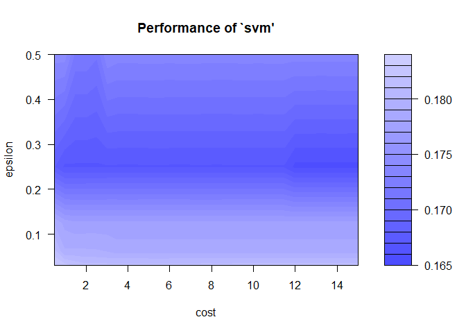

``` r
m   <- svm(x, y, kernel="linear", cost = 7.5, epsilon=0.125)
new <- predict(m, x)  #apply the model back to the training data
summary(m)
```


    Call:
    svm.default(x = x, y = y, kernel = "linear", cost = 7.5, epsilon = 0.125)


    Parameters:
       SVM-Type:  eps-regression 
     SVM-Kernel:  linear 
           cost:  7.5 
          gamma:  1 
        epsilon:  0.125 


    Number of Support Vectors:  76

``` r
# visualize
plot(x, y)                  #original data
points(x, log(x), col = 2)  #true model
points(x, new, col = 4)     #estimated model predictions -- linear, as expected!
```

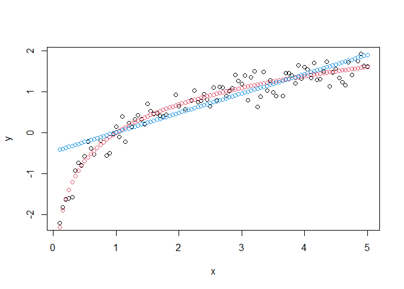

``` r
# estimate model and predict input values
# second kernel to test: polynomial 
# tuning parameters: cost, coef0, gamma, and degree (see documentation: ?svm)
# but you can also train on other things (e.g., epsilon) -- but this time we wont
tunedM <- tune.svm(x, y, kernel="polynomial", cost = seq(0.5,10,length=5), coef0= c(-1,0,1), gamma=seq(0.1,2, length=5), degree = c(1.5,2,2.5,3))
tunedM
```


    Parameter tuning of 'svm':

    - sampling method: 10-fold cross validation 

    - best parameters:
     degree gamma coef0 cost
          3     2     1  0.5

    - best performance: 0.05678845 

``` r
str(tunedM$performances)  #here is where the tuned performance data is at
```

    'data.frame':   300 obs. of  6 variables:
     $ degree    : num  1.5 2 2.5 3 1.5 2 2.5 3 1.5 2 ...
     $ gamma     : num  0.1 0.1 0.1 0.1 0.575 0.575 0.575 0.575 1.05 1.05 ...
     $ coef0     : num  -1 -1 -1 -1 -1 -1 -1 -1 -1 -1 ...
     $ cost      : num  0.5 0.5 0.5 0.5 0.5 0.5 0.5 0.5 0.5 0.5 ...
     $ error     : num  0.206 57.727 57.727 1.414 0.188 ...
     $ dispersion: num  0.179 18.397 18.397 0.96 0.15 ...

``` r
plot(tunedM$performances$gamma,tunedM$performances$error)
```

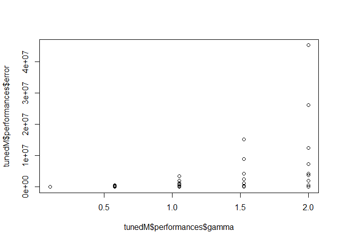

``` r
plot(tunedM$performances$coef0,tunedM$performances$error)
```

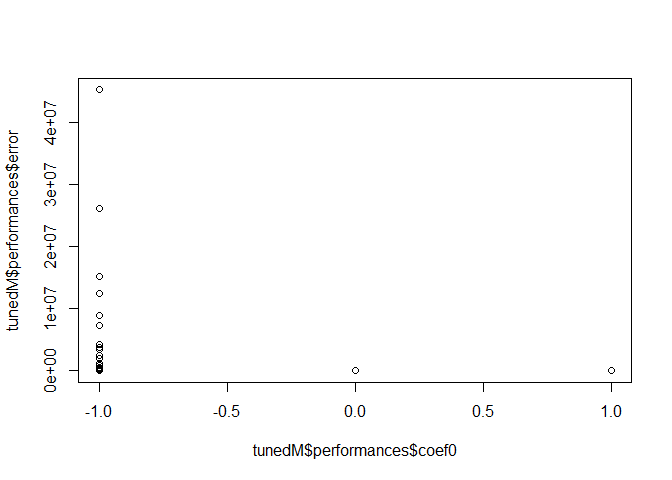

``` r
plot(tunedM$performances$cost,tunedM$performances$error)
```

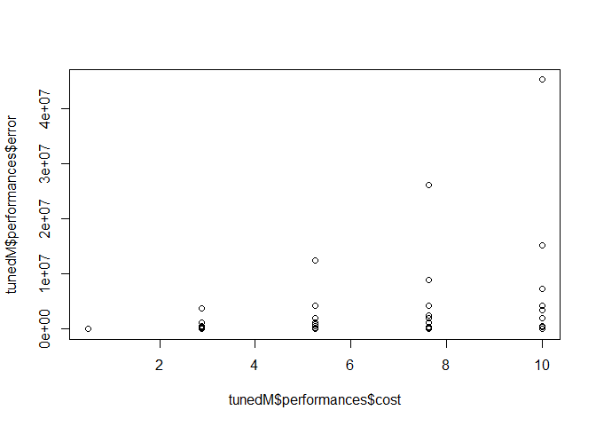

``` r
m   <- svm(x, y, kernel="polynomial", cost=0.5, coef0=1,gamma=0.575, degree=3)
new <- predict(m, x)

# visualize
plot(x, y)                  #original data
points(x, log(x), col = 2)  #true model
points(x, new, col = 4)     #estimated model predictions -- not too shabby!  
```

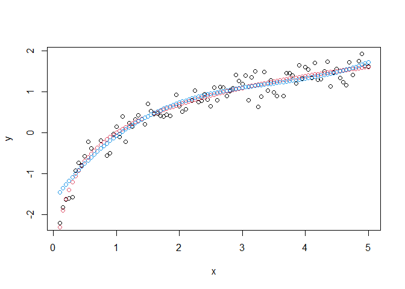

``` r
# estimate model and predict input values
# third kernel to test: radial basis 
# tuning parameters: cost, gamma (see documentation: ?svm)
# but you can also train on other things (e.g., epsilon) -- but this time we wont


#this time I am going to try to focus in on better parameter values to test
tunedM <- tune.svm(x, y, kernel="radial", cost = seq(0.1,12,length=10), gamma=seq(0.1, 15, length=10))
plot(tunedM)
```

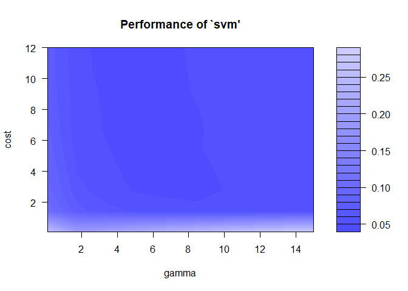

``` r
tunedM <- tune.svm(x, y, kernel="radial", cost = seq(4,14,length=10), gamma=seq(2, 8, length=10))
plot(tunedM)
```

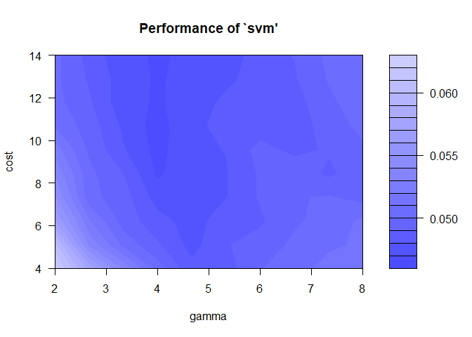

``` r
tunedM <- tune.svm(x, y, kernel="radial", cost = seq(12,15,length=20), gamma=seq(3, 5, length=20))
plot(tunedM)
```

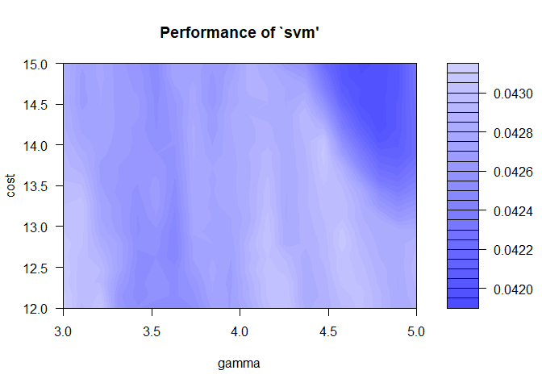

``` r
tunedM <- tune.svm(x, y, kernel="radial", cost = seq(13.5,15,length=20), gamma=seq(3, 3.25, length=20))
plot(tunedM)  #notice now that there is very little difference in error values
```

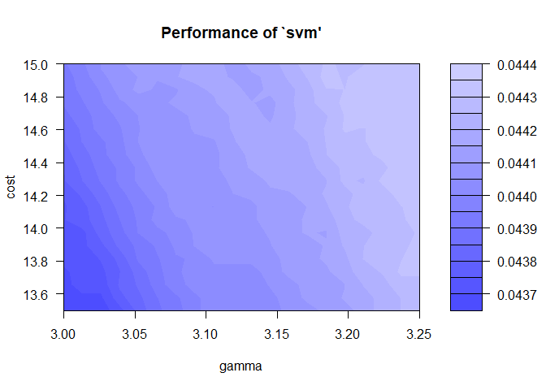

``` r
tunedM
```


    Parameter tuning of 'svm':

    - sampling method: 10-fold cross validation 

    - best parameters:
     gamma cost
         3 13.5

    - best performance: 0.04365471 

``` r
m   <- svm(x, y, kernel="radial", gamma=3.026316, cost=15)
new <- predict(m, x)

# visualize
plot(x, y)                  #original data
points(x, log(x), col = 2)  #true model
points(x, new, col = 4)     #estimated model predictions -- great!  


# estimate model and predict input values
m   <- svm(x, y, kernel="sigmoid")  #i'll let you try to tune this one on your own!


#OKAY -- now I'll use the caret package to train (and tune and CV) SVM models
# I will also switch to formula interface since caret always allows formula interface

library(caret)
```

    Loading required package: ggplot2

    Loading required package: lattice

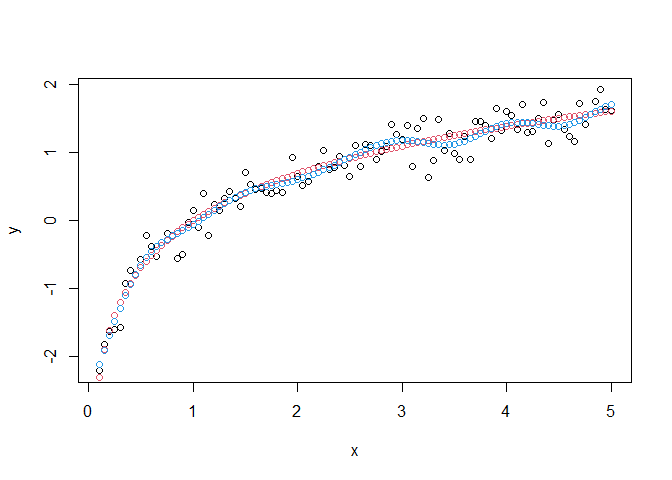

``` r
library(mlbench)  #for some house pricing data
data("BostonHousing2")
?BostonHousing2
```

    starting httpd help server ...

     done

``` r
BH2<-BostonHousing2  #just so I don't have to write out BostonHousing2 everytime!

#first a simple OLS fit --
# for ease of demonstration, I am removing the categorical data

olsFit<-lm(cmedv~.-medv-town-tract-lon-lat-chas,data=BH2)  #OLS including the interaction term
summary(olsFit)
```


    Call:
    lm(formula = cmedv ~ . - medv - town - tract - lon - lat - chas, 
        data = BH2)

    Residuals:
         Min       1Q   Median       3Q      Max 
    -13.3633  -2.7932  -0.6455   1.9380  26.3434 

    Coefficients:
                  Estimate Std. Error t value Pr(>|t|)    
    (Intercept)  36.805167   5.101441   7.215 2.05e-12 ***
    crim         -0.111338   0.032823  -3.392 0.000749 ***
    zn            0.048357   0.013726   3.523 0.000466 ***
    indus         0.043042   0.061167   0.704 0.481965    
    nox         -17.342269   3.817494  -4.543 6.99e-06 ***
    rm            3.830097   0.417711   9.169  < 2e-16 ***
    age           0.002670   0.013192   0.202 0.839676    
    dis          -1.511620   0.199425  -7.580 1.73e-13 ***
    rad           0.326064   0.065960   4.943 1.05e-06 ***
    tax          -0.014129   0.003733  -3.785 0.000173 ***
    ptratio      -0.962194   0.130248  -7.387 6.44e-13 ***
    b             0.009659   0.002682   3.601 0.000349 ***
    lstat        -0.540079   0.050624 -10.668  < 2e-16 ***
    ---
    Signif. codes:  0 '***' 0.001 '**' 0.01 '*' 0.05 '.' 0.1 ' ' 1

    Residual standard error: 4.745 on 493 degrees of freedom
    Multiple R-squared:  0.7393,    Adjusted R-squared:  0.7329 
    F-statistic: 116.5 on 12 and 493 DF,  p-value: < 2.2e-16

``` r
hist(olsFit$residuals)
```

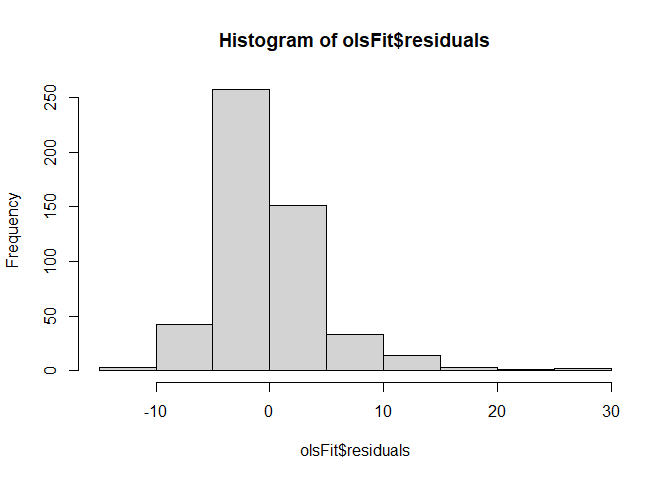

``` r
#while OLS does not have any hyperparameters, we can still get resampled estimates of performance

ctrl <- trainControl(method="repeatedcv", number=5,   # 5 fold cross validation
                     repeats=5) 

ols.eval <- train(data=BH2, cmedv~.-medv-town-tract-lon-lat-chas,
                  method = "lm",   #lm
                  preProc = c("center","scale"),  # Center and scale data (note: this is done automatically in SVM methods)
                  trControl=ctrl)

ols.eval  #the CV estimates of performance
```

    Linear Regression 

    506 samples
     18 predictor

    Pre-processing: centered (12), scaled (12) 
    Resampling: Cross-Validated (5 fold, repeated 5 times) 
    Summary of sample sizes: 403, 405, 406, 405, 405, 405, ... 
    Resampling results:

      RMSE      Rsquared   MAE     
      4.845858  0.7228697  3.379857

    Tuning parameter 'intercept' was held constant at a value of TRUE

``` r
summary(ols.eval$finalModel)
```


    Call:
    lm(formula = .outcome ~ ., data = dat)

    Residuals:
         Min       1Q   Median       3Q      Max 
    -13.3633  -2.7932  -0.6455   1.9380  26.3434 

    Coefficients:
                Estimate Std. Error t value Pr(>|t|)    
    (Intercept) 22.52885    0.21095 106.798  < 2e-16 ***
    crim        -0.95768    0.28233  -3.392 0.000749 ***
    zn           1.12780    0.32011   3.523 0.000466 ***
    indus        0.29528    0.41963   0.704 0.481965    
    nox         -2.00958    0.44236  -4.543 6.99e-06 ***
    rm           2.69109    0.29349   9.169  < 2e-16 ***
    age          0.07517    0.37135   0.202 0.839676    
    dis         -3.18303    0.41993  -7.580 1.73e-13 ***
    rad          2.83912    0.57433   4.943 1.05e-06 ***
    tax         -2.38118    0.62910  -3.785 0.000173 ***
    ptratio     -2.08310    0.28198  -7.387 6.44e-13 ***
    b            0.88182    0.24489   3.601 0.000349 ***
    lstat       -3.85673    0.36151 -10.668  < 2e-16 ***
    ---
    Signif. codes:  0 '***' 0.001 '**' 0.01 '*' 0.05 '.' 0.1 ' ' 1

    Residual standard error: 4.745 on 493 degrees of freedom
    Multiple R-squared:  0.7393,    Adjusted R-squared:  0.7329 
    F-statistic: 116.5 on 12 and 493 DF,  p-value: < 2.2e-16

``` r
#look at plot of predicted vs. actual   -- not bad, but we can do better
qplot(BH2$cmedv,ols.eval$finalModel$fitted.values)+
      geom_abline(intercept=0,slope=1)
```

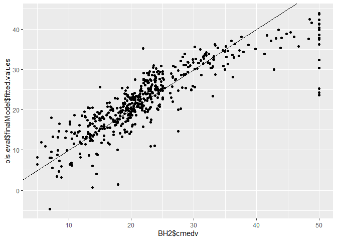

``` r
#go to the caret website and look at documentation
#the method use choose will imply a library
#method = "svmRadial" will load the kernlab library and use it
#whereas method = "svmLinear2" will load the e1071 library


#since SVM is more computationally expensive, I am going to 
#change my cross-validation to 5-fold (instead of 5-fold with 5 repeats)
#just so this doesn't take too long...

ctrl <- trainControl(method="repeatedcv", number=5)  # 5 fold cross validation
                  

#Train and tune the SVM - first broad tuning on cost only
svm.tune <- train(data=BH2, 
                  cmedv~.-medv-town-tract-lon-lat-chas,
                  method = "svmRadial",   # Radial kernel
                  tuneLength = 9,                   # 9 values of the cost function
                  preProc = c("center","scale"),  # Center and scale data
                  trControl=ctrl)

svm.tune
```

    Support Vector Machines with Radial Basis Function Kernel 

    506 samples
     18 predictor

    Pre-processing: centered (12), scaled (12) 
    Resampling: Cross-Validated (5 fold, repeated 1 times) 
    Summary of sample sizes: 404, 404, 405, 406, 405 
    Resampling results across tuning parameters:

      C      RMSE      Rsquared   MAE     
       0.25  4.712889  0.7792087  2.744043
       0.50  4.050023  0.8265621  2.422470
       1.00  3.565796  0.8582323  2.168983
       2.00  3.238813  0.8795387  2.050584
       4.00  3.027659  0.8930160  2.018299
       8.00  2.936448  0.8988933  1.973180
      16.00  2.966322  0.8973756  1.999027
      32.00  3.058848  0.8921317  2.087826
      64.00  3.268781  0.8784260  2.182260

    Tuning parameter 'sigma' was held constant at a value of 0.1576228
    RMSE was used to select the optimal model using the smallest value.
    The final values used for the model were sigma = 0.1576228 and C = 8.

``` r
### here are the results -- they will be a little different each time it is run...

#Resampling results across tuning parameters:
  
#   C      RMSE      Rsquared   MAE     
# 0.25  4.546144  0.7845407  2.724332
# 0.50  3.917098  0.8300925  2.407811
# 1.00  3.551744  0.8537731  2.205566
# 2.00  3.445098  0.8606667  2.158521
# 4.00  3.305801  0.8732653  2.144413
# 8.00  3.074737  0.8912926  2.068876
# 16.00  2.955133  0.8988610  2.026812
# 32.00  3.020573  0.8916185  2.070000
# 64.00  3.278652  0.8751030  2.228849

#Tuning parameter 'sigma' was held constant at a value of 0.1384756

## from this, we see that for sigm close to 0.14, 
## and C somewhere between 8 and 32, 
## we get pretty good results...  

#let's do some more refined tuning on both cost and sigma
grid <- expand.grid(sigma = seq(0.08,0.16,length=5),
                    C = seq(8,32,length=20))

svm.tune <- train(data=BH2, 
                  cmedv~.-medv-town-tract-lon-lat-chas,
                  method = "svmRadial", 
                  tuneGrid = grid,
                  trControl=ctrl)

svm.tune
```

    Support Vector Machines with Radial Basis Function Kernel 

    506 samples
     18 predictor

    No pre-processing
    Resampling: Cross-Validated (5 fold, repeated 1 times) 
    Summary of sample sizes: 404, 405, 405, 406, 404 
    Resampling results across tuning parameters:

      sigma  C          RMSE      Rsquared   MAE     
      0.08    8.000000  2.934016  0.8942925  1.999675
      0.08    9.263158  2.916210  0.8953951  2.000137
      0.08   10.526316  2.898916  0.8967102  2.000460
      0.08   11.789474  2.896962  0.8969629  1.999531
      0.08   13.052632  2.899761  0.8968869  1.999276
      0.08   14.315789  2.906369  0.8965841  2.000705
      0.08   15.578947  2.907559  0.8966427  2.002763
      0.08   16.842105  2.904384  0.8969616  2.003311
      0.08   18.105263  2.904244  0.8970961  2.005881
      0.08   19.368421  2.905882  0.8970591  2.008857
      0.08   20.631579  2.904594  0.8971916  2.011384
      0.08   21.894737  2.904761  0.8971867  2.015518
      0.08   23.157895  2.907843  0.8969678  2.019670
      0.08   24.421053  2.912417  0.8966698  2.024559
      0.08   25.684211  2.919464  0.8962072  2.031027
      0.08   26.947368  2.926222  0.8957289  2.037380
      0.08   28.210526  2.931445  0.8953224  2.040248
      0.08   29.473684  2.936741  0.8949017  2.043449
      0.08   30.736842  2.942556  0.8944749  2.047281
      0.08   32.000000  2.947063  0.8941306  2.049998
      0.10    8.000000  2.910493  0.8957600  2.001777
      0.10    9.263158  2.911160  0.8956942  2.003533
      0.10   10.526316  2.911333  0.8957794  2.006204
      0.10   11.789474  2.909515  0.8959651  2.008200
      0.10   13.052632  2.908411  0.8959539  2.006969
      0.10   14.315789  2.912740  0.8956321  2.012035
      0.10   15.578947  2.921223  0.8950075  2.018338
      0.10   16.842105  2.930001  0.8943788  2.024010
      0.10   18.105263  2.935844  0.8939973  2.028158
      0.10   19.368421  2.941503  0.8935873  2.032472
      0.10   20.631579  2.946883  0.8931708  2.037838
      0.10   21.894737  2.954593  0.8925729  2.045186
      0.10   23.157895  2.961728  0.8920570  2.051252
      0.10   24.421053  2.967705  0.8916042  2.056393
      0.10   25.684211  2.974051  0.8911476  2.062504
      0.10   26.947368  2.981957  0.8905718  2.068934
      0.10   28.210526  2.990826  0.8899271  2.074335
      0.10   29.473684  2.999057  0.8893254  2.080197
      0.10   30.736842  3.006077  0.8888646  2.085886
      0.10   32.000000  3.013758  0.8883692  2.092266
      0.12    8.000000  2.939755  0.8936279  2.022278
      0.12    9.263158  2.936774  0.8935263  2.019548
      0.12   10.526316  2.941072  0.8930286  2.023383
      0.12   11.789474  2.948276  0.8924250  2.026956
      0.12   13.052632  2.953116  0.8921395  2.032169
      0.12   14.315789  2.957536  0.8918952  2.037276
      0.12   15.578947  2.963446  0.8915434  2.045004
      0.12   16.842105  2.969131  0.8911187  2.051963
      0.12   18.105263  2.978486  0.8904284  2.058922
      0.12   19.368421  2.990195  0.8895829  2.068549
      0.12   20.631579  3.001143  0.8887772  2.079323
      0.12   21.894737  3.012826  0.8880123  2.089647
      0.12   23.157895  3.023432  0.8873184  2.098599
      0.12   24.421053  3.031259  0.8868261  2.106168
      0.12   25.684211  3.040244  0.8862174  2.114114
      0.12   26.947368  3.049511  0.8855947  2.121759
      0.12   28.210526  3.056499  0.8851278  2.127799
      0.12   29.473684  3.062287  0.8847394  2.133426
      0.12   30.736842  3.070218  0.8842152  2.139125
      0.12   32.000000  3.080208  0.8835447  2.145149
      0.14    8.000000  2.975052  0.8905313  2.041057
      0.14    9.263158  2.974372  0.8905871  2.041779
      0.14   10.526316  2.977064  0.8904387  2.045251
      0.14   11.789474  2.984979  0.8898908  2.051947
      0.14   13.052632  2.994624  0.8891378  2.060437
      0.14   14.315789  3.008271  0.8881023  2.072806
      0.14   15.578947  3.021296  0.8871361  2.087344
      0.14   16.842105  3.031838  0.8864618  2.098768
      0.14   18.105263  3.042610  0.8857168  2.108680
      0.14   19.368421  3.053233  0.8849622  2.118395
      0.14   20.631579  3.061177  0.8844250  2.125093
      0.14   21.894737  3.065833  0.8841427  2.129436
      0.14   23.157895  3.070046  0.8838875  2.132814
      0.14   24.421053  3.079751  0.8832153  2.138599
      0.14   25.684211  3.093967  0.8822515  2.147480
      0.14   26.947368  3.105019  0.8814571  2.155486
      0.14   28.210526  3.114888  0.8807227  2.164851
      0.14   29.473684  3.123941  0.8800603  2.173976
      0.14   30.736842  3.132095  0.8794300  2.182180
      0.14   32.000000  3.139676  0.8788341  2.189903
      0.16    8.000000  3.009363  0.8882075  2.054604
      0.16    9.263158  3.013187  0.8879548  2.060369
      0.16   10.526316  3.028086  0.8868678  2.073036
      0.16   11.789474  3.042682  0.8857543  2.087513
      0.16   13.052632  3.051265  0.8852007  2.096913
      0.16   14.315789  3.061977  0.8843631  2.106210
      0.16   15.578947  3.069711  0.8837894  2.114465
      0.16   16.842105  3.076985  0.8832373  2.124203
      0.16   18.105263  3.083178  0.8827825  2.134320
      0.16   19.368421  3.090988  0.8821942  2.143048
      0.16   20.631579  3.106942  0.8810439  2.155916
      0.16   21.894737  3.119461  0.8801061  2.167746
      0.16   23.157895  3.126909  0.8794504  2.178073
      0.16   24.421053  3.133551  0.8788082  2.187293
      0.16   25.684211  3.139767  0.8782247  2.194668
      0.16   26.947368  3.145376  0.8777390  2.201295
      0.16   28.210526  3.151161  0.8772795  2.208116
      0.16   29.473684  3.154611  0.8770710  2.213254
      0.16   30.736842  3.157167  0.8769806  2.217446
      0.16   32.000000  3.161139  0.8768108  2.221359

    RMSE was used to select the optimal model using the smallest value.
    The final values used for the model were sigma = 0.08 and C = 11.78947.

``` r
plot(svm.tune)
```

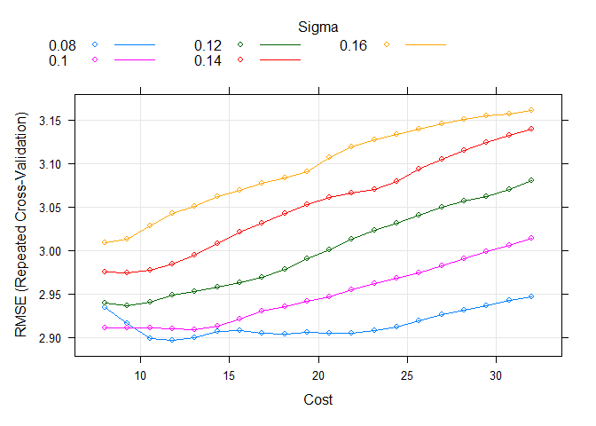

``` r
#from the graph, I see the sigma should probably be around 0.08
#and Cost should probably be between 20 and 32

grid <- expand.grid(sigma = seq(0.06,0.09,length=4),
                    C = seq(20,32,length=10))


#note this might take a while....   
svm.tune <- train(data=BH2, 
                  cmedv~.-medv-town-tract-lon-lat-chas,
                  method = "svmRadial", 
                  tuneGrid = grid,
                  trControl=ctrl)

svm.tune
```

    Support Vector Machines with Radial Basis Function Kernel 

    506 samples
     18 predictor

    No pre-processing
    Resampling: Cross-Validated (5 fold, repeated 1 times) 
    Summary of sample sizes: 404, 406, 404, 406, 404 
    Resampling results across tuning parameters:

      sigma  C         RMSE      Rsquared   MAE     
      0.06   20.00000  3.071639  0.8892114  2.097752
      0.06   21.33333  3.063042  0.8897219  2.095072
      0.06   22.66667  3.057118  0.8900556  2.093668
      0.06   24.00000  3.053013  0.8902141  2.093017
      0.06   25.33333  3.051702  0.8901641  2.093214
      0.06   26.66667  3.050920  0.8901133  2.093037
      0.06   28.00000  3.051019  0.8900427  2.093649
      0.06   29.33333  3.052547  0.8898637  2.096208
      0.06   30.66667  3.053383  0.8897364  2.096960
      0.06   32.00000  3.052427  0.8896843  2.097291
      0.07   20.00000  3.050927  0.8901507  2.095907
      0.07   21.33333  3.051632  0.8899492  2.097144
      0.07   22.66667  3.051987  0.8898358  2.097372
      0.07   24.00000  3.045341  0.8901575  2.095752
      0.07   25.33333  3.038004  0.8905368  2.092814
      0.07   26.66667  3.034582  0.8906396  2.090571
      0.07   28.00000  3.032513  0.8907423  2.089817
      0.07   29.33333  3.030685  0.8908322  2.090202
      0.07   30.66667  3.026791  0.8910721  2.090015
      0.07   32.00000  3.022065  0.8913710  2.088842
      0.08   20.00000  3.028180  0.8911708  2.088804
      0.08   21.33333  3.022186  0.8915343  2.086099
      0.08   22.66667  3.017035  0.8918782  2.083875
      0.08   24.00000  3.012520  0.8921974  2.082300
      0.08   25.33333  3.008147  0.8924681  2.081736
      0.08   26.66667  3.004581  0.8926799  2.081768
      0.08   28.00000  3.004242  0.8926790  2.083032
      0.08   29.33333  3.004568  0.8925992  2.085635
      0.08   30.66667  3.005870  0.8924335  2.088464
      0.08   32.00000  3.007214  0.8922477  2.090708
      0.09   20.00000  3.005972  0.8927660  2.077739
      0.09   21.33333  3.001865  0.8929993  2.076122
      0.09   22.66667  3.001150  0.8929506  2.078816
      0.09   24.00000  3.002137  0.8927532  2.082357
      0.09   25.33333  3.003545  0.8925067  2.085142
      0.09   26.66667  3.006639  0.8921705  2.088045
      0.09   28.00000  3.011248  0.8917372  2.092110
      0.09   29.33333  3.016134  0.8913257  2.095362
      0.09   30.66667  3.022367  0.8908420  2.099317
      0.09   32.00000  3.028731  0.8903536  2.104303

    RMSE was used to select the optimal model using the smallest value.
    The final values used for the model were sigma = 0.09 and C = 22.66667.

``` r
plot(svm.tune)
```

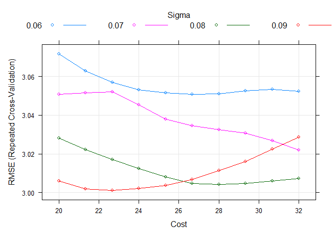

``` r
svm.tune$finalModel
```

    Support Vector Machine object of class "ksvm" 

    SV type: eps-svr  (regression) 
     parameter : epsilon = 0.1  cost C = 22.6666666666667 

    Gaussian Radial Basis kernel function. 
     Hyperparameter : sigma =  0.09 

    Number of Support Vectors : 337 

    Objective Function Value : -566.3581 
    Training error : 0.02653 

``` r
#now to plot predictions vs actuals

new<-predict(svm.tune, BH2)

#these predictions are great!
qplot(BH2$cmedv,new)+
  geom_abline(intercept=0,slope=1)  
```

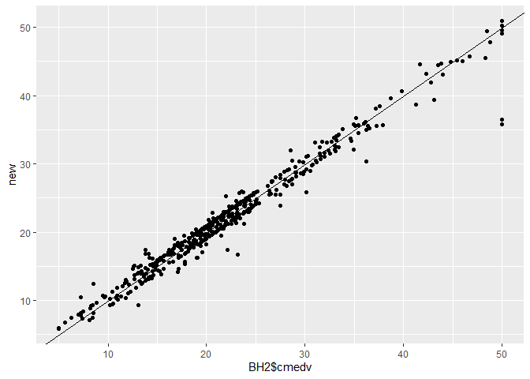
