Logistic Regression
================
Daniel Carpenter

-   <a href="#overview" id="toc-overview"><span
    class="toc-section-number">1</span> Overview</a>
-   <a href="#summary" id="toc-summary"><span
    class="toc-section-number">2</span> Summary</a>
-   <a href="#general-setup" id="toc-general-setup"><span
    class="toc-section-number">3</span> General Setup</a>
-   <a href="#evaluate-performance" id="toc-evaluate-performance"><span
    class="toc-section-number">4</span> Evaluate Performance</a>

## Overview

> Great for dichotomous outcomes (choose one of 2 decisions)

-   Compare and contrast Multiple Linear Regression and Logistic
    Regression

-   Build logistic regression models and interpret the results

-   Evaluate classification performance with confusion matrices, ROC
    curves, concordant pairs, K-S charts, and cumulative gains

-   Fit your logistic regression models with lasso or elastic net
    regularization

## Summary

-   Classifier based on dichotomous Outcomes (Success or Failure,
    binary)

-   Need a model that bounds between 0 and 1

-   To keep above 1: Odds:

    -   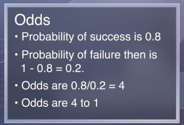

-   To keep above 0:

    -   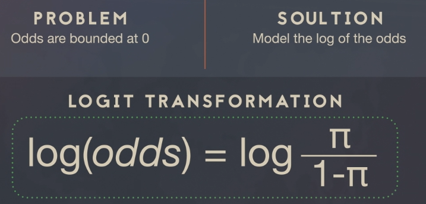

## General Setup

### Classification Rule

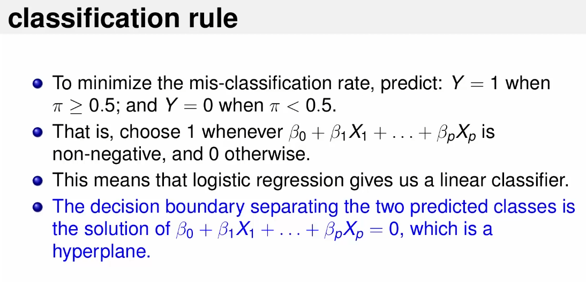

Example

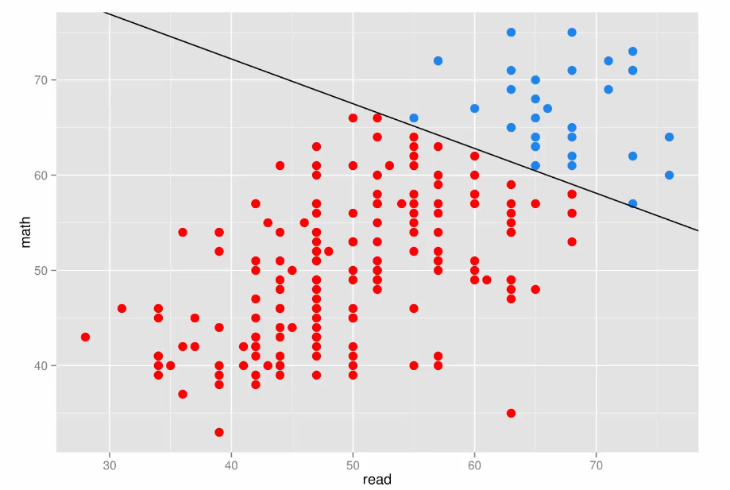

### Example in R

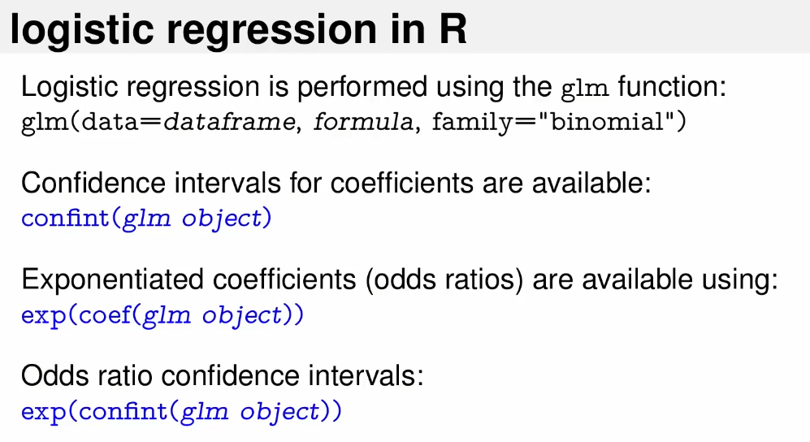

## Evaluate Performance

``` r
#ISE 5103 R script for introducing logistic regression diagnostics
#Author: Charles Nicholson
#October 2015


honors <- read.csv("C:/Users/daniel.carpenter/OneDrive - the Chickasaw Nation/Documents/GitHub/OU-DSA/IDA/02 - Notes/09 - Logistic Regression/honors.csv")  #you will need to import your data


#we will use a simple model for the example
fit <- glm(data=honors, hon ~ math + read + female , family="binomial")
summary(fit)
```


    Call:
    glm(formula = hon ~ math + read + female, family = "binomial", 
        data = honors)

    Deviance Residuals: 
        Min       1Q   Median       3Q      Max  
    -1.8305  -0.6327  -0.3300  -0.1258   2.3896  

    Coefficients:
                 Estimate Std. Error z value Pr(>|z|)    
    (Intercept) -11.77025    1.71068  -6.880 5.97e-12 ***
    math          0.12296    0.03128   3.931 8.44e-05 ***
    read          0.05906    0.02655   2.224   0.0261 *  
    female        0.97995    0.42163   2.324   0.0201 *  
    ---
    Signif. codes:  0 '***' 0.001 '**' 0.01 '*' 0.05 '.' 0.1 ' ' 1

    (Dispersion parameter for binomial family taken to be 1)

        Null deviance: 222.71  on 199  degrees of freedom
    Residual deviance: 156.17  on 196  degrees of freedom
    AIC: 164.17

    Number of Fisher Scoring iterations: 5

``` r
#Note: deviance is similar to the idea of sum of squares of residuals in OLS

# there are three "types" of deviance:  NULL, Residul, and Saturated

# NULL DEVIANCE: deviance if you have an empty model
# RESIUDAL DEVIANCE: deviance based on your actual model
# SATURATED DEVIANCE: hypothetical best deviance (usally equals 0)


#the "fit" glm object has a lot of useful information
names(fit)
```

     [1] "coefficients"      "residuals"         "fitted.values"    
     [4] "effects"           "R"                 "rank"             
     [7] "qr"                "family"            "linear.predictors"
    [10] "deviance"          "aic"               "null.deviance"    
    [13] "iter"              "weights"           "prior.weights"    
    [16] "df.residual"       "df.null"           "y"                
    [19] "converged"         "boundary"          "model"            
    [22] "call"              "formula"           "terms"            
    [25] "data"              "offset"            "control"          
    [28] "method"            "contrasts"         "xlevels"          

``` r
head(fit$data)             # all of the data is stored
```

      female read write math hon
    1      0   57    52   41   0
    2      1   68    59   53   0
    3      0   44    33   54   0
    4      0   63    44   47   0
    5      0   47    52   57   0
    6      0   44    52   51   0

``` r
head(fit$y)                # the "true" value of the binary target  
```

    1 2 3 4 5 6 
    0 0 0 0 0 0 

``` r
head(fit$fitted.values)    # the predicted probabilities
```

             1          2          3          4          5          6 
    0.03349379 0.43605763 0.07366663 0.09362166 0.12072124 0.05212585 

``` r
fit$deviance               # the residual deviance
```

    [1] 156.1696

``` r
#now let's take a look at the residuals

pearsonRes <-residuals(fit,type="pearson")
devianceRes <-residuals(fit,type="deviance")
rawRes <-residuals(fit,type="response")
studentDevRes<-rstudent(fit)
fv<-fitted(fit)

#let's go ahead and create a classification based on the probability
honors$pred<-as.numeric(fit$fitted.values>0.5)

  
predVals <-  data.frame(trueVal=honors$hon, predClass=honors$pred, predProb=fv, 
           rawRes, pearsonRes, devianceRes, studentDevRes)

tail(predVals)
```

        trueVal predClass   predProb      rawRes pearsonRes devianceRes
    195       1         0 0.34597179  0.65402821  1.3749215   1.4569818
    196       0         0 0.24086217 -0.24086217 -0.5632796  -0.7423906
    197       0         0 0.02565056 -0.02565056 -0.1622524  -0.2279705
    198       0         0 0.39770481 -0.39770481 -0.8125980  -1.0069832
    199       1         0 0.39886292  0.60113708  1.2276510   1.3558300
    200       1         1 0.71565558  0.28434442  0.6303334   0.8179930
        studentDevRes
    195     1.4812688
    196    -0.7456107
    197    -0.2284131
    198    -1.0123318
    199     1.3653534
    200     0.8242592

``` r
#note: anytime the trueVal (hon) equals 1, the residuals are positive; 
#      otherwise, they they are negative

plot(studentDevRes) 
```

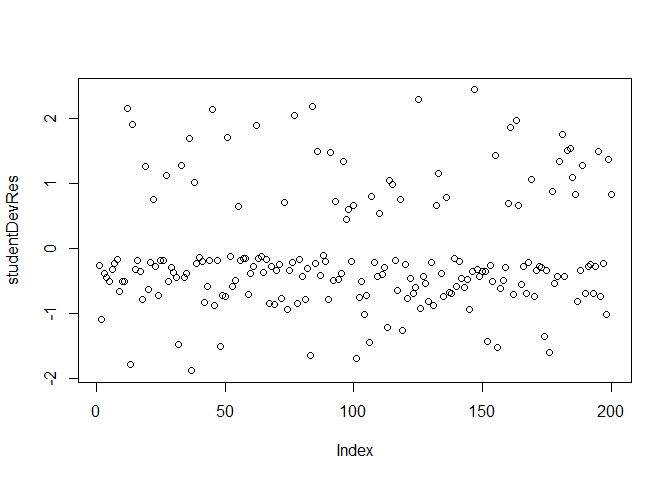

``` r
barplot(studentDevRes)
```

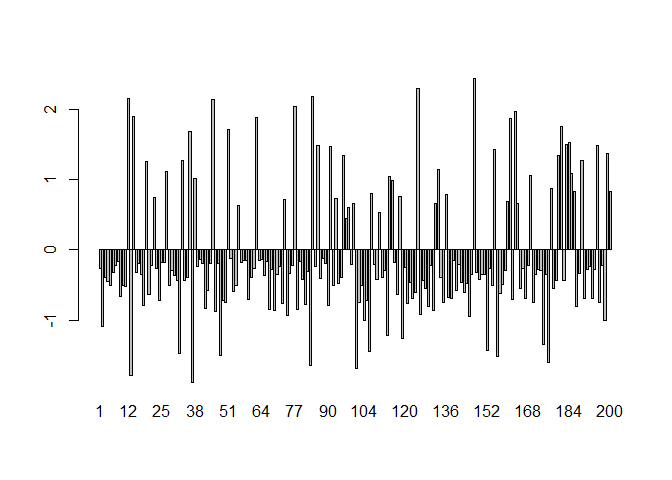

``` r
#let's look at logisitic regression residuals 

plot(predict(fit),residuals(fit))  #plot predicted value vs residuals
abline(h=0,lty=2,col="grey")
```

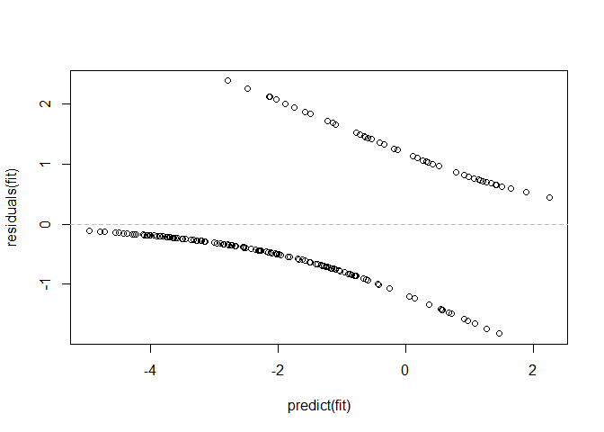

``` r
plot(predict(fit),residuals(fit),col=c("blue","red")[1+honors$hon])
abline(h=0,lty=2,col="grey")

# Why two lines of points? 

# We predict a probability (actually log odds) for Y taking values 0 or 1. 
# If y = 0, then we always predict more & residuals are negative (blue) 
# If y = 1, then we underestimate & residuals are positive (red). 

# There is nothing outstanding from this graph. 
# If we want to understand what is going on, we can run a local regression

rl=loess(residuals(fit)~predict(fit))
X<-data.frame(yHat=rl$x,predictedR=rl$fitted)
X<-X[order(X[,1]),]
lines(X,col="black",lwd=1)


# What are we looking for?  We'd like to know if this local regression line 
# is different from the 0 reference line?  

# Let's add some error bars...

rl=loess(residuals(fit)~predict(fit))
y=predict(rl,se=TRUE)
segments(predict(fit),y$fit+2*y$se.fit,predict(fit),y$fit-2*y$se.fit,col="green")
```

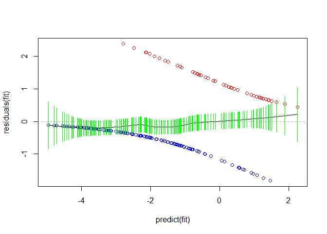

``` r
#standard plots available for logistic regression
plot(fit)
```

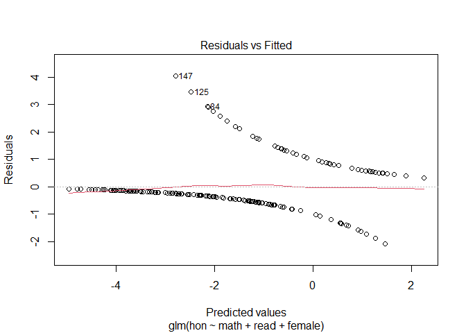

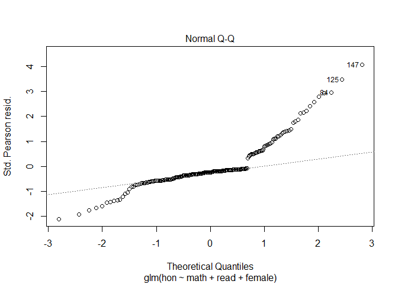

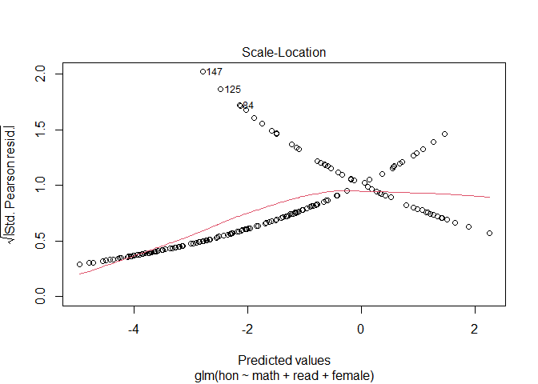

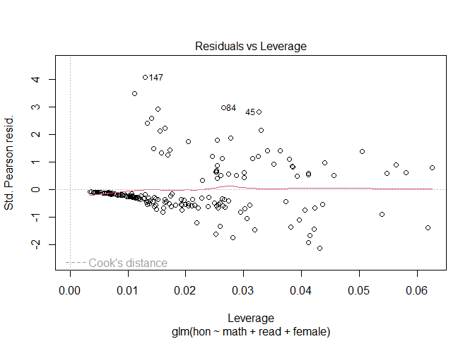

``` r
#now let's look at leverage and influence
barplot(cooks.distance(fit))
```

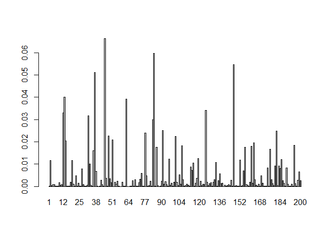

``` r
library(car)
```

    Loading required package: carData

``` r
influence.measures(fit)
```

    Influence measures of
         glm(formula = hon ~ math + read + female, family = "binomial",      data = honors) :

           dfb.1_  dfb.math  dfb.read  dfb.feml    dffit cov.r   cook.d     hat inf
    1   -0.022201  2.90e-02 -0.013655  0.016984 -0.03378 1.032 1.16e-04 0.01306    
    2    0.033093  1.71e-01 -0.240379 -0.105797 -0.29465 1.046 1.16e-02 0.05390    
    3   -0.033568 -4.87e-03  0.034952  0.034172 -0.05365 1.032 2.99e-04 0.01461    
    4   -0.036993  6.54e-02 -0.047129  0.042343 -0.08254 1.043 7.16e-04 0.02628    
    5   -0.038730 -1.77e-02  0.051060  0.052354 -0.08023 1.034 6.87e-04 0.01924    
    6   -0.028455  4.26e-03  0.020733  0.025148 -0.03810 1.029 1.49e-04 0.01062    
    7   -0.018476  1.67e-02 -0.002178  0.013142 -0.02246 1.027 5.11e-05 0.00777    
    8   -0.012525  2.28e-03  0.009543  0.007901 -0.01478 1.026 2.20e-05 0.00597    
    9   -0.035293  6.71e-02 -0.061262  0.078176 -0.12234 1.036 1.67e-03 0.02594    
    10  -0.038485  3.70e-02 -0.014068  0.051098 -0.07035 1.030 5.27e-04 0.01526    
    11  -0.038870  5.31e-02 -0.033372  0.053387 -0.08231 1.034 7.24e-04 0.01967    
    12   0.171390 -1.75e-01  0.069760 -0.211522  0.30036 0.921 3.30e-02 0.01515   *
    13   0.250754 -1.45e-01 -0.161305  0.149686 -0.41684 0.981 4.00e-02 0.04126    
    14   0.115511 -2.63e-03 -0.069226 -0.215389  0.27606 0.946 2.04e-02 0.01638    
    15  -0.027537  7.50e-03  0.016189  0.023810 -0.03521 1.028 1.27e-04 0.00968    
    16  -0.014645  7.78e-03  0.004950  0.009651 -0.01604 1.025 2.60e-05 0.00563    
    17  -0.030905  9.06e-03  0.016723  0.029100 -0.04123 1.028 1.76e-04 0.01047    
    18  -0.022863 -1.93e-02  0.021527  0.097750 -0.12980 1.026 1.97e-03 0.02102    
    19  -0.057309 -2.99e-02  0.147089 -0.157777  0.28060 1.019 1.17e-02 0.03798    
    20  -0.036676  4.73e-03  0.016153  0.072546 -0.09208 1.027 9.37e-04 0.01646    
    21  -0.017585  3.01e-02 -0.018984  0.012204 -0.03263 1.038 1.08e-04 0.01762    
    22  -0.103596  1.61e-01 -0.052113 -0.066537  0.20372 1.064 4.75e-03 0.05485   *
    23  -0.023130  1.84e-02 -0.000304  0.018112 -0.02830 1.028 8.16e-05 0.00857    
    24  -0.030191  2.99e-02 -0.025628  0.087483 -0.11622 1.027 1.54e-03 0.01997    
    25  -0.014165  3.85e-03  0.009199  0.009249 -0.01627 1.026 2.67e-05 0.00607    
    26  -0.013654  1.77e-03  0.011194  0.008824 -0.01658 1.027 2.77e-05 0.00664    
    27  -0.081673  7.98e-02  0.037937 -0.133895  0.24003 1.024 7.86e-03 0.03519    
    28  -0.038730 -1.77e-02  0.051060  0.052354 -0.08023 1.034 6.87e-04 0.01924    
    29  -0.024994  7.44e-03  0.014285  0.020403 -0.03089 1.028 9.75e-05 0.00891    
    30  -0.031584  2.29e-02  0.000720  0.030276 -0.04269 1.028 1.89e-04 0.01070    
    31  -0.036733 -2.40e-02  0.059100  0.042041 -0.07618 1.039 6.09e-04 0.02278    
    32   0.156932  7.45e-02 -0.317070  0.162579 -0.42817 1.028 3.16e-02 0.06186   *
    33  -0.051858  2.28e-02  0.078896 -0.160747  0.25892 1.011 1.01e-02 0.03155    
    34  -0.036733 -2.40e-02  0.059100  0.042041 -0.07618 1.039 6.09e-04 0.02278    
    35  -0.033208  2.21e-02  0.002666  0.033463 -0.04598 1.028 2.20e-04 0.01102    
    36   0.056893 -4.60e-02  0.048025 -0.207231  0.27391 0.969 1.59e-02 0.02046    
    37   0.274749 -3.08e-01  0.006955  0.143964 -0.44956 0.974 5.12e-02 0.04323   *
    38  -0.094722  1.07e-01  0.015280 -0.115605  0.22929 1.034 6.79e-03 0.03858    
    39  -0.019281  1.33e-02  0.002475  0.013955 -0.02219 1.027 5.00e-05 0.00710    
    40  -0.009943  5.41e-03  0.003396  0.005915 -0.01056 1.024 1.12e-05 0.00421    
    41  -0.015153  1.21e-02  0.000262  0.010079 -0.01732 1.026 3.03e-05 0.00624    
    42  -0.016511 -6.01e-02  0.060582  0.105250 -0.15575 1.030 2.88e-03 0.02681    
    43  -0.038433 -5.90e-03  0.033167  0.064434 -0.08552 1.029 7.96e-04 0.01669    
    44  -0.014645  7.78e-03  0.004950  0.009651 -0.01604 1.025 2.60e-05 0.00563    
    45   0.165454 -3.41e-01  0.276211 -0.216600  0.43934 0.940 6.63e-02 0.03264   *
    46  -0.009043 -7.97e-02  0.073265  0.112226 -0.17483 1.032 3.70e-03 0.03024    
    47  -0.014474  1.42e-02 -0.002891  0.009485 -0.01770 1.027 3.16e-05 0.00696    
    48   0.167036 -2.05e-01  0.004902  0.159858 -0.35613 1.005 2.26e-02 0.04223    
    49  -0.031850 -9.76e-02  0.127828  0.088350 -0.17371 1.053 3.42e-03 0.04364    
    50  -0.027836 -6.37e-03  0.013826  0.091086 -0.11799 1.026 1.60e-03 0.01940    
    51   0.062925  1.13e-01 -0.147938 -0.210015  0.31091 0.971 2.09e-02 0.02546    
    52  -0.008285  5.05e-03  0.002236  0.004734 -0.00872 1.024 7.64e-06 0.00367    
    53  -0.039119 -6.50e-02  0.103633  0.066832 -0.13187 1.051 1.90e-03 0.03736    
    54  -0.038874  6.96e-02 -0.052361  0.051070 -0.09340 1.042 9.28e-04 0.02663    
    55  -0.093879  6.56e-02  0.044304 -0.047557  0.14539 1.051 2.33e-03 0.03930    
    56  -0.014113  5.42e-03  0.007281  0.009203 -0.01570 1.026 2.49e-05 0.00568    
    57  -0.010914  4.44e-03  0.005469  0.006642 -0.01185 1.025 1.41e-05 0.00466    
    58  -0.010346  6.98e-03  0.001903  0.006209 -0.01111 1.025 1.24e-05 0.00441    
    59  -0.032401  6.31e-02 -0.061680  0.084373 -0.12861 1.034 1.87e-03 0.02570    
    60  -0.033337  8.72e-03  0.018610  0.033764 -0.04680 1.028 2.28e-04 0.01130    
    61  -0.023130  1.84e-02 -0.000304  0.018112 -0.02830 1.028 8.16e-05 0.00857    
    62   0.108162  1.83e-01 -0.280301 -0.218875  0.39114 0.964 3.93e-02 0.03301    
    63  -0.011272  8.40e-03  0.001095  0.006905 -0.01235 1.025 1.54e-05 0.00484    
    64  -0.008755  3.15e-03  0.004949  0.005067 -0.00951 1.024 9.09e-06 0.00405    
    65  -0.031634  1.70e-02  0.007798  0.030395 -0.04191 1.028 1.82e-04 0.01027    
    66  -0.012304  8.79e-03  0.001600  0.007711 -0.01348 1.025 1.83e-05 0.00510    
    67  -0.013601 -3.16e-03 -0.011114  0.107251 -0.14413 1.025 2.49e-03 0.02222    
    68  -0.024042  1.33e-02  0.006524  0.019215 -0.02858 1.027 8.34e-05 0.00817    
    69  -0.010287  3.03e-02 -0.055667  0.110423 -0.15878 1.027 3.04e-03 0.02559    
    70  -0.029944  1.80e-02  0.005470  0.027462 -0.03863 1.028 1.54e-04 0.00984    
    71  -0.020121  9.50e-03  0.007776  0.014826 -0.02308 1.026 5.41e-05 0.00717    
    72  -0.025799  2.09e-02 -0.021777  0.093971 -0.12421 1.026 1.78e-03 0.02046    
    73  -0.100301  5.78e-02  0.064522 -0.059874  0.16673 1.051 3.15e-03 0.04126    
    74   0.002116  8.60e-02 -0.139517  0.121143 -0.21816 1.040 5.92e-03 0.04060    
    75  -0.028998  3.07e-02 -0.010351  0.025874 -0.04179 1.030 1.80e-04 0.01231    
    76  -0.017828  1.30e-02  0.001575  0.012527 -0.02043 1.026 4.23e-05 0.00680    
    77   0.148407 -8.69e-02 -0.007330 -0.214528  0.27480 0.931 2.39e-02 0.01414   *
    78  -0.015075  1.02e-01 -0.135407  0.108227 -0.20150 1.046 4.85e-03 0.04235    
    79  -0.012062  5.90e-04  0.011126  0.007536 -0.01514 1.027 2.31e-05 0.00661    
    80  -0.035634 -4.19e-05  0.030134  0.039279 -0.05641 1.030 3.33e-04 0.01365    
    81  -0.023635  5.04e-02 -0.060400  0.097259 -0.14233 1.031 2.36e-03 0.02537    
    82  -0.027191 -1.15e-02  0.038581  0.023253 -0.04672 1.036 2.24e-04 0.01743    
    83   0.211043 -2.02e-01 -0.048355  0.156765 -0.38528 0.993 2.99e-02 0.04142    
    84   0.174664 -3.11e-01  0.228368 -0.213481  0.40317 0.929 5.99e-02 0.02651   *
    85  -0.019119  2.31e-02 -0.009255  0.013749 -0.02701 1.030 7.40e-05 0.01064    
    86   0.000354  1.63e-01 -0.140213 -0.191411  0.31529 0.998 1.76e-02 0.03416    
    87  -0.034727  2.07e-02  0.005060  0.036936 -0.04963 1.028 2.57e-04 0.01139    
    88  -0.007273  3.15e-03  0.003518  0.004051 -0.00770 1.024 5.96e-06 0.00340    
    89  -0.015731  1.51e-02 -0.002745  0.010580 -0.01918 1.027 3.72e-05 0.00723    
    90  -0.022703 -4.29e-02  0.049244  0.098346 -0.13901 1.029 2.26e-03 0.02387    
    91  -0.008272  2.49e-01 -0.232607 -0.191002  0.38198 1.017 2.51e-02 0.05057    
    92  -0.038874  6.96e-02 -0.052361  0.051070 -0.09340 1.042 9.28e-04 0.02663    
    93  -0.097217  3.58e-02  0.064444  0.074161  0.13717 1.035 2.14e-03 0.02742    
    94  -0.039561 -1.72e-02  0.064022 -0.018948 -0.08018 1.036 6.81e-04 0.02118    
    95  -0.034280  1.81e-02  0.016188 -0.011141 -0.04597 1.028 2.20e-04 0.01085    
    96  -0.030684  1.73e-01 -0.172109  0.124692  0.27762 1.007 1.22e-02 0.03260    
    97  -0.065732  4.19e-02  0.022493  0.036702  0.07722 1.039 6.27e-04 0.02285    
    98  -0.086648  8.98e-02 -0.011393  0.056447  0.11795 1.043 1.52e-03 0.03006    
    99  -0.016343  6.70e-03  0.010020 -0.001805 -0.01917 1.027 3.72e-05 0.00698    
    100 -0.093384  8.97e-02 -0.003903  0.065994  0.12887 1.039 1.85e-03 0.02876    
    101  0.218114 -6.00e-02 -0.168786 -0.175311 -0.32425 0.976 2.23e-02 0.02821    
    102 -0.029948 -4.18e-02  0.082753 -0.051557 -0.12574 1.028 1.82e-03 0.02155    
    103 -0.039874  1.96e-02  0.020538 -0.021206 -0.06321 1.026 4.26e-04 0.01216    
    104  0.014753  9.69e-02 -0.131603 -0.091861 -0.19881 1.024 5.10e-03 0.02954    
    105 -0.032140  1.72e-02  0.014868 -0.047887 -0.09504 1.020 1.03e-03 0.01335    
    106  0.144805 -2.53e-01  0.141389 -0.154614 -0.32648 1.005 1.83e-02 0.03817    
    107 -0.099741  1.13e-01 -0.024382  0.083866  0.15924 1.035 2.97e-03 0.03015    
    108 -0.016999  7.58e-03  0.009699 -0.001976 -0.01984 1.027 3.98e-05 0.00705    
    109 -0.036549  2.69e-02  0.008236 -0.013834 -0.05116 1.028 2.74e-04 0.01132    
    110 -0.078809  3.84e-02  0.041095  0.048205  0.09718 1.040 1.01e-03 0.02542    
    111 -0.035159  6.31e-02 -0.036312 -0.011815 -0.07029 1.041 5.14e-04 0.02399    
    112 -0.025449  2.04e-02  0.003807 -0.005056 -0.03132 1.028 1.00e-04 0.00919    
    113  0.070286  7.34e-02 -0.164737 -0.123538 -0.24368 1.013 8.63e-03 0.03064    
    114 -0.086979 -6.85e-02  0.177315  0.110476  0.23527 1.032 7.26e-03 0.03838    
    115 -0.096497 -1.20e-01  0.249594  0.106987  0.28785 1.062 1.05e-02 0.06259   *
    116 -0.013759  8.34e-03  0.005231 -0.001219 -0.01547 1.026 2.41e-05 0.00584    
    117 -0.038784 -3.92e-02  0.089333 -0.036569 -0.11572 1.036 1.48e-03 0.02497    
    118 -0.099654 -2.24e-02  0.136434  0.078521  0.17622 1.049 3.57e-03 0.04121    
    119  0.083568 -2.13e-01  0.161570 -0.130025 -0.28901 1.020 1.25e-02 0.03959    
    120 -0.021324  1.47e-02  0.005931 -0.003334 -0.02512 1.027 6.41e-05 0.00796    
    121 -0.029016  9.63e-02 -0.082604 -0.053570 -0.14187 1.033 2.33e-03 0.02645    
    122 -0.038492  3.81e-02 -0.002958 -0.017090 -0.05921 1.028 3.70e-04 0.01277    
    123 -0.035303  6.98e-03  0.030566 -0.042790 -0.09147 1.022 9.42e-04 0.01373    
    124 -0.039761  2.91e-03  0.040328 -0.031650 -0.08162 1.026 7.29e-04 0.01432    
    125  0.200965 -1.60e-01 -0.030949  0.068479  0.27497 0.902 3.42e-02 0.01117   *
    126 -0.004295 -1.16e-03  0.006106 -0.076468 -0.12699 1.014 1.99e-03 0.01491    
    127 -0.037235  3.86e-02 -0.004981 -0.014804 -0.05610 1.029 3.30e-04 0.01289    
    128 -0.040956 -3.47e-02  0.086348 -0.025093 -0.10307 1.041 1.14e-03 0.02743    
    129 -0.022346 -2.97e-02  0.059937 -0.060158 -0.12195 1.021 1.75e-03 0.01753    
    130 -0.017737  6.41e-03  0.011902 -0.002174 -0.02124 1.027 4.57e-05 0.00758    
    131 -0.013003  4.03e-02 -0.033666 -0.069292 -0.12537 1.017 1.90e-03 0.01612    
    132 -0.094689  1.44e-01 -0.067166  0.066446  0.16412 1.057 3.00e-03 0.04563    
    133 -0.072437 -1.18e-01  0.220479  0.118854  0.27864 1.032 1.08e-02 0.04409    
    134 -0.034370  1.14e-02  0.024312 -0.011201 -0.04772 1.029 2.37e-04 0.01162    
    135 -0.031462  1.09e-01 -0.094989 -0.050805 -0.15022 1.038 2.59e-03 0.03106    
    136 -0.102165 -6.53e-02  0.190202  0.083052  0.21954 1.066 5.59e-03 0.05813   *
    137 -0.036584 -1.57e-02  0.058942 -0.040677 -0.10011 1.026 1.12e-03 0.01714    
    138 -0.035310 -3.11e-02  0.075872 -0.043403 -0.11293 1.029 1.44e-03 0.02046    
    139 -0.010997  9.23e-03  0.001127 -0.000718 -0.01254 1.025 1.58e-05 0.00525    
    140 -0.040168  4.17e-02 -0.005403 -0.029358 -0.07665 1.026 6.39e-04 0.01354    
    141 -0.016540  9.49e-04  0.017085 -0.001837 -0.02235 1.029 5.05e-05 0.00931    
    142 -0.038741  7.22e-04  0.041803 -0.017429 -0.06459 1.030 4.41e-04 0.01486    
    143 -0.039761  2.91e-03  0.040328 -0.031650 -0.08162 1.026 7.29e-04 0.01432    
    144 -0.039044  2.29e-02  0.015726 -0.018445 -0.05871 1.027 3.65e-04 0.01179    
    145  0.000971 -5.49e-02  0.064253 -0.080804 -0.14924 1.017 2.79e-03 0.01930    
    146 -0.031611  2.83e-02  0.001141 -0.008799 -0.04205 1.029 1.83e-04 0.01093    
    147  0.216957 -2.55e-01  0.064604  0.057269  0.31445 0.889 5.47e-02 0.01301   *
    148 -0.029008  2.06e-02  0.007484 -0.006994 -0.03639 1.028 1.36e-04 0.00974    
    149 -0.036549  2.69e-02  0.008236 -0.013834 -0.05116 1.028 2.74e-04 0.01132    
    150 -0.031659  2.27e-02  0.007882 -0.008835 -0.04091 1.028 1.73e-04 0.01030    
    151 -0.031611  2.83e-02  0.001141 -0.008799 -0.04205 1.029 1.83e-04 0.01093    
    152  0.139365 -1.55e-02 -0.135054 -0.151923 -0.26386 0.994 1.19e-02 0.02597    
    153 -0.022908  1.80e-02  0.003753 -0.003940 -0.02761 1.028 7.76e-05 0.00855    
    154 -0.039874  1.96e-02  0.020538 -0.021206 -0.06321 1.026 4.26e-04 0.01216    
    155 -0.007362 -1.98e-02  0.031719  0.123681  0.20281 0.984 6.97e-03 0.01578    
    156  0.166459  1.80e-02 -0.204782 -0.161807 -0.31139 0.993 1.76e-02 0.03198    
    157 -0.039308  3.78e-02 -0.001648 -0.033356 -0.08033 1.024 7.09e-04 0.01329    
    158 -0.039753 -4.81e-03  0.049504 -0.020089 -0.07210 1.031 5.53e-04 0.01643    
    159 -0.025510  1.66e-02  0.008350 -0.005079 -0.03092 1.028 9.77e-05 0.00892    
    160 -0.094687  6.12e-02  0.031472  0.068679  0.12618 1.035 1.79e-03 0.02607    
    161  0.112960  1.62e-02 -0.143664  0.105312  0.26397 0.948 1.79e-02 0.01556    
    162 -0.034424  7.05e-02 -0.045992 -0.045056 -0.11099 1.027 1.39e-03 0.01921    
    163  0.140193 -3.41e-02 -0.113847  0.096593  0.25892 0.936 1.96e-02 0.01338   *
    164 -0.094689  1.44e-01 -0.067166  0.066446  0.16412 1.057 3.00e-03 0.04563    
    165 -0.040430  4.45e-02 -0.008426 -0.025752 -0.07325 1.027 5.79e-04 0.01385    
    166 -0.023724  1.99e-02  0.002441 -0.004279 -0.02906 1.028 8.61e-05 0.00893    
    167 -0.035303  6.98e-03  0.030566 -0.042790 -0.09147 1.022 9.42e-04 0.01373    
    168 -0.018308  1.18e-02  0.006109 -0.002350 -0.02111 1.027 4.52e-05 0.00714    
    169 -0.084115  1.15e-01 -0.043849  0.109768  0.19172 1.018 4.86e-03 0.02548    
    170 -0.030716  6.56e-02 -0.044246 -0.050495 -0.11421 1.025 1.50e-03 0.01828    
    171 -0.030877  1.48e-02  0.016352 -0.008231 -0.03980 1.028 1.63e-04 0.01028    
    172 -0.024511  2.54e-02 -0.003268 -0.004625 -0.03210 1.029 1.05e-04 0.01030    
    173 -0.025510  1.66e-02  0.008350 -0.005079 -0.03092 1.028 9.77e-05 0.00892    
    174  0.113723 -9.12e-02 -0.016716 -0.141587 -0.22792 0.995 8.33e-03 0.02187    
    175 -0.030802  2.02e-02  0.009898 -0.008191 -0.03927 1.028 1.59e-04 0.01006    
    176  0.193685 -1.43e-01 -0.043487 -0.168647 -0.29129 0.980 1.67e-02 0.02525    
    177 -0.098528  3.77e-02  0.063590  0.091921  0.15795 1.027 3.01e-03 0.02535    
    178 -0.040956 -3.47e-02  0.086348 -0.025093 -0.10307 1.041 1.14e-03 0.02743    
    179 -0.037235  3.86e-02 -0.004981 -0.014804 -0.05610 1.029 3.30e-04 0.01289    
    180 -0.029898  1.27e-01 -0.118597  0.123800  0.23954 0.999 9.09e-03 0.02460    
    181  0.080166 -2.40e-01  0.196840  0.115603  0.33283 0.970 2.49e-02 0.02778    
    182 -0.037356  1.36e-02  0.024917 -0.014990 -0.05448 1.028 3.11e-04 0.01200    
    183  0.013664  6.04e-02 -0.086981  0.122895  0.22455 0.980 9.12e-03 0.01731    
    184  0.022291 -2.33e-02  0.003230  0.122060  0.20904 0.975 8.12e-03 0.01447    
    185 -0.084431  2.40e-01 -0.193137  0.114597  0.29977 1.049 1.20e-02 0.05640    
    186 -0.099288  4.83e-02  0.051920  0.086726  0.15001 1.029 2.67e-03 0.02537    
    187 -0.022520 -5.25e-03  0.031051 -0.059783 -0.11077 1.018 1.45e-03 0.01461    
    188 -0.029830  2.79e-02 -0.000394 -0.007525 -0.03938 1.029 1.60e-04 0.01080    
    189 -0.046138 -7.86e-02  0.144354  0.122702  0.23512 1.005 8.34e-03 0.02632    
    190 -0.035303  6.98e-03  0.030566 -0.042790 -0.09147 1.022 9.42e-04 0.01373    
    191 -0.023781  1.66e-02  0.006476 -0.004298 -0.02851 1.027 8.29e-05 0.00856    
    192 -0.020692  7.94e-03  0.013336 -0.003095 -0.02504 1.028 6.37e-05 0.00830    
    193 -0.035303  6.98e-03  0.030566 -0.042790 -0.09147 1.022 9.42e-04 0.01373    
    194 -0.024672  1.48e-02  0.009528 -0.004685 -0.02971 1.028 9.01e-05 0.00873    
    195  0.004597  1.93e-01 -0.235004  0.125556  0.32453 1.001 1.85e-02 0.03638    
    196 -0.030440  4.43e-02 -0.019175 -0.050497 -0.10289 1.021 1.22e-03 0.01488    
    197 -0.018967  1.54e-02  0.002543 -0.002553 -0.02240 1.027 5.09e-05 0.00762    
    198  0.015933 -3.26e-03 -0.013669 -0.091290 -0.14556 1.010 2.74e-03 0.01609    
    199 -0.022114  4.93e-02 -0.034276  0.123426  0.20158 0.989 6.59e-03 0.01690    
    200 -0.099290  7.31e-02  0.022293  0.086454  0.14932 1.029 2.64e-03 0.02525    

``` r
influencePlot(fit)
```

           StudRes        Hat      CookD
    32  -1.4758499 0.06186277 0.03163519
    45   2.1358673 0.03264300 0.06634186
    84   2.1791183 0.02651006 0.05987157
    115  0.9823616 0.06259147 0.01048172
    125  2.2930555 0.01117335 0.03415423
    147  2.4343454 0.01300918 0.05467310

``` r
vif(fit)
```

        math     read   female 
    1.427189 1.413538 1.040705 

``` r
# There are a lot of things similar between OLS and logistic regression
# i.e., leverage, influence, variance inflation,
#       Deviance is kind of like residual sum of squares
#       p-values of predictors
#       AIC or BIC scores
#       stepwise regression (using AIC or BIC)
#       you can even perform a version of LASSO or elastic net -- use "glmnet" package


# Residuals however, are less informative for logistic regression than OLS;
# the whole 1/0 issue and the logit transformation makes them kind of pain!


# one of the most important things to do is to determine if the model has 
# good classificaion qualities

# PLEASE NOTE FOR SIMPLICITY: 
# I am skipping the cross-Validation and/or data-splitting strategies...
# In practice, remember you don't really care about the fit on training data,
# but on the test data!


# one semi-fancy SAS-like cross tabulation function
library(gmodels)
CrossTable(honors$pred, honors$hon, chisq=T)
```


     
       Cell Contents
    |-------------------------|
    |                       N |
    | Chi-square contribution |
    |           N / Row Total |
    |           N / Col Total |
    |         N / Table Total |
    |-------------------------|

     
    Total Observations in Table:  200 

     
                 | honors$hon 
     honors$pred |         0 |         1 | Row Total | 
    -------------|-----------|-----------|-----------|
               0 |       138 |        25 |       163 | 
                 |     1.812 |     5.585 |           | 
                 |     0.847 |     0.153 |     0.815 | 
                 |     0.914 |     0.510 |           | 
                 |     0.690 |     0.125 |           | 
    -------------|-----------|-----------|-----------|
               1 |        13 |        24 |        37 | 
                 |     7.985 |    24.606 |           | 
                 |     0.351 |     0.649 |     0.185 | 
                 |     0.086 |     0.490 |           | 
                 |     0.065 |     0.120 |           | 
    -------------|-----------|-----------|-----------|
    Column Total |       151 |        49 |       200 | 
                 |     0.755 |     0.245 |           | 
    -------------|-----------|-----------|-----------|

     
    Statistics for All Table Factors


    Pearson's Chi-squared test 
    ------------------------------------------------------------
    Chi^2 =  39.98877     d.f. =  1     p =  2.554267e-10 

    Pearson's Chi-squared test with Yates' continuity correction 
    ------------------------------------------------------------
    Chi^2 =  37.35607     d.f. =  1     p =  9.841398e-10 

     

``` r
# or the confustion matrix function and assessment metrics we have seen before
library(caret)
```

    Loading required package: ggplot2

    Loading required package: lattice

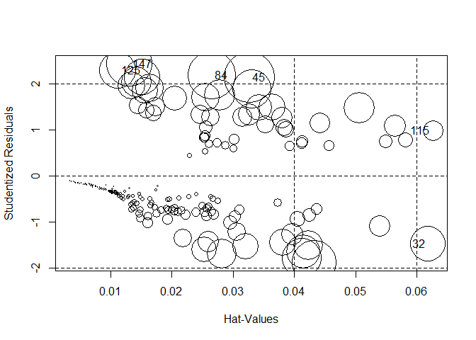

``` r
# confusionMatrix(honors$pred, honors$hon, positive="1")

#of course you can change the threshold value...
# confusionMatrix(as.numeric(fit$fitted.values>.25),honors$hon, positive="1")

#which is the point of the ROC curve!
library(ROCR) 

pred <- prediction(fit$fitted.values, fit$y)    #ROC curve for training data
perf <- performance(pred,"tpr","fpr") 

plot(perf,colorize=TRUE, print.cutoffs.at = c(0.25,0.5,0.75)); 
abline(0, 1, col="red")  
```

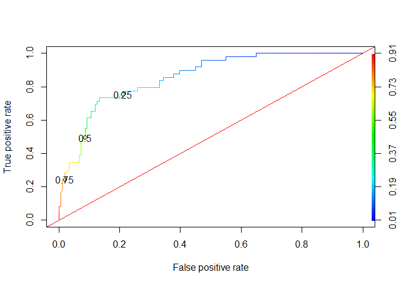

``` r
?performance
```

    starting httpd help server ...

     done

``` r
# can also plot accuracy by average cutoff level 
perf <- performance(pred, "acc")
plot(perf, avg= "vertical",  
    spread.estimate="boxplot", 
    show.spread.at= seq(0.1, 0.9, by=0.1))
```

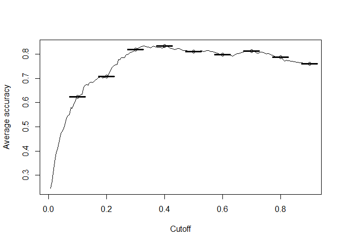

``` r
# can also look at cutoff based on different cost structure
perf <- performance(pred, "cost", cost.fp=1, cost.fn=5)
plot(perf); 
```

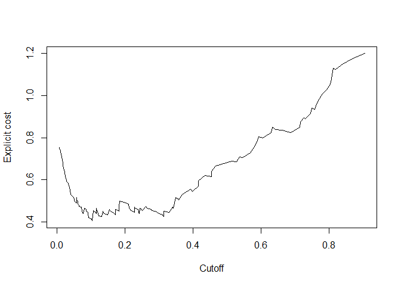

``` r
# one nice one to look at...
# difference in distribution of predicted probablities 
# for observations that were y=0 and y=1

plot(0,0,type="n", xlim= c(0,1), ylim=c(0,7),     
        xlab="Prediction", ylab="Density",  
        main="How well do the predictions separate the classes?")

 for (runi in 1:length(pred@predictions)) {
   lines(density(pred@predictions[[runi]][pred@labels[[runi]]==1]), col= "blue")
   lines(density(pred@predictions[[runi]][pred@labels[[runi]]==0]), col="green")
 }
```

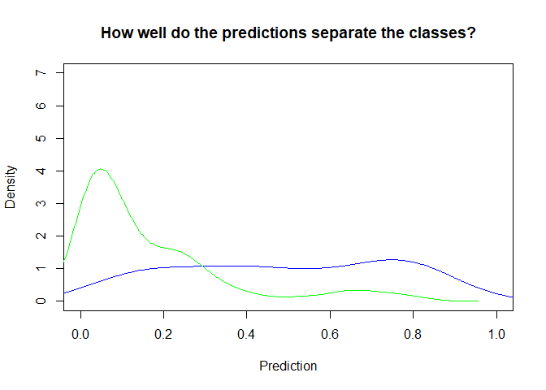

``` r
#Concordant Pairs and AUC

Association=function(trueVal,predProb)
{
  Con_Dis_Data = cbind(trueVal, predProb) 
  
  ones = Con_Dis_Data[Con_Dis_Data[,1] == 1,]
  zeros = Con_Dis_Data[Con_Dis_Data[,1] == 0,]
  
  conc=matrix(0, dim(zeros)[1], dim(ones)[1])   #build a matrix of 0's 
  disc=matrix(0, dim(zeros)[1], dim(ones)[1])
  ties=matrix(0, dim(zeros)[1], dim(ones)[1])
  
  for (j in 1:dim(zeros)[1])
  {
    for (i in 1:dim(ones)[1])
    {
      if (ones[i,2]>zeros[j,2])
           {conc[j,i]=1}
      
      else if (ones[i,2]<zeros[j,2])
           {disc[j,i]=1}
      
      else if (ones[i,2]==zeros[j,2])
           {ties[j,i]=1}
    }
  }
  
  Pairs=dim(zeros)[1]*dim(ones)[1]              #total number of pairs
  PercentConcordance=(sum(conc)/Pairs)*100
  PercentDiscordance=(sum(disc)/Pairs)*100
  PercentTied=(sum(ties)/Pairs)*100
  AUC=PercentConcordance +(0.5 * PercentTied)
  
  return(list("Percent Concordance"=PercentConcordance,
              "Percent Discordance"=PercentDiscordance,
              "Percent Tied"=PercentTied,
              "Pairs"=Pairs,
              "AUC"=AUC))
}
#***FUNCTION TO CALCULATE CONCORDANCE AND DISCORDANCE ENDS***#


Association(fit$y,fit$fitted.values)
```

    $`Percent Concordance`
    [1] 85.67374

    $`Percent Discordance`
    [1] 14.28571

    $`Percent Tied`
    [1] 0.04054602

    $Pairs
    [1] 7399

    $AUC
    [1] 85.69401

``` r
#D statistic (2009)
honors.1<-predVals[predVals$trueVal==1,]
honors.0<-predVals[predVals$trueVal==0,]

mean(honors.1$predProb) - mean(honors.0$predProb)
```

    [1] 0.3250159

``` r
#K-S chart  (Kolmogorov-Smirnov chart) 
# measures the degree of separation 
# between the positive (y=1) and negative (y=0) distributions

predVals$group<-cut(predVals$predProb,seq(1,0,-.1),include.lowest=T)
xtab<-table(predVals$group,predVals$trueVal)

xtab
```

               
                 0  1
      [0,0.1]   78  2
      (0.1,0.2] 25  8
      (0.2,0.3] 26  3
      (0.3,0.4]  8  7
      (0.4,0.5]  1  5
      (0.5,0.6]  3  5
      (0.6,0.7]  5  3
      (0.7,0.8]  4  9
      (0.8,0.9]  1  6
      (0.9,1]    0  1

``` r
#make empty dataframe
KS<-data.frame(Group=numeric(10),
              CumPct0=numeric(10),
              CumPct1=numeric(10),
              Dif=numeric(10))

#fill data frame with information: Group ID, 
#Cumulative % of 0's, of 1's and Difference
for (i in 1:10) {
    KS$Group[i]<-i
    KS$CumPct0[i] <- sum(xtab[1:i,1]) / sum(xtab[,1])
    KS$CumPct1[i] <- sum(xtab[1:i,2]) / sum(xtab[,2])
    KS$Dif[i]<-abs(KS$CumPct0[i]-KS$CumPct1[i])
}

KS  
```

       Group   CumPct0    CumPct1        Dif
    1      1 0.5165563 0.04081633 0.47573996
    2      2 0.6821192 0.20408163 0.47803757
    3      3 0.8543046 0.26530612 0.58899851
    4      4 0.9072848 0.40816327 0.49912150
    5      5 0.9139073 0.51020408 0.40370320
    6      6 0.9337748 0.61224490 0.32152994
    7      7 0.9668874 0.67346939 0.29341803
    8      8 0.9933775 0.85714286 0.13623463
    9      9 1.0000000 0.97959184 0.02040816
    10    10 1.0000000 1.00000000 0.00000000

``` r
KS[KS$Dif==max(KS$Dif),]
```

      Group   CumPct0   CumPct1       Dif
    3     3 0.8543046 0.2653061 0.5889985

``` r
maxGroup<-KS[KS$Dif==max(KS$Dif),][1,1]

#and the K-S chart
ggplot(data=KS)+
   geom_line(aes(Group,CumPct0),color="blue")+
   geom_line(aes(Group,CumPct1),color="red")+
   geom_segment(x=maxGroup,xend=maxGroup,
                y=KS$CumPct0[maxGroup],yend=KS$CumPct1[maxGroup])+
  labs(title = "K-S Chart", x= "Deciles", y = "Cumulative Percent")
```

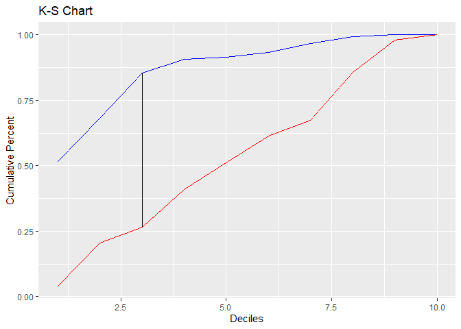
