Descision Trees
================
Daniel Carpenter

-   <a href="#overview" id="toc-overview">1 Overview</a>
-   <a href="#general-ideas" id="toc-general-ideas">2 General Ideas</a>
-   <a href="#methods-to-assess-impurity"
    id="toc-methods-to-assess-impurity">3 Methods to Assess Impurity</a>

## Overview

> Fantastic for classification Modeling

-   Evaluate impurity with Misclassification rate, Entropy, Information
    Gain, Information Gain Ratio and Gini Index

-   Compare and contrast the different impurity measures

-   Build classification trees in R

-   Improve your classification trees by using tree ensembles
    techniques: Bagging, Random Forests and Boosting

### Pros of Decision Trees

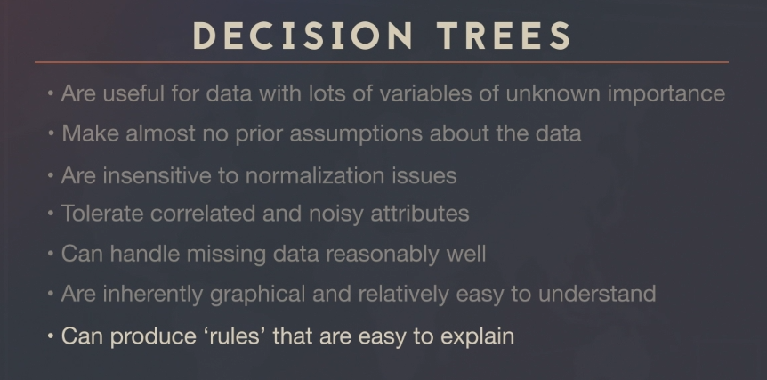

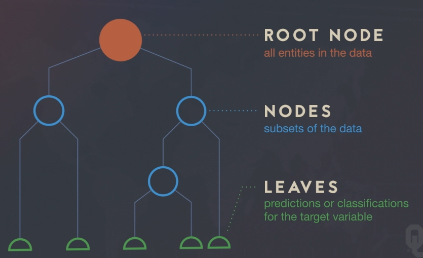

### Cons of Decision Trees

-   Overly complex

-   Model changes depending on input data. So difficult to explain to
    management

    -   Sensitive to the sample you use

    -   Numeric data sets can be complex and hard to comunicate

### Process Overview

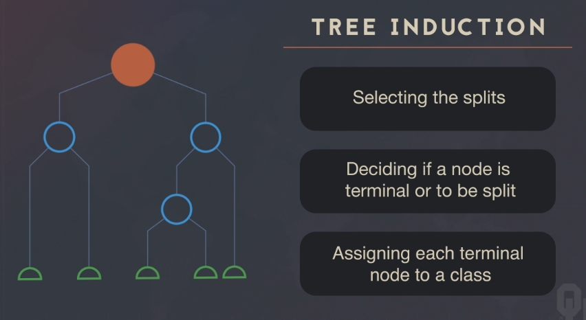

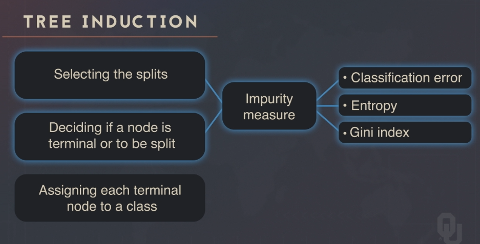

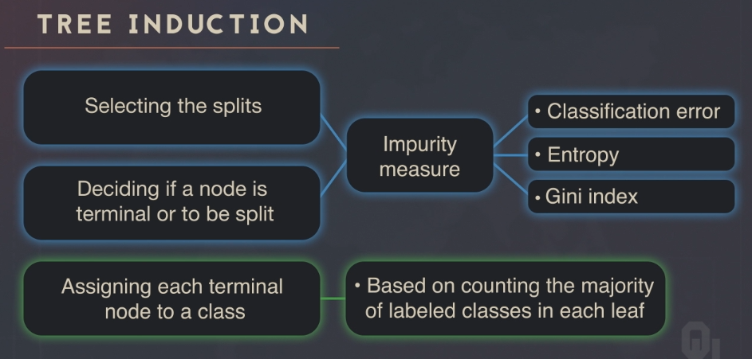

## General Ideas

### Interpretation of Decision Trees

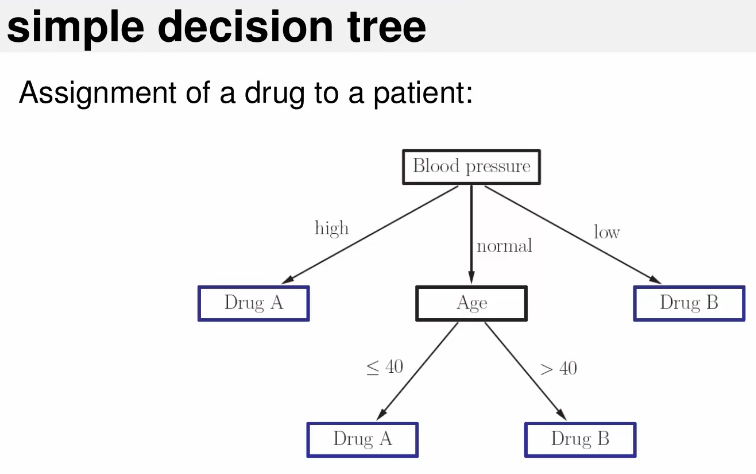

Algorithm idea:

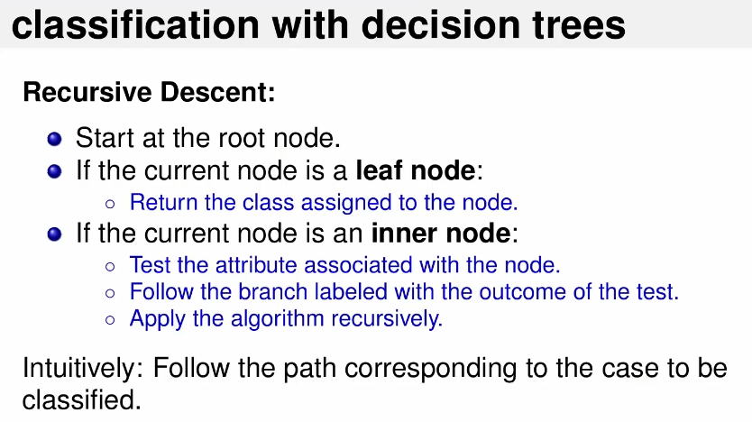

### Constructing Trees (Induction)

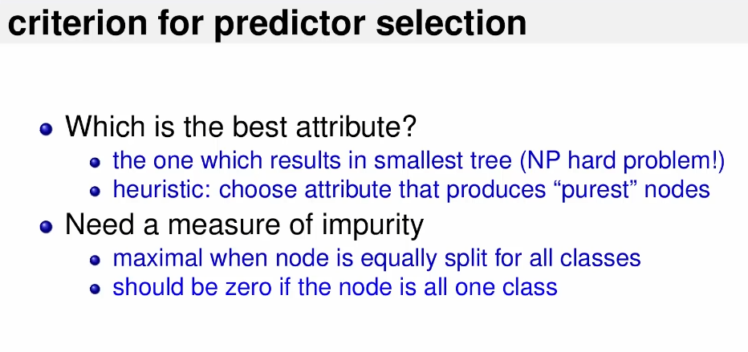

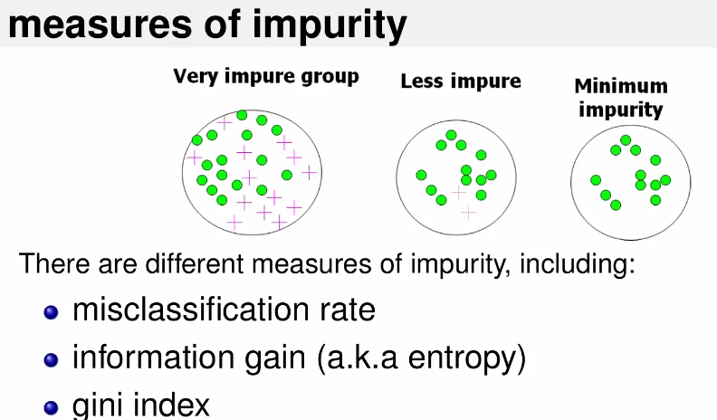

## Methods to Assess Impurity

> Goal is to make the best predictive Model

### Summary of Methods

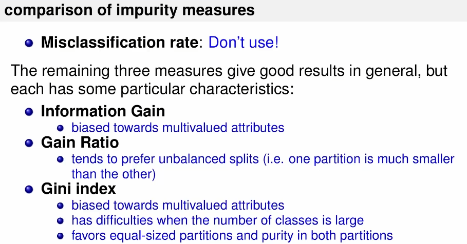

### Method 1 - Using Misclassificatin Rate

-   Note do not use the misclassification rate

-   In practice, we do not use this. It is a greedy technique, only
    making the best decision based on a given iteration.

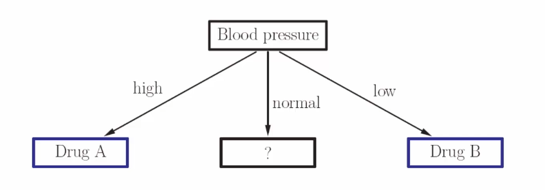

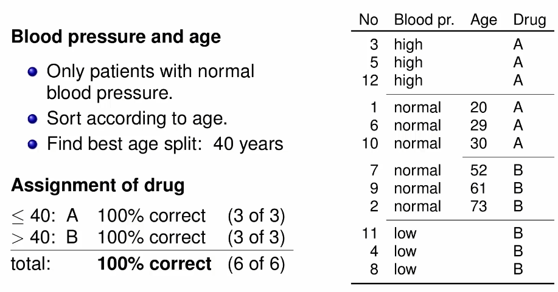

### Method 2 - Entropy (Improvement to Misclassification)

> Entropy measures impurity
>
> Goal is to minimize the Entropy
>
> Typically does better than misclassification for complex problems

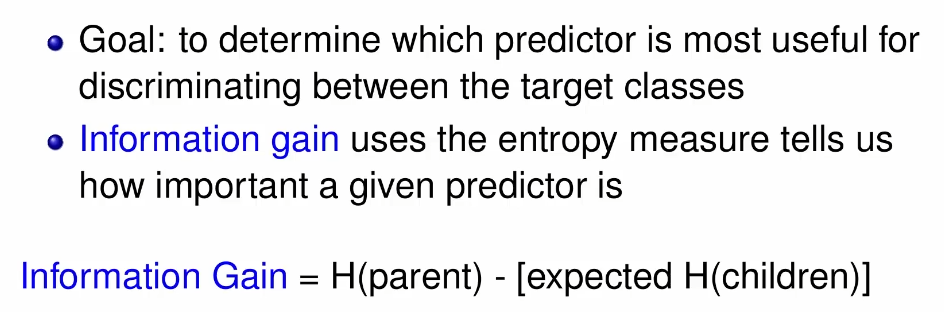

### Method 3 - Information Gain

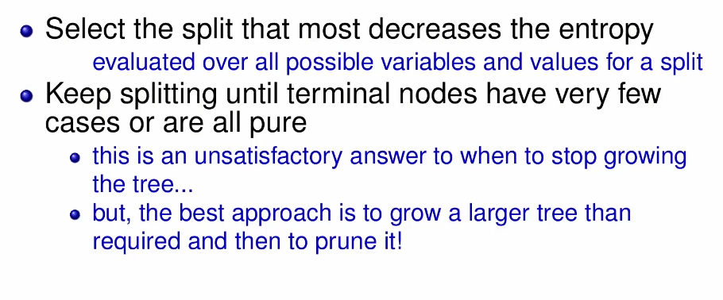

### Method 4 - Information Gain *Ratio*

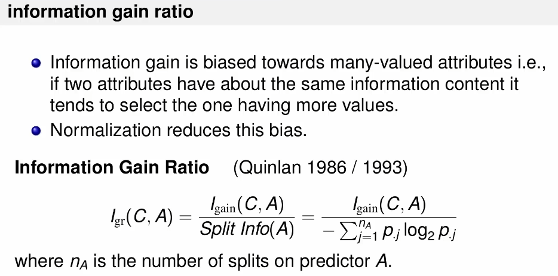

### Method 5 - Gini Index

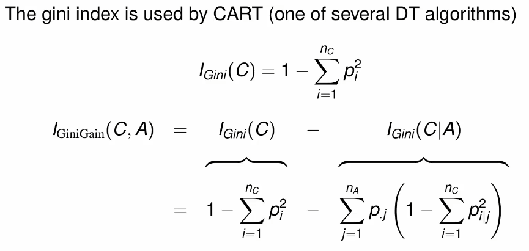
