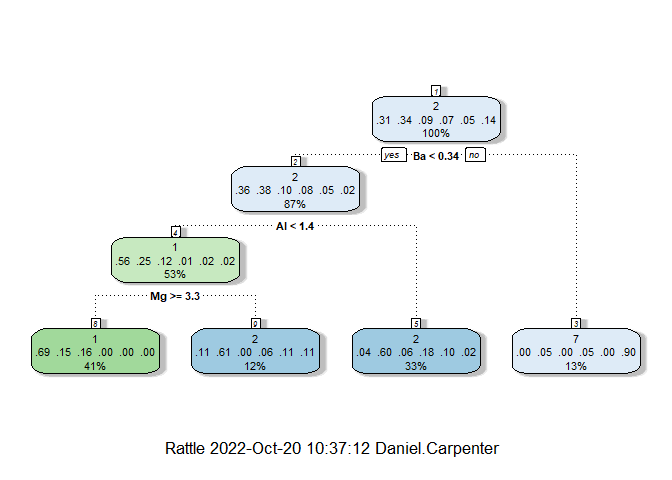

Descision Trees
================
Daniel Carpenter

-   <a href="#overview" id="toc-overview"><span
    class="toc-section-number">1</span> Overview</a>
    -   <a href="#pros-of-decision-trees" id="toc-pros-of-decision-trees"><span
        class="toc-section-number">1.1</span> Pros of Decision Trees</a>
    -   <a href="#cons-of-decision-trees" id="toc-cons-of-decision-trees"><span
        class="toc-section-number">1.2</span> Cons of Decision Trees</a>
    -   <a href="#process-overview" id="toc-process-overview"><span
        class="toc-section-number">1.3</span> Process Overview</a>
-   <a href="#general-ideas" id="toc-general-ideas"><span
    class="toc-section-number">2</span> General Ideas</a>
    -   <a href="#interpretation-of-decision-trees"
        id="toc-interpretation-of-decision-trees"><span
        class="toc-section-number">2.1</span> Interpretation of Decision
        Trees</a>
    -   <a href="#constructing-trees-induction"
        id="toc-constructing-trees-induction"><span
        class="toc-section-number">2.2</span> Constructing Trees (Induction)</a>
-   <a href="#methods-to-assess-impurity"
    id="toc-methods-to-assess-impurity"><span
    class="toc-section-number">3</span> Methods to Assess Impurity</a>
    -   <a href="#summary-of-methods" id="toc-summary-of-methods"><span
        class="toc-section-number">3.1</span> Summary of Methods</a>
    -   <a href="#method-1---using-misclassificatin-rate"
        id="toc-method-1---using-misclassificatin-rate"><span
        class="toc-section-number">3.2</span> Method 1 - Using Misclassificatin
        Rate</a>
    -   <a href="#method-2---entropy-improvement-to-misclassification"
        id="toc-method-2---entropy-improvement-to-misclassification"><span
        class="toc-section-number">3.3</span> Method 2 - Entropy (Improvement to
        Misclassification)</a>
    -   <a href="#method-3---information-gain"
        id="toc-method-3---information-gain"><span
        class="toc-section-number">3.4</span> Method 3 - Information Gain</a>
    -   <a href="#method-4---information-gain-ratio"
        id="toc-method-4---information-gain-ratio"><span
        class="toc-section-number">3.5</span> Method 4 - Information Gain
        <em>Ratio</em></a>
    -   <a href="#method-5---gini-index" id="toc-method-5---gini-index"><span
        class="toc-section-number">3.6</span> Method 5 - Gini Index</a>
-   <a href="#tree-algorithms" id="toc-tree-algorithms"><span
    class="toc-section-number">4</span> Tree Algorithms</a>
    -   <a href="#concepts" id="toc-concepts"><span
        class="toc-section-number">4.1</span> Concepts</a>
    -   <a href="#section" id="toc-section"><span
        class="toc-section-number">4.2</span> </a>
    -   <a href="#r-packages" id="toc-r-packages"><span
        class="toc-section-number">4.3</span> R Packages</a>
    -   <a href="#notes-on-trees" id="toc-notes-on-trees"><span
        class="toc-section-number">4.4</span> Notes on Trees</a>
    -   <a href="#complexity" id="toc-complexity"><span
        class="toc-section-number">4.5</span> Complexity</a>
-   <a href="#r-example" id="toc-r-example"><span
    class="toc-section-number">5</span> R Example</a>
-   <a href="#tree-ensembles" id="toc-tree-ensembles"><span
    class="toc-section-number">6</span> Tree Ensembles</a>
    -   <a href="#overview-1" id="toc-overview-1"><span
        class="toc-section-number">6.1</span> Overview</a>
    -   <a href="#bagging" id="toc-bagging"><span
        class="toc-section-number">6.2</span> Bagging</a>
    -   <a href="#random-forests" id="toc-random-forests"><span
        class="toc-section-number">6.3</span> Random Forests</a>
    -   <a href="#boosted-trees" id="toc-boosted-trees"><span
        class="toc-section-number">6.4</span> Boosted Trees</a>

## Overview

> Fantastic for classification Modeling

-   Evaluate impurity with Misclassification rate, Entropy, Information
    Gain, Information Gain Ratio and Gini Index

-   Compare and contrast the different impurity measures

-   Build classification trees in R

-   Improve your classification trees by using tree ensembles
    techniques: Bagging, Random Forests and Boosting

### Pros of Decision Trees


### Cons of Decision Trees

-   Overly complex

-   Model changes depending on input data. So difficult to explain to
    management

    -   Sensitive to the sample you use

    -   Numeric data sets can be complex and hard to comunicate

### Process Overview


## General Ideas

### Interpretation of Decision Trees


Algorithm idea:


### Constructing Trees (Induction)


## Methods to Assess Impurity

> Goal is to make the best predictive Model

### Summary of Methods


### Method 1 - Using Misclassificatin Rate

-   Note do not use the misclassification rate

-   In practice, we do not use this. It is a greedy technique, only
    making the best decision based on a given iteration.


### Method 2 - Entropy (Improvement to Misclassification)

> Entropy measures impurity
>
> Goal is to minimize the Entropy
>
> Typically does better than misclassification for complex problems


### Method 3 - Information Gain


### Method 4 - Information Gain *Ratio*


### Method 5 - Gini Index


## Tree Algorithms

### Concepts

### 

### R Packages


### Notes on Trees

-   No need to scale, impute missing values, or alter the distribution

-   Can handle multicorrelation

-   Greedy algorithm - so might not be the most optimal tree.


### Complexity

-   Number of leaf nodes indicate the complexity of the tree (called
    `CP` in R)


## R Example

``` r
#ISE 5103 R script for introducing tree ensembles
#Author: Charles Nicholson
#November 2015

library(rpart)         # CART algorithm
library(party)         # to print trees
```

    Loading required package: grid

    Loading required package: mvtnorm

    Loading required package: modeltools

    Loading required package: stats4

    Loading required package: strucchange

    Loading required package: zoo


    Attaching package: 'zoo'

    The following objects are masked from 'package:base':

        as.Date, as.Date.numeric

    Loading required package: sandwich

``` r
library(partykit)      # to print trees using "party"
```

    Loading required package: libcoin


    Attaching package: 'partykit'

    The following objects are masked from 'package:party':

        cforest, ctree, ctree_control, edge_simple, mob, mob_control,
        node_barplot, node_bivplot, node_boxplot, node_inner, node_surv,
        node_terminal, varimp

``` r
library(rattle)        # for graphics
```

    Loading required package: tibble

    Loading required package: bitops

    Rattle: A free graphical interface for data science with R.
    Version 5.5.1 Copyright (c) 2006-2021 Togaware Pty Ltd.
    Type 'rattle()' to shake, rattle, and roll your data.

``` r
library(adabag)        # for boosting
```

    Loading required package: caret

    Loading required package: ggplot2

    Loading required package: lattice

    Loading required package: foreach

    Loading required package: doParallel

    Loading required package: iterators

    Loading required package: parallel

``` r
library(ipred)         # for bagging and error estimation
```


    Attaching package: 'ipred'

    The following object is masked from 'package:adabag':

        bagging

``` r
library(randomForest)  # for Random Forests
```

    randomForest 4.7-1.1

    Type rfNews() to see new features/changes/bug fixes.


    Attaching package: 'randomForest'

    The following object is masked from 'package:ggplot2':

        margin

    The following object is masked from 'package:rattle':

        importance

``` r
library(caret)         # for training and modeling
library(MASS)          # to obtain the sample data set "Glass"
library(mlbench)

#we have used this Glass data before
data(Glass)


#Point #1 --> Tree are unstable

#run the following bit of code -- it will produce 7 different trees
#based on slightly different samples of Glass data
#make sure to use the "back arrows" in the Plots window to view
#all of the trees ---> they are VERY different from each other!

seeds <- c(3, 67, 71, 67, 78, 2, 1)

for (i in 1:length(seeds)) {
  set.seed(seeds[i])                        #try different seeds
  s <- sample(dim(Glass)[1], 150)
  train <- Glass[s,]
  test <- Glass[-s,]
  
  #use CART tree
  fit1 <- rpart(data = train, Type ~ .)
  fitTreeParty <- as.party(fit1)
  plot(fitTreeParty)
  print (fit1$variable.importance)
}
```


           Al        Mg        Ca        RI        Ba         K        Na        Si 
    27.034948 25.510585 23.332494 21.503694 17.042602 15.674614 11.615920  7.576749 
           Fe 
     5.155926 


           Al        Mg        Ca        Ba        RI         K        Na        Si 
    25.075624 22.427812 21.238391 19.037809 16.632998 13.342861  9.941118  7.743243 


            Mg         Al         RI         Ba         Ca          K         Na 
    19.3914766 18.7799409 16.2813596 16.1703485 14.5531151  8.7021572  7.6735800 
            Si         Fe 
     7.2421284  0.8123056 


           Al        Mg        Ca        Ba        RI         K        Na        Si 
    25.075624 22.427812 21.238391 19.037809 16.632998 13.342861  9.941118  7.743243 


           Al        Ca        Mg        Ba        RI        Na         K        Si 
    24.196579 23.905099 19.910362 19.590823 16.919586 12.366152 12.338293  8.107061 
           Fe 
     5.111222 


          Ca       Al       RI       Mg       Ba       Na        K       Si 
    24.05882 23.02620 20.35572 18.68324 17.88358 14.58461 12.96205 10.68219 


           RI        Ca        Al        Mg        Ba        Na         K        Si 
    28.658356 28.007028 24.936832 21.116321 17.771795 11.977266 10.461586  7.059875 

``` r
#not only are the tree structures different, but the above code also
#printed out the "Variable importance" measures -->
#the results were different each time.


#Now,fix the seed so we can all take about the same example
set.seed(1)
s <- sample(dim(Glass)[1], 150)
train <- Glass[s,]
test <- Glass[-s,]

#use CART to build a single tree
fit1 <- rpart(data = train, Type ~ .)
fitTreeParty <- as.party(fit1)
plot(fitTreeParty)
```


``` r
#how well did our tree do?  (on training data?)
pred = predict(fit1, type = "class")
confusionMatrix(pred, train$Type)
```

    Confusion Matrix and Statistics

              Reference
    Prediction  1  2  3  5  6  7
             1 39  1  3  0  0  0
             2  5 41  1  1  2  2
             3  3  5  9  0  0  0
             5  0  3  0  9  5  1
             6  0  0  0  0  0  0
             7  0  1  0  1  0 18

    Overall Statistics
                                              
                   Accuracy : 0.7733          
                     95% CI : (0.6979, 0.8376)
        No Information Rate : 0.34            
        P-Value [Acc > NIR] : < 2.2e-16       
                                              
                      Kappa : 0.6998          
                                              
     Mcnemar's Test P-Value : NA              

    Statistics by Class:

                         Class: 1 Class: 2 Class: 3 Class: 5 Class: 6 Class: 7
    Sensitivity            0.8298   0.8039  0.69231  0.81818  0.00000   0.8571
    Specificity            0.9612   0.8889  0.94161  0.93525  1.00000   0.9845
    Pos Pred Value         0.9070   0.7885  0.52941  0.50000      NaN   0.9000
    Neg Pred Value         0.9252   0.8980  0.96992  0.98485  0.95333   0.9769
    Prevalence             0.3133   0.3400  0.08667  0.07333  0.04667   0.1400
    Detection Rate         0.2600   0.2733  0.06000  0.06000  0.00000   0.1200
    Detection Prevalence   0.2867   0.3467  0.11333  0.12000  0.00000   0.1333
    Balanced Accuracy      0.8955   0.8464  0.81696  0.87672  0.50000   0.9208

``` r
#Train Accuracy:   0.7553
#Kappa:            0.6438

#how well did our tree do?  (on test data?)
pred = predict(fit1, newdata = test, type = "class")
confusionMatrix(pred, test$Type)
```

    Confusion Matrix and Statistics

              Reference
    Prediction  1  2  3  5  6  7
             1 10  1  2  0  0  0
             2 10 23  1  0  1  0
             3  2  1  1  0  0  0
             5  0  0  0  2  1  0
             6  0  0  0  0  0  0
             7  1  0  0  0  0  8

    Overall Statistics
                                              
                   Accuracy : 0.6875          
                     95% CI : (0.5594, 0.7976)
        No Information Rate : 0.3906          
        P-Value [Acc > NIR] : 1.476e-06       
                                              
                      Kappa : 0.5474          
                                              
     Mcnemar's Test P-Value : NA              

    Statistics by Class:

                         Class: 1 Class: 2 Class: 3 Class: 5 Class: 6 Class: 7
    Sensitivity            0.4348   0.9200  0.25000  1.00000  0.00000   1.0000
    Specificity            0.9268   0.6923  0.95000  0.98387  1.00000   0.9821
    Pos Pred Value         0.7692   0.6571  0.25000  0.66667      NaN   0.8889
    Neg Pred Value         0.7451   0.9310  0.95000  1.00000  0.96875   1.0000
    Prevalence             0.3594   0.3906  0.06250  0.03125  0.03125   0.1250
    Detection Rate         0.1562   0.3594  0.01562  0.03125  0.00000   0.1250
    Detection Prevalence   0.2031   0.5469  0.06250  0.04688  0.00000   0.1406
    Balanced Accuracy      0.6808   0.8062  0.60000  0.99194  0.50000   0.9911

``` r
#Test Accuracy:   0.6094
#Kappa:           0.4087

#---> did not generalize so well!


summary(fit1)
```

    Call:
    rpart(formula = Type ~ ., data = train)
      n= 150 

              CP nsplit rel error    xerror       xstd
    1 0.21212121      0 1.0000000 1.0909091 0.05554637
    2 0.09090909      2 0.5757576 0.6767677 0.06150290
    3 0.06060606      3 0.4848485 0.5959596 0.06043185
    4 0.05050505      4 0.4242424 0.5353535 0.05913478
    5 0.01010101      5 0.3737374 0.4343434 0.05594294
    6 0.01000000      8 0.3434343 0.4343434 0.05594294

    Variable importance
    RI Ca Al Mg Ba Na  K Si 
    19 19 17 14 12  8  7  5 

    Node number 1: 150 observations,    complexity param=0.2121212
      predicted class=2  expected loss=0.66  P(node) =1
        class counts:    47    51    13    11     7    21
       probabilities: 0.313 0.340 0.087 0.073 0.047 0.140 
      left son=2 (130 obs) right son=3 (20 obs)
      Primary splits:
          Ba < 0.335    to the left,  improve=17.77179, (0 missing)
          Al < 1.435    to the left,  improve=14.70220, (0 missing)
          Mg < 3.345    to the right, improve=14.62613, (0 missing)
          RI < 1.517195 to the right, improve=11.94827, (0 missing)
          Na < 13.995   to the left,  improve=11.83444, (0 missing)
      Surrogate splits:
          Al < 1.91     to the left,  agree=0.927, adj=0.45, (0 split)
          Na < 14.285   to the left,  agree=0.913, adj=0.35, (0 split)
          Ca < 6.4      to the right, agree=0.887, adj=0.15, (0 split)
          Si < 70.025   to the right, agree=0.880, adj=0.10, (0 split)
          RI < 1.51557  to the right, agree=0.873, adj=0.05, (0 split)

    Node number 2: 130 observations,    complexity param=0.2121212
      predicted class=2  expected loss=0.6153846  P(node) =0.8666667
        class counts:    47    50    13    10     7     3
       probabilities: 0.362 0.385 0.100 0.077 0.054 0.023 
      left son=4 (80 obs) right son=5 (50 obs)
      Primary splits:
          Al < 1.435    to the left,  improve=13.336540, (0 missing)
          RI < 1.517145 to the right, improve=13.063600, (0 missing)
          Ca < 8.25     to the left,  improve= 9.997283, (0 missing)
          Mg < 2.56     to the right, improve= 9.381716, (0 missing)
          K  < 0.625    to the left,  improve= 5.364749, (0 missing)
      Surrogate splits:
          Ca < 8.25     to the right, agree=0.746, adj=0.34, (0 split)
          RI < 1.517145 to the right, agree=0.723, adj=0.28, (0 split)
          K  < 0.625    to the left,  agree=0.715, adj=0.26, (0 split)
          Mg < 2.4      to the right, agree=0.677, adj=0.16, (0 split)
          Na < 14.23    to the left,  agree=0.638, adj=0.06, (0 split)

    Node number 3: 20 observations
      predicted class=7  expected loss=0.1  P(node) =0.1333333
        class counts:     0     1     0     1     0    18
       probabilities: 0.000 0.050 0.000 0.050 0.000 0.900 

    Node number 4: 80 observations,    complexity param=0.09090909
      predicted class=1  expected loss=0.4375  P(node) =0.5333333
        class counts:    45    20    10     1     2     2
       probabilities: 0.563 0.250 0.125 0.012 0.025 0.025 
      left son=8 (62 obs) right son=9 (18 obs)
      Primary splits:
          Mg < 3.345    to the right, improve=8.511380, (0 missing)
          Ca < 10.48    to the left,  improve=8.493643, (0 missing)
          RI < 1.51707  to the right, improve=5.383824, (0 missing)
          K  < 0.085    to the right, improve=1.554437, (0 missing)
          Si < 71.66    to the right, improve=1.393493, (0 missing)
      Surrogate splits:
          Ca < 10.48    to the left,  agree=0.912, adj=0.611, (0 split)
          RI < 1.523075 to the left,  agree=0.850, adj=0.333, (0 split)
          Si < 73.435   to the left,  agree=0.838, adj=0.278, (0 split)
          Na < 12.505   to the right, agree=0.825, adj=0.222, (0 split)
          K  < 0.01     to the right, agree=0.825, adj=0.222, (0 split)

    Node number 5: 50 observations,    complexity param=0.06060606
      predicted class=2  expected loss=0.4  P(node) =0.3333333
        class counts:     2    30     3     9     5     1
       probabilities: 0.040 0.600 0.060 0.180 0.100 0.020 
      left son=10 (32 obs) right son=11 (18 obs)
      Primary splits:
          Mg < 2.555    to the right, improve=9.231944, (0 missing)
          RI < 1.517325 to the left,  improve=7.809340, (0 missing)
          Ca < 8.415    to the left,  improve=7.074359, (0 missing)
          K  < 0.145    to the right, improve=4.829236, (0 missing)
          Na < 13.99    to the left,  improve=4.254762, (0 missing)
      Surrogate splits:
          Ca < 9.245    to the left,  agree=0.96, adj=0.889, (0 split)
          RI < 1.518145 to the left,  agree=0.92, adj=0.778, (0 split)
          Na < 13.85    to the left,  agree=0.74, adj=0.278, (0 split)
          Al < 1.64     to the left,  agree=0.74, adj=0.278, (0 split)
          K  < 0.035    to the right, agree=0.74, adj=0.278, (0 split)

    Node number 8: 62 observations,    complexity param=0.05050505
      predicted class=1  expected loss=0.3064516  P(node) =0.4133333
        class counts:    43     9    10     0     0     0
       probabilities: 0.694 0.145 0.161 0.000 0.000 0.000 
      left son=16 (52 obs) right son=17 (10 obs)
      Primary splits:
          RI < 1.51707  to the right, improve=6.781141, (0 missing)
          Si < 72.24    to the left,  improve=2.414630, (0 missing)
          Ca < 9.27     to the right, improve=2.098065, (0 missing)
          K  < 0.21     to the left,  improve=1.182177, (0 missing)
          Na < 12.83    to the left,  improve=1.144731, (0 missing)
      Surrogate splits:
          K  < 0.665    to the left,  agree=0.871, adj=0.2, (0 split)
          Mg < 3.41     to the right, agree=0.855, adj=0.1, (0 split)
          Ca < 8.125    to the right, agree=0.855, adj=0.1, (0 split)

    Node number 9: 18 observations
      predicted class=2  expected loss=0.3888889  P(node) =0.12
        class counts:     2    11     0     1     2     2
       probabilities: 0.111 0.611 0.000 0.056 0.111 0.111 

    Node number 10: 32 observations,    complexity param=0.01010101
      predicted class=2  expected loss=0.15625  P(node) =0.2133333
        class counts:     2    27     3     0     0     0
       probabilities: 0.062 0.844 0.094 0.000 0.000 0.000 
      left son=20 (25 obs) right son=21 (7 obs)
      Primary splits:
          RI < 1.517325 to the left,  improve=4.241071, (0 missing)
          Ca < 8.415    to the left,  improve=3.562500, (0 missing)
          Si < 72.395   to the right, improve=1.703929, (0 missing)
          Mg < 3.425    to the right, improve=1.395833, (0 missing)
          K  < 0.59     to the right, improve=1.345833, (0 missing)
      Surrogate splits:
          Ca < 8.415    to the left,  agree=0.906, adj=0.571, (0 split)
          Si < 72.05    to the right, agree=0.844, adj=0.286, (0 split)

    Node number 11: 18 observations
      predicted class=5  expected loss=0.5  P(node) =0.12
        class counts:     0     3     0     9     5     1
       probabilities: 0.000 0.167 0.000 0.500 0.278 0.056 

    Node number 16: 52 observations,    complexity param=0.01010101
      predicted class=1  expected loss=0.1923077  P(node) =0.3466667
        class counts:    42     6     4     0     0     0
       probabilities: 0.808 0.115 0.077 0.000 0.000 0.000 
      left son=32 (17 obs) right son=33 (35 obs)
      Primary splits:
          RI < 1.517685 to the left,  improve=1.4197800, (0 missing)
          Si < 72.78    to the right, improve=1.3678320, (0 missing)
          Na < 13.62    to the left,  improve=1.0769230, (0 missing)
          Mg < 3.61     to the left,  improve=1.0769230, (0 missing)
          K  < 0.505    to the right, improve=0.9314685, (0 missing)
      Surrogate splits:
          Si < 72.98    to the right, agree=0.885, adj=0.647, (0 split)
          Ca < 8.555    to the left,  agree=0.846, adj=0.529, (0 split)
          Na < 13.01    to the left,  agree=0.788, adj=0.353, (0 split)
          Al < 1.195    to the right, agree=0.731, adj=0.176, (0 split)
          Mg < 3.61     to the left,  agree=0.712, adj=0.118, (0 split)

    Node number 17: 10 observations
      predicted class=3  expected loss=0.4  P(node) =0.06666667
        class counts:     1     3     6     0     0     0
       probabilities: 0.100 0.300 0.600 0.000 0.000 0.000 

    Node number 20: 25 observations
      predicted class=2  expected loss=0  P(node) =0.1666667
        class counts:     0    25     0     0     0     0
       probabilities: 0.000 1.000 0.000 0.000 0.000 0.000 

    Node number 21: 7 observations
      predicted class=3  expected loss=0.5714286  P(node) =0.04666667
        class counts:     2     2     3     0     0     0
       probabilities: 0.286 0.286 0.429 0.000 0.000 0.000 

    Node number 32: 17 observations
      predicted class=1  expected loss=0  P(node) =0.1133333
        class counts:    17     0     0     0     0     0
       probabilities: 1.000 0.000 0.000 0.000 0.000 0.000 

    Node number 33: 35 observations,    complexity param=0.01010101
      predicted class=1  expected loss=0.2857143  P(node) =0.2333333
        class counts:    25     6     4     0     0     0
       probabilities: 0.714 0.171 0.114 0.000 0.000 0.000 
      left son=66 (26 obs) right son=67 (9 obs)
      Primary splits:
          Ca < 8.69     to the right, improve=3.546032, (0 missing)
          RI < 1.51879  to the right, improve=3.466667, (0 missing)
          Si < 72.24    to the left,  improve=3.180019, (0 missing)
          K  < 0.37     to the right, improve=2.057143, (0 missing)
          Na < 13.455   to the left,  improve=1.841353, (0 missing)
      Surrogate splits:
          RI < 1.51879  to the right, agree=0.857, adj=0.444, (0 split)
          K  < 0.575    to the left,  agree=0.829, adj=0.333, (0 split)
          Al < 1.17     to the left,  agree=0.800, adj=0.222, (0 split)
          Si < 72.37    to the left,  agree=0.800, adj=0.222, (0 split)
          Mg < 3.505    to the right, agree=0.771, adj=0.111, (0 split)

    Node number 66: 26 observations
      predicted class=1  expected loss=0.1538462  P(node) =0.1733333
        class counts:    22     1     3     0     0     0
       probabilities: 0.846 0.038 0.115 0.000 0.000 0.000 

    Node number 67: 9 observations
      predicted class=2  expected loss=0.4444444  P(node) =0.06
        class counts:     3     5     1     0     0     0
       probabilities: 0.333 0.556 0.111 0.000 0.000 0.000 

``` r
#examine variable importance
fit1$variable.importance
```

           RI        Ca        Al        Mg        Ba        Na         K        Si 
    28.658356 28.007028 24.936832 21.116321 17.771795 11.977266 10.461586  7.059875 

``` r
barplot(fit1$variable.importance, main = "CART Variable Importance")
```


``` r
varImp(fit1)   #from caret package -- a slighter different calculation
```

        Overall
    Al 28.03874
    Ba 17.77179
    Ca 34.77188
    K  17.26504
    Mg 44.22393
    Na 20.15221
    RI 54.11369
    Si 10.05990
    Fe  0.00000

``` r
#examine relative error and CV error
#(note to get actual error scale by root misclassification rate)
#different error at each cost parameter level

# note the cost values shown are related to the "alpha" value from the lecture

fit1$cptable  #this extracts the complexity paramater cost
```

              CP nsplit rel error    xerror       xstd
    1 0.21212121      0 1.0000000 1.0909091 0.05554637
    2 0.09090909      2 0.5757576 0.6767677 0.06150290
    3 0.06060606      3 0.4848485 0.5959596 0.06043185
    4 0.05050505      4 0.4242424 0.5353535 0.05913478
    5 0.01010101      5 0.3737374 0.4343434 0.05594294
    6 0.01000000      8 0.3434343 0.4343434 0.05594294

``` r
#larger values of CP are associated with less complex trees


#next look at complexity for pruning
plotcp(fit1)
```


``` r
#we can prune the tree accordingly

#prune tree
pfit <-
  prune(fit1, cp = 0.12) #setting the cp to 0.12 will produce tree with 4 leaves
fancyRpartPlot(pfit)
```


``` r
pred = predict(pfit, newdata = test, type = "class")
confusionMatrix(pred, test$Type)
```

    Confusion Matrix and Statistics

              Reference
    Prediction  1  2  3  5  6  7
             1 19 15  3  0  1  0
             2  3 10  1  2  1  0
             3  0  0  0  0  0  0
             5  0  0  0  0  0  0
             6  0  0  0  0  0  0
             7  1  0  0  0  0  8

    Overall Statistics
                                              
                   Accuracy : 0.5781          
                     95% CI : (0.4482, 0.7006)
        No Information Rate : 0.3906          
        P-Value [Acc > NIR] : 0.001833        
                                              
                      Kappa : 0.3659          
                                              
     Mcnemar's Test P-Value : NA              

    Statistics by Class:

                         Class: 1 Class: 2 Class: 3 Class: 5 Class: 6 Class: 7
    Sensitivity            0.8261   0.4000   0.0000  0.00000  0.00000   1.0000
    Specificity            0.5366   0.8205   1.0000  1.00000  1.00000   0.9821
    Pos Pred Value         0.5000   0.5882      NaN      NaN      NaN   0.8889
    Neg Pred Value         0.8462   0.6809   0.9375  0.96875  0.96875   1.0000
    Prevalence             0.3594   0.3906   0.0625  0.03125  0.03125   0.1250
    Detection Rate         0.2969   0.1562   0.0000  0.00000  0.00000   0.1250
    Detection Prevalence   0.5938   0.2656   0.0000  0.00000  0.00000   0.1406
    Balanced Accuracy      0.6813   0.6103   0.5000  0.50000  0.50000   0.9911

``` r
pfit <-
  prune(fit1, cp = 0.063)  #setting the cp to 0.063 will produce tree with 6 leaves
fancyRpartPlot(pfit)
```



``` r
predTree = predict(pfit, newdata = test, type = "class")
confusionMatrix(predTree , test$Type)
```

    Confusion Matrix and Statistics

              Reference
    Prediction  1  2  3  5  6  7
             1 16 11  3  0  0  0
             2  6 14  1  2  2  0
             3  0  0  0  0  0  0
             5  0  0  0  0  0  0
             6  0  0  0  0  0  0
             7  1  0  0  0  0  8

    Overall Statistics
                                              
                   Accuracy : 0.5938          
                     95% CI : (0.4637, 0.7149)
        No Information Rate : 0.3906          
        P-Value [Acc > NIR] : 0.000799        
                                              
                      Kappa : 0.3858          
                                              
     Mcnemar's Test P-Value : NA              

    Statistics by Class:

                         Class: 1 Class: 2 Class: 3 Class: 5 Class: 6 Class: 7
    Sensitivity            0.6957   0.5600   0.0000  0.00000  0.00000   1.0000
    Specificity            0.6585   0.7179   1.0000  1.00000  1.00000   0.9821
    Pos Pred Value         0.5333   0.5600      NaN      NaN      NaN   0.8889
    Neg Pred Value         0.7941   0.7179   0.9375  0.96875  0.96875   1.0000
    Prevalence             0.3594   0.3906   0.0625  0.03125  0.03125   0.1250
    Detection Rate         0.2500   0.2188   0.0000  0.00000  0.00000   0.1250
    Detection Prevalence   0.4688   0.3906   0.0000  0.00000  0.00000   0.1406
    Balanced Accuracy      0.6771   0.6390   0.5000  0.50000  0.50000   0.9911

``` r
#I found the accuracy on the partitioned test data to
#be best with the smaller of the two cp values
```

## Tree Ensembles

### Overview


### Bagging

-   Cannot interpret since average of multiple models


Example of bagging 3 models:


#### R Example

``` r
#now for BAGGING!
? bagging
```

    starting httpd help server ... done

``` r
#we will use the bagging from "ipred" package

#notice some parameters:
# -- nbagg: number of trees
# -- coob: compute out-of-bag estimates for error or not

fit2 <-
  bagging(Type ~ ., data = train, coob = T)  #coob=T --> compute oob error estimate
fit2
```


    Bagging classification trees with 25 bootstrap replications 

    Call: bagging.data.frame(formula = Type ~ ., data = train, coob = T)

    Out-of-bag estimate of misclassification error:  0.2467 

``` r
predBag = predict(fit2, newdata = test)
predBag = factor(pred, levels = levels(test$Type))
confusionMatrix(predBag, test$Type)
```

    Confusion Matrix and Statistics

              Reference
    Prediction  1  2  3  5  6  7
             1 19 15  3  0  1  0
             2  3 10  1  2  1  0
             3  0  0  0  0  0  0
             5  0  0  0  0  0  0
             6  0  0  0  0  0  0
             7  1  0  0  0  0  8

    Overall Statistics
                                              
                   Accuracy : 0.5781          
                     95% CI : (0.4482, 0.7006)
        No Information Rate : 0.3906          
        P-Value [Acc > NIR] : 0.001833        
                                              
                      Kappa : 0.3659          
                                              
     Mcnemar's Test P-Value : NA              

    Statistics by Class:

                         Class: 1 Class: 2 Class: 3 Class: 5 Class: 6 Class: 7
    Sensitivity            0.8261   0.4000   0.0000  0.00000  0.00000   1.0000
    Specificity            0.5366   0.8205   1.0000  1.00000  1.00000   0.9821
    Pos Pred Value         0.5000   0.5882      NaN      NaN      NaN   0.8889
    Neg Pred Value         0.8462   0.6809   0.9375  0.96875  0.96875   1.0000
    Prevalence             0.3594   0.3906   0.0625  0.03125  0.03125   0.1250
    Detection Rate         0.2969   0.1562   0.0000  0.00000  0.00000   0.1250
    Detection Prevalence   0.5938   0.2656   0.0000  0.00000  0.00000   0.1406
    Balanced Accuracy      0.6813   0.6103   0.5000  0.50000  0.50000   0.9911

``` r
#Test Accuracy:   0.5781
#Kappa:           0.3528

#(not so good this time...)
```

<br>

### Random Forests


Want to de-correlate by tuning hyper-parameter `p`


#### R Example

``` r
#Random Forest
? randomForest

#notice some parameters:
# -- ntree: number of trees
# -- mtry: the value "m" from lecture


fit3 <-
  randomForest(
    Type ~ .,
    data = train,
    importance = T,
    ntrees = 1500,
    mtry = 3
  )
fit3
```


    Call:
     randomForest(formula = Type ~ ., data = train, importance = T,      ntrees = 1500, mtry = 3) 
                   Type of random forest: classification
                         Number of trees: 500
    No. of variables tried at each split: 3

            OOB estimate of  error rate: 23.33%
    Confusion matrix:
       1  2 3 5 6  7 class.error
    1 44  3 0 0 0  0  0.06382979
    2  8 36 2 3 1  1  0.29411765
    3  5  3 5 0 0  0  0.61538462
    5  0  2 0 8 0  1  0.27272727
    6  0  2 0 0 5  0  0.28571429
    7  1  3 0 0 0 17  0.19047619

``` r
predRF = predict(fit3, newdata = test)
predRF = factor(predRF, levels = levels(test$Type))
confusionMatrix(predRF, test$Type)
```

    Confusion Matrix and Statistics

              Reference
    Prediction  1  2  3  5  6  7
             1 18  6  2  0  0  0
             2  4 19  1  0  0  0
             3  1  0  1  0  0  0
             5  0  0  0  2  0  0
             6  0  0  0  0  1  0
             7  0  0  0  0  1  8

    Overall Statistics
                                              
                   Accuracy : 0.7656          
                     95% CI : (0.6431, 0.8625)
        No Information Rate : 0.3906          
        P-Value [Acc > NIR] : 1.156e-09       
                                              
                      Kappa : 0.6586          
                                              
     Mcnemar's Test P-Value : NA              

    Statistics by Class:

                         Class: 1 Class: 2 Class: 3 Class: 5 Class: 6 Class: 7
    Sensitivity            0.7826   0.7600  0.25000  1.00000  0.50000   1.0000
    Specificity            0.8049   0.8718  0.98333  1.00000  1.00000   0.9821
    Pos Pred Value         0.6923   0.7917  0.50000  1.00000  1.00000   0.8889
    Neg Pred Value         0.8684   0.8500  0.95161  1.00000  0.98413   1.0000
    Prevalence             0.3594   0.3906  0.06250  0.03125  0.03125   0.1250
    Detection Rate         0.2812   0.2969  0.01562  0.03125  0.01562   0.1250
    Detection Prevalence   0.4062   0.3750  0.03125  0.03125  0.01562   0.1406
    Balanced Accuracy      0.7937   0.8159  0.61667  1.00000  0.75000   0.9911

``` r
#Test Accuracy:   0.8125
#Kappa:           0.7252

#really good results!!!


#The plot method traces the error rates (out-of-bag, and by each response
#category) as the number of trees increases.

plot(fit3)
```


``` r
#The importance option in the randomForest function requests the assessment of
#predictor importances. There are two global measures:
#one is the mean descrease in accuracy over all classes,
#the other is the mean decrease in Gini index.


par(mfrow = c(2, 1))
barplot(fit3$importance[, 7], main = "Importance (Dec.Accuracy)")
barplot(fit3$importance[, 8], main = "Importance (Gini Index)")
```


``` r
par(mfrow = c(1, 1))

varImpPlot(fit3)
```


<br>

### Boosted Trees

> Generally Best Tree Ensemble


#### Most Popular Boosting Method: `AdaBoost`


#### R Example

``` r
#now for boosting
? boosting

#notice some parameters:
# -- coeflearn: formula for computing alpha; in lecture I talked about the 'Fruend' method
# -- mfinal the value "M" from lecture (number of iterations)
# -- boos: can use bootstrap sampling with boosted trees or not

# please note boosting is more computationally intense than the other methods
fit4 <- boosting(Type ~ .,
                 data = train,
                 boos = F,
                 mfinal = 20)

predBoost = predict(fit4, test)$class
predBoost = factor(predBoost, levels = levels(test$Type))
confusionMatrix(predBoost, test$Type)
```

    Confusion Matrix and Statistics

              Reference
    Prediction  1  2  3  5  6  7
             1 18  6  2  0  0  0
             2  3 18  1  0  0  0
             3  2  0  1  0  0  0
             5  0  0  0  2  0  1
             6  0  1  0  0  0  0
             7  0  0  0  0  2  7

    Overall Statistics
                                             
                   Accuracy : 0.7188         
                     95% CI : (0.5924, 0.824)
        No Information Rate : 0.3906         
        P-Value [Acc > NIR] : 1.058e-07      
                                             
                      Kappa : 0.5966         
                                             
     Mcnemar's Test P-Value : NA             

    Statistics by Class:

                         Class: 1 Class: 2 Class: 3 Class: 5 Class: 6 Class: 7
    Sensitivity            0.7826   0.7200  0.25000  1.00000  0.00000   0.8750
    Specificity            0.8049   0.8974  0.96667  0.98387  0.98387   0.9643
    Pos Pred Value         0.6923   0.8182  0.33333  0.66667  0.00000   0.7778
    Neg Pred Value         0.8684   0.8333  0.95082  1.00000  0.96825   0.9818
    Prevalence             0.3594   0.3906  0.06250  0.03125  0.03125   0.1250
    Detection Rate         0.2812   0.2812  0.01562  0.03125  0.00000   0.1094
    Detection Prevalence   0.4062   0.3438  0.04688  0.04688  0.01562   0.1406
    Balanced Accuracy      0.7937   0.8087  0.60833  0.99194  0.49194   0.9196

``` r
#Accuracy : 0.7812
#Kappa : 0.6934


df <- data.frame(
  Truth = test$Type,
  Tree = predTree,
  Bagging = predBag,
  Forest = predRF,
  Boosted = predBoost
)

#for each observation, you can look at the true Glass type,
#and the classifications from each competing technique
df
```

        Truth Tree Bagging Forest Boosted
    3       1    2       2      2       2
    4       1    1       1      1       1
    5       1    1       1      1       1
    6       1    2       2      2       2
    8       1    1       1      1       1
    9       1    1       1      1       1
    11      1    2       2      2       2
    12      1    1       1      1       1
    18      1    1       1      1       1
    27      1    1       1      1       1
    30      1    1       1      1       1
    32      1    1       1      1       1
    36      1    1       1      3       3
    38      1    1       1      1       1
    41      1    1       1      1       1
    47      1    1       1      1       1
    52      1    2       1      1       1
    54      1    2       1      1       1
    55      1    2       1      1       1
    57      1    1       1      2       3
    62      1    7       7      1       1
    63      1    1       1      1       1
    69      1    1       1      1       1
    72      2    1       1      2       2
    77      2    2       2      2       2
    80      2    2       2      2       2
    81      2    2       2      2       2
    82      2    1       1      2       2
    88      2    2       2      2       2
    91      2    1       1      2       2
    95      2    2       2      2       2
    98      2    2       1      1       1
    99      2    2       2      2       2
    100     2    2       1      1       2
    109     2    2       1      2       6
    114     2    1       1      2       1
    116     2    1       1      2       2
    117     2    1       1      2       2
    120     2    2       2      2       2
    125     2    1       1      1       1
    128     2    2       1      2       2
    135     2    1       1      1       1
    136     2    1       1      2       1
    137     2    1       1      1       1
    138     2    2       2      2       2
    139     2    2       2      2       2
    140     2    2       2      2       2
    142     2    1       1      1       2
    149     3    1       1      3       3
    151     3    2       2      2       2
    152     3    1       1      1       1
    158     3    1       1      1       1
    169     5    2       2      5       5
    171     5    2       2      5       5
    181     6    2       2      6       7
    185     6    2       1      7       7
    192     7    7       7      7       7
    197     7    7       7      7       5
    199     7    7       7      7       7
    203     7    7       7      7       7
    205     7    7       7      7       7
    208     7    7       7      7       7
    212     7    7       7      7       7
    214     7    7       7      7       7

``` r
#and the total correct classifications by each
c(
  TreeCorrect = sum(df$Truth == df$Tree),
  BaggingCorrect = sum(df$Truth == df$Bagging),
  ForestCorrect = sum(df$Truth == df$Forest),
  BoostedCorrect = sum(df$Truth == df$Boosted)
)
```

       TreeCorrect BaggingCorrect  ForestCorrect BoostedCorrect 
                38             37             49             46 

``` r
# now, we can also do any type of cross-validation
# that you want to do
# I am using the "errorest" function from the "ipred" package
# it is a little bit of an annoying technique, but I'll show
# it here anyway
# ---- another good option is the caret package (at bottomr)

mypredict.rpart <- function(object, newdata) {
  predict(object, newdata = newdata, type = "class")
}


mypredict.boosting <- function(object, newdata) {
  as.factor(predict(object, newdata = newdata)$class)
}


ctrl <- control.errorest(k = 5)


#note the full cross-validation for boosting takes a long time ~ 5 minutes or so
# you can remove the boosting CV if you want!

errors <-
  c(
    Tree = errorest(
      Type ~ .,
      data = Glass,
      model = rpart,
      estimator = "cv",
      est.para = ctrl,
      predict = mypredict.rpart
    )$error,
    Bagging = errorest(
      Type ~ .,
      data = Glass,
      model = bagging,
      estimator = "cv",
      est.para = ctrl
    )$error,
    Forest = errorest(
      Type ~ .,
      data = Glass,
      model = randomForest,
      estimator = "cv",
      est.para = ctrl
    )$error,
    Boosted = errorest(
      Type ~ .,
      data = Glass,
      model = boosting,
      estimator = "cv",
      predict = mypredict.boosting
    )$error
  )

#and now for an apples to apples comparison
errors
```

         Tree   Bagging    Forest   Boosted 
    0.3411215 0.2476636 0.2242991 0.1869159 

``` r
#in my sample, random forest won -- the lowest error


# Another perfectly good option is to use the "caret" package
# for all your modeling, cross-validation needs,
# and hyper-parameter tuning needs

# e.g., for random forest

rfGrid <-
  expand.grid(mtry = 2:9)  #let's tune across mtry = 2,3,...,9

rf_model <- train(
  Type ~ .,
  data = Glass,
  method = "rf",
  #random forest
  trControl = trainControl(method = "cv", number = 5),
  #cross-validation
  tuneGrid = rfGrid,
  #hyper-parameter tuning
  allowParallel = TRUE
)

#prints out the CV accuracy and kappa for each mtry value
print(rf_model)
```

    Random Forest 

    214 samples
      9 predictor
      6 classes: '1', '2', '3', '5', '6', '7' 

    No pre-processing
    Resampling: Cross-Validated (5 fold) 
    Summary of sample sizes: 172, 171, 170, 172, 171 
    Resampling results across tuning parameters:

      mtry  Accuracy   Kappa    
      2     0.7943069  0.7140896
      3     0.7753700  0.6893687
      4     0.7516762  0.6585730
      5     0.7657354  0.6778991
      6     0.7656247  0.6796109
      7     0.7425803  0.6468123
      8     0.7425803  0.6493597
      9     0.7281889  0.6277193

    Accuracy was used to select the optimal model using the largest value.
    The final value used for the model was mtry = 2.

``` r
#the best model (based on tuning grid)
print(rf_model$finalModel)
```


    Call:
     randomForest(x = x, y = y, mtry = param$mtry, allowParallel = TRUE) 
                   Type of random forest: classification
                         Number of trees: 500
    No. of variables tried at each split: 2

            OOB estimate of  error rate: 19.16%
    Confusion matrix:
       1  2 3  5 6  7 class.error
    1 62  6 2  0 0  0   0.1142857
    2 10 62 1  1 1  1   0.1842105
    3  8  3 6  0 0  0   0.6470588
    5  0  2 0 10 0  1   0.2307692
    6  0  1 0  0 8  0   0.1111111
    7  1  3 0  0 0 25   0.1379310
