SVM for Classification
================
Daniel Carpenter

-   <a href="#concepts" id="toc-concepts"><span
    class="toc-section-number">1</span> Concepts</a>
    -   <a href="#overview" id="toc-overview"><span
        class="toc-section-number">1.1</span> Overview</a>
    -   <a href="#linear-separation" id="toc-linear-separation"><span
        class="toc-section-number">1.2</span> Linear Separation</a>
    -   <a href="#example" id="toc-example"><span
        class="toc-section-number">1.3</span> Example</a>
    -   <a href="#summary" id="toc-summary"><span
        class="toc-section-number">1.4</span> Summary</a>
    -   <a href="#the-kernel-trick" id="toc-the-kernel-trick"><span
        class="toc-section-number">1.5</span> The Kernel Trick</a>
-   <a href="#r-example" id="toc-r-example"><span
    class="toc-section-number">2</span> R Example</a>

# Concepts

## Overview

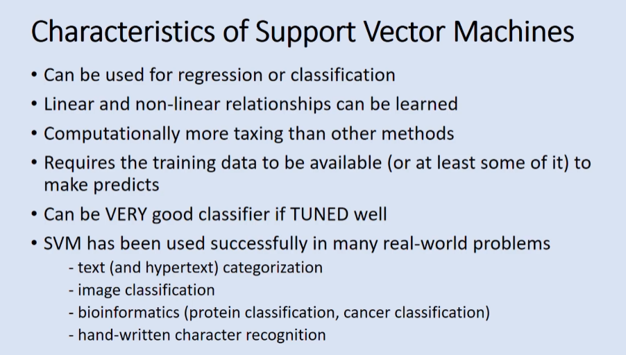

## Linear Separation

> Maximize the distance between classes

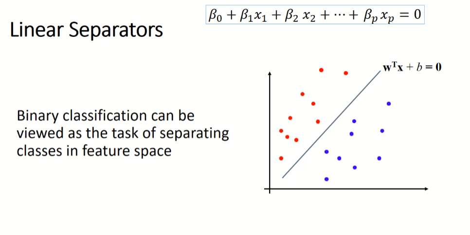

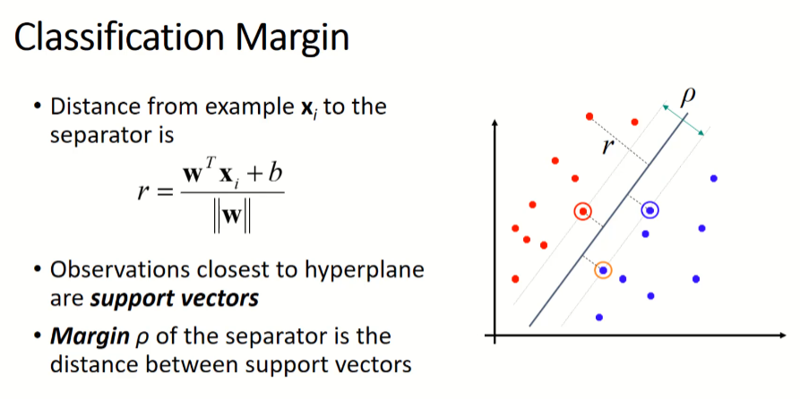

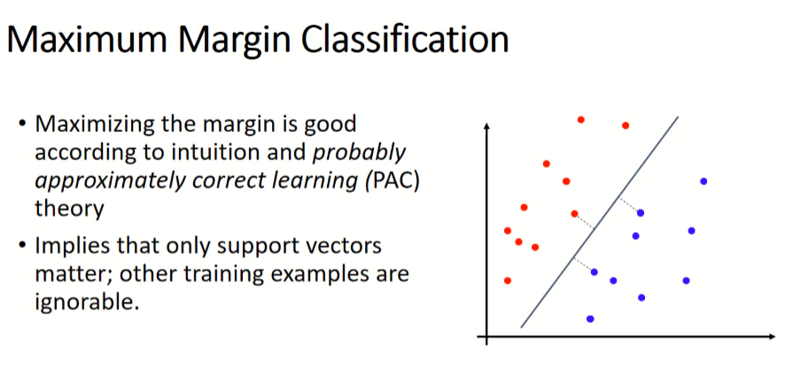

## Example

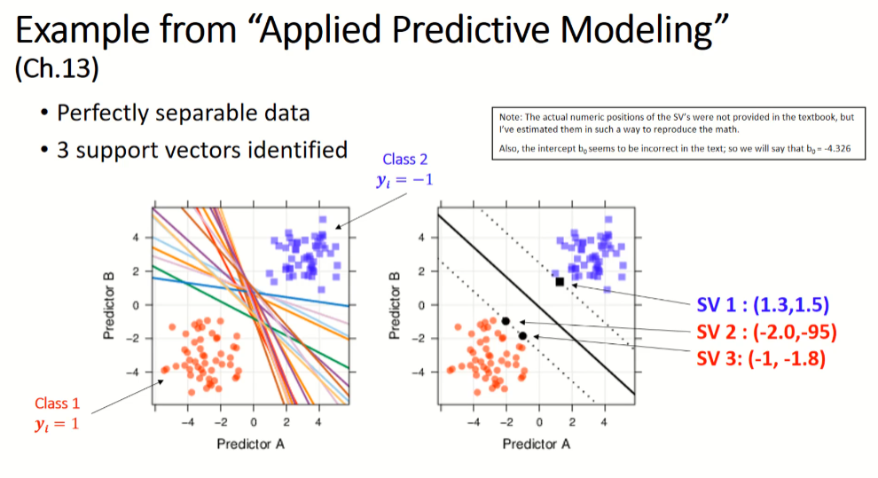

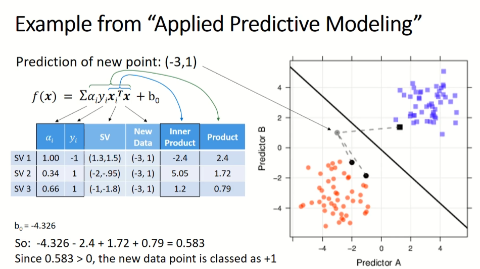

## Summary

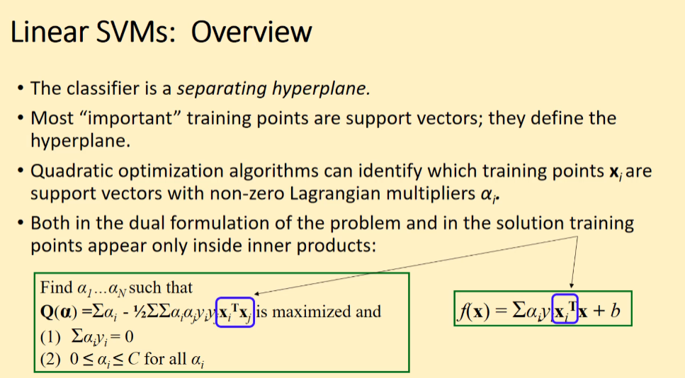

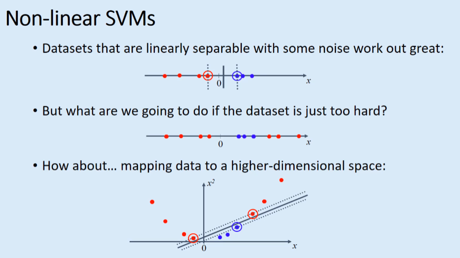

## The Kernel Trick

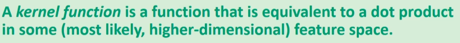

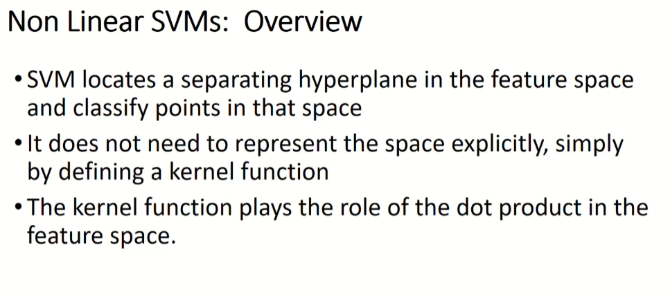

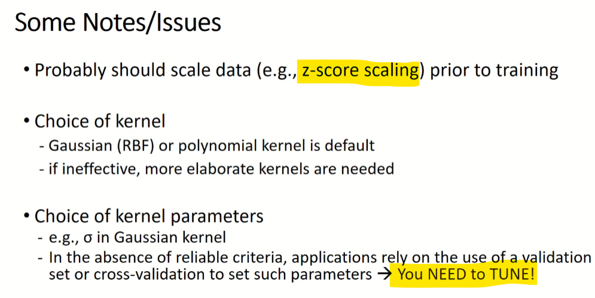

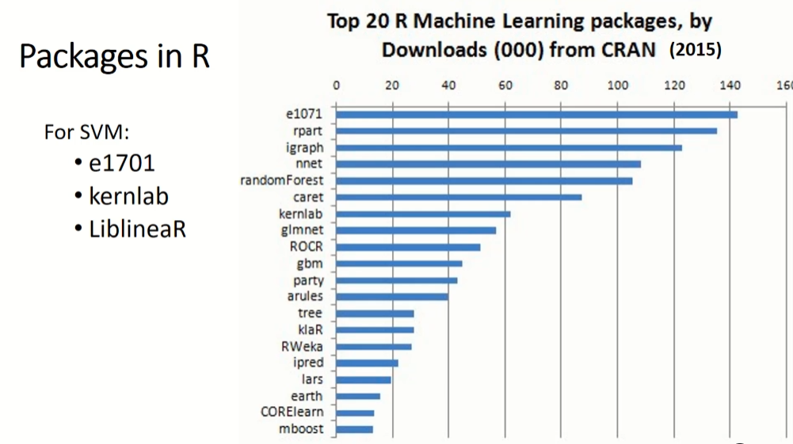

# R Example

``` r
library(mlbench) # Glass data
library(kernlab) # ksvm function

data(Glass)
names(Glass)
```

     [1] "RI"   "Na"   "Mg"   "Al"   "Si"   "K"    "Ca"   "Ba"   "Fe"   "Type"

``` r
## train a support vector machine
fit.svm <- ksvm(
  Type ~ .,
  data   = Glass,
  kernel = "rbfdot"           # Radial basis function kernal
  # C      = 5, # cost 
  # cross  = 3  # cross validatoin
)

fit.svm # view results
```

    Support Vector Machine object of class "ksvm" 

    SV type: C-svc  (classification) 
     parameter : cost C = 1 

    Gaussian Radial Basis kernel function. 
     Hyperparameter : sigma =  0.286630094787891 

    Number of Support Vectors : 174 

    Objective Function Value : -69.341 -30.3014 -6.9018 -6.9379 -8.6788 -28.1581 -12.2833 -8.9432 -12.9344 -5.9865 -6.1009 -7.1005 -6.5426 -8.6444 -7.1136 
    Training error : 0.17757 
