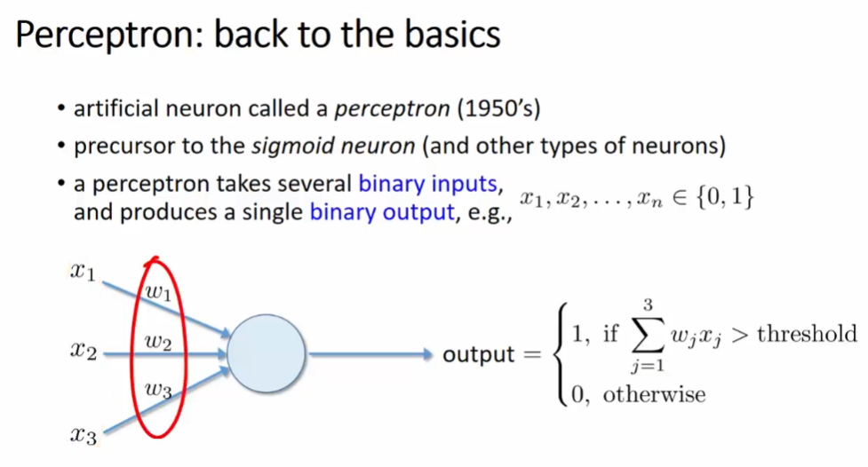

Neural Network & Deep Learning
================
Daniel Carpenter

- <a href="#concepts" id="toc-concepts">1 Concepts</a>
  - <a href="#overview" id="toc-overview">1.1 Overview</a>
    - <a href="#ideas" id="toc-ideas">1.1.1 Ideas</a>
    - <a href="#training" id="toc-training">1.1.2 Training</a>
  - <a href="#deep-learning" id="toc-deep-learning">1.2 Deep Learning</a>
  - <a href="#cnns" id="toc-cnns">1.3 CNN’s</a>
  - <a href="#r-example" id="toc-r-example">1.4 R Example</a>

# Concepts

## Overview

### Ideas

### Training

## Deep Learning

## CNN’s

## R Example
