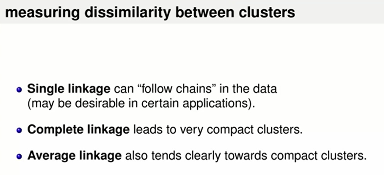
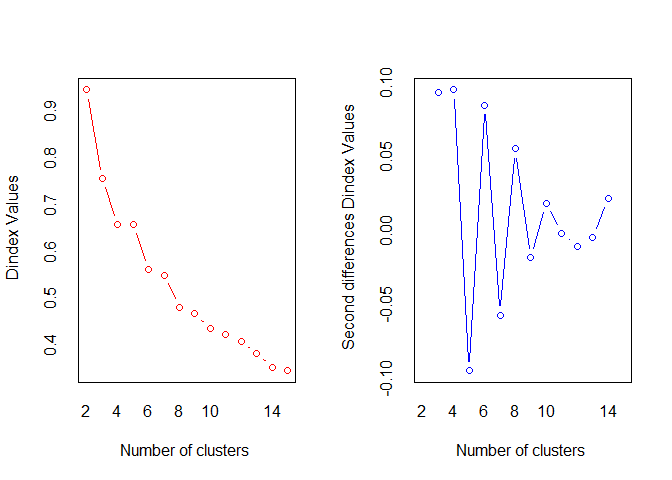

Clustering
================
Daniel Carpenter

-   <a href="#concepts" id="toc-concepts"><span
    class="toc-section-number">1</span> Concepts</a>
    -   <a href="#overview" id="toc-overview"><span
        class="toc-section-number">1.1</span> Overview</a>
        -   <a href="#what-is-clustering" id="toc-what-is-clustering"><span
            class="toc-section-number">1.1.1</span> What is clustering?</a>
    -   <a href="#different-types-of-clustering"
        id="toc-different-types-of-clustering"><span
        class="toc-section-number">1.2</span> Different Types of Clustering</a>
        -   <a href="#partitional-clustering" id="toc-partitional-clustering"><span
            class="toc-section-number">1.2.1</span> 1 - Partitional Clustering</a>
        -   <a href="#section" id="toc-section"><span
            class="toc-section-number">1.2.2</span> </a>
        -   <a href="#section-1" id="toc-section-1"><span
            class="toc-section-number">1.2.3</span> </a>
        -   <a href="#hierarchical-clustering"
            id="toc-hierarchical-clustering"><span
            class="toc-section-number">1.2.4</span> 2 - Hierarchical Clustering</a>
        -   <a href="#density-clustering" id="toc-density-clustering"><span
            class="toc-section-number">1.2.5</span> 3 - Density Clustering</a>
    -   <a href="#section-2" id="toc-section-2"><span
        class="toc-section-number">1.3</span> </a>
    -   <a href="#section-3" id="toc-section-3"><span
        class="toc-section-number">1.4</span> </a>
    -   <a href="#section-4" id="toc-section-4"><span
        class="toc-section-number">1.5</span> </a>
    -   <a href="#summary" id="toc-summary"><span
        class="toc-section-number">1.6</span> Summary</a>
    -   <a href="#r-example" id="toc-r-example"><span
        class="toc-section-number">1.7</span> R Example</a>

# Concepts

## Overview

-   Differentiate among three types of clustering: `partitional`,
    `hierarchical`, and `density-based` clustering

-   Identify the strengths and weaknesses of k-means clustering

-   Employ strategies to mitigate the weaknesses of k-means clustering

-   Implement a variety of linkage techniques for hierarchical
    clustering

-   Contrast density-based clustering results with partitioned and
    nested clustering paradigms

### What is clustering?

> Figuring out how to group the data
>
> Typically this is referred to as “data mining”


Examples and uses


Properties of measuring similarity


Overview of three types of clustering


## Different Types of Clustering

### 1 - Partitional Clustering


Steps


Evaluation

### 


Strengths of K-Means


Weaknesses of K-Means

### 

Overcoming Weaknesses


### 2 - Hierarchical Clustering





### 3 - Density Clustering

## 

## 

## 

## Summary


## R Example

``` r
#Example of clustering for ISE 5103 Intelligent Data Analytics
#Charles Nicholson
#November 2015


library(ggplot2)    #for graphics and the dataset for this example session
library(cluster)    #provides more cluster algorithms than base R (e.g. PAM)
library(useful)     #provides a plot function for clusters and "FitKMeans" and "PlotHartigan" functions
library(NbClust)    #provides tons of tools for identifying the "right" number of clusters
library(rgl)        #for 3D rotating plots

#check out the input paramters for k-means and various options
?kmeans
```

    starting httpd help server ... done

``` r
#to start let's look at some really simple data: 2 dimensions 
data (cars,package="caret")
cars<-cars[,c("Price","Mileage")]   #price and mileage for several cars listed for resale in 2005 Kelly Blue Book
head(cars)
```

         Price Mileage
    1 22661.05   20105
    2 21725.01   13457
    3 29142.71   31655
    4 30731.94   22479
    5 33358.77   17590
    6 30315.17   23635

``` r
summary(cars)
```

         Price          Mileage     
     Min.   : 8639   Min.   :  266  
     1st Qu.:14273   1st Qu.:14624  
     Median :18025   Median :20914  
     Mean   :21343   Mean   :19832  
     3rd Qu.:26717   3rd Qu.:25213  
     Max.   :70755   Max.   :50387  

``` r
#let's scale the data..
carScaled<-scale(cars)  #default is mean centering with scaling by standard deviation


#kmeans is a function in the standard R package "stats"
carsKM <- kmeans(carScaled,3, nstart=10)          

#note above: nstart=10   -- this performs the clustering 10 times with 10 different initial
#seeds; the clustering result with the minimum error is kept.


#we can take a look at the cluster results
carsKM$centers  # the centroids of the final clusers (remember, these are scaled)
```

           Price    Mileage
    1  1.5874781 -0.2313049
    2 -0.3321564 -1.1380479
    3 -0.4455946  0.6093903

``` r
carsKM$size #and the size of each cluster
```

    [1] 165 201 438

``` r
# a ggplot of the original 2D data color-coded by the cluster number
p<-qplot(data=cars, x=Price, y=Mileage, color=factor(carsKM$cluster))  #plot the 2 variables and the cluster color
g <- guide_legend("Cluster")                  #retitle the legend...
p + guides(color = g, size = g, shape = g)    #retitle the legend...
```


``` r
#create our own plot function to look for "Within cluster Sum of square error 'elbow' plot"
#defaults to 15 as clusters max

wssplot <- function(data, nc=15){                    

  par(mfrow=c(1,2))
  
  wss <- NULL  
  pctExp <-NULL
  
  for (k in 1:nc)
  {
     kclus <- kmeans(data, centers=k)
     wss[k] <- kclus$tot.withinss      #store the total within SSE for given k
     pctExp[k] <- 1-wss[k]/kclus$totss
  }
  
  plot(1:nc, wss, type="b", xlab="Number of Clusters",
       ylab="Within groups sum of squares")

  plot(1:nc, pctExp, type="b", xlab="Number of Clusters",
       ylab="Pct Explained")
  
  par(mfrow=c(1,1))
}


#unfortunaely, there is no obivous "elbow"
wssplot(carScaled,nc=30)
```


``` r
# "Hartigan's rule is one statistical technique to "find" the elbow
clusFit<-FitKMeans(carScaled,max.clusters=30,nstart=20)   #evaluates k using the "Hartigan" rule
clusFit
```

       Clusters  Hartigan AddCluster
    1         2 451.92520       TRUE
    2         3 466.29817       TRUE
    3         4 205.39133       TRUE
    4         5 217.80511       TRUE
    5         6 122.46559       TRUE
    6         7 128.08317       TRUE
    7         8 108.52906       TRUE
    8         9 104.22500       TRUE
    9        10  91.82523       TRUE
    10       11  79.43256       TRUE
    11       12  76.63020       TRUE
    12       13  77.73274       TRUE
    13       14  66.02849       TRUE
    14       15  54.62570       TRUE
    15       16  78.14959       TRUE
    16       17  42.29698       TRUE
    17       18  25.37699       TRUE
    18       19  33.96420       TRUE
    19       20  70.00931       TRUE
    20       21  38.40964       TRUE
    21       22  47.81685       TRUE
    22       23  55.01406       TRUE
    23       24  26.26407       TRUE
    24       25  14.95363       TRUE
    25       26  56.06510       TRUE
    26       27  19.80026       TRUE
    27       28  29.10766       TRUE
    28       29  57.20457       TRUE
    29       30  24.65782       TRUE

``` r
PlotHartigan(clusFit)
```


``` r
#FYI: Hartigan rule is: ADD CLUSTER if (sum(k$withinss)/sum(kplus1$withinss)-1)*(nrow(x)-k-1) > 10

#unfortunately, with even with this technique, it seems to want to add too many clusters for this data


#demonstrate "NbClust"  
#since it takes a long time to run, demo on a small sample

# the NbClust package contains several techniques for evaluating the 'right' value for k
# the package identifies the value of k indicated by each statistical procedure
# some of the techniques agree, others don't

carScaledsamp<-carScaled[sample(nrow(carScaled),200),]

NbClust(carScaledsamp,method="kmeans")
```


    *** : The Hubert index is a graphical method of determining the number of clusters.
                    In the plot of Hubert index, we seek a significant knee that corresponds to a 
                    significant increase of the value of the measure i.e the significant peak in Hubert
                    index second differences plot. 
     



    *** : The D index is a graphical method of determining the number of clusters. 
                    In the plot of D index, we seek a significant knee (the significant peak in Dindex
                    second differences plot) that corresponds to a significant increase of the value of
                    the measure. 
     
    ******************************************************************* 
    * Among all indices:                                                
    * 8 proposed 2 as the best number of clusters 
    * 4 proposed 3 as the best number of clusters 
    * 2 proposed 4 as the best number of clusters 
    * 1 proposed 5 as the best number of clusters 
    * 1 proposed 6 as the best number of clusters 
    * 1 proposed 7 as the best number of clusters 
    * 3 proposed 8 as the best number of clusters 
    * 1 proposed 10 as the best number of clusters 
    * 2 proposed 14 as the best number of clusters 
    * 1 proposed 15 as the best number of clusters 

                       ***** Conclusion *****                            
     
    * According to the majority rule, the best number of clusters is  2 
     
     
    ******************************************************************* 

    $All.index
           KL       CH Hartigan     CCC    Scott  Marriot     TrCovW   TraceW
    2  3.9987 107.1257 117.0820 -2.2815 228.0457 49622.50 26623.7363 255.6524
    3  0.7380 143.0507  45.6493 -5.0079 360.3112 57630.22  6184.9810 160.6539
    4  0.8869 132.0087  29.6139 -6.1345 443.2720 67667.60  4684.6206 130.4303
    5  0.7143 120.7498  68.1528 -7.3871 499.7648 79712.83  3442.7300 113.3101
    6  0.4933 143.2538 -13.2994 -5.1931 618.6600 63345.11  1637.3175  83.9644
    7  1.0310 108.4160  81.1899 -8.9882 593.0188 98013.51  2340.5554  90.1441
    8  5.4921 142.8747  14.8448 -5.3919 738.2798 61921.22   652.5199  63.4517
    9  0.8587 135.8257  32.2408 -6.1683 769.5377 67029.93   561.7484  58.8979
    10 1.8146 143.9385  13.1862 -5.4550 823.7555 63103.19   571.5270  50.3918
    11 0.3977 139.1178   3.7043 -6.0080 852.9795 65974.74   424.8801  47.1215
    12 1.0187 128.6021  29.6309 -7.1710 860.9126 75461.97   408.2122  46.2157
    13 1.0340 138.1956  28.6867 -6.2679 925.2956 64186.91   495.3198  39.9233
    14 0.7509 148.5423  -3.9343 -5.3513 983.9502 55519.96   454.9219  34.6135
    15 0.9962 134.0091  31.0756 -6.8616 966.9063 69404.21   367.4548  35.3615
       Friedman   Rubin Cindex     DB Silhouette   Duda Pseudot2   Beale Ratkowsky
    2    2.0423  1.5428 0.1938 1.2443     0.4308 1.0358  -3.5553 -0.0338    0.3316
    3    2.9641  2.4551 0.1945 0.9607     0.3897 1.2713 -22.4070 -0.2073    0.4430
    4    4.0625  3.0240 0.1648 1.0527     0.3451 0.6506  11.2786  0.5213    0.4090
    5    5.0282  3.4809 0.2244 0.9777     0.3790 0.7863  17.3893  0.2508    0.3770
    6    7.4151  4.6974 0.2389 0.9240     0.3679 5.8200 -20.7045 -0.5521    0.3620
    7    6.8389  4.3754 0.1667 1.0147     0.3319 0.3240  47.9780  1.9991    0.3320
    8   10.8679  6.2160 0.2015 0.8618     0.3571 3.2126 -42.0120 -0.6690    0.3237
    9   11.9998  6.6966 0.1976 0.8637     0.3560 2.0072 -25.5918 -0.4845    0.3072
    10  13.7805  7.8270 0.1830 0.8050     0.3701 1.3742 -11.7087 -0.2610    0.2952
    11  15.0419  8.3702 0.1768 0.8119     0.3535 0.7598   5.6908  0.2108    0.2828
    12  15.3225  8.5343 0.1918 0.9265     0.3172 1.0746  -1.5973 -0.0661    0.2712
    13  18.5398  9.8794 0.1924 0.9784     0.3335 1.0942  -1.7224 -0.0754    0.2630
    14  21.9651 11.3949 0.1769 0.8719     0.3578 1.4160  -6.4635 -0.2350    0.2552
    15  20.5157 11.1539 0.1774 0.9000     0.3551 2.5056  -6.6098 -0.5547    0.2464
           Ball Ptbiserial     Frey McClain   Dunn Hubert SDindex Dindex   SDbw
    2  127.8262     0.5122   1.1610  0.2948 0.0357 0.0046  5.2063 0.9464 1.2828
    3   53.5513     0.4971   0.6914  0.8090 0.0058 0.0043  3.5175 0.7563 1.1342
    4   32.6076     0.4732  -2.7024  1.1971 0.0191 0.0051  3.4086 0.6596 0.7299
    5   22.6620     0.5374   0.8480  0.9246 0.0348 0.0057  3.7762 0.6581 0.8538
    6   13.9941     0.4988   2.4115  1.2298 0.0252 0.0066  4.1653 0.5618 0.5414
    7   12.8777     0.4440   0.2899  1.6354 0.0176 0.0062  4.7398 0.5504 0.6110
    8    7.9315     0.4363   0.3148  1.7789 0.0314 0.0072  4.4216 0.4819 0.5179
    9    6.5442     0.4346   0.1800  1.8011 0.0314 0.0073  4.1735 0.4686 0.4578
    10   5.0392     0.4342   0.9033  1.8202 0.0314 0.0075  3.8700 0.4371 0.3168
    11   4.2838     0.4174  -5.7280  1.9865 0.0099 0.0076  4.3618 0.4241 0.3651
    12   3.8513     0.3950   0.1534  2.2390 0.0236 0.0076  5.3889 0.4093 0.4994
    13   3.0710     0.3929   0.3515  2.2458 0.0334 0.0078  4.9806 0.3841 0.2920
    14   2.4724     0.3799 -17.7897  2.3759 0.0334 0.0079  4.9389 0.3542 0.2614
    15   2.3574     0.3474   0.0422  2.8767 0.0335 0.0079  5.8736 0.3463 0.2464

    $All.CriticalValues
       CritValue_Duda CritValue_PseudoT2 Fvalue_Beale
    2          0.3178           221.0651       1.0000
    3          0.2704           283.3204       1.0000
    4          0.2646            58.3768       0.5962
    5          0.0222          2825.2496       0.7802
    6         -0.5522           -70.2739       1.0000
    7          0.1881            99.2518       0.1471
    8          0.2704           164.5957       1.0000
    9          0.2311           169.6463       1.0000
    10         0.1881           185.5577       1.0000
    11        -0.5522           -50.5972       0.8184
    12         0.1556           124.8529       1.0000
    13        -0.1409          -161.9451       1.0000
    14        -0.3258           -89.5318       1.0000
    15         0.0222           485.5898       1.0000

    $Best.nc
                        KL       CH Hartigan     CCC   Scott  Marriot   TrCovW
    Number_clusters 8.0000  14.0000   7.0000  2.0000   8.000     6.00     3.00
    Value_Index     5.4921 148.5423  94.4893 -2.2815 145.261 51036.11 20438.76
                     TraceW Friedman   Rubin Cindex     DB Silhouette   Duda
    Number_clusters  3.0000    8.000 14.0000 4.0000 10.000     2.0000 2.0000
    Value_Index     64.7748    4.029 -1.7566 0.1648  0.805     0.4308 1.0358
                    PseudoT2   Beale Ratkowsky    Ball PtBiserial  Frey McClain
    Number_clusters   2.0000  2.0000     3.000  3.0000     5.0000 2.000  2.0000
    Value_Index      -3.5553 -0.0338     0.443 74.2749     0.5374 1.161  0.2948
                      Dunn Hubert SDindex Dindex    SDbw
    Number_clusters 2.0000      0  4.0000      0 15.0000
    Value_Index     0.0357      0  3.4086      0  0.2464

    $Best.partition
      [1] 2 2 2 2 1 1 2 2 2 2 2 2 2 2 2 1 2 2 2 2 2 2 2 2 2 2 2 2 2 2 1 1 2 2 2 2 1
     [38] 2 1 2 2 2 1 2 2 2 1 1 1 2 2 1 2 2 2 2 2 1 2 2 2 2 2 2 1 2 1 1 2 2 2 2 2 2
     [75] 2 2 1 1 1 1 1 1 2 2 2 2 2 1 2 1 2 2 1 2 2 1 2 2 1 2 2 1 2 1 2 2 1 2 2 2 2
    [112] 2 2 2 2 2 2 2 2 2 2 2 2 2 2 2 2 1 1 1 2 2 2 2 2 2 2 2 2 2 2 1 2 2 2 2 2 2
    [149] 2 2 2 1 1 2 2 2 2 2 2 2 1 2 2 2 2 2 2 1 2 2 1 1 2 1 2 2 1 2 2 1 2 2 2 2 2
    [186] 2 1 2 2 2 2 2 1 2 2 1 2 2 2 2

``` r
############### irisdata ###################

#let's get a little bit more complex, and see how we do with "ground truth" available data

# we know that there really are 3 different species of in the Iris data
# let's see how many clusters are identified using these techniques

set.seed(42)
data(iris)
iris$Species <- factor(iris$Species,
                       levels = c("versicolor","virginica","setosa"))

iris[,1:4]<-scale(iris[,1:4])  # first scale the data
head(iris)
```

      Sepal.Length Sepal.Width Petal.Length Petal.Width Species
    1   -0.8976739  1.01560199    -1.335752   -1.311052  setosa
    2   -1.1392005 -0.13153881    -1.335752   -1.311052  setosa
    3   -1.3807271  0.32731751    -1.392399   -1.311052  setosa
    4   -1.5014904  0.09788935    -1.279104   -1.311052  setosa
    5   -1.0184372  1.24503015    -1.335752   -1.311052  setosa
    6   -0.5353840  1.93331463    -1.165809   -1.048667  setosa

``` r
wssplot(iris[,1:4],nc=5)  #again, no obvious elbow...
```


``` r
#let's try NbClust...
NbClust(iris[,1:4],method="kmeans")
```


    *** : The Hubert index is a graphical method of determining the number of clusters.
                    In the plot of Hubert index, we seek a significant knee that corresponds to a 
                    significant increase of the value of the measure i.e the significant peak in Hubert
                    index second differences plot. 
     


    *** : The D index is a graphical method of determining the number of clusters. 
                    In the plot of D index, we seek a significant knee (the significant peak in Dindex
                    second differences plot) that corresponds to a significant increase of the value of
                    the measure. 
     
    ******************************************************************* 
    * Among all indices:                                                
    * 10 proposed 2 as the best number of clusters 
    * 6 proposed 3 as the best number of clusters 
    * 1 proposed 4 as the best number of clusters 
    * 1 proposed 5 as the best number of clusters 
    * 3 proposed 12 as the best number of clusters 
    * 1 proposed 14 as the best number of clusters 
    * 2 proposed 15 as the best number of clusters 

                       ***** Conclusion *****                            
     
    * According to the majority rule, the best number of clusters is  2 
     
     
    ******************************************************************* 

    $All.index
           KL       CH Hartigan    CCC     Scott   Marriot    TrCovW   TraceW
    2  3.9498 251.3493  87.3699 3.3595  357.8871 1471010.8 1643.9577 220.8793
    3  5.1669 241.9044  33.1486 5.1886  489.5281 1376126.9 1225.4423 138.8884
    4  0.5567 207.2659  37.4374 3.6814  555.6392 1574434.9  705.5542 113.3319
    5  3.5421 203.2674  19.5911 3.5789  652.9526 1285860.3  667.4659  90.2022
    6  0.7874 187.2031  19.0351 3.3533  720.9245 1176948.3  510.6882  79.4655
    7  1.1988 178.5481  16.2779 3.4533  763.2771 1207890.6  394.3442  70.1876
    8  0.5699 171.5792  20.5630 3.5166  846.4971  905868.3  351.9925  63.0146
    9  2.1882 173.2143  13.2186 4.2469  921.2836  696371.3  222.4485  55.0437
    10 1.1910 168.6666   2.3371 4.3223  945.2575  732730.5  185.9404  50.3257
    11 0.5545 153.4637  14.6665 3.2722  946.7235  877980.9  182.2093  49.4994
    12 3.4040 154.4471   3.2103 3.7498 1020.6039  638493.7  153.0732  44.7750
    13 1.5176 144.0858   6.7708 3.0052 1032.0196  694431.0  143.4864  43.7571
    14 0.0701 139.0737  31.6603 2.7569 1054.2586  694400.3  120.0184  41.6964
    15 4.5221 160.2774  10.5759 5.2266 1121.4592  509296.4   75.4837  33.8226
       Friedman   Rubin Cindex     DB Silhouette   Duda Pseudot2   Beale Ratkowsky
    2   50.5461  2.6983 0.2709 0.6828     0.5818 1.9311 -48.6978 -1.1403    0.5535
    3   58.5837  4.2912 0.2428 0.9141     0.4599 0.4603  56.2860  2.7732    0.5028
    4   61.9721  5.2589 0.3474 0.9814     0.3869 0.9204   4.3246  0.2048    0.4491
    5   67.5363  6.6074 0.3598 1.0526     0.3455 2.2695 -31.8842 -1.2891    0.4114
    6   77.5691  7.5001 0.3307 1.1560     0.3266 0.5343  27.0234  2.0266    0.3797
    7   78.2758  8.4915 0.3177 1.1076     0.3254 0.6799  14.1232  1.0960    0.3548
    8   86.3269  9.4581 0.2989 1.1326     0.3227 1.8821 -14.9977 -1.0719    0.3341
    9   95.0688 10.8278 0.2730 1.0595     0.3388 0.9118   3.4826  0.2219    0.3174
    10  94.7241 11.8429 0.2580 1.0584     0.3377 1.4544  -8.1230 -0.7071    0.3025
    11  91.0161 12.0406 0.2545 1.1341     0.3075 2.1682 -13.4695 -1.2007    0.2886
    12 105.5354 13.3110 0.2442 0.9875     0.3299 1.5579  -6.8042 -0.8213    0.2775
    13 106.5486 13.6207 0.2469 1.0763     0.2958 1.8617 -11.5714 -1.0158    0.2669
    14 108.5813 14.2938 0.2412 1.0789     0.2918 1.1559  -1.4840 -0.2931    0.2577
    15 110.4875 17.6214 0.3555 0.9910     0.3154 2.1520  -8.5650 -1.1749    0.2507
           Ball Ptbiserial    Frey McClain   Dunn Hubert SDindex Dindex   SDbw
    2  110.4396     0.7815  1.4732  0.3492 0.2674 0.0028  3.0377 1.0566 0.4276
    3   46.2961     0.6797  2.0078  0.7938 0.0265 0.0030  2.8248 0.8573 0.5612
    4   28.3330     0.6245  0.6583  1.0201 0.0399 0.0032  2.5023 0.7738 0.4574
    5   18.0404     0.5905  0.7997  1.2718 0.0808 0.0034  2.4689 0.6936 0.2555
    6   13.2443     0.5556  0.9092  1.5025 0.0842 0.0036  2.9665 0.6558 0.2588
    7   10.0268     0.5340  0.9015  1.6553 0.0912 0.0037  2.7896 0.6120 0.1772
    8    7.8768     0.4992  0.6392  1.9329 0.0861 0.0037  3.0573 0.5747 0.1510
    9    6.1160     0.4624  0.2551  2.2801 0.0861 0.0038  3.0630 0.5336 0.1361
    10   5.0326     0.4561  1.8980  2.3325 0.0861 0.0038  2.9536 0.5155 0.1257
    11   4.4999     0.4359  0.2507  2.5654 0.0475 0.0038  3.7685 0.5093 0.1325
    12   3.7312     0.4307 -2.8078  2.6103 0.0912 0.0038  3.4704 0.4861 0.0956
    13   3.3659     0.4028  0.7216  3.0160 0.0475 0.0039  5.5228 0.4790 0.1024
    14   2.9783     0.3893  0.0340  3.2251 0.0475 0.0039  5.6579 0.4664 0.0844
    15   2.2548     0.3919  0.1034  3.1206 0.0750 0.0040  6.0749 0.4380 0.0638

    $All.CriticalValues
       CritValue_Duda CritValue_PseudoT2 Fvalue_Beale
    2          0.5551            80.9487       1.0000
    3          0.5551            38.4707       0.0284
    4          0.5633            38.7617       0.9355
    5          0.4195            78.8634       1.0000
    6          0.4590            36.5375       0.0961
    7          0.4656            34.4267       0.3624
    8          0.3890            50.2528       1.0000
    9          0.3999            54.0151       0.9254
    10         0.3508            48.1166       1.0000
    11         0.3008            58.1006       1.0000
    12         0.3999            28.5079       1.0000
    13         0.2576            72.0597       1.0000
    14         0.2316            36.4880       1.0000
    15         0.2576            46.1182       1.0000

    $Best.nc
                        KL       CH Hartigan     CCC    Scott  Marriot   TrCovW
    Number_clusters 3.0000   2.0000   3.0000 15.0000   3.0000     12.0   4.0000
    Value_Index     5.1669 251.3493  54.2213  5.2266 131.6411 295424.5 519.8881
                     TraceW Friedman   Rubin  Cindex     DB Silhouette   Duda
    Number_clusters  3.0000  12.0000 12.0000 14.0000 2.0000     2.0000 2.0000
    Value_Index     56.4345  14.5193 -0.9608  0.2412 0.6828     0.5818 1.9311
                    PseudoT2   Beale Ratkowsky    Ball PtBiserial   Frey McClain
    Number_clusters   2.0000  2.0000    2.0000  3.0000     2.0000 3.0000  2.0000
    Value_Index     -48.6978 -1.1403    0.5535 64.1435     0.7815 2.0078  0.3492
                      Dunn Hubert SDindex Dindex    SDbw
    Number_clusters 2.0000      0  5.0000      0 15.0000
    Value_Index     0.2674      0  2.4689      0  0.0638

    $Best.partition
      [1] 1 1 1 1 1 1 1 1 1 1 1 1 1 1 1 1 1 1 1 1 1 1 1 1 1 1 1 1 1 1 1 1 1 1 1 1 1
     [38] 1 1 1 1 1 1 1 1 1 1 1 1 1 2 2 2 2 2 2 2 2 2 2 2 2 2 2 2 2 2 2 2 2 2 2 2 2
     [75] 2 2 2 2 2 2 2 2 2 2 2 2 2 2 2 2 2 2 2 2 2 2 2 2 2 2 2 2 2 2 2 2 2 2 2 2 2
    [112] 2 2 2 2 2 2 2 2 2 2 2 2 2 2 2 2 2 2 2 2 2 2 2 2 2 2 2 2 2 2 2 2 2 2 2 2 2
    [149] 2 2

``` r
#we will use 3 clusters for k-means
cl <- kmeans(iris[,1:4],3)
iris$cluster <- as.factor(cl$cluster)
head(iris)
```

      Sepal.Length Sepal.Width Petal.Length Petal.Width Species cluster
    1   -0.8976739  1.01560199    -1.335752   -1.311052  setosa       1
    2   -1.1392005 -0.13153881    -1.335752   -1.311052  setosa       2
    3   -1.3807271  0.32731751    -1.392399   -1.311052  setosa       2
    4   -1.5014904  0.09788935    -1.279104   -1.311052  setosa       2
    5   -1.0184372  1.24503015    -1.335752   -1.311052  setosa       1
    6   -0.5353840  1.93331463    -1.165809   -1.048667  setosa       1

``` r
#to visualize this 4d data in 3d let's use PCA, and then color code base on clusters
pc <- princomp(iris[,1:4], cor=TRUE, scores=TRUE)
summary(pc)
```

    Importance of components:
                              Comp.1    Comp.2     Comp.3      Comp.4
    Standard deviation     1.7083611 0.9560494 0.38308860 0.143926497
    Proportion of Variance 0.7296245 0.2285076 0.03668922 0.005178709
    Cumulative Proportion  0.7296245 0.9581321 0.99482129 1.000000000

``` r
plot3d(pc$scores[,1:3], col=iris$cluster, main="k-means clusters")

#and a quick check to see how our 'natural clusters' align with the species data
table(iris$Species, iris$cluster)
```

                
                  1  2  3
      versicolor  0  4 46
      virginica   0  0 50
      setosa     33 17  0

``` r
dev.off()
```

    null device 
              1 

``` r
#let's try hiearchial clustering for the iris data
#hiearchial clustering requires a distance matrix

di <- dist(iris[,1:4], method="euclidean")   # with hiearchical clustering, only need distance matrix

hc <- hclust(di, method="ward.D")
plot(hc, labels=FALSE)

rect.hclust(hc, k=3, border="red")     #if we were to "cut" at k=3, what are the groups?
iris$hcluster <- as.factor(cutree(hc, k=3))   #cutting at k=3, here are the assignments

#and a quick check to see how our 'natural clusters' align with the species data
table( iris$Species, iris$hcluster)
```

                
                  1  2  3
      versicolor  0 50  0
      virginica   0 23 27
      setosa     49  1  0

``` r
############## mtcars data ##################


#Some easier data to play around with for hiearchial clustering
#use small data set for example...
#mtcars: 1974 Motor Trend US magazine data
# fuel consumption, 10 aspects of design and performance 

data(mtcars)   
head(mtcars)
```

                       mpg cyl disp  hp drat    wt  qsec vs am gear carb
    Mazda RX4         21.0   6  160 110 3.90 2.620 16.46  0  1    4    4
    Mazda RX4 Wag     21.0   6  160 110 3.90 2.875 17.02  0  1    4    4
    Datsun 710        22.8   4  108  93 3.85 2.320 18.61  1  1    4    1
    Hornet 4 Drive    21.4   6  258 110 3.08 3.215 19.44  1  0    3    1
    Hornet Sportabout 18.7   8  360 175 3.15 3.440 17.02  0  0    3    2
    Valiant           18.1   6  225 105 2.76 3.460 20.22  1  0    3    1

``` r
MT<-mtcars[,c("mpg","cyl","disp","hp","wt","qsec")]
MT<-scale(MT)


#NOTE: the 'daisy" function in package "cluster" can handle mixed data for distances using the Gower's Distance method
#e.g.  d<-daisy(mtcars,stand=T)  

d<-daisy(mtcars,stand=T)
```

    Warning in daisy(mtcars, stand = T): binary variable(s) 8, 9 treated as interval
    scaled

``` r
#different distance functions will produce different results


dev.off()
```

    null device 
              1 

``` r
#look at the different shapes of dendrograms based on the linkage techniques

hclus<-hclust(d,method="single")   #notice the long chains (e.g., very unbalanced)
plot(hclus)

hclus<-hclust(d,method="complete")
plot(hclus)

hclus<-hclust(d,method="average")
plot(hclus)

hclus<-hclust(d,method="ward.D")  # notice how balanced the clusters are
plot(hclus)


#for fun and optional -- take a look at movie data from imdb.com

#################### movies data ##################
#we will use "movie rating data" for the example from the "ggplot2" library
# install.packages('ggplot2movies')
library('ggplot2movies')
?movies
data(movies)
View(movies)


#but let's clean it up a bit first...
movies2<-movies[complete.cases(movies),c(1:6,17)]    #keep only complete cases; keep some variables
movies2<-movies2[movies2$votes>2500,]                #exclude movies with only a few ratings

mDD<-duplicated(movies2[,c("title")])
movies2<-movies2[!mDD,]

dat<-round(scale(movies2[,-c(1,7)]),3)               #scale the numeric data (and round the results)
row.names(dat)<-movies2$title                        #keep the movie titles as row.names
dat<-as.data.frame(dat)


#we will start by looking at partitions
wssplot(dat,nc=30)   #-- again, no clear elbow!  
```

    Warning: did not converge in 10 iterations

``` r
set.seed(100)      #just so that we will all get the same results!

kclus<-kmeans(dat, 6, nstart=5)    #how about trying k=6

plot(kclus,data=dat) #this plot function comes from the "useful" libary uses PCA 

clusInfo<-data.frame(kclus$centers,kclus$size)
clusInfo
```

             year     length      budget     rating       votes kclus.size
    1  0.56625879  0.3389201  1.56101917 -0.1473259  0.17708626        313
    2 -2.22851913 -0.2312077 -0.91936612  0.9339563 -0.20458470        183
    3  0.01190123  0.9218765  0.27377778  1.3547160  3.47887654         81
    4 -1.06658462  3.0500462 -0.33092308  0.9478769  0.09375385         65
    5  0.20304230 -0.1427341 -0.45749396  0.3648474 -0.14853776        662
    6  0.38614789 -0.5685563 -0.04270892 -1.2621502 -0.48717136        426

``` r
#by evaluating the centroids of each variable, we can discuss the 'meaning' of the cluster

#         year     length      budget     rating       votes kclus.size
#1 -2.22851913 -0.2312077 -0.91936612  0.9339563 -0.20458470        183
#2  0.20304230 -0.1427341 -0.45749396  0.3648474 -0.14853776        662
#3  0.01190123  0.9218765  0.27377778  1.3547160  3.47887654         81
#4  0.56625879  0.3389201  1.56101917 -0.1473259  0.17708626        313
#5  0.38614789 -0.5685563 -0.04270892 -1.2621502 -0.48717136        426
#6 -1.06658462  3.0500462 -0.33092308  0.9478769  0.09375385         65

# in this example, cluster #1 are the oldest movies, with smaller budgets, and above average ratings
# whereas, clsuter #4 are big budget movies that are newer but have lower ratings

#(your results might be different!)


movieClus <- data.frame(movies2, clust=kclus$cluster, dat)
head(movieClus[movieClus$clust==2,c("title","rating","budget","year","mpaa")])
```

                                                            title rating   budget
    12 Angry Men                                     12 Angry Men    8.7   340000
    20000 Leagues Under the Sea       20000 Leagues Under the Sea    7.1  5000000
    Adventures of Robin Hood, The   Adventures of Robin Hood, The    8.2  1900000
    Airport                                               Airport    6.4 10000000
    Alice in Wonderland                       Alice in Wonderland    7.2  3000000
    All Quiet on the Western Front All Quiet on the Western Front    8.2  1200000
                                   year mpaa
    12 Angry Men                   1957     
    20000 Leagues Under the Sea    1954     
    Adventures of Robin Hood, The  1938   PG
    Airport                        1970     
    Alice in Wonderland            1951     
    All Quiet on the Western Front 1930     

``` r
#helper function to evaluate "representative data points within clusters"
#and possibly outliers
#-- calculate the distance between the given cluster centers
#-- and the data, and return the distance between the data and the closest cluster center

# NOTE to the progammatically inclined:
# this function is really poorly written in that it requires a "global" name for the cluster object (kclus)
# Sorry.

closest.cluster <- function(x) 
{
  cluster.dist <- apply(kclus$centers, 1, function(y) sqrt(sum((x-y)^2)))
  return(cluster.dist[which.min(cluster.dist)[1]])
}


movieClus$dist <- apply(dat, 1, closest.cluster)   #apply the "distance to nearest cluster function"
movieClus <-movieClus [order(movieClus$dist),]         #sort the data by this new distance

#now we can look at top 10 most representative titles in the cluster

head(movieClus[movieClus$clust==1,c("title","rating","budget","year","dist")],10) 
```

                                          title rating   budget year      dist
    Bandits                             Bandits    6.7 80000000 2001 0.4068084
    Sum of All Fears, The Sum of All Fears, The    6.6 68000000 2002 0.4710377
    6th Day, The                   6th Day, The    5.9 82000000 2000 0.4990758
    What Dreams May Come   What Dreams May Come    6.3 85000000 1998 0.5016524
    Meet the Fockers           Meet the Fockers    6.5 80000000 2004 0.5036388
    Star Trek: Nemesis       Star Trek: Nemesis    6.5 70000000 2002 0.5292958
    S.W.A.T.                           S.W.A.T.    5.9 80000000 2003 0.5469023
    X Files, The                   X Files, The    6.7 66000000 1998 0.5508367
    Score, The                       Score, The    6.8 68000000 2001 0.5513528
    You've Got Mail             You've Got Mail    6.2 65000000 1998 0.5564252

``` r
head(movieClus[movieClus$clust==2,c("title","rating","budget","year","dist")],10)  
```

                                              title rating  budget year      dist
    Breakfast at Tiffany's   Breakfast at Tiffany's    7.7 2500000 1961 0.3422013
    Cat on a Hot Tin Roof     Cat on a Hot Tin Roof    7.8 3000000 1958 0.3956298
    Rebel Without a Cause     Rebel Without a Cause    7.8 1500000 1955 0.4292571
    Dr. No                                   Dr. No    7.2 1100000 1962 0.4302181
    Per un pugno di dollari Per un pugno di dollari    7.8  200000 1964 0.4503492
    Haunting, The                     Haunting, The    7.6 1400000 1963 0.4525766
    From Russia with Love     From Russia with Love    7.3 2000000 1963 0.4799754
    Charade                                 Charade    8.1 4000000 1963 0.4931515
    Dial M for Murder             Dial M for Murder    7.8 1400000 1954 0.4961047
    To Catch a Thief               To Catch a Thief    7.4 2500000 1955 0.5104439

``` r
head(movieClus[movieClus$clust==3,c("title","rating","budget","year","dist")],10) 
```

                                                                                    title
    L.A. Confidential                                                   L.A. Confidential
    Goodfellas                                                                 Goodfellas
    Indiana Jones and the Last Crusade                 Indiana Jones and the Last Crusade
    Twelve Monkeys                                                         Twelve Monkeys
    Star Wars: Episode VI - Return of the Jedi Star Wars: Episode VI - Return of the Jedi
    Die Hard                                                                     Die Hard
    Se7en                                                                           Se7en
    Blade Runner                                                             Blade Runner
    Forrest Gump                                                             Forrest Gump
    Aliens                                                                         Aliens
                                               rating   budget year      dist
    L.A. Confidential                             8.4 35000000 1997 0.4861067
    Goodfellas                                    8.6 25000000 1990 0.7731037
    Indiana Jones and the Last Crusade            8.1 48000000 1989 0.8142112
    Twelve Monkeys                                7.9 29000000 1995 0.8161190
    Star Wars: Episode VI - Return of the Jedi    8.1 32500000 1983 0.8969396
    Die Hard                                      8.0 28000000 1988 0.9724542
    Se7en                                         8.4 30000000 1995 1.0905385
    Blade Runner                                  8.2 28000000 1982 1.1077440
    Forrest Gump                                  8.2 55000000 1994 1.1624426
    Aliens                                        8.3 18500000 1986 1.2137499

``` r
head(movieClus[movieClus$clust==4,c("title","rating","budget","year","dist")],10) 
```

                                      title rating   budget year      dist
    Gandhi                           Gandhi    8.0 22000000 1982 0.4665957
    Barry Lyndon               Barry Lyndon    8.0 11000000 1975 0.5222873
    Right Stuff, The       Right Stuff, The    7.9 27000000 1983 0.5695718
    Fiddler on the Roof Fiddler on the Roof    7.6  9000000 1971 0.8656722
    Deer Hunter, The       Deer Hunter, The    8.1 15000000 1978 0.8895054
    Bridge Too Far, A     Bridge Too Far, A    7.0 26000000 1977 0.9795224
    Patton                           Patton    8.2 12000000 1970 0.9827421
    Wild Bunch, The         Wild Bunch, The    8.2  6000000 1969 0.9871282
    Doctor Zhivago           Doctor Zhivago    7.9 11000000 1965 1.0667210
    Sound of Music, The Sound of Music, The    7.8  8200000 1965 1.1465226

``` r
head(movieClus[movieClus$clust==5,c("title","rating","budget","year","dist")],10) 
```

                                                                            title
    To Die For                                                         To Die For
    Private Parts                                                   Private Parts
    Cop Land                                                             Cop Land
    Everyone Says I Love You                             Everyone Says I Love You
    Hudsucker Proxy, The                                     Hudsucker Proxy, The
    Gift, The                                                           Gift, The
    While You Were Sleeping                               While You Were Sleeping
    Ice Storm, The                                                 Ice Storm, The
    Get Shorty                                                         Get Shorty
    Star Trek VI: The Undiscovered Country Star Trek VI: The Undiscovered Country
                                           rating   budget year      dist
    To Die For                                6.7 20000000 1995 0.3368818
    Private Parts                             6.6 20000000 1997 0.3915010
    Cop Land                                  6.7 15000000 1997 0.4083079
    Everyone Says I Love You                  6.9 20000000 1996 0.4375050
    Hudsucker Proxy, The                      7.4 25000000 1994 0.4485090
    Gift, The                                 6.8 10000000 2000 0.4793190
    While You Were Sleeping                   6.5 17000000 1995 0.4814098
    Ice Storm, The                            7.5 18000000 1997 0.4919517
    Get Shorty                                7.0 30250000 1995 0.4929266
    Star Trek VI: The Undiscovered Country    6.9 30000000 1991 0.5160961

``` r
head(movieClus[movieClus$clust==6,c("title","rating","budget","year","dist")],10) 
```

                                                            title rating   budget
    Dracula 2000                                     Dracula 2000    4.9 28000000
    Watcher, The                                     Watcher, The    5.2 33000000
    Chill Factor                                     Chill Factor    5.0 34000000
    In Dreams                                           In Dreams    5.3 30000000
    Bachelor, The                                   Bachelor, The    5.0 21000000
    Big Momma's House                           Big Momma's House    4.7 30000000
    Exit Wounds                                       Exit Wounds    5.3 33000000
    American Werewolf in Paris, An American Werewolf in Paris, An    5.0 22000000
    Wedding Planner, The                     Wedding Planner, The    4.9 35000000
    Johnny Mnemonic                               Johnny Mnemonic    4.7 26000000
                                   year      dist
    Dracula 2000                   2000 0.2415568
    Watcher, The                   2000 0.2629287
    Chill Factor                   1999 0.2813914
    In Dreams                      1999 0.2835382
    Bachelor, The                  1999 0.3502680
    Big Momma's House              2000 0.3615955
    Exit Wounds                    2001 0.3708809
    American Werewolf in Paris, An 1997 0.3800532
    Wedding Planner, The           2001 0.3871937
    Johnny Mnemonic                1995 0.3951500
