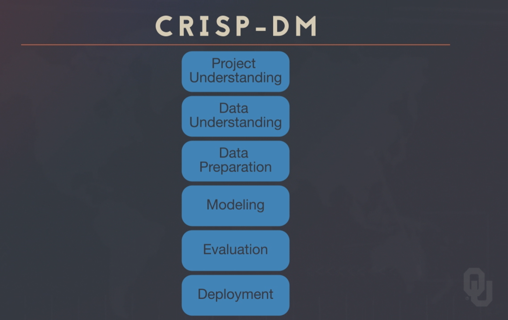
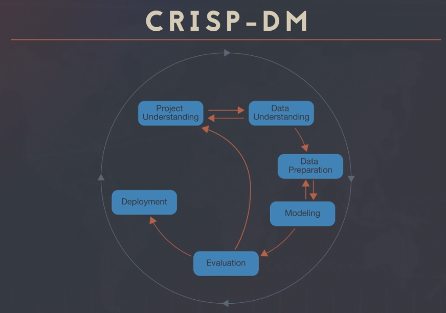
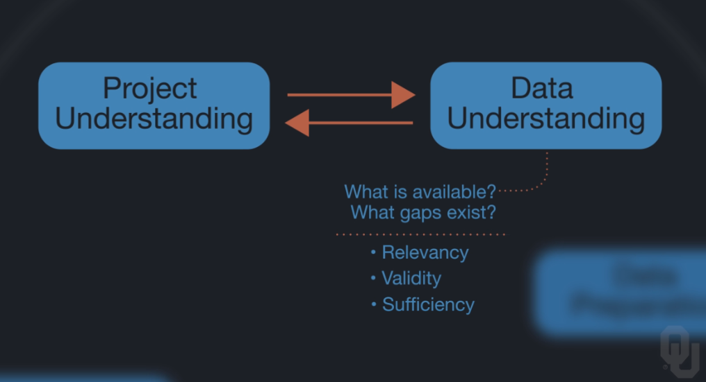

# Cross-Industry Project Analysis Flow

## Cross Industry Project for Data Mining  
> Agnostic framework to go about data mining

### Overview
 

### Flow
 

### Project Understanding
> What is the problem?

* Our goal to meet with SMEs to understand problem
* IS the project reasonable

### Data Understanding
* If data not available then revise project goals or cancel project   

 

### Data Prep
> 90% of the typical work

### Modeling
> Select, buikd, and assess models

### Evaluate Final Model
> What have we learned?  
> Does the outcome meet project goals?

### Deployment
> Usually hand off the project to the SME

