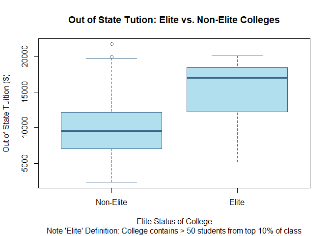

Homework 1: Intro to R
================
Daniel Carpenter
August 2022

-   <a href="#using-r-vectors" id="toc-using-r-vectors"><span
    class="toc-section-number">1</span> Using R: Vectors</a>
-   <a href="#using-r-some-missing-values"
    id="toc-using-r-some-missing-values"><span
    class="toc-section-number">2</span> Using R: Some missing values</a>
-   <a href="#using-r-introductory-data-exploration"
    id="toc-using-r-introductory-data-exploration"><span
    class="toc-section-number">3</span> Using R: Introductory data
    exploration</a>
-   <a href="#using-r-manipulating-data-in-data-frames"
    id="toc-using-r-manipulating-data-in-data-frames"><span
    class="toc-section-number">4</span> Using R: Manipulating data in data
    frames</a>
-   <a href="#using-r-aggregate-function"
    id="toc-using-r-aggregate-function"><span
    class="toc-section-number">5</span> Using R: <code>aggregate()</code>
    function</a>

## File Extension used: Quarto, the new version of R Markdown

Please note that the file rendered is using the new (enhanced) R
Markdown engine, called Quarto. [Please see the documentation
here](https://quarto.org/docs/tools/rstudio.html#:~:text=You%20can%20download%20RStudio%20v2022,products%2Frstudio%2Fdownload%2F.&text=If%20you%20have%20already%20installed,activate%20from%20R%20Markdown%20Preferences.),
which outlines which versions of RStudio works with quarto. I talked
with Dr. Nicholson, and he is happy to let students use Quarto, since
when RStudio rebrands to “Posit” in October, Quarto will become more
mainstream. For our purposes, the main difference is the enhanced
output, and the definition of the YAML header.

For the TA’s ease, you can do the following to render my `.qmd` file. If
you have any trouble, we can meet or I can convert to R Markdown in the
future.

``` r
# NOT RUN: You can run this is regular R
install.packages("quarto")

library(quarto)
quarto_render("Carpenter-HW1.qmd")
```



## Packages

-   Ideally, these packages will install automatically if you do not
    have them already

``` r
if (!require(graphics))  install.packages('graphics')  # for rendering some plots
if (!require(plyr))      install.packages('plyr')      # get plyr package
if (!require(tidyverse)) install.packages('tidyverse') # get tidverse for piping
if (!require(knitr))     install.packages('knitr')     # knitting to kable table
if (!require(datasets))  install.packages('datasets')  # Quakes dataset
```

# Using R: Vectors

## (a)

Create a vector with 10 numbers (3, 12, 6, -5, 0, 8, 15, 1, -10, 7) and
assign it to x.

``` r
x <- c(3, 12, 6, -5, 0, 8, 15, 1, -10, 7)
```

## (b)

Using the commands seq, min, and max with one line of code create a new
vector y with 10 elements ranging from the minimum value of x to the
maximum value of x.

``` r
# Min, max of x vector
xMin = min(x)
xMax = max(x)
INCREMENT = (xMax - xMin) / (length(x) - 1) # size of each step

# Create the vector from min of x to max of x while maintaining length of 10
y = seq(min(x), max(x), INCREMENT)
y # display
```

     [1] -10.000000  -7.222222  -4.444444  -1.666667   1.111111   3.888889
     [7]   6.666667   9.444444  12.222222  15.000000

``` r
# Prove is 10 elements:
paste('The length of y is:', length(y) )
```

    [1] "The length of y is: 10"

## (c)

### Compute the `sum`, `mean`, `standard deviation`, `variance`, `mean absolute deviation`, `quartiles`

``` r
# Combine x and y into single object
xAndY <- cbind(x, y)

# This is what x and y look like
head(xAndY)
```

          x          y
    [1,]  3 -10.000000
    [2,] 12  -7.222222
    [3,]  6  -4.444444
    [4,] -5  -1.666667
    [5,]  0   1.111111
    [6,]  8   3.888889

``` r
# List of all the function to calculate on x and y (excluding quintile)
vectorOfFuns      <- c('sum', 'mean', 'sd', 'var', 'mad', 'quantile')
vectorOfFunsNames <- c('sum', 'mean', 'standard deviation', 'variance', # function full names 
                       'mean absolute deviation', 'quartiles')

for (funIdx in 1:length(vectorOfFuns)) {
  
  # Print result of the function calculation output, for x and y
  print( paste( vectorOfFunsNames[funIdx], 'of x and y:' ) )
  
  # Calulate using a function from `vectorOfFuns`
  output <- apply(xAndY,                         # Using X and Y
                  ncol(xAndY),                   # There are n cols in x & y
                  paste0(vectorOfFuns[funIdx]) ) # Retrieve/apply function
  
  print(output)
}
```

    [1] "sum of x and y:"
     x  y 
    37 25 
    [1] "mean of x and y:"
      x   y 
    3.7 2.5 
    [1] "standard deviation of x and y:"
           x        y 
    7.572611 8.410140 
    [1] "variance of x and y:"
           x        y 
    57.34444 70.73045 
    [1] "mean absolute deviation of x and y:"
           x        y 
     5.93040 10.29583 
    [1] "quartiles of x and y:"
              x      y
    0%   -10.00 -10.00
    25%    0.25  -3.75
    50%    4.50   2.50
    75%    7.75   8.75
    100%  15.00  15.00

### Compute the Quintiles

``` r
# Quintile for x
quantile(x, probs = seq(0, 1, 0.20))
```

       0%   20%   40%   60%   80%  100% 
    -10.0  -1.0   2.2   6.4   8.8  15.0 

``` r
# Quintile for y
quantile(y, probs = seq(0, 1, 0.20))
```

               0%           20%           40%           60%           80% 
    -1.000000e+01 -5.000000e+00 -1.665335e-15  5.000000e+00  1.000000e+01 
             100% 
     1.500000e+01 

## (d)

Use sample() to create a new 7 element vector z by using R to randomly
sample from x with replacement.

``` r
z = sample(x, size=7)

z # show value
```

    [1] -10   6   0   7   1   8  -5

## (e)

Use `t.test()` to compute a statistical test for differences in means
between the vectors `x` and `y`.

``` r
t.test(x, y)
```


        Welch Two Sample t-test

    data:  x and y
    t = 0.33531, df = 17.805, p-value = 0.7413
    alternative hypothesis: true difference in means is not equal to 0
    95 percent confidence interval:
     -6.324578  8.724578
    sample estimates:
    mean of x mean of y 
          3.7       2.5 

*Are the differences in means significant?*

No, they are not statistically significant (90%, 95%, or 99%), given

-   t-value is \< \~1.96  
-   p-value is \> 0.10, 0.05. 0.01

## (f)

To sort a data frame in `R`, use the `order()` function. Sort the vector
`x` and re-run the t-test as a paired t-test.

``` r
# Sort x
xSorted = x[order(x)]

# Run as paired t test
t.test(x, y, paired = TRUE)
```


        Paired t-test

    data:  x and y
    t = 0.30858, df = 9, p-value = 0.7647
    alternative hypothesis: true mean difference is not equal to 0
    95 percent confidence interval:
     -7.596943  9.996943
    sample estimates:
    mean difference 
                1.2 

## (g)

Create a logical vector that identifies which numbers in x are negative.

``` r
xThatAreNeg = x < 0

x # reminder of what x looks like
```

     [1]   3  12   6  -5   0   8  15   1 -10   7

``` r
xThatAreNeg # display
```

     [1] FALSE FALSE FALSE  TRUE FALSE FALSE FALSE FALSE  TRUE FALSE

## (h)

Use this logical vector to remove all entries with negative numbers from
x. (Make sure to overwrite the vector x so that the new vector x has 8
elements!)

``` r
x = subset(x, !xThatAreNeg)

x # display
```

    [1]  3 12  6  0  8 15  1  7



# Using R: Some missing values

## (a)

### Use the code below to create the dataframe X and

``` r
col1 <- c(1,2,3,NA,5)
col2 <- c(4,5,6,89,101)
col3 <- c(45,NA,66,121,201)
col4 <- c(14,NA,13,NA,27)
X <- rbind (col1,col2,col3,col4)
```

### Then write code to display all rows in X with missing values.

``` r
# All rows of X that have NAs (e.g., not complete)
X[!complete.cases(X), ]
```

         [,1] [,2] [,3] [,4] [,5]
    col1    1    2    3   NA    5
    col3   45   NA   66  121  201
    col4   14   NA   13   NA   27

## (b)

Use the following vector y for this part:

``` r
y <- c(3,12,99,99,7,99,21)
```

### i.

Some statistical applications and older systems sometimes code missing
values with a number, e.g., 99. In order to let R know that is a missing
value you need to recode it as ‘NA’. Please write a line of code that
will replace any 99’s in the vector y with ‘NA’.

``` r
# Replace 99 with NA values in the vector y
y[y == 99] <- NA
y
```

    [1]  3 12 NA NA  7 NA 21

### ii.

With the updated vector y, write code that will count the number of
missing values in it.

``` r
# Number of NA values in the vector y
sum( is.na(y) )
```

    [1] 3



# Using R: Introductory data exploration

## a. Read in `college.csv`

``` r
college <- read.csv('college.csv')
```

## b. Preview data

``` r
# Create row names for each college
rownames(college) <- college[, 1] 

# Remove the college variabl
college <- college[,-1] # get row names and store as field

# View(college)
```

## c.

### i. Stats on Data

``` r
# summary of each variable
summary(college)
```

       Private               Apps           Accept          Enroll    
     Length:777         Min.   :   81   Min.   :   72   Min.   :  35  
     Class :character   1st Qu.:  776   1st Qu.:  604   1st Qu.: 242  
     Mode  :character   Median : 1558   Median : 1110   Median : 434  
                        Mean   : 3002   Mean   : 2019   Mean   : 780  
                        3rd Qu.: 3624   3rd Qu.: 2424   3rd Qu.: 902  
                        Max.   :48094   Max.   :26330   Max.   :6392  
       Top10perc       Top25perc      F.Undergrad     P.Undergrad     
     Min.   : 1.00   Min.   :  9.0   Min.   :  139   Min.   :    1.0  
     1st Qu.:15.00   1st Qu.: 41.0   1st Qu.:  992   1st Qu.:   95.0  
     Median :23.00   Median : 54.0   Median : 1707   Median :  353.0  
     Mean   :27.56   Mean   : 55.8   Mean   : 3700   Mean   :  855.3  
     3rd Qu.:35.00   3rd Qu.: 69.0   3rd Qu.: 4005   3rd Qu.:  967.0  
     Max.   :96.00   Max.   :100.0   Max.   :31643   Max.   :21836.0  
        Outstate       Room.Board       Books           Personal   
     Min.   : 2340   Min.   :1780   Min.   :  96.0   Min.   : 250  
     1st Qu.: 7320   1st Qu.:3597   1st Qu.: 470.0   1st Qu.: 850  
     Median : 9990   Median :4200   Median : 500.0   Median :1200  
     Mean   :10441   Mean   :4358   Mean   : 549.4   Mean   :1341  
     3rd Qu.:12925   3rd Qu.:5050   3rd Qu.: 600.0   3rd Qu.:1700  
     Max.   :21700   Max.   :8124   Max.   :2340.0   Max.   :6800  
          PhD            Terminal       S.F.Ratio      perc.alumni   
     Min.   :  8.00   Min.   : 24.0   Min.   : 2.50   Min.   : 0.00  
     1st Qu.: 62.00   1st Qu.: 71.0   1st Qu.:11.50   1st Qu.:13.00  
     Median : 75.00   Median : 82.0   Median :13.60   Median :21.00  
     Mean   : 72.66   Mean   : 79.7   Mean   :14.09   Mean   :22.74  
     3rd Qu.: 85.00   3rd Qu.: 92.0   3rd Qu.:16.50   3rd Qu.:31.00  
     Max.   :103.00   Max.   :100.0   Max.   :39.80   Max.   :64.00  
         Expend        Grad.Rate     
     Min.   : 3186   Min.   : 10.00  
     1st Qu.: 6751   1st Qu.: 53.00  
     Median : 8377   Median : 65.00  
     Mean   : 9660   Mean   : 65.46  
     3rd Qu.:10830   3rd Qu.: 78.00  
     Max.   :56233   Max.   :118.00  

### ii. Pairs Plots

``` r
# Find package for `pairs`
# ?pairs


# Correlation between 1st 10 variables
pairs(college[, 2:11]) # 2-11 since first variable is type character
```


### iii. Boxplots: Private/Public OS Tuition

``` r
# Note used boxplot instead of plot since it is the de facto for base R
# Hope that choice is okay - took a judgement call
boxplot(
        # Data
        Outstate ~ Private, # Y ~ X
        data   =  college,  # Dataset
        
        # Aesthetics (titles & colors)
        main   = "Out of State Tution: Public vs. Private Colleges",
        names  = c('Public', 'Private'), # names of the x axis
        xlab   = "College Type",
        ylab   = "Out of State Tuition ($)",
        col    = "lightblue2",
        border = "steelblue4"
)
```


### iv. `Elite` variable

``` r
# By default create and set the Elite variable to 'No'
Elite <- rep ("No", nrow(college ))

# If the college has more than 50 students from the top 10% of their class,
# Then 'Yes', the college is elite
Elite [college$Top10perc >50] <- "Yes"

# Ensure the data type is a factor
Elite <- as.factor(Elite)

# Finally add the new `Elite` variable to the college data frame
college <- data.frame(college ,Elite)
```

### v. \# of Elite Colleges

-   Note there are 78 elite schools (699 that are not elite). See below.

``` r
summary(college$Elite)
```

     No Yes 
    699  78 

### vi. Boxplots: Elite OS Tuition

``` r
boxplot(
        # Data
        Outstate ~ Elite, # Y ~ X
        data   =  college,  # Dataset
        
        # Aesthetics (titles & colors)
        main   = "Out of State Tution: Elite vs. Non-Elite Colleges",
        sub    = "Note 'Elite' Definition: College contains > 50 students from top 10% of class",
        names  = c('Non-Elite', 'Elite'), # names of the x axis
        xlab   = "Elite Status of College",
        ylab   = "Out of State Tuition ($)",
        col    = "lightblue2",
        border = "steelblue4"
)
```



### vii. Histograms

-   Plot 4 numeric variables

``` r
par(mfrow=c(2,2)) # Set up 2x2 grid for plotting

# plot histogram with some defaults
hist(x = college$Books,

     # Aesthetics (titles & colors)
     breaks = 20, # Number of bins
     main   = 'Cost Distribution for Books',
     xlab   = 'Cost of Books ($)',
     ylab   = 'Number of Colleges',
     col    = "lightsteelblue1",
     border = "steelblue4"
)

# plot histogram with some defaults
hist(x = college$Room.Board,

     # Aesthetics (titles & colors)
     breaks = 10, # Number of bins
     main   = 'Cost Distribution for Room & Board',
     xlab   = 'Cost of Room & Board ($)',
     ylab   = 'Number of Colleges',
     col    = "palevioletred",
     border = "maroon4"
)

# plot histogram with some defaults
hist(x = college$P.Undergrad,

     # Aesthetics (titles & colors)
     breaks = 50, # Number of bins
     main   = 'Distribution of Number of PT Undergraduates',
     xlab   = 'Number of Part-Time Undergraduates',
     ylab   = 'Number of Students',
     col    = "darkseagreen3",
     border = "darkseagreen4"
)

# plot histogram with some defaults
hist(x = college$F.Undergrad,

     # Aesthetics (titles & colors)
     breaks = 30, # Number of bins
     main   = 'Distribution of Number of FT Undergraduates',
     xlab   = 'Number of Full-Time Undergraduates',
     ylab   = 'Number of Students',
     col    = "thistle",
     border = "plum4"
)
```




# Using R: Manipulating data in data frames

-   Uses `tidyverse` piping and `dplyr` functions since use of `plyr`
    only specified for getting `baseball` dataset

## (a) Load `baseball` from `plyr`

``` r
baseball.base <- plyr::baseball
```

## (b) Data Cleanup

``` r
# ?baseball # get info on dataset

baseball <- baseball.base %>%
  
  # for players before 1954, sacrifice flies 
  # (i.e. the variable sf) should be set to 0 
  mutate(sf = if_else(year < 1954, 0.0, as.double(sf) ), # double because dplyr needs that
         
  # Hit by pitch (the variable hbp) is often missing,
  # set these missings to 0.
        hbp = if_else(is.na(hbp), 0.0, as.double(hbp) )
  ) %>%
  
  # Exclude all player records with fewer than 50 at bats (the variable ab).
  filter(ab < 50)

# Validation that the manipulation worked
# summary(baseball$sf)
# summary(baseball$hbp)
# summary(baseball$ab)
```

## (c) Calculate the base percentage `obp`

``` r
baseball <- baseball %>%
  
  # Calculate base percent
  mutate(obp = (h + bb + hbp) / (ab + bb + hbp + sf) )
```

## (d) Sort & Display

-   Sort data descending on `obp`
-   Display top 5 players
-   *Assumes the player name is the `id` since name not available in
    dataset*

``` r
baseball <- baseball %>%
  
  # Sort data descending
  arrange(desc(obp) )

NUM_PLAYERS_TO_DISPLAY = 5 # Number of players to display

knitr::kable(
  
  # Print top 5 players, their year, id, obp on-base percentage
  head(baseball %>% select(year, id, obp), # copy filtered data
       NUM_PLAYERS_TO_DISPLAY)             # only show 5 players
)
```

| year | id        | obp |
|-----:|:----------|----:|
| 1894 | brownpe01 |   1 |
| 1913 | griffcl01 |   1 |
| 1914 | griffcl01 |   1 |
| 1916 | davisha01 |   1 |
| 1918 | haineje01 |   1 |



# Using R: `aggregate()` function

## (a)

Load the quakes data from the `datasets` package.

``` r
data(quakes)

# ?quakes # see variable descriptions 
# head(quakes) # look at top 6 rows
```

## (b)

Plot the recorded earthquake magnitude against the earthquake depth
using the `plot` command.

-   Independent variable: `mag`  
-   Dependent variable: `depth`

``` r
plot(depth ~ mag,
     data = quakes,
     
     # Aesthetics
     main = 'How Magnitude of Earthquakes Correlates with Depth of Plane',
     xlab = 'Richter Magnitude of Earthquake',
     ylab = 'Depth (km)',
     col = 'steelblue3'
     )
```


## (c)

Use `aggregate` to compute the average earthquake depth for each
magnitude level. Store these results in a new data frame named
`quakeAvgDepth.`

``` r
# ?aggregate # what the variable does

# Average magnitude of quake by depth
quakeAvgDepth <- aggregate(depth ~ mag,   # Value ~ Group 
                           FUN   = mean,  # Function
                           data  = quakes # Original Data
                           )
```

## (d)

Rename the variables in quakeAvgDepth to something meaningful.

``` r
colnames(quakeAvgDepth) <- c('magnitudeOfQuake', 'depthOfPlanKM') 

# head(quakeAvgDepth) # look at data
```

## (e)

Plot the magnitude vs. the average depth.

``` r
plot(depthOfPlanKM ~ magnitudeOfQuake,
     data = quakeAvgDepth,
     
     # Aesthetics
     main = 'How Magnitude of Earthquakes Correlates with Avg. Depth of Plane',
     xlab = 'Richter Magnitude of Earthquake',
     ylab = 'Avg. Depth (km)',
     col  = 'tomato3'
     )
```


## (f)

From the two plots, do you think there is a relationship between
earthquake depth and magnitude?

-   It is unclear using the non-aggregated data if there is a
    relationship.

-   However, when aggregating using by average magnitude level, there is
    clearer inverse relationship between the magnitude level and average
    depth.
