Homework 2 - Data Exploration
================
Daniel Carpenter
August 2022

-   <a href="#ggplot2" id="toc-ggplot2"><code>ggplot2</code></a>
-   <a href="#house-prices-data-exploratory-data-analysis-and-visualization"
    id="toc-house-prices-data-exploratory-data-analysis-and-visualization">House
    prices data: Exploratory Data Analysis and Visualization</a>

<!-- ## File Extension used: Quarto, the new version of R Markdown -->
<!-- Please note that the file rendered is using the new (enhanced) R Markdown engine, called Quarto. [Please see the documentation here](https://quarto.org/docs/tools/rstudio.html#:~:text=You%20can%20download%20RStudio%20v2022,products%2Frstudio%2Fdownload%2F.&text=If%20you%20have%20already%20installed,activate%20from%20R%20Markdown%20Preferences.), which outlines which versions of RStudio works with quarto. I talked with Dr. Nicholson, and he is happy to let students use Quarto, since when RStudio rebrands to "Posit" in October, Quarto will become more mainstream. For our purposes, the main difference is the enhanced output, and the definition of the YAML header. -->
<!-- For the TA's ease, you can do the following to render my `.qmd` file. If you have any trouble, we can meet or I can convert to R Markdown in the future. -->
<!-- ```{r, eval=FALSE, echo=TRUE, include=TRUE} -->
<!-- # NOT RUN: You can run this is regular R -->
<!-- install.packages("quarto") -->
<!-- library(quarto) -->
<!-- quarto_render("Carpenter-HW1.qmd") -->
<!-- ``` -->



## Packages

-   Ideally, these packages will install automatically if you do not
    have them already

``` r
library(tidyverse) # get tidverse for piping
library(ggthemes) # themes for plots
library(skimr)
library(knitr)
library(GGally) # pairs
library(scales)
require(lubridate)

# Ridge lines
library(ggridges)
library(viridis)
library(hrbrthemes)
```

# `ggplot2`

## (a) \| 3.2.4

### Problem 4

Make a scatterplot of hwy vs cyl.

``` r
theme_set(theme_light()) # set the theme

# ?mpg
mpg %>%
  
  # hwy vs. cyl
  ggplot(aes(x = cyl,
             y = hwy)
         ) +
  
  # add points with a little but of jitter to see overlap
  # since discrete number of cylinders
  geom_jitter(color = 'steelblue3', size = 2, alpha = 0.3,
              width = 0.15) + # add points
  
  # Labels
  labs(title = 'How does the # of Cylinders relate to the Highway MPG?',
       x     = 'Number of Cylinders',
       y     = 'Highway MPG',
       caption = '\nNote small amount of jittering since number of cylinders is discrete') +
  
  theme_get() # get the theme set before
```

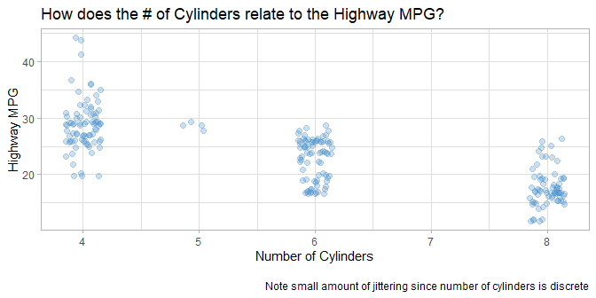



### Problem 5

What happens if you make a scatterplot of class vs drv? Why is the plot
not useful?

*Answer:* The below scatter is not useful since both the response and
independant variables are discrete values (not continuous). This graph
only shows the combinations between the dimensions. All data is
overlapping.

``` r
# ?mpg
mpg %>%
  
  # hwy vs. cyl
  ggplot(aes(x = drv,
             y = class)
         ) +
  
  # add points
  geom_point(color = 'steelblue3', size = 2, alpha = 0.3) + 
  
  # Labels
  labs(title = 'How does the Type of Car relate to the Type of Drive Train?',
       x     = 'Type of Drive Train',
       y     = 'Type of Car') +
  
  theme_get() # get the theme set before
```

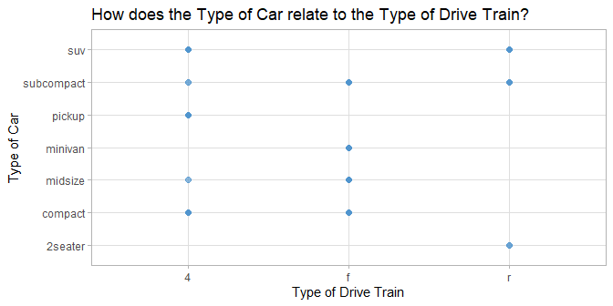



## (a) \| 3.3.1

### Problem 3

Map a continuous variable to color, size, and shape.

*Assumptions*:

1.  Using same x and y variables as problem 1 of excercise 3.3.1
2.  Assuming we are only mapping a variable one at a time, just because
    all three mappings at once could be confusing and lose
    effectiveness.

How do these aesthetics behave differently for categorical
vs. continuous variables?

*Answer*: You need to be careful with continuous vs. categorical data
when mapping. For example, you do not want to determine the size using a
a categorical variable, since it will not provide much meaning on
correlation. Generally, these will work well at telling a story:

-   size: continuous
-   color: categorical
-   shape: categorical

Create a base plot for reuse:

``` r
title_base = 'MPG (Highway) ~ Engine Displacement (Lt)\n'

# Create a base plot defined about with hwy ~ displ
plot_base <- mpg %>%
  
  # hwy vs. cyl
  ggplot(aes(x = displ,
             y = hwy 
             )
         ) +
  
  # Labels
  labs(x     = 'Displacement of Engine (Liters)',
       y     = 'Miles per Gallon (Highway)' ) +
  
  theme_get() # get the theme set before
```

**Map a `color`**

``` r
plot_base + # Using a plot defined about with hwy ~ displ
  
  # Add mapping and other static aesthetics
  geom_point(aes(color = cyl), size=2) + 
  
  # Update title
  ggtitle(paste0( title_base, 'Coloring: Number of Cylinders' ))
```

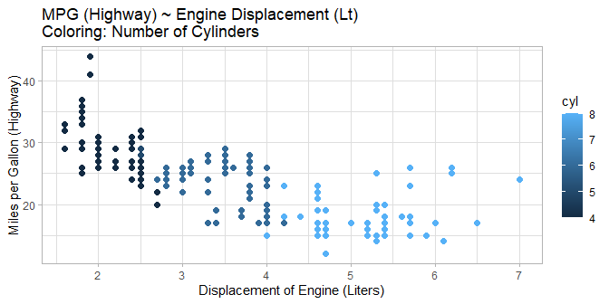

**Map a `size`**

``` r
plot_base + # Using a plot defined about with hwy ~ displ
  
  # Add mapping and other static aesthetics
  geom_point(aes(size = cty), alpha=0.5) + 
  
  # Update title
  ggtitle(paste0( title_base, 'Sizing: MPG (City)' ))
```

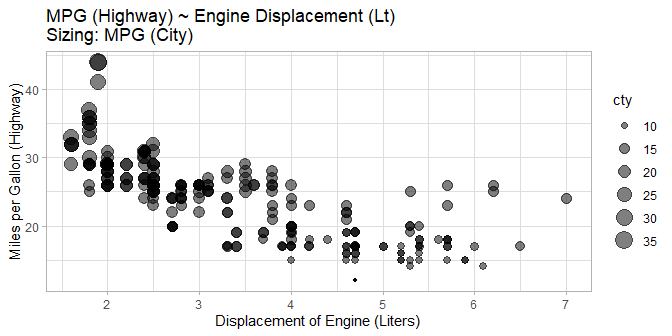

**Map a `shape`**

``` r
plot_base + # Using a plot defined about with hwy ~ displ
  
  # Add mapping and other static aesthetics
  geom_point(aes(shape = drv), size=3, alpha=0.5) + 
  
  # Update title
  ggtitle(paste0( title_base, 'Shape: Type of Drive Train' ))
```

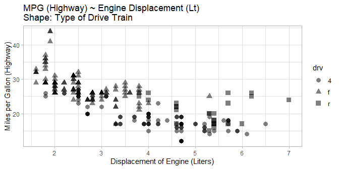



### Problem 4

What happens if you map the same variable to multiple aesthetics?

*Answer*: It will condense the legend and it makes it much easier to
read. This would be a useful way to analyze the information.

``` r
plot_base + # Using a plot defined about with hwy ~ displ
  
  # Add mapping and other static aesthetics
  geom_point(aes(shape = drv,
                 color = drv
                 ), size=3, alpha=0.5) + 
  
  # Update title
  ggtitle(paste0( title_base, 'Shape & Color: Type of Drive Train' ))
```

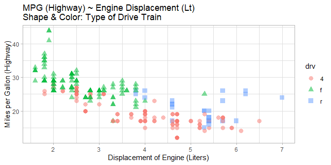



### Problem 6

What happens if you map an aesthetic to something other than a variable
name, like aes(colour = displ \< 5)? Note, you’ll also need to specify x
and y.

*Answer*: It will map the points above and below the right hand side of
the inequality. For example, below shows when the number of cylinders is
\< 7. It also makes a note in the legend

``` r
plot_base + # Using a plot defined about with hwy ~ displ
  
  # Add mapping and other static aesthetics
  geom_point(aes(color = cyl < 7), size=3, alpha=0.5) + 
  
  # Update title
  ggtitle(paste0( title_base, 'Coloring: Split between # of Cylinders above and below 7' ))
```

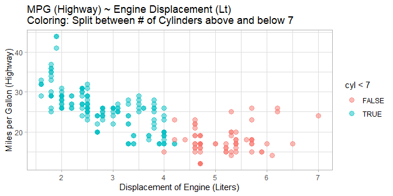



## (a) \| 3.5.1

### Problem 4:

What are the advantages to using faceting instead of the colour
aesthetic?

**Advantages**  
Faceting allows you to see trends within certain subgroups of a
variable. For example, the below graph shows the relationships between
the x and y variables given the type of car. You can see clear trends
within some of the sub-groups.

**Disadvantages**  
You may want to compare the variables on the same plot. If the data does
not overlap, then a facet may not be needed.

**How might the balance change if you had a larger dataset?**  
If you have a lot of data, it may overlap or have disparate clusters. In
that case having facets may be useful.

``` r
# Code from website 
ggplot(data = mpg) + 
  
  # Create the x/y mapping
  geom_point(mapping = aes(x = displ, y = hwy)) + 
  
  # Facet on type of car
  facet_wrap(~ class, nrow = 2) +
  
  # Title
  ggtitle('Example of faceting on the type of car with mpg dataset') +
  theme_get()
```

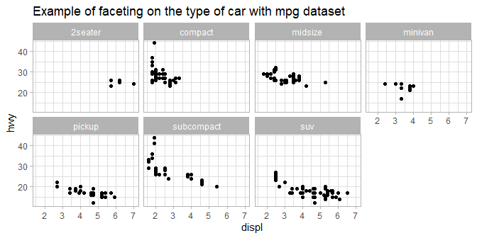



## (b): Recreate the Plot

Please see the below plot recreated:

``` r
# Create a base plot defined about with hwy ~ displ
mpg %>%
  
  # hwy vs. cyl
  ggplot( aes(x = displ, y = hwy) ) +
  
  # Labels
  labs(title = 'Reproduced Plot by Daniel Carpenter',
       x     = 'Displacement',
       y     = 'Highway MPG' ) + 
  
  # Color theme: black an white
  theme_bw() +
  
  # The jittered points
  geom_jitter(alpha = 0.25,   # Transparency
              width = 0.25) + # Jittering amount
  
  # Facet on Drive Shaft Type
  facet_grid(. ~ drv) +
  
  # Linear model line
  geom_smooth(method = lm, fill = NA, color = 'black', size = 1.5) +
  
  # Loess smoother line
  geom_smooth(method = 'loess', size = 1.5)
```

    `geom_smooth()` using formula 'y ~ x'
    `geom_smooth()` using formula 'y ~ x'

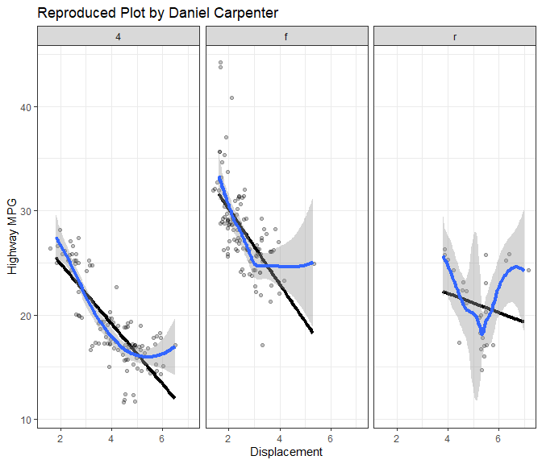



# House prices data: Exploratory Data Analysis and Visualization

## Pull in Data

``` r
housing <- read_csv('housingData.csv')
```

    Rows: 1000 Columns: 74
    -- Column specification --------------------------------------------------------
    Delimiter: ","
    chr (38): MSZoning, Alley, LotShape, LandContour, LotConfig, LandSlope, Neig...
    dbl (36): Id, MSSubClass, LotFrontage, LotArea, OverallQual, OverallCond, Ye...

    i Use `spec()` to retrieve the full column specification for this data.
    i Specify the column types or set `show_col_types = FALSE` to quiet this message.

``` r
# Create a date field using month and year
housing <- housing %>%
  
  # Create date field in YYY-MM-DD format, and please note end of month
  mutate(EndOfMonth = ceiling_date(
      as.Date(paste0(YrSold, '-', MoSold, '-01')),
      'month') - days(1)
  )

# This is what the new data looks like
head(housing$EndOfMonth)
```

    [1] "2009-11-30" "2006-06-30" "2008-05-31" "2009-11-30" "2008-07-31"
    [6] "2007-09-30"



## Visualizations of Data

> Shows 5 Visualizations to explore data

### 1. How do Numeric Variables Correlate with Sale Price of Home?

-   10 or so highly correlated variables (see listing below).
-   Goal is to understand what information matters to begin data
    investigation.
-   Used this information for future visualizations to tell story.

Create heatmap of correlated data for exploration

``` r
# heatmap of the numeric data for non-null values

# Why am I dropping rows?
# Generally seems like these are for some data that explains a 
# Unique attribute of the house, like if the house has a basement, pool, fense or not.
housingNumeric <- housing %>% select_if(is.numeric) %>% drop_na()

# Create correlation matrix of numeric variables in housing data
correlationMatrix <- cor(housingNumeric )

# Use above for heat map
heatmap(correlationMatrix)
```

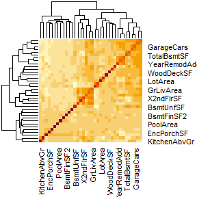

Looks to be 10 or so highly correlated variables

``` r
# get top 10 highest correlated variables

## Sort data on sale price descending
corMatrixSorted <- as.data.frame(correlationMatrix) %>% arrange(desc(SalePrice))

corVarsTop10 <- rownames(corMatrixSorted)[2:11] # 2:11 since exclude sale price variable

# What are the top 10 (sorted by highest correlation)?
kable(corVarsTop10)
```

| x            |
|:-------------|
| OverallQual  |
| GrLivArea    |
| TotalBsmtSF  |
| GarageCars   |
| X1stFlrSF    |
| GarageArea   |
| FullBath     |
| TotRmsAbvGrd |
| YearBuilt    |
| YearRemodAdd |



### 2. Are newer homes more popular?

-   Looks like newer homes are selling more, or at least more
    representative in the sample.
-   This information is useful to understand from a high level that if
    you are selling or buying a house, the demand for your home may
    depend on the age of the house. Again, this assumption depends on
    the representatives of the sample to the population.

#### Some resuable theming

``` r
# unique(housing$YrSold)
YEAR_THRESHOLD = 1950

# Colors
getFillPal = c('#A8D3DE', '#F2A896')
getColorPal  = c('#7A9BA3', '#B27A6D')

# Names associated with colors
getColNames = paste0(c('Pre-', 'Post-'), YEAR_THRESHOLD)
```

#### The actual plot

``` r
housing %>% # using the housing data
  
  # Get a count of homes sold by year built 
  group_by(YearBuilt) %>%
  summarise(NumSold = n() ) %>%
  
  # Start ggplot with x axis being yearbuilt
  ggplot(aes(x = YearBuilt,
             color = YearBuilt > YEAR_THRESHOLD
             )) +
  
      # Labels and Titles
      labs(title = paste('Most homes Sold in Sample were Built after', YEAR_THRESHOLD),
           x = 'Year Home was Built',
           y = 'Number of Homes Sold') + 
    
      # Build a lollipop chart
      # Basics here: https://r-graph-gallery.com/300-basic-lollipop-plot.html
      geom_segment(aes(x=YearBuilt, xend=YearBuilt, y=0, yend=NumSold), 
                   alpha = 0.5 ) +
      geom_point(aes(y = NumSold) ) +
    
      # Diverge on colors based on the YEAR_THRESHOLD variable
      # Splits based on the year built
      scale_color_manual(values = getFillPal, # See chunk above. just 2 colors
                         labels = getColNames 
                         ) +
        
      # Themes
      theme_minimal() + 
      theme(legend.title    = element_blank(), # Format the legend nicer
            legend.position = 'top')
```

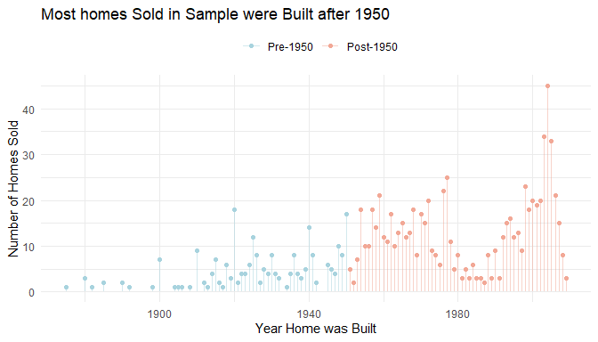



### 3. Are there any changes happening to sale price overtime?

-   No real change in sale price over time among larger higher-level
    groupings.
-   Appears that older homes sell for less.
-   Useful to understand that there are little fluctuations in the
    overall trend of the market over the four year period in order to
    understand the market trends.

``` r
housing %>%
  ggplot(aes(y     = YrSold,
             group = YrSold,  # key here is that we are grouping by year sold
             x     = SalePrice,
             color = YearBuilt > YEAR_THRESHOLD, # 2-colors that show split in years
             fill  = YearBuilt > YEAR_THRESHOLD
             )
         ) +
  
  # Labels
  labs(title    = 'Distribution of Yearly Home Prices at Sale Date Remain Steady',
       subtitle = paste('Note Homes Built before', YEAR_THRESHOLD, 'sell for Less'),
       x        = 'Sale Price of Home (USD)',
       y        = 'Year Home Sold') +
  
  # Ridge Line Density Plots
  # More here: https://r-graph-gallery.com/294-basic-ridgeline-plot.html#color
  geom_density_ridges_gradient(scale = 3, rel_min_height = 0.01 ) +
  
  # Formatting of axis as comma
  scale_x_continuous(labels = comma) +
  
  # Themes
  theme_minimal() +
    theme(
      legend.position = "top",
      legend.title    = element_blank(),
      panel.spacing   = unit(0.1, "lines"),
      strip.text      = element_blank()
    ) +
  
  # Facet on the year threshold
  facet_grid(. ~ YearBuilt > YEAR_THRESHOLD) +
  
  # Diverge on colors based on the YEAR_THRESHOLD variable
  # Splits based on the year built
  scale_color_manual(values = getColorPal, labels = getColNames ) +
  scale_fill_manual( values = getFillPal,  labels = getColNames )
```

    Picking joint bandwidth of 13700

    Picking joint bandwidth of 18700

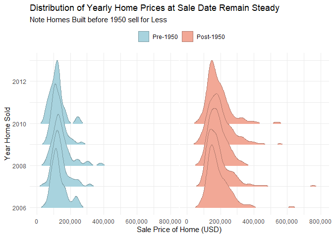



### 4. How does the overall quality of the home correlate with sale price overtime?

-   Note the plot includes pre/post 1950 as seen above
-   As noted before, the overall quality of home rating correlates
    highly with the sale price of the home
-   Appears that no Pre-1950 homes receive quality rating of 10, which
    are of the highest selling homes in the other portion of the sample
    (post-1950)
-   Useful to understand for a seller that older homes have limit on
    potential for resale.

``` r
housing %>%
  ggplot(aes(y     = SalePrice,
             x     = OverallQual,
             color = YearBuilt > YEAR_THRESHOLD # 2-colors that show split in years
             )
         ) +
  
  # Labels
  labs(title    = 'Better Quality & Newer Homes Sell for More',
       subtitle = 'Note no Pre-1950 homes receive quality rating of 10',
       x        = 'Overall Quality of Home (Scale 1-10, 10 being best)',
       y        = 'Sale Price of Home (USD)',
       caption  = '\nOnly showing equal-tail 95% of home sale prices for clarity') +
  
  # Points
  geom_jitter(alpha = 0.5, # transparency
              width = 0.25, # jitter amt
              size  = 1.5  
              ) +

  # Formatting of axis as comma
  scale_y_continuous(labels = comma,
                     # Limit the x axis to 95% percentile (equal tailed)
                     limits = c(0.025, quantile(housing$SalePrice, 0.975))) +
  
  # Themes
  theme_minimal() +
    theme(
      legend.position = "top",
      legend.title    = element_blank(),
      panel.spacing   = unit(1, "lines"),
      strip.text      = element_blank()
    ) +
  
  # Facet on the year threshold
  facet_grid(. ~ YearBuilt > YEAR_THRESHOLD) +
  
  # Add a linear method
  geom_smooth(method = lm, fill = 'grey80') +

  # Diverge on colors based on the YEAR_THRESHOLD variable
  # Splits based on the year built
  scale_color_manual(values = getFillPal,
                     labels = getColNames )
```

    `geom_smooth()` using formula 'y ~ x'

    Warning: Removed 25 rows containing non-finite values (stat_smooth).

    Warning: Removed 25 rows containing missing values (geom_point).

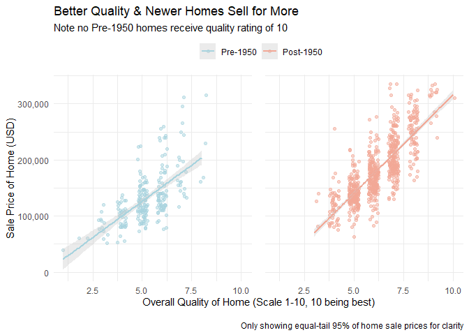



### 5. Does the neighborhood that you live in affect the sale price?

-   Yes, living near positive conditions will positively impact the sale
    price of the home.
-   What is interesting is that living near a railroad does not
    drastically decrease the sale price.
-   Note that the sample mainly represents the “normal” conditions,
    skewing the data some.
-   Implication: you may more for your surrounding public amenities.

``` r
# Note most homes are "normal" in the sample!
table(housing$Condition1)
```


    Artery  Feedr   Norm   PosA   PosN     RR 
        31     51    871      7     14     26 

``` r
# Remap the factor levels
# Note condensed decriptions from data dictionary for ease of viewing
housing$Condition1 <- recode(housing$Condition1,
                             'Artery' = 'Near Arterial St.',
                             'Feedr'  = 'Near Feeder Street',
                             'Norm'   = 'Normal',
                             'PosN'   = 'Near Park, Greenbelt, etc.',
                             'PosA'   = 'Near Other Public Ammenity',
                             'RR'     = 'Near Railroad'
                             )

housing %>%
  ggplot(aes(y     = reorder(Condition1, SalePrice),
             x     = SalePrice
             )
         ) +
  
  # Labels
  labs(title    = 'Homes Near Public Amenities Sell Higher',
       subtitle = '',
       x        = 'Sale Price of Home (USD)',
       y        = 'Home Proximity to Various Conditions\n',
       caption  = '\nOnly showing equal-tail 99% of home sale prices for clarity') +
  
  # boxplots and colors
  geom_boxplot(color = '#8EA199',
               fill  = '#C2DCD1') +

  # Formatting of axis as comma
  scale_x_continuous(labels = comma,
                     
                     # Limit the x axis to 99% percentile (equal tailed)
                     limits = c((1 - 0.99) / 2, quantile(housing$SalePrice, 
                                                         1 - (1 - 0.99) / 2))) +
  
  # Themes
  theme_minimal()
```

    Warning: Removed 5 rows containing non-finite values (stat_boxplot).

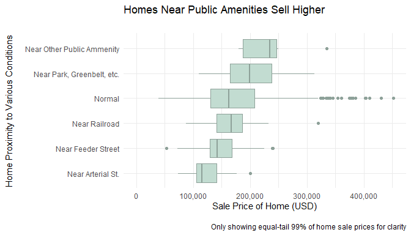
