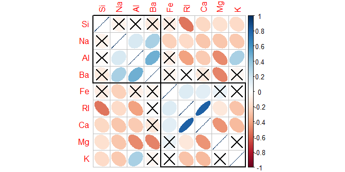
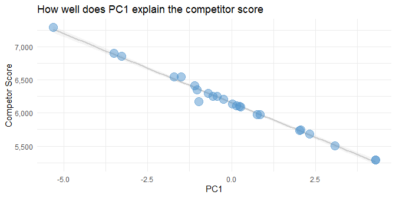
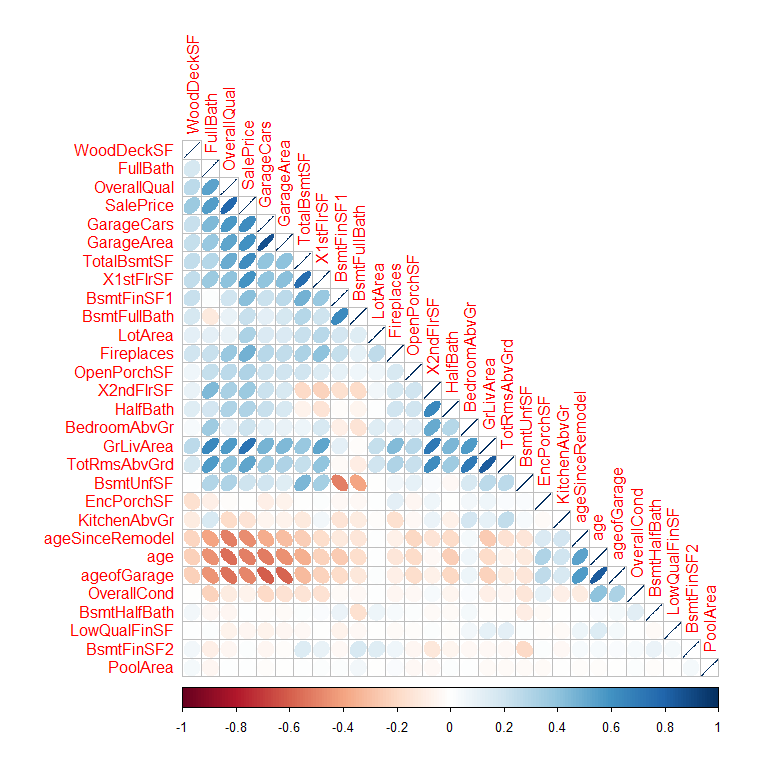
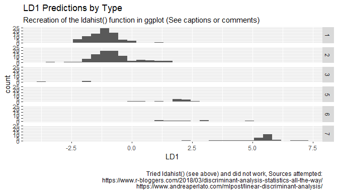
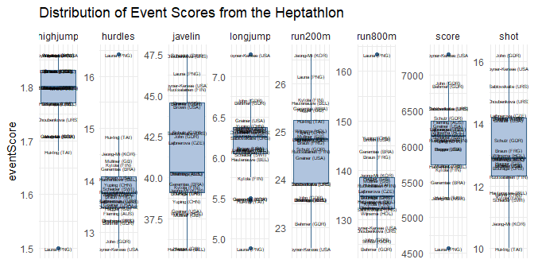
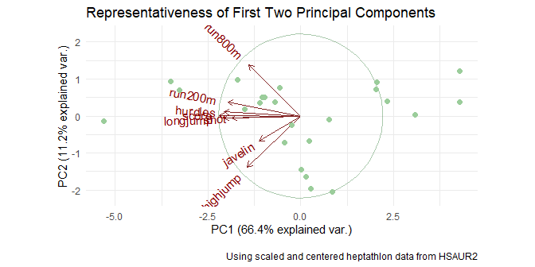
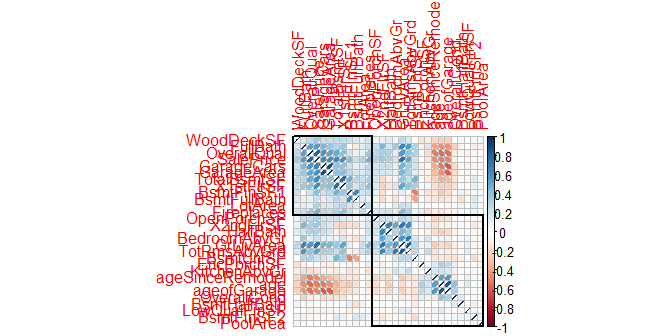

Homework 3 - Principal Component Analysis
================
Daniel Carpenter
August 2022

-   <a href="#glass-data" id="toc-glass-data">1. Glass Data</a>
-   <a href="#principal-components-for-dimension-reduction"
    id="toc-principal-components-for-dimension-reduction">2. Principal
    components for dimension reduction</a>
-   <a href="#housing-data-dimension-reduction-and-exploration"
    id="toc-housing-data-dimension-reduction-and-exploration">3. Housing
    data dimension reduction and exploration</a>

***Check list:***

-   1 (iv - v)
-   1 c (iii)

## Packages

``` r
library(tidyverse) # get tidverse for piping
library(skimr)
library(knitr)
library(scales)
require(lubridate)

library(mlbench)  # Glass data
library(ggbiplot) # biplots
library(corrplot)
library(caret)    # preProcess for centering and z score scaling 
library(MASS)     # Linear discreiminant analysis with lda 

library(HSAUR2)   # olympic data
library(outliers) # grubbs.test
library(DescTools) # for the %like% operator
```

# 1. Glass Data

## Get and Clean Data

``` r
data(Glass)

# Remove duplicates
Glass <- Glass[!duplicated(Glass), ]
```

## (a) Mathematics of PCA

`i.` Create the correlation matrix of all the numerical attributes in
the `Glass` data and store the results in a new object `corMat`

``` r
skimmed <- skim(Glass)

# Notice one factor data, for variable `type`
skimmed$skim_type
```

     [1] "factor"  "numeric" "numeric" "numeric" "numeric" "numeric" "numeric"
     [8] "numeric" "numeric" "numeric"

``` r
# Get only numeric data
GlassNumeric <- Glass %>% dplyr::select(where(is.numeric))

# Create correlation matrix using only numeric data type
corMat <- cor(GlassNumeric)
```

`ii.` Compute the eigenvalues and eigenvectors of `corMat.`

Eigenvalues

``` r
# prcomp(corMat)
eigenValues = eigen(corMat)$values
eigenValues
```

    [1] 2.510152168 2.058169337 1.407484057 1.144693344 0.914768873 0.528593040
    [7] 0.370262639 0.064267543 0.001608997

Eigenvectors

``` r
eigenVectors = eigen(corMat)$vectors
eigenVectors
```

                [,1]        [,2]        [,3]       [,4]        [,5]        [,6]
     [1,]  0.5432231 -0.28911804 -0.08849541  0.1479796  0.07670808 -0.11455615
     [2,] -0.2676141 -0.26909913  0.36710090  0.5010669 -0.14626769  0.55790564
     [3,]  0.1093261  0.59215502 -0.02295318  0.3842440 -0.11610001 -0.30585293
     [4,] -0.4269512 -0.29636272 -0.32602906 -0.1488756 -0.01720068  0.02014091
     [5,] -0.2239232  0.15874450  0.47979931 -0.6394962 -0.01763694 -0.08850787
     [6,] -0.2156587  0.15305116 -0.66349177 -0.0733491  0.30154622  0.24107648
     [7,]  0.4924367 -0.34678973  0.01380151 -0.2743430  0.18431431  0.14957911
     [8,] -0.2516459 -0.48262056 -0.07649040  0.1299431 -0.24970936 -0.65986429
     [9,]  0.1912640  0.06089167 -0.27223834 -0.2252596 -0.87828176  0.24066617
                 [,7]        [,8]        [,9]
     [1,] -0.08223530  0.75177166 -0.02568051
     [2,] -0.15419352  0.12819398  0.31188932
     [3,]  0.20691746  0.07799332  0.57732740
     [4,]  0.69982052  0.27334224  0.19041178
     [5,] -0.20945417  0.38077660  0.29747147
     [6,] -0.50515516  0.11064442  0.26075531
     [7,]  0.09984144 -0.39885229  0.57999243
     [8,] -0.35043794 -0.14497643  0.19853265
     [9,] -0.07120579  0.01650505  0.01459278

`iii.` Use `prcomp` to compute the principal components of the `Glass`
attributes (make sure to use the scale option).

``` r
# Using only numeric data
pc.glass <- prcomp(GlassNumeric, scale = TRUE)
pc.glass
```

    Standard deviations (1, .., p=9):
    [1] 1.58434597 1.43463213 1.18637433 1.06990343 0.95643550 0.72704404 0.60849210
    [8] 0.25351044 0.04011231

    Rotation (n x k) = (9 x 9):
              PC1         PC2         PC3        PC4         PC5         PC6
    RI -0.5432231  0.28911804 -0.08849541 -0.1479796  0.07670808 -0.11455615
    Na  0.2676141  0.26909913  0.36710090 -0.5010669 -0.14626769  0.55790564
    Mg -0.1093261 -0.59215502 -0.02295318 -0.3842440 -0.11610001 -0.30585293
    Al  0.4269512  0.29636272 -0.32602906  0.1488756 -0.01720068  0.02014091
    Si  0.2239232 -0.15874450  0.47979931  0.6394962 -0.01763694 -0.08850787
    K   0.2156587 -0.15305116 -0.66349177  0.0733491  0.30154622  0.24107648
    Ca -0.4924367  0.34678973  0.01380151  0.2743430  0.18431431  0.14957911
    Ba  0.2516459  0.48262056 -0.07649040 -0.1299431 -0.24970936 -0.65986429
    Fe -0.1912640 -0.06089167 -0.27223834  0.2252596 -0.87828176  0.24066617
               PC7         PC8         PC9
    RI -0.08223530 -0.75177166 -0.02568051
    Na -0.15419352 -0.12819398  0.31188932
    Mg  0.20691746 -0.07799332  0.57732740
    Al  0.69982052 -0.27334224  0.19041178
    Si -0.20945417 -0.38077660  0.29747147
    K  -0.50515516 -0.11064442  0.26075531
    Ca  0.09984144  0.39885229  0.57999243
    Ba -0.35043794  0.14497643  0.19853265
    Fe -0.07120579 -0.01650505  0.01459278

`iv.` Compare the results from (ii) and (iii) - Are they the same?
Different? Why? <br>

-   The eigenvalues differ
-   The eigenvectors are the same in absolute value, but the signs are
    the opposite within each value of the vectors
-   Why do they differ? Past `ii` uses the correlation matrix; the
    principal component analysis (`ii`) uses the covariance matrix,
    which is a scaled, or *normalized*, version of the correlation
    matrix.

`v.` Using R demonstrate that principal components 1 and 2 from (iii)
are orthogonal. (Hint: the inner product between two vectors is useful
in determining the angle between the two vectors)

``` r
PC1.glass <- pc.glass$x[,1]
PC2.glass <- pc.glass$x[,2]

angle <- acos( sum(PC1.glass*PC2.glass) / ( sqrt(sum(PC1.glass * PC1.glass)) * sqrt(sum(PC2.glass * PC2.glass)) ) )

angle
```

    [1] 1.570796



## (b) Applications of PCA

1.  Create a visualization of the corMat correlation matrix (i.e., a
    heatmap or variant).

-   [`corrplot`
    options](https://cran.r-project.org/web/packages/corrplot/vignettes/corrplot-intro.html).

``` r
testRes = cor.mtest(GlassNumeric, conf.level = 0.90)


# Correlation matrix to show spread and significance
corrplot(corMat, 
         p.mat     = testRes$p, # Significance 'x' marks 
         sig.level = 0.10,      # ""           levels
         order     = 'hclust',  # Clustering
         addrect   = 2,
         method    = 'ellipse') # Show spread and direction        
```





2.  Provide visualizations of the principal component analysis results
    from the Glass data. Consider incorporating the glass type to group
    and color your biplot.

``` r
# First show the spread of the components
plot(pc.glass,
     main = 'Principal Components Explanation of Data',
     xlab = 'Principal Components',
     col  = 'lightsteelblue3'
     )
```



``` r
# NExt show the biplots
ggbiplot(pc.glass,
         obs.scale    = 1, 
         var.scale    = 1, 
         varname.size = 4, 
         labels.size  = 10, 
         circle       = TRUE,
         group        = Glass$Type#,
         # ellipse      = TRUE
         ) +
  
  # Titles and caption
  labs(title   = 'Representativeness of First Two Principal Components',
       caption = '\nUsing Glass data from mlbench') +
  
  # Add color to points by glass type
  geom_point(aes(colour=Glass$Type), size = 1) +
  
  # Categorical palette on glass type
  scale_color_brewer(name = 'Glass Type', 
                     palette = 'Set2', type = 'qual') + 
  
  theme_minimal() # the theme
```



3.  Provide an interpretation of the first two prinicpal components the
    Glass data.

-   Both PC1 and PC2 represent roughly half (50%) of the cumulative
    proportion of variance (see summary below)

-   PC1 best explains `Fe`, `K`, and `Si` glass types, since they lie
    closest to parallel with the x axis

-   PC2 best represents `Ba`, and `Mg`, since they lie close to parallel
    with the y axis.

-   Other variables appear to be explained by both principal components,
    since they are near a 45 degree angle.

Summary of cumulative proportion located here

``` r
summary(pc.glass)
```

    Importance of components:
                              PC1    PC2    PC3    PC4    PC5     PC6     PC7
    Standard deviation     1.5843 1.4346 1.1864 1.0699 0.9564 0.72704 0.60849
    Proportion of Variance 0.2789 0.2287 0.1564 0.1272 0.1016 0.05873 0.04114
    Cumulative Proportion  0.2789 0.5076 0.6640 0.7912 0.8928 0.95154 0.99268
                               PC8     PC9
    Standard deviation     0.25351 0.04011
    Proportion of Variance 0.00714 0.00018
    Cumulative Proportion  0.99982 1.00000

4.  Based on the PCA results, do you believe that you can effectively
    reduce the dimension of the data? If so, to what degree? If not,
    why?

-   Given the cumulative proportions above, it is clear that the first
    two principal components capture only half (\~50%) of the variation
    in the original data. We could compare that to a coin flip, or a
    random chance.

-   However, the *first four* PC’s capture roughly 80%. This cuts the
    number of variables in half, which is impressive.

-   Note that if your `q` threshold was set to 95%, then this analysis
    would not perform well, since all but one of the PC’s capture 95% of
    the variation in the actual data.



## (c) Application of LDA

1.  Since the `Glass` data is grouped into various labeled glass types
    we can consider linear discriminant analysis (LDA) as another form
    of dimension reduction. Use the `lda` method from the `MASS` package
    to reduce the `Glass` data dimensionality.

``` r
preproc.param <- Glass %>% preProcess(method = c("center", "scale")) 

# Transform the data using the estimated parameters 
# Apply centering and scaling to the dataset
transformed <- preproc.param %>% predict(Glass)

# Fit the model , '.' means *
lda.model <- lda(Type ~ ., data = transformed) 
lda.model
```

    Call:
    lda(Type ~ ., data = transformed)

    Prior probabilities of groups:
             1          2          3          5          6          7 
    0.32394366 0.35680751 0.07981221 0.06103286 0.04225352 0.13615023 

    Group means:
               RI          Na         Mg          Al          Si           K
    1  0.10586803 -0.21529537  0.6021709 -0.55566964 -0.03051835 -0.07127292
    2  0.08928758 -0.35801082  0.2236651 -0.08333047 -0.07370057  0.03395576
    3 -0.12668032  0.04037692  0.5986928 -0.50069475 -0.32346915 -0.14146475
    5  0.19121411 -0.70579005 -1.3197807  1.17832829 -0.37327809  1.48675612
    6 -0.29416453  1.52153712 -0.9514821 -0.16699477  0.71265830 -0.76375492
    7 -0.40605128  1.27100801 -1.4829529  1.35761437  0.40154052 -0.26592900
               Ca          Ba           Fe
    1 -0.11782012 -0.32708816  0.005626553
    2  0.08387772 -0.25209570  0.230146481
    3 -0.12002632 -0.33526691 -0.002235610
    5  0.82037781  0.02373083  0.035785004
    6  0.28233912 -0.35297613 -0.586918470
    7 -0.32450463  1.73435095 -0.449113729

    Coefficients of linear discriminants:
               LD1        LD2       LD3          LD4        LD5
    RI  0.94568441 0.07527438 1.0863607 -0.818100075  2.3954624
    Na  1.93653461 2.56835550 0.3710009 -5.620203296 -2.1990082
    Mg  1.06291733 4.27171386 2.2661557 -9.823318476 -4.4675280
    Al  1.65414159 0.83192958 1.1005447 -3.192430110 -0.6006326
    Si  1.89406393 2.29624206 1.3286024 -5.857566773 -0.9918384
    K   1.02248031 1.19667679 0.8324237 -5.232631319 -2.0664499
    Ca  1.42618954 3.35575714 0.9098493 -9.431977031 -5.6893657
    Ba  1.14918330 1.69975242 1.2850261 -3.150403464 -2.3353652
    Fe -0.04927568 0.01955888 0.1195656 -0.002693645  0.1268396

    Proportion of trace:
       LD1    LD2    LD3    LD4    LD5 
    0.8145 0.1168 0.0417 0.0158 0.0111 

2.  How would you interpret the first discriminant function, LD1?

-   Within the coefficient matric, you can see that LD1’s top 3
    coefficients contain Na, Si, and Al, which shows that there are
    greater levels of separation

-   Additionally, LD1 holds 81% of the discriminitory power. This values
    holds an important role in between group discrimination.

3.  Use the ldahist function from the MASS package to visualize the
    results for LD1 and LD2. Comment on the results.

-   Please see below on my best ability to use `ldahist()`

-   For the most part the predictions do well, although you can see that
    there is a spread from the average by type from reviewing the
    original and centered data

``` r
# ------------

# Predict the values
predictions <- lda.model %>% predict(transformed) 

# Tried below and did not work, which is everything that I found online
# https://www.r-bloggers.com/2018/03/discriminant-analysis-statistics-all-the-way/
# https://www.andreaperlato.com/mlpost/linear-discriminant-analysis/
# ldahist(data=predictions$x[ , 1], g = Type)


# Recreating the ldahist to the best of my ability in ggplot2...

# Get LD1 and type from the predicted data, combine into single dataset
LD1 <- predictions$x[ , 1]
Type = predictions$class

predictedLD1 <- data.frame(Type, LD1)

# Recreate the ldahist() output
predictedLD1 %>%
  ggplot(aes(x = LD1)) +
  
    # Create a histogram
  geom_histogram() +
  
    # Facet on type
    facet_grid(Type ~ .) +
    labs(title    = 'LD1 Predictions by Type',
         subtitle = 'Recreation of the ldahist() function in ggplot (See captions or comments)',
         caption  = paste0('\nTried ldahist() (see above) and did not work, Sources attempted:',
                           '\nhttps://www.r-bloggers.com/2018/03/discriminant-analysis-statistics-all-the-way/',
'\nhttps://www.andreaperlato.com/mlpost/linear-discriminant-analysis/')
    )
```

    `stat_bin()` using `bins = 30`. Pick better value with `binwidth`.





# 2. Principal components for dimension reduction

## 2 (a) Remove outlier

-   Launa from PNG is the outlier. She is an outlier in highjump,
    longjump, run800m, and hurdles. See image below.

-   Notice that Joyner is an outlier too, but not removed since problem
    does not specify

``` r
data(heptathlon)

grubbs.test(heptathlon$score)
```


        Grubbs test for one outlier

    data:  heptathlon$score
    G = 2.68194, U = 0.68781, p-value = 0.04618
    alternative hypothesis: lowest value 4566 is an outlier

``` r
heptathlonPivot <- heptathlon %>%

  # Get the competitor name as own col
  mutate(competitor = rownames(heptathlon) )  %>%
  
  pivot_longer(cols      = hurdles:score,
               names_to  = 'event',
               values_to = 'eventScore')

# Create a plot of each event
heptathlonPivot %>%
  
  ggplot(aes(x = 1,
             y = eventScore)) +

  # To see the distribution
  geom_boxplot(color = 'steelblue4', fill = 'lightsteelblue') +
  
  # Display the olympians
  geom_text(label = heptathlonPivot$competitor, size = 1.5) +
  
  facet_wrap(. ~ event, nrow = 1, scales = 'free') + 
  
  # Aesthetics
  ggtitle('Distribution of Event Scores from the Heptathlon') +
  theme_minimal() + theme(axis.text.x  = element_blank(),
                          axis.title.x = element_blank())
```



``` r
# Remove outlier with name like Launa
heptathlon <- heptathlon %>% 
  filter(!(rownames(heptathlon) %like% 'Launa%'))
```

## 2 (b)

### Transform the running events (hurdles, run200m, run800m) so that large values are good.

``` r
heptathlon.goodBad <- heptathlon %>%
  mutate(hurdles = max(hurdles) - hurdles, 
         run200m = max(run200m) - run200m, 
         run800m = max(run800m) - run800m 
         )
```

## 2 (c)

### Perform PCA and store in `Hpca`

``` r
Hpca <- prcomp(heptathlon.goodBad,
               center = TRUE, # Mean centered  
               scale  = TRUE  # Z-SCore standardized
               )
```

## 2 (d)

### Visualize first two principal components

``` r
# Create the biplot
ggbiplot(Hpca,
         obs.scale    = 1, 
         var.scale    = 1, 
         varname.size = 4, 
         labels.size  = 10, 
         circle       = TRUE
         ) +
  
  # Titles and caption
  labs(title   = 'Representativeness of First Two Principal Components',
       caption = '\nUsing scaled and centered heptathlon data from HSAUR2') +
  
  # Add color to points by glass type
  geom_point(color = 'darkseagreen3', size = 2) +
  
  theme_minimal() # the theme
```



### Interpretation of Results

#### `PC1`:

-   Explains 66% of the variation in the data

-   Explains all variables very well *(except for `run800m`, `javelin`,
    and `highjump`)*

#### `PC2`:

-   Explains 11% of the variation in the data

-   Explains some of `run800m`, `javelin`, and `highjump`. Since the
    angles are nearly 45 degrees, you can tell that the explanatory
    power splits between `PC1` and `PC2`



# 3. Housing data dimension reduction and exploration

## Read and Clean data

``` r
# Read data
housingData <- read_csv('housingData.csv')
```

    Rows: 1000 Columns: 74
    -- Column specification --------------------------------------------------------
    Delimiter: ","
    chr (38): MSZoning, Alley, LotShape, LandContour, LotConfig, LandSlope, Neig...
    dbl (36): Id, MSSubClass, LotFrontage, LotArea, OverallQual, OverallCond, Ye...

    i Use `spec()` to retrieve the full column specification for this data.
    i Specify the column types or set `show_col_types = FALSE` to quiet this message.

``` r
hd <- housingData %>%
  
  # selects only numeric columns
  select_if(is.numeric) %>%
  
  # creates new variables age, ageSinceRemodel, and ageofGarage, and
  dplyr::mutate(age = YrSold - YearBuilt,
                ageSinceRemodel = YrSold - YearRemodAdd,
                ageofGarage = ifelse(is.na(GarageYrBlt), age, YrSold - GarageYrBlt)) %>%
  
  # removes a few columns that are not needed
  dplyr::select(!c(Id,MSSubClass, LotFrontage, GarageYrBlt,
                   MiscVal, YrSold , MoSold, YearBuilt,
                   YearRemodAdd, MasVnrArea))
```

## Correlation Analysis

``` r
# Parameters
numericData = hd
confInt     = 0.90

# Create correlation matrix
corMatHouse <- cor(numericData)

testRes = cor.mtest(numericData, conf.level = confInt)


# Correlation matrix to show spread and significance
corrplot(corMatHouse, 
         order     = 'hclust',    # Clustering
         addrect   = 2,
         method    = 'ellipse')   # Show spread and direction  
```


