ISE 5103 Intelligent Data Analytics
================
Daniel Carpenter & Sonaxy Mohanty
September 2022

-   <a href="#packages" id="toc-packages">Packages</a>
-   <a href="#1---data-quality-report"
    id="toc-1---data-quality-report"><code>1</code> - Data Quality
    Report</a>
    -   <a href="#1-a---read-data" id="toc-1-a---read-data"><code>1 (a)</code> -
        Read data</a>
    -   <a href="#1-b---numeric-housing-tibble"
        id="toc-1-b---numeric-housing-tibble"><code>1 (b)</code> - Numeric
        Housing Tibble</a>
    -   <a href="#1-c---factor-housing-tibble"
        id="toc-1-c---factor-housing-tibble"><code>1 (c)</code> - Factor Housing
        Tibble</a>
    -   <a href="#1-d---use-glimpse"
        id="toc-1-d---use-glimpse"><code>1 (d)</code> - Use Glimpse</a>
    -   <a href="#1-e---get-q1-and-q3"
        id="toc-1-e---get-q1-and-q3"><code>1 (e)</code> - Get Q1 and Q3</a>
    -   <a href="#1-f---vectorized-summary-stats"
        id="toc-1-f---vectorized-summary-stats"><code>1 (f)</code> - Vectorized
        Summary Stats</a>
    -   <a href="#1-g---apply-summary-stats"
        id="toc-1-g---apply-summary-stats"><code>1 (g)</code> - Apply Summary
        Stats</a>
    -   <a href="#1-h---add-stats-names"
        id="toc-1-h---add-stats-names"><code>1 (h)</code> - Add Stats Names</a>
    -   <a href="#1-i---pretty-up-data"
        id="toc-1-i---pretty-up-data"><code>1 (i)</code> - Pretty up data</a>
    -   <a href="#1-j---factor-data-report"
        id="toc-1-j---factor-data-report"><code>1 (j)</code> - Factor Data
        Report</a>
-   <a href="#2---transformation" id="toc-2---transformation"><code>2</code>
    - Transformation</a>
    -   <a href="#2-a---fixing-skewed-data"
        id="toc-2-a---fixing-skewed-data"><code>2 (a)</code> - Fixing Skewed
        Data</a>
    -   <a href="#2-b---impute-missing-values"
        id="toc-2-b---impute-missing-values"><code>2 (b)</code> - Impute Missing
        Values</a>
    -   <a href="#2-c---dummy-variable-manipulation"
        id="toc-2-c---dummy-variable-manipulation"><code>2 (c)</code> - Dummy
        Variable Manipulation</a>
    -   <a href="#2-d---more-fun-with-factors"
        id="toc-2-d---more-fun-with-factors"><code>2 (d)</code> - More fun with
        Factors</a>
    -   <a href="#references" id="toc-references">References</a>

## Packages

``` r
# Data Wrangling
library(tidyverse)

# Modeling
library(car)      # symbox 
library(EnvStats) # boxcox function
library(mice)     # Predictive mean matching for missing values

# Aesthetics
library(knitr)
library(cowplot)  # multiple ggplots on one plot with plot_grid()
library(scales)
library(kableExtra)
```

# `1` - Data Quality Report

## `1 (a)` - Read data

-   Created a tibble `housingData` after adding three new variables:
    `age`, `ageSinceRemodel` and `ageofGarage` to the housing data

``` r
# Read data
housingData <- read.csv('housingData.csv')

# create three new variables
housingData <- housingData %>%
  dplyr::mutate(age             = YrSold - YearBuilt,
                ageSinceRemodel = YrSold - YearRemodAdd,
                ageofGarage     = YrSold - GarageYrBlt
                )

housingData
```

## `1 (b)` - Numeric Housing Tibble

-   Created a tibble named `housingNumeric` which contained all of the
    numeric variables from the original data using the `dplyr::select`
    command along with the `is.numeric` function

``` r
housingNumeric <- housingData %>%
  #selecting all the numeric data
  dplyr::select_if(is.numeric) %>%
  #converting the dataframe to tibble
  as_tibble()

housingNumeric
```

    ## # A tibble: 1,000 × 39
    ##       Id MSSub…¹ LotFr…² LotArea Overa…³ Overa…⁴ YearB…⁵ YearR…⁶ MasVn…⁷ BsmtF…⁸
    ##    <int>   <int>   <int>   <int>   <int>   <int>   <int>   <int>   <int>   <int>
    ##  1     1      20      NA   11000       5       6    1966    1966     200     740
    ##  2     2      20      NA   36500       5       5    1964    1964     621     812
    ##  3     3      20      57    9764       5       7    1967    2003       0     702
    ##  4     4      70      NA    7500       6       7    1942    1950       0     547
    ##  5     5      20      80    9200       6       6    1965    1965       0     892
    ##  6     6      60      72   11317       7       5    2003    2003     101       0
    ##  7     7      20      80    8480       5       6    1963    1963       0     630
    ##  8     8      70      65   11700       7       7    1880    2003       0       0
    ##  9     9      60      80    9760       6       6    1964    1964     360     674
    ## 10    10      60      93   10261       6       5    2000    2000     318       0
    ## # … with 990 more rows, 29 more variables: BsmtFinSF2 <int>, BsmtUnfSF <int>,
    ## #   TotalBsmtSF <int>, X1stFlrSF <int>, X2ndFlrSF <int>, LowQualFinSF <int>,
    ## #   GrLivArea <int>, BsmtFullBath <int>, BsmtHalfBath <int>, FullBath <int>,
    ## #   HalfBath <int>, BedroomAbvGr <int>, KitchenAbvGr <int>, TotRmsAbvGrd <int>,
    ## #   Fireplaces <int>, GarageYrBlt <int>, GarageCars <int>, GarageArea <int>,
    ## #   WoodDeckSF <int>, OpenPorchSF <int>, EncPorchSF <int>, PoolArea <int>,
    ## #   MiscVal <int>, MoSold <int>, YrSold <int>, SalePrice <int>, age <int>, …

## `1 (c)` - Factor Housing Tibble

-   Created a tibble named `housingFactor` which contains all of the
    character variables from the original data

``` r
housingFactor <- housingData %>%
  
  #converting the character data into factors
  transmute_if(is.character, as.factor) %>%
  #converting the dataframe to tibble
  as_tibble()

housingFactor
```

    ## # A tibble: 1,000 × 38
    ##    MSZon…¹ Alley LotSh…² LandC…³ LotCo…⁴ LandS…⁵ Neigh…⁶ Condi…⁷ BldgT…⁸ House…⁹
    ##    <fct>   <fct> <fct>   <fct>   <fct>   <fct>   <fct>   <fct>   <fct>   <fct>  
    ##  1 RL      <NA>  IR1     Lvl     CulDSac Gtl     NAmes   Norm    1Fam    1Story 
    ##  2 RL      <NA>  IR1     Low     Inside  Mod     ClearCr Norm    1Fam    1Story 
    ##  3 RL      <NA>  IR1     Lvl     other   Gtl     Sawyer  Feedr   1Fam    1Story 
    ##  4 RL      <NA>  IR1     Bnk     Inside  Gtl     Crawfor Norm    1Fam    2Story 
    ##  5 RL      <NA>  Reg     Lvl     Inside  Gtl     NAmes   Norm    1Fam    1Story 
    ##  6 RL      <NA>  Reg     Lvl     Inside  Gtl     CollgCr Norm    1Fam    2Story 
    ##  7 RL      <NA>  Reg     Lvl     Corner  Gtl     Sawyer  Norm    1Fam    1Story 
    ##  8 RM      Pave  IR1     Lvl     Corner  Gtl     OldTown Norm    1Fam    2Story 
    ##  9 RL      <NA>  Reg     Lvl     Inside  Mod     NAmes   Norm    1Fam    2Story 
    ## 10 RL      <NA>  IR1     Lvl     Inside  Gtl     Gilbert Norm    1Fam    2Story 
    ## # … with 990 more rows, 28 more variables: RoofStyle <fct>, Exterior1st <fct>,
    ## #   Exterior2nd <fct>, MasVnrType <fct>, ExterQual <fct>, ExterCond <fct>,
    ## #   Foundation <fct>, BsmtQual <fct>, BsmtCond <fct>, BsmtExposure <fct>,
    ## #   BsmtFinType1 <fct>, BsmtFinType2 <fct>, Heating <fct>, HeatingQC <fct>,
    ## #   CentralAir <fct>, Electrical <fct>, KitchenQual <fct>, Functional <fct>,
    ## #   FireplaceQu <fct>, GarageType <fct>, GarageFinish <fct>, GarageQual <fct>,
    ## #   GarageCond <fct>, PavedDrive <fct>, PoolQC <fct>, Fence <fct>, …

## `1 (d)` - Use Glimpse

-   Using `glimpse` function, we verified the output of `housingNumeric`
    and `housingFactor` tibbles

``` r
glimpse(housingNumeric)
glimpse(housingFactor)
```

## `1 (e)` - Get Q1 and Q3

-   Create our own user-defined functions for extracting only first and
    3rd quantile

-   **Explanation**: Gets the quantiles of a vector using quantile
    function, but we use the `[]` brackets to retrieve the 2nd or 4th
    objects in the vector, which are `Q1` and `Q3`

``` r
Q1 <- function(x,na.rm=TRUE) {
  quantile(x,na.rm=na.rm)[2]
}
Q3 <- function(x,na.rm=TRUE) {
  quantile(x,na.rm=na.rm)[4]
}
```

## `1 (f)` - Vectorized Summary Stats

-   User-defined function that will help apply several summary
    statistics to our data all at once

-   Contained vector of functions with default to not evaluate if `na`

``` r
# Vector of functions for summary of numeric variables
myNumericSummary <- function(x){
  c(length(x), n_distinct(x), sum(is.na(x)), mean(x, na.rm=TRUE),
  min(x,na.rm=TRUE), Q1(x,na.rm=TRUE), median(x,na.rm=TRUE), Q3(x,na.rm=TRUE),
  max(x,na.rm=TRUE), sd(x,na.rm=TRUE))
}
```

## `1 (g)` - Apply Summary Stats

-   Applied the user-defined summary stats function to every variable in
    the `housingNumeric` data set and saving the new tibble as
    `numericSummary`

``` r
numericSummary <- housingNumeric %>%
  #applying the function myNumericSummary to every column across the housingNumeric dataset 
  summarise(across(.cols=everything(), ~myNumericSummary(.x)))
```

## `1 (h)` - Add Stats Names

-   Combined original data set and the names of each summary statistic

``` r
numericSummary <- cbind(
  stat=c("n","unique","missing","mean","min","Q1","median","Q3","max","sd"),
  numericSummary
)

#glimpse(numericSummary)
```

## `1 (i)` - Pretty up data

-   Transformed data to make it ready for output format

``` r
numericSummaryFinal <- numericSummary %>%
  pivot_longer("Id":"ageofGarage", names_to = "variable", 
               values_to = "value") %>%
  pivot_wider(names_from = stat, values_from = value) %>%
  mutate(missing_pct = 100*missing/n,
         unique_pct = 100*unique/n) %>%
  select(variable, n, missing, missing_pct, unique, unique_pct, 
         everything())
```

-   Output

``` r
options(digits=3)
options(scipen=99)
numericSummaryFinal %>% 
  #knitr::kable('pipe', table.attr = "style='width:40%;'")
  knitr::kable(format='latex', align=c('l', 'r', 'r','r', 'r', 'r', 'r', 'r',
                               'r', 'r', 'r', 'r', 'r'), booktabs=TRUE) %>%
  kable_styling(font_size=6)
```

## `1 (j)` - Factor Data Report

-   Created user-defined function to identify `first`, `second` or
    `least common` modes

``` r
getmodes <- function(v,type=1) {
tbl <- table(v)
m1<-which.max(tbl)
if (type==1) {
  #1st mode
return (names(m1)) 
}
else if (type==2) {
  #2nd mode
return (names(which.max(tbl[-m1]))) 
}
else if (type==-1) {
  #least common mode
return (names(which.min(tbl))) 
}
else {
stop("Invalid type selected")
}
}
```

-   Created another user-defined function to identify the `frequencies`
    of the first, second, or least common modes

``` r
getmodesCnt <- function(v,type=1) {
tbl <- table(v)
m1<-which.max(tbl)
if (type==1) {
return (max(tbl)) #1st mode freq
}
else if (type==2) {
return (max(tbl[-m1])) #2nd mode freq
}
else if (type==-1) {
return (min(tbl)) #least common freq
}
else {
stop("Invalid type selected")
}
}
```

-   User-defined function that will help apply several summary
    statistics to our data all at once

``` r
# Vector of functions for summary of categorical variables
myFactorSummary <- function(x){
  c(length(x), n_distinct(x), sum(is.na(x)), getmodes(x, type=1), 
    getmodesCnt(x, type=1), getmodes(x, type=2), getmodesCnt(x, type=2), 
    getmodes(x, type=-1), getmodesCnt(x, type=-1))
}
```

-   Applied the user-defined summary stats function to every variable in
    the `housingFactor` data set and saving the new tibble as
    `factorSummary`

``` r
factorSummary <- housingFactor %>%
  #applying the function myNumericSummary to every column across the housingNumeric dataset 
  summarise(across(.cols=everything(), ~myFactorSummary(.x)))
```

-   Combined original data set and the names of each summary statistic

``` r
factorSummary <- cbind(
  stat=c("n","unique","missing","firstmode","firstmode_freq","secondmode",
         "secondmode_freq","leastcommon","leastcommon_freq"), 
  factorSummary)

#glimpse(factorSummary)
```

-   Transformed data to make it ready for output format

``` r
factorSummaryFinal <- factorSummary %>%
  pivot_longer("MSZoning":"SaleType", names_to = "variable", 
               values_to = "value") %>%
  pivot_wider(names_from = stat, values_from = value) %>%
  
  #converting n, missing and unique variables from char to numeric datatype
  mutate(missing_pct = 100*as.numeric(missing)/as.numeric(n),
         unique_pct = 100*as.numeric(unique)/as.numeric(n),
         freqRatio = as.numeric(firstmode_freq)/as.numeric(secondmode_freq)) %>%
  select(variable, n, missing, missing_pct, unique, unique_pct, freqRatio,
         everything())
```

-   Output

``` r
options(digits=3)
options(scipen=99)
factorSummaryFinal %>% 
  knitr::kable(col.names = c("variable","n","missing","missing_pct", "unique",
                             "unique_pct","freqRatio","1st mode","1st mode freq",
                             "2nd mode", "2nd mode freq","least common",
                             "least common freq"),
               format='latex', 
               align=c('l', 'r', 'r','r', 'r', 'r', 'r','r','r', 'r', 'r', 'r', 'r'),
               booktabs=TRUE) %>%
  kable_styling(font_size=4)
```

# `2` - Transformation

## `2 (a)` - Fixing Skewed Data

### Function to Convert Skewed Data to Normally Distributed Vector

``` r
normalizeDist <- function(aVector) {
  
  # Get the optimal lambda. Used later for converting to normal distribution
  normLambda = boxcox(aVector, optimize = TRUE)$lambda

  # Now convert vector to normal distribution, using the optimal lambda
  normalizedVector <- (aVector ** normLambda - 1) / normLambda
  
  return(normalizedVector)
}

# Colors
goodCol = 'darkseagreen3'
badCol  = 'tomato3'
```

### `i.` Fix `LotArea` in Housing Data Set

#### Lot area is highly skewed

``` r
varTitle = 'Lot Size (Sq. Ft.)'

# See that LotArea is highly skewed
hist(housingData$LotArea, 
      main = varTitle, xlab = varTitle, col = badCol)
```

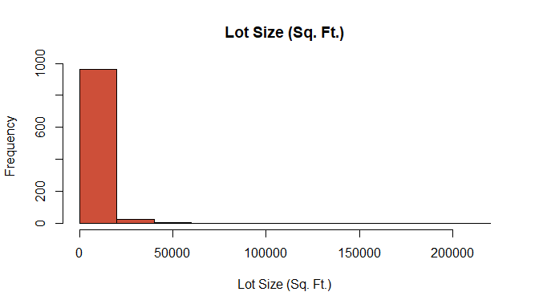

``` r
# Look at the symbox to see where optimal may lie
symbox(housingData$LotArea, data=housingData, powers=c(3,2,1,0,-0.5,-1,-2),
       ylab = varTitle)
```

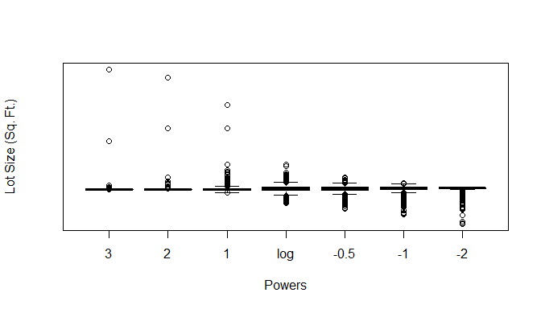

``` r
# Normalize the data and store in data
housingData <- housingData %>% 
  mutate(normLotArea = normalizeDist(housingData$LotArea) )
```

#### See the normalized Lot Area variable

-   You can see that the data is definitely more normal

-   However, much of the data is near the median, which may or may not
    be fine, depending on the analysis

``` r
# Now see the results of the normalization
par(mfrow=c(2,1))

hist( housingData$LotArea, 
      main = paste('Raw', varTitle), xlab = paste('Raw', varTitle), 
      col = badCol )

hist( housingData$normLotArea,
      main = paste('Normalized', varTitle), xlab = paste('Normalized', varTitle), 
      col = goodCol)
```

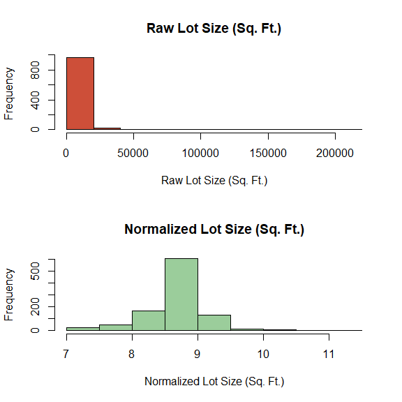<!-- -->

### `i.` Fix `GrLivArea` in Housing Data Set

#### Above Ground Living Area is highly skewed

``` r
varTitle = 'Above Ground Living Area (Sq. Ft.)'

# See that LotArea is highly skewed
hist(housingData$GrLivArea, 
      main = varTitle, xlab = varTitle, col = badCol )
```

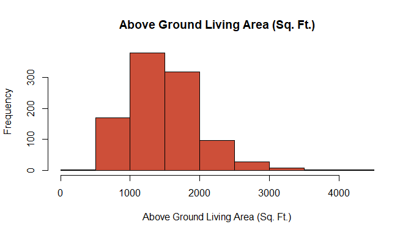

``` r
# Look at the symbox to see where optimal may lie
symbox(housingData$GrLivArea, data=housingData, powers=c(3,2,1,0,-0.5,-1,-2),
       ylab = varTitle)
```

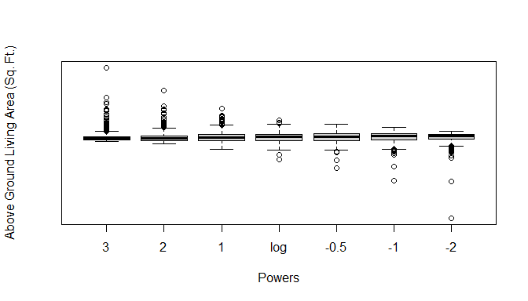

``` r
# Normalize the data and store in data
housingData <- housingData %>% 
  mutate(normYearBuilt = normalizeDist(housingData$GrLivArea) )
```

#### See the normalized Lot Area variable

-   You can see that the data is definitely more normal

``` r
# Now see the results of the normalization
par(mfrow=c(2,1))

hist( housingData$GrLivArea, 
      main = paste('Raw', varTitle), xlab = paste('Raw', varTitle), 
      col = badCol )

hist( housingData$normYearBuilt,
      main = paste('Normalized', varTitle), xlab = paste('Normalized', varTitle),
      col = goodCol )
```

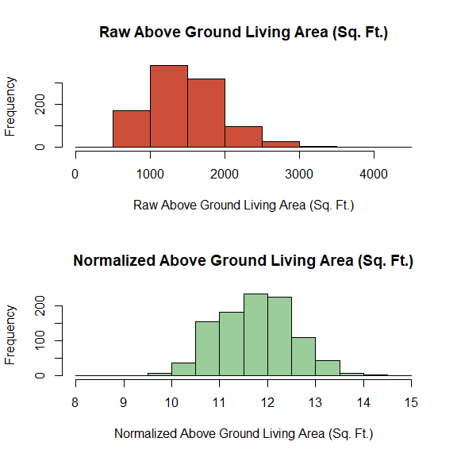<!-- -->

## `2 (b)` - Impute Missing Values

### Function to plot comparison of imputation methods

Highlights of function include:

-   Histogram of actual data, with mean line on x-axis

-   Histogram of imputed data, with mean line on x-axis

-   Regression of actual and imputed data, spread across trival x-axis.
    Goal is to show variation in data

``` r
seeImputation <- function(df, df.meanInputed, 
                          imputationMethod) {
  
  # Min/Max ranges so actual and imputed histograms align
  yMin = min(df.meanInputed$y)
  yMax = max(df.meanInputed$y)
  
  # Non Altered data -------------------------------------------------
  
  meanVal = mean(df$y, na.rm=T) # mean of the non altered data
  
  # Create the plot
  p1 <- df %>%
    ggplot(aes(x = y)) +
    
    # Histogram
    geom_histogram(color = 'grey65', fill = 'grey95') +
    
    # The mean value line
    geom_vline(xintercept = meanVal, color = 'tomato3') +
    
    # Text associated with mean value
    annotate("text", 
             label = "Mean Value", 
             x = meanVal, y = 100, 
             size = 5, colour = "tomato3" ) +
    
    # Labels
    labs(title = 'Data with Missing Values',
         y     = 'Frequency', 
         x     = '' ) +
    
    xlim(yMin, yMax) + # min and max range of x axis (for equal comparison)
    theme_minimal() # Theme
  
  
  # Imputed data -------------------------------------------------

  meanValImpute = mean(df.meanInputed$y, na.rm=T)
  
  # Create the plot
  p2 <- df.meanInputed %>%
    ggplot(aes(x = y)) +
    
    # Histogram
    geom_histogram(color = 'grey65', fill = 'grey95') +
    
    # The mean value line
    geom_vline(xintercept = meanVal, color = 'tomato3') +
    
    # Text associated with mean value
    annotate("text", 
             label = "Mean Value", 
             x = meanValImpute, y = 100, 
             size = 5, colour = "tomato3" ) +
    
    # Labels
    labs(title = 'Data without Missing Values',
             subtitle = paste('Using', imputationMethod, 'Imputation Method'),
             y = 'Frequency', 
             x = 'Linear feet of street connected to property') +
    
    xlim(yMin, yMax) + # min and max range of x axis (for equal comparison)
    theme_minimal() # Theme
  
  # Variation scatter ----------------------------------------------------------
  
  p3 <- df.meanInputed %>% ggplot(aes(x=x, y=y, color=missing)) + 
    
    # Add points
    geom_point(alpha = 0.5) +
    
    # Colors, limits, labels, and themes
    scale_color_manual(values = c('grey80', badCol),
                       labels = c('Actuals', 'Imputed') ) +
    ylim(0, quantile(df.meanInputed$y, 0.99)) + # lower 99% of dist
    labs(title   = 'Variation of Actuals vs. Imputed Data',
         x       = 'x', 
         y       = 'Lot Frontage',
         caption =paste0('\nUsing housing.csv data',
                         '\nOnly showing lower 99% of distribution for viewing') 
         ) +
    theme_minimal() + theme(legend.position = 'bottom',
                            legend.title    = element_blank())
  
  
  # Combine the plots for the final returned output
  combinedPlots <- plot_grid(p1, p2, p3, 
                             ncol = 1, label_size = 12,
                             rel_heights = c(1, 1.1, 1.75))
  return(combinedPlots)
}
```

### Create Reusable data set `df`

``` r
# How much is missing?
missing <- is.na(housingData$LotFrontage)
paste('There are', sum(missing), 'missing values')
```

    ## [1] "There are 207 missing values"

``` r
# Create a data frame to easily reference the lot frontage for other inputation
df <- data.frame(x = rexp(nrow(housingData)), # meaningless x to help show varation 
                 y = housingData$LotFrontage, 
                 missing = missing)
```

### `i` Mean Value Imputation

``` r
# Create copy of the data with NAs
df.meanInputed <- df  

# Conduct Mean imputation
df.meanInputed[missing,"y"] <- mean(df.meanInputed$y, na.rm=T)

# Compare missing vs. non missing for given imputation method
seeImputation(df, df.meanInputed, imputationMethod = 'Mean')
```

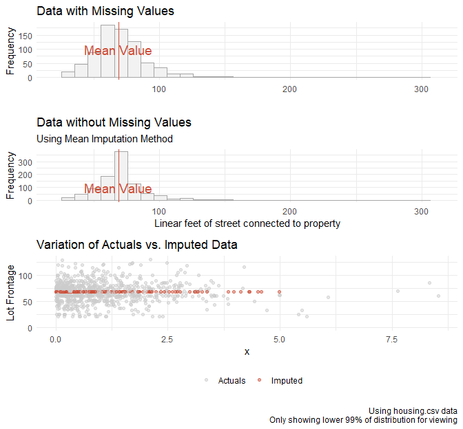<!-- -->

### `ii` Regression with Error Imputation

-   Output seems to capture appropriate variance of the actual data.

-   It is clear that the mean does not change

``` r
fit <- lm(y ~ x, data = df)    # fit a linear model to the data
f   <- summary(fit)

c  <- f[[4]] # extract the coefficients 
se <- f[[6]] # extract the model standard error

# Regression with NO error
dfReg.imp <- df
dfReg.imp[missing,"y"]<- (c[1] + c[2] * dfReg.imp[missing,"x"])

# Imputation by Regression with error. Note se = standard error of model
df.regErrorImputed <- dfReg.imp %>%
  mutate(y = y + if_else(missing, rnorm(n(), 0, se), 0))

# Compare missing vs. non missing for given imputation method
seeImputation(df, df.regErrorImputed, imputationMethod = 'Regression with Error')
```

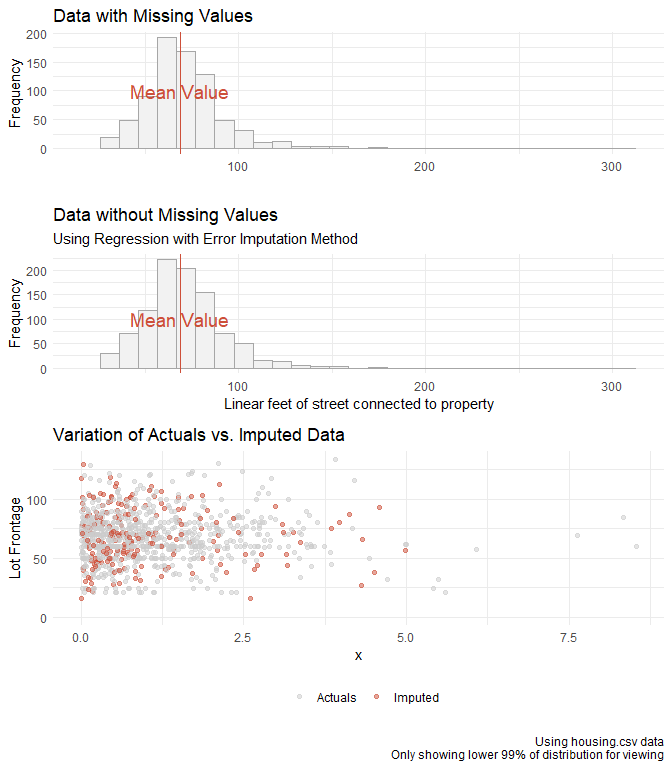<!-- -->

### `iii` Predictive Mean Matching Imputation

-   Output seems to capture appropriate variance of the actual data.

-   It is clear that the mean does not change much, if at all.

``` r
df.pmmImputed <- df # copy data with missingness

# imputation by PMM
df.pmmImputed[missing,"y"] <- mice.impute.pmm( df.pmmImputed$y, 
                                              !df.pmmImputed$missing, 
                                               df.pmmImputed$x)

# Compare missing vs. non missing for given imputation method
seeImputation(df, df.pmmImputed, 
              imputationMethod = 'Predictive Mean Matching (PMM)')
```

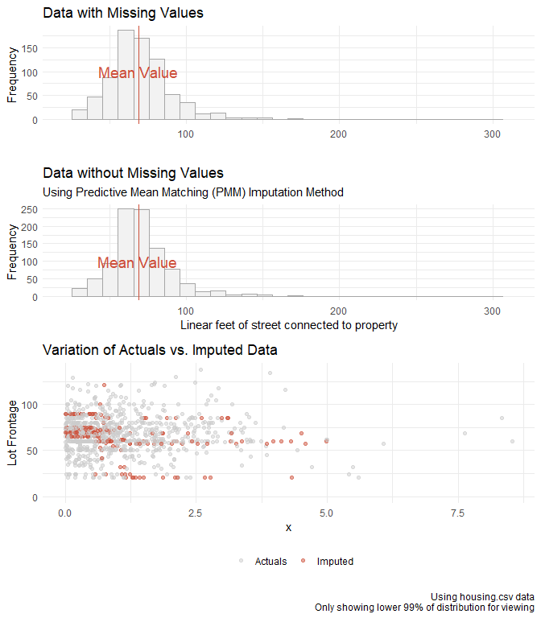<!-- -->

## `2 (c)` - Dummy Variable Manipulation

Collapse the factor levels in the Exterior1st down to only five levels –
the first four levels should be the most frequent levels and all other
levels should be collapsed into a single “Other” level.

Interpretation

-   Now there are only 5 levels for the `Exterior1st` variable

-   4 most frequent left untouched, and the others grouped in `Other`

``` r
housingData <- housingData %>%
  
  # lumps all levels except for the n most frequent 
  mutate(Exterior1st = fct_lump_n(Exterior1st, n=4))

# See that there are only 5 levels now
unique(housingData$Exterior1st)
```

    ## [1] Other   Wd Sdng VinylSd HdBoard MetalSd
    ## Levels: HdBoard MetalSd VinylSd Wd Sdng Other

``` r
length(unique(housingData$Exterior1st))
```

    ## [1] 5

## `2 (d)` - More fun with Factors

### `i` - Get average `SalePrice` for each `Neighborhood` using `tidyverse`

-   Note sorted descending

``` r
housingData %>%
  group_by(Neighborhood) %>%
  summarise(AvgSalePrice = mean(SalePrice)) %>%
  arrange(desc(AvgSalePrice)) %>% # sort descending on sale price
  kable() # output as a kable table
```

<table>
<thead>
<tr>
<th style="text-align:left;">
Neighborhood
</th>
<th style="text-align:right;">
AvgSalePrice
</th>
</tr>
</thead>
<tbody>
<tr>
<td style="text-align:left;">
NoRidge
</td>
<td style="text-align:right;">
328794
</td>
</tr>
<tr>
<td style="text-align:left;">
NridgHt
</td>
<td style="text-align:right;">
283057
</td>
</tr>
<tr>
<td style="text-align:left;">
Timber
</td>
<td style="text-align:right;">
241940
</td>
</tr>
<tr>
<td style="text-align:left;">
ClearCr
</td>
<td style="text-align:right;">
218265
</td>
</tr>
<tr>
<td style="text-align:left;">
Somerst
</td>
<td style="text-align:right;">
211678
</td>
</tr>
<tr>
<td style="text-align:left;">
Crawfor
</td>
<td style="text-align:right;">
209766
</td>
</tr>
<tr>
<td style="text-align:left;">
CollgCr
</td>
<td style="text-align:right;">
194942
</td>
</tr>
<tr>
<td style="text-align:left;">
NWAmes
</td>
<td style="text-align:right;">
191823
</td>
</tr>
<tr>
<td style="text-align:left;">
Gilbert
</td>
<td style="text-align:right;">
189466
</td>
</tr>
<tr>
<td style="text-align:left;">
SawyerW
</td>
<td style="text-align:right;">
183971
</td>
</tr>
<tr>
<td style="text-align:left;">
other
</td>
<td style="text-align:right;">
170248
</td>
</tr>
<tr>
<td style="text-align:left;">
Mitchel
</td>
<td style="text-align:right;">
154788
</td>
</tr>
<tr>
<td style="text-align:left;">
NAmes
</td>
<td style="text-align:right;">
146669
</td>
</tr>
<tr>
<td style="text-align:left;">
Sawyer
</td>
<td style="text-align:right;">
134708
</td>
</tr>
<tr>
<td style="text-align:left;">
Edwards
</td>
<td style="text-align:right;">
128772
</td>
</tr>
<tr>
<td style="text-align:left;">
OldTown
</td>
<td style="text-align:right;">
126023
</td>
</tr>
<tr>
<td style="text-align:left;">
BrkSide
</td>
<td style="text-align:right;">
124844
</td>
</tr>
<tr>
<td style="text-align:left;">
IDOTRR
</td>
<td style="text-align:right;">
114319
</td>
</tr>
</tbody>
</table>
### `ii` - Boxplots of Avg. Sale Price by Neighborhood

``` r
housingData %>%
  ggplot(aes(x = Neighborhood,
             y = SalePrice) ) +
  
  # Boxplots
  geom_boxplot(color = 'steelblue4', fill = 'lightsteelblue1', alpha = 0.7) +
  
  # Theme, y scale format, and labels
  theme_minimal() + theme(panel.grid.major.x = element_blank()) +
  scale_y_continuous(labels = comma) + 
  labs(title = 'Distribution of Sale Prices by Neighborhood',
       x     = 'Neighborhood',
       y     = 'Sale Price of Home')
```

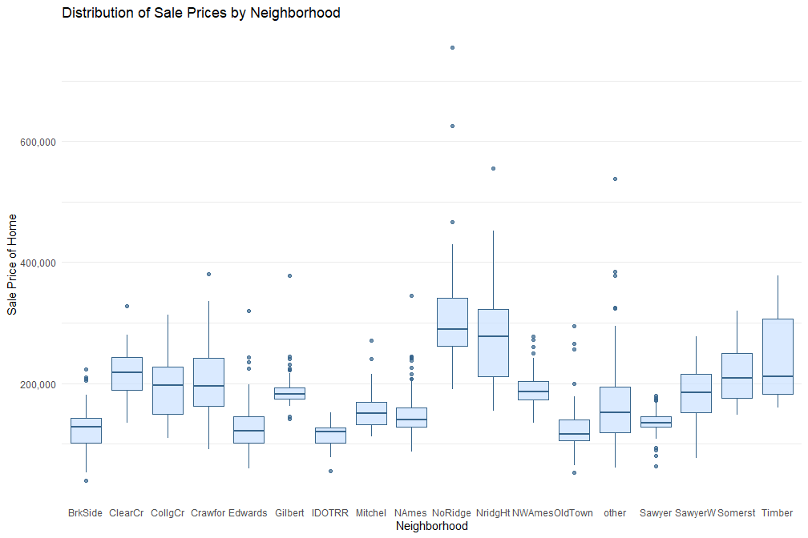<!-- -->

### `iii-iv` - Boxplots Reordered by Descending Sale Price

``` r
housingData %>%
  ggplot(aes(x = fct_reorder(Neighborhood, desc(SalePrice) ),
             y = SalePrice) ) +
  
  # Boxplots
  geom_boxplot(color = 'steelblue4', fill = 'lightsteelblue1', alpha = 0.7) +
  
  # Theme, y scale format, and labels
  theme_minimal() + theme(panel.grid.major.x = element_blank()) +
  scale_y_continuous(labels = comma) + 
  labs(title = 'Distribution of Sale Prices by Neighborhood',
       subtitle = 'Ordered Descending by Sale Price of Home',
       x     = 'Neighborhood',
       y     = 'Sale Price of Home')
```

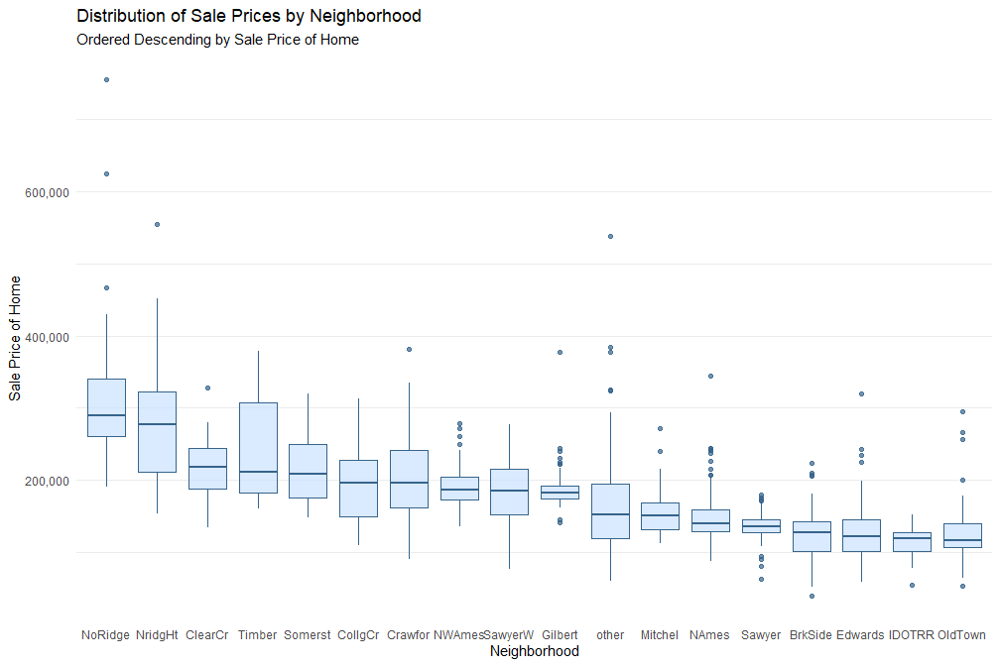<!-- -->

## References

1.  <https://dplyr.tidyverse.org/reference/across.html>  
2.  <https://www.rdocumentation.org/packages/base/versions/3.6.2/topics/options>  
3.  <https://cran.r-project.org/web/packages/kableExtra/vignettes/awesome_table_in_pdf.pdf>
