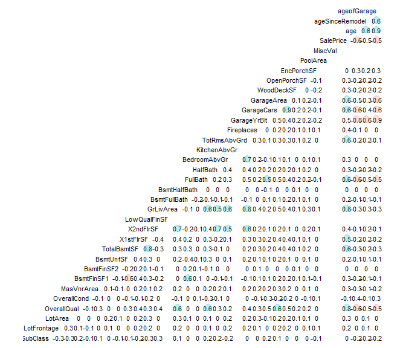

ISE 5103 Intelligent Data Analytics
================
Daniel Carpenter & Sonaxy Mohanty
October 2022

-   <a href="#packages" id="toc-packages">Packages</a>
-   <a href="#general-data-prep" id="toc-general-data-prep">General Data
    Prep</a>
-   <a href="#exploratory-data-analysis"
    id="toc-exploratory-data-analysis">Exploratory Data Analysis</a>
-   <a href="#1-a---ols-model" id="toc-1-a---ols-model"><code>1 (a)</code> -
    OLS Model</a>
    -   <a href="#i" id="toc-i"><code>i</code>.</a>
    -   <a href="#ii-complete-analysis-of-the-residuals"
        id="toc-ii-complete-analysis-of-the-residuals"><code>ii</code>. Complete
        analysis of the residuals</a>
-   <a href="#1-b---pls-model" id="toc-1-b---pls-model"><code>1 (b)</code> -
    PLS Model</a>
-   <a href="#1-c---lasso-model"
    id="toc-1-c---lasso-model"><code>1 (c)</code> - LASSO Model</a>
-   <a href="#1-d---model-variants"
    id="toc-1-d---model-variants"><code>1 (d)</code> - Model Variants</a>
    -   <a href="#1-d-i---pcr-model"
        id="toc-1-d-i---pcr-model"><code>1 (d, i)</code> - PCR Model</a>
    -   <a href="#1-d-ii---svr-model"
        id="toc-1-d-ii---svr-model"><code>1 (d, ii)</code> - SVR Model</a>
    -   <a href="#1-d-iii---mars-model"
        id="toc-1-d-iii---mars-model"><code>1 (d, iii)</code> - MARS Model</a>
-   <a href="#summary-table-of-model-performance"
    id="toc-summary-table-of-model-performance">Summary Table of Model
    Performance</a>
-   <a href="#references" id="toc-references">References</a>

## Packages

``` r
# Data Wrangling
library(tidyverse)

# Modeling
library(MASS)
library(caret) # Modeling variants like SVM
library(earth) # Modeling with Mars
library(pls)  #Modeling with PLS
library(glmnet) #Modeling with LASSO

# Aesthetics
library(knitr)
library(cowplot)  # multiple ggplots on one plot with plot_grid()
library(scales)
library(kableExtra)
library(ggplot2)

#Hold-out Validation
library(caTools)

#Data Correlation
library(GGally)
library(regclass)

#RMSE Calculation
library(Metrics)

#p-value for OLS model
library(broom)

#ncvTest
library(car)
```

## General Data Prep

> For general data preparation, please see conceptual steps below. See
> `.rmd` file for detailed code.

### `(i)` Read Data

``` r
# Convert all character data to factor 
hd <- read.csv('housingData.csv', stringsAsFactors = TRUE) %>%

# creates new variables age, ageSinceRemodel, and ageofGarage and
  dplyr::mutate(age = YrSold - YearBuilt,
                ageSinceRemodel = YrSold - YearRemodAdd,
                ageofGarage = ifelse(is.na(GarageYrBlt), age, YrSold - GarageYrBlt)) %>%

# remove some columns used in the above calculations
  dplyr::select(!c(Id,YrSold , 
                   MoSold, YearBuilt, YearRemodAdd))
```

### `(ii)` Impute Missing Values with `PMM`

Make data set of `numeric` variables `hd.numericRaw`

``` r
hd.numericRaw <- hd %>%
  
  #selecting all the numeric data
  dplyr::select_if(is.numeric) %>%
  
  #converting the data frame to tibble
  as_tibble() 
```

Make data set of `factor` variables `hd.factorRaw`

``` r
hd.factorRaw <- hd %>%
  
  #selecting all the numeric data
  dplyr::select_if(is.factor) %>%
  
  #converting the data frame to tibble
  as_tibble()
```

For each column with missing data, impute missing values with `PMM`

1.  Imputation completed with our created function called
    `imputeWithPMM()`  
2.  Applies function to columns with missing data via dynamic `dplyr`
    logic  
3.  Note `seeImputation()` function to visualize the imputation from
    prior homework 4, not shown for simplicity in viewing

``` r
# Create function to impute via `PMM`
imputeWithPMM <- function(colWithMissingData) {
  
  # Using the mice package
  suppressMessages(library(mice))
  
  # Discover the missing rows
  isMissing <- is.na(colWithMissingData) 
  
  # Create data frame to pass to PMM imputation function from mic package
  df <- data.frame(x       = rexp(length(colWithMissingData)), # meaningless x to help show variation 
                   y       = colWithMissingData, 
                   missing = isMissing)
  
  # imputation by PMM
  df[isMissing, "y"] <- mice.impute.pmm( df$y, 
                                        !df$missing, 
                                         df$x)
  
  return(df$y)
}
```

``` r
# Apply `PMM` function to numeric data containing null values 

# Data to store imputed values with PMM method
hd.Imputed <- hd

# Which columns has Na's?
colNamesWithNulls <- colnames(hd.numericRaw[ , colSums(is.na(hd.numericRaw)) != 0])
colNamesWithNulls
```

    ## [1] "LotFrontage" "MasVnrArea"  "GarageYrBlt"

``` r
numberOfColsWithNulls = length(colNamesWithNulls)


# For each of the numeric columns with null values
for (colWithNullsNum in 1:numberOfColsWithNulls) {
  
  # The name of the column with null values
  nameOfThisColumn <- colNamesWithNulls[colWithNullsNum]
  
  # Get the actual data of the column with nulls
  colWithNulls <- hd[, nameOfThisColumn]
  
  # Impute the missing values with PMM
  imputedValues <- imputeWithPMM(colWithNulls)
  
  # Now store the data in the original new frame
  hd.Imputed[, nameOfThisColumn] <- imputedValues
  
  # Save a visualization of the imputation
  pmmVisual <- seeImputation(data.frame(y = colWithNulls),
                             data.frame(y = imputedValues),
                             nameOfThisColumn )
  
  fileToSave = paste0('OutputPMM/Imputation_With_PMM_', nameOfThisColumn, '.pdf')
  print(paste0('For imputation results of ', nameOfThisColumn, ', see ', fileToSave))
  dir.create("OutputPMM/")
  ggsave(pmmVisual, filename = fileToSave,
         height = 11, width = 8.5)
}
```

    ## [1] "For imputation results of LotFrontage, see OutputPMM/Imputation_With_PMM_LotFrontage.pdf"

    ## [1] "For imputation results of MasVnrArea, see OutputPMM/Imputation_With_PMM_MasVnrArea.pdf"

    ## [1] "For imputation results of GarageYrBlt, see OutputPMM/Imputation_With_PMM_GarageYrBlt.pdf"

<!-- \newpage -->

### `(iii)` Factor Level Collapsing

> Overview: Create `Other` Bin for Columns over `4` Unique Values

-   Applied to any `factor` column (previously `character`) with over 4
    unique values
-   Applies `fct_lump()` function to columns via dynamic `dplyr` logic

``` r
hd.Cleaned <- hd.Imputed # For final cleaned data

# Get list of factors and the number of unique values
factorCols <- as.data.frame(t(hd.factorRaw %>% summarise_all(n_distinct)))

# We are going to factor collapse factor columns with more than 4 columns
# So there will be 4 of the original, and 1 containing 'other'
# This is the threshold
factorThreshold = 4

# Get a list of the factors we are going to collapse
colsWithManyFactors <- rownames(factorCols %>% filter(V1 > factorThreshold))

# Show a summary of how many factors will be collapsed
numberOfColsWithManyFactors = length(colsWithManyFactors)
paste('Before cleaning, there are', numberOfColsWithManyFactors, 'factor columns with more than', 
      factorThreshold, 'unique values')
```

    ## [1] "Before cleaning, there are 14 factor columns with more than 4 unique values"

``` r
# Collapse the affected factors in the original data (the one that already has imputation)

## for each factor column that we are about to collapse
for (collapsedColNum in 1:numberOfColsWithManyFactors) {
  
  # The name of the column with null values
  nameOfThisColumn <- colsWithManyFactors[collapsedColNum]
  
  # Get the actual data of the column with nulls
  colWithManyFactors <- hd[, nameOfThisColumn]
  
  # lumps all levels except for the n most frequent 
  hd.Cleaned[, nameOfThisColumn] <- fct_lump_n(colWithManyFactors, 
                                                       n=factorThreshold)
}

# Check to see if the factor lumping worked
factorColsCleaned <- t(hd.Cleaned %>% 
                       select_if(is.factor) %>%
                       summarise_all(n_distinct))
paste('After cleaning, there are', sum(factorColsCleaned > factorThreshold, na.rm = TRUE), 
      "columns with more than", factorThreshold, "unique values (omitting NA's)")
```

    ## [1] "After cleaning, there are 14 columns with more than 4 unique values (omitting NA's)"

### `(iv)` Remove Outliers from Numeric Data

> Overview: Using numeric data frame, remove *some* outliers from each
> column without dwindling the entire data set. See steps below to
> create data frame `hd.CleanedNoOutliers`.

-   **Please note that NOT all models use this data set with removed
    outliers**.
    -   Only models which are sensitive to outliers use this data frame
        without outliers.  
    -   For example, the linear model using this data frame.

Outlier removal steps below:

-   Since there are so many outliers in each column, we are only going
    to remove some outliers  
-   If you count the number of outliers by column, the 75% of columns
    contain less than 50 outliers.  
-   However, some contain up to 200. Since remove ALL outliers would
    reduce the size of the data to less than 300 observations, we are
    removing up to 50 per numeric column.

``` r
hd.CleanedNoOutliers <- hd.Cleaned

# Remove up to 75% of the outliers in the data set
# this is the 3rd quartile of number of outliers.
k_outliers = 50 
numOutliers = c() # to store the number of outliers per column

theColNames <- colnames(hd.Cleaned)

for (colNum in 1:ncol(hd.Cleaned)) {

  theCol <- hd.Cleaned[, colNum]
  nrowBefore = length(theCol)
  colName <- theColNames[colNum]
  

  # Only consider numeric
  if (is.numeric(theCol)) {
        
    # Identify the outliers in the column
    # Source: https://www.geeksforgeeks.org/remove-outliers-from-data-set-in-r/
    columnOutliers <- boxplot.stats(hd.CleanedNoOutliers[, colNum])$out
    numOutliers <- c(numOutliers, length(columnOutliers))
    
    # Now remove k outliers from the column
    if (length(columnOutliers) < k_outliers) {
      
      hd.CleanedNoOutliers  <- hd.CleanedNoOutliers %>%
        
        # If this syntax looks weird, it is just referencing a column in the 
        # data set using dplyr piping. See below for more info:
        # https://stackoverflow.com/questions/48062213/dplyr-using-column-names-as-function-arguments
        # https://stackoverflow.com/questions/72673381/column-names-as-variables-in-dplyr-select-v-filter
        filter( !( get({{colName}}) %in% columnOutliers ) )
    }
  }
}
paste0('Of the columns with outliers, removed up to 75th percentile of num. outliers.')
```

    ## [1] "Of the columns with outliers, removed up to 75th percentile of num. outliers."

``` r
paste0('See that the 75th percentile of columns with outliers contain ',
       paste0(summary(numOutliers)[5]), ' outliers')
```

    ## [1] "See that the 75th percentile of columns with outliers contain 51.75 outliers"

## Exploratory Data Analysis

### Checking the distribution of Sale Price of houses

``` r
hist(hd.CleanedNoOutliers$SalePrice, 
     col = 'skyblue4',
     main = 'Distribution of Sale Price of houses',
     xlab = 'House Price')
```

<!-- -->

-   After removing the desired outliers, we can see that the
    distribution of `log(Sale Price)` looks like a normal distribution
    with few outliers on the left tail.

### Correlation between features in the dataset

``` r
ggcorr(hd.CleanedNoOutliers, geom='blank', label=T, label_size=3, hjust=1,
       size=3, layout.exp=2) +
  geom_point(size = 4, aes(color = coefficient > 0, alpha = abs(coefficient) >= 0.5)) +
  scale_alpha_manual(values = c("TRUE" = 0.25, "FALSE" = 0)) +
  guides(color = F, alpha = F)
```

<!-- -->

-   We can see that `SalePrice` has strong correlations with
    `GarageArea`, `GarageCars`, `TotRmsAbvGrd`, `FullBath`, `GrLivArea`,
    `X1stFlrSF`, `TotalBsmtSF`, `OverallQual`.

# `1 (a)` - OLS Model

## `i`.

### Hold-out validation set

-   Since, we have deleted some of the outlier values during data
    pre-processing, using 10% of the data as test and remaining 90% as
    train

``` r
idx <- sample(nrow(hd.CleanedNoOutliers), nrow(hd.CleanedNoOutliers)*0.1)
test <- hd.CleanedNoOutliers[idx,]
train <- hd.CleanedNoOutliers[-idx,]
```

### Fit the OLS Model

#### `Model 1`:

-   Linear model containing:
    -   *Independent variables:*
        `GarageArea + GarageCars + TotRmsAbvGrd + FullBath + GrLivArea + X1stFlrSF + TotalBsmtSF + OverallQual`
    -   *Predicted variable:* `SalePrice`

``` r
ols.mdl1 <- lm(log(SalePrice) ~ GarageArea + GarageCars + TotRmsAbvGrd 
              + FullBath + GrLivArea + X1stFlrSF + TotalBsmtSF + OverallQual, data=train)
```

``` r
summary(ols.mdl1)
```

    ## 
    ## Call:
    ## lm(formula = log(SalePrice) ~ GarageArea + GarageCars + TotRmsAbvGrd + 
    ##     FullBath + GrLivArea + X1stFlrSF + TotalBsmtSF + OverallQual, 
    ##     data = train)
    ## 
    ## Residuals:
    ##      Min       1Q   Median       3Q      Max 
    ## -0.60845 -0.07292  0.00978  0.08654  0.47000 
    ## 
    ## Coefficients:
    ##                Estimate Std. Error t value Pr(>|t|)    
    ## (Intercept)   1.065e+01  3.432e-02 310.397  < 2e-16 ***
    ## GarageArea    2.275e-04  5.427e-05   4.192  3.1e-05 ***
    ## GarageCars    5.000e-02  1.609e-02   3.108  0.00196 ** 
    ## TotRmsAbvGrd  5.790e-04  6.649e-03   0.087  0.93064    
    ## FullBath      4.116e-02  1.386e-02   2.968  0.00309 ** 
    ## GrLivArea     2.737e-04  2.583e-05  10.598  < 2e-16 ***
    ## X1stFlrSF    -3.049e-06  2.790e-05  -0.109  0.91300    
    ## TotalBsmtSF   2.164e-04  2.433e-05   8.897  < 2e-16 ***
    ## OverallQual   8.004e-02  6.239e-03  12.829  < 2e-16 ***
    ## ---
    ## Signif. codes:  0 '***' 0.001 '**' 0.01 '*' 0.05 '.' 0.1 ' ' 1
    ## 
    ## Residual standard error: 0.1361 on 724 degrees of freedom
    ## Multiple R-squared:  0.8066, Adjusted R-squared:  0.8044 
    ## F-statistic: 377.3 on 8 and 724 DF,  p-value: < 2.2e-16

``` r
AIC(ols.mdl1)
```

    ## [1] -833.129

``` r
BIC(ols.mdl1)
```

    ## [1] -787.1575

``` r
ols.mdl1.RMSE <- rmse(actual=log(train$SalePrice), predicted=ols.mdl1$fitted.values)
```

``` r
VIF(ols.mdl1)
```

    ##   GarageArea   GarageCars TotRmsAbvGrd     FullBath    GrLivArea    X1stFlrSF 
    ##     3.747991     4.191478     2.992405     1.961489     4.132558     2.622933 
    ##  TotalBsmtSF  OverallQual 
    ##     2.653477     2.050188

-   **For Model 1**: Adjusted R-squared is `0.8138`, AIC is `-847.5004`
    and BIC is `-801.5289` and RMSE is `171456.2`.  
-   Still trying to improve the existing model.  
-   No multicollinearity detected.

#### `Model 2`:

-   This model created is based on `Principal Component Analysis`.
    -   Uses `numeric` data for Principal Component Analysis  
    -   Then appends the `factor` data to the data *without `NULL`
        values*  
    -   Finally, uses `stepAIC()` to best model data

``` r
#Get cleaned `numeric` and `factor` `data frames` for OLS Model
# After cleaning, two data sets that contain..

## Numeric data ---------------------------------------------------
hd.numericClean.OLS <- train %>% select_if(is.numeric)

## Factors -------------------------------------------------------
hd.factorClean.OLS  <- train %>% dplyr::select(where(is.factor))

# Removing any columns with NA
removeColsWithNA <- function(df) {
  return( df[ , colSums(is.na(df)) == 0] )
}
hd.factorClean.OLS <- removeColsWithNA(hd.factorClean.OLS)

paste('Num. factor cols. removed due to null values:', 
      ncol(train %>% dplyr::select(where(is.factor)) ) - ncol(hd.factorClean.OLS) )
```

    ## [1] "Num. factor cols. removed due to null values: 16"

``` r
paste(ncol(hd.factorClean.OLS), 'factor cols. remain') 
```

    ## [1] "22 factor cols. remain"

``` r
# Principal component analysis on numeric data
#to remove zero variance columns from the dataset, using the apply expression, 
#setting variance not equal to zero
pc.house <- prcomp(hd.numericClean.OLS[ , which(apply(hd.numericClean.OLS, 2, var) != 0)] %>%
                     dplyr::select(-SalePrice), # do not include response var
                   center = TRUE, # Mean centered  
                   scale  = TRUE  # Z-Score standardized
                   )

# See first 10 cumulative proportions
pc.house.summary <- summary(pc.house)
pc.house.summary$importance[, 1:10]
```

    ##                            PC1      PC2      PC3      PC4      PC5      PC6
    ## Standard deviation     2.60037 1.860578 1.703664 1.408879 1.145132 1.134045
    ## Proportion of Variance 0.23317 0.119370 0.100090 0.068450 0.045220 0.044350
    ## Cumulative Proportion  0.23317 0.352540 0.452630 0.521070 0.566290 0.610640
    ##                             PC7     PC8      PC9      PC10
    ## Standard deviation     1.047496 1.03631 1.011789 0.9602641
    ## Proportion of Variance 0.037840 0.03703 0.035300 0.0318000
    ## Cumulative Proportion  0.648470 0.68551 0.720810 0.7526000

Now we choose number of PC’s that explain 75% of the variation

-   Note this threshold is just a judgement call. No significance behind
    75%

``` r
cumPropThreshold = 0.75 # The threshold

numPCs <- sum(pc.house.summary$importance['Cumulative Proportion', ] < cumPropThreshold)
paste0('There are ', numPCs, ' principal components that explain up to ', cumPropThreshold*100, 
       '% of the variation in the data')
```

    ## [1] "There are 9 principal components that explain up to 75% of the variation in the data"

``` r
chosenPCs <- as.data.frame(pc.house$x[, 1:numPCs])
```

``` r
#Join on the factor data
df.ols <- cbind(SalePrice = hd.numericClean.OLS$SalePrice, chosenPCs, hd.factorClean.OLS) 
```

### Fit the Model

-   Linear model containing:
    -   Principal components explaining 75% of variation in `numeric`
        data
    -   Non-null `factor` data  
    -   *Predicted variable:* `SalePrice`
-   Then use `stepAIC()` to identify which variables are actually
    important for model

``` r
# Fit data using PC's, non-null factors
fit.ols <- lm(log(SalePrice) ~ ., data = df.ols)

# Reduce to only important variables
ols.mdl2 <- stepAIC(fit.ols, direction="both")
```

-   Reporting `all the variables` of the best model (`Model 2`):

**Coefficient estimates**:

``` r
# Reporting the variables for best model
ols.mdl2.sum <- summary(ols.mdl2)

# Coefficient estimates of the model
ols.mdl2.sum$coefficients
```

    ##                          Estimate  Std. Error       t value      Pr(>|t|)
    ## (Intercept)          1.167879e+01 0.064646815  1.806553e+02  0.000000e+00
    ## PC1                  7.680389e-02 0.003028370  2.536146e+01 4.143975e-100
    ## PC3                 -5.107985e-02 0.004420829 -1.155436e+01  2.686925e-28
    ## PC4                 -1.952798e-02 0.003187462 -6.126497e+00  1.528491e-09
    ## PC5                  8.143573e-03 0.004321925  1.884247e+00  5.996236e-02
    ## PC6                 -3.810332e-02 0.004016721 -9.486176e+00  4.047656e-20
    ## PC7                 -1.116983e-02 0.003823769 -2.921156e+00  3.604130e-03
    ## PC8                 -2.792595e-02 0.004060648 -6.877214e+00  1.396364e-11
    ## PC9                  1.158340e-02 0.003876572  2.988053e+00  2.909807e-03
    ## MSZoningRH          -1.392549e-01 0.049301439 -2.824561e+00  4.874716e-03
    ## MSZoningRL          -5.759490e-02 0.023394921 -2.461855e+00  1.407172e-02
    ## MSZoningRM          -9.890075e-02 0.025652819 -3.855356e+00  1.266424e-04
    ## LandContourHLS       7.917568e-02 0.030573862  2.589652e+00  9.815075e-03
    ## LandContourLow       3.513932e-02 0.037692352  9.322666e-01  3.515331e-01
    ## LandContourLvl      -5.242978e-03 0.019679779 -2.664145e-01  7.900016e-01
    ## LotConfigCulDSac     2.783362e-02 0.018119557  1.536109e+00  1.249815e-01
    ## LotConfigInside     -6.812083e-06 0.010575115 -6.441616e-04  9.994862e-01
    ## LotConfigother      -3.144235e-02 0.020838671 -1.508846e+00  1.318073e-01
    ## NeighborhoodNAmes   -1.857504e-02 0.017338075 -1.071344e+00  2.843988e-01
    ## NeighborhoodOldTown -6.095598e-02 0.023297984 -2.616363e+00  9.086623e-03
    ## Neighborhoodother   -4.113109e-02 0.021351639 -1.926367e+00  5.447939e-02
    ## NeighborhoodOther   -1.113604e-02 0.013611536 -8.181328e-01  4.135709e-01
    ## Condition1Feedr      5.739541e-02 0.027807442  2.064031e+00  3.939756e-02
    ## Condition1Norm       9.461088e-02 0.022540873  4.197303e+00  3.063794e-05
    ## Condition1RR         4.302262e-02 0.032743979  1.313909e+00  1.893244e-01
    ## Condition1Other      6.419995e-02 0.043290673  1.482997e+00  1.385432e-01
    ## BldgType2fmCon      -1.681753e-02 0.041021856 -4.099650e-01  6.819621e-01
    ## BldgTypeDuplex       1.548195e-03 0.053342446  2.902370e-02  9.768543e-01
    ## BldgTypeTwnhs       -2.535442e-02 0.030062593 -8.433877e-01  3.993113e-01
    ## BldgTypeTwnhsE       3.987977e-02 0.023658778  1.685622e+00  9.233208e-02
    ## HouseStyle1Story    -4.902167e-02 0.016020651 -3.059905e+00  2.302086e-03
    ## HouseStyle2Story     1.429854e-02 0.017784937  8.039692e-01  4.216986e-01
    ## HouseStyleSLvl      -1.188674e-02 0.022889846 -5.193018e-01  6.037210e-01
    ## HouseStyleOther     -2.535574e-02 0.022987493 -1.103023e+00  2.704112e-01
    ## RoofStyleHip         1.042899e-02 0.010873944  9.590810e-01  3.378623e-01
    ## RoofStyleother       1.266007e-01 0.031702550  3.993391e+00  7.230766e-05
    ## Exterior1stMetalSd   5.051822e-02 0.046030122  1.097504e+00  2.728138e-01
    ## Exterior1stVinylSd  -2.244993e-03 0.044645448 -5.028492e-02  9.599103e-01
    ## Exterior1stWd Sdng  -5.019232e-02 0.029083733 -1.725787e+00  8.484476e-02
    ## Exterior1stOther     2.299730e-02 0.022168043  1.037408e+00  2.999185e-01
    ## Exterior2ndMetalSd  -3.080838e-02 0.046496157 -6.626005e-01  5.078133e-01
    ## Exterior2ndVinylSd   3.765969e-02 0.045466447  8.282964e-01  4.077963e-01
    ## Exterior2ndWd Sdng   5.924821e-02 0.029647129  1.998447e+00  4.607010e-02
    ## Exterior2ndOther    -7.704962e-03 0.021868124 -3.523376e-01  7.246954e-01
    ## ExterQualAvg        -2.630914e-02 0.013589523 -1.935987e+00  5.328769e-02
    ## ExterQualBelowAvg    3.952126e-02 0.057980661  6.816284e-01  4.957085e-01
    ## FoundationCBlock    -1.609751e-04 0.016553811 -9.724353e-03  9.922441e-01
    ## Foundationother      7.077953e-03 0.035278504  2.006308e-01  8.410479e-01
    ## FoundationPConc      3.719023e-02 0.018743130  1.984206e+00  4.763868e-02
    ## Heatingother         6.036279e-02 0.034290756  1.760323e+00  7.880734e-02
    ## CentralAirY          7.812578e-02 0.025443477  3.070562e+00  2.222598e-03
    ## KitchenQualAvg      -2.971360e-02 0.011663032 -2.547674e+00  1.106562e-02
    ## KitchenQualBelowAvg -5.326673e-02 0.029900390 -1.781473e+00  7.528611e-02
    ## FunctionalMaj2      -2.169423e-01 0.071642698 -3.028114e+00  2.554958e-03
    ## FunctionalMin1       8.985229e-02 0.044632592  2.013154e+00  4.449611e-02
    ## FunctionalMin2       1.118952e-01 0.044095585  2.537560e+00  1.138734e-02
    ## FunctionalMod        2.452407e-02 0.072125766  3.400182e-01  7.339489e-01
    ## FunctionalTyp        1.710032e-01 0.036930262  4.630435e+00  4.380181e-06
    ## PavedDriveP          3.604131e-03 0.030223854  1.192479e-01  9.051146e-01
    ## PavedDriveY          6.053860e-02 0.018705601  3.236389e+00  1.269860e-03

**p-values**:

``` r
# p-values of the model
glance(ols.mdl2)$p.value
```

    ## value 
    ##     0

**Adjusted R-squared**:

``` r
ols.mdl2.sum$adj.r.squared
```

    ## [1] 0.8929468

**AIC**:

``` r
AIC(ols.mdl2)
```

    ## [1] -1226.397

**BIC**:

``` r
BIC(ols.mdl2)
```

    ## [1] -945.9715

**VIF**:

``` r
VIF(ols.mdl2)
```

    ##                     GVIF Df GVIF^(1/(2*Df))
    ## PC1             4.480179  1        2.116643
    ## PC3             4.098099  1        2.024376
    ## PC4             1.456950  1        1.207042
    ## PC5             1.769590  1        1.330259
    ## PC6             1.499033  1        1.224350
    ## PC7             1.159031  1        1.076583
    ## PC8             1.279314  1        1.131068
    ## PC9             1.111431  1        1.054244
    ## MSZoning        3.438020  3        1.228527
    ## LandContour     1.517353  3        1.071966
    ## LotConfig       1.386462  3        1.055969
    ## Neighborhood    5.929401  4        1.249184
    ## Condition1      1.757911  4        1.073062
    ## BldgType        6.947589  4        1.274176
    ## HouseStyle      5.349893  4        1.233227
    ## RoofStyle       1.393339  2        1.086461
    ## Exterior1st  5754.773889  4        2.951233
    ## Exterior2nd  5663.217047  4        2.945323
    ## ExterQual       3.519854  2        1.369718
    ## Foundation      5.306185  3        1.320678
    ## Heating         1.816291  1        1.347698
    ## CentralAir      2.071578  1        1.439298
    ## KitchenQual     3.136071  2        1.330750
    ## Functional      2.054221  5        1.074644
    ## PavedDrive      1.707506  2        1.143117

**RMSE**:

``` r
ols.mdl2.RMSE <- rmse(actual=log(df.ols$SalePrice), predicted=ols.mdl2$fitted.values)
ols.mdl2.RMSE
```

    ## [1] 0.09645116

-   So, we can say that using PCA followed by stepAIC the OLS regression
    model is better as compared to the other OLS model built based on
    their `adjusted R-squared` value.  
-   There is also no multicollinearity found in the model as the VIF
    values are less than 10.

``` r
# Key diagnostics for OLS: lm final summary table
ols.mdl1.sum <- summary(ols.mdl1)

# Get the RMSE and R Squared of the model
keyDiagnostics.ols.mdl1 <- data.frame(Model    = 'OLS',
                                 Notes    = 'lm',
                                 Hyperparameters = 'N/A',
                                 RMSE     = ols.mdl1.RMSE,
                                 Rsquared = ols.mdl1.sum$adj.r.squared)

# Show output
keyDiagnostics.ols.mdl1 %>% 
  knitr::kable()
```

<table>
<thead>
<tr>
<th style="text-align:left;">
Model
</th>
<th style="text-align:left;">
Notes
</th>
<th style="text-align:left;">
Hyperparameters
</th>
<th style="text-align:right;">
RMSE
</th>
<th style="text-align:right;">
Rsquared
</th>
</tr>
</thead>
<tbody>
<tr>
<td style="text-align:left;">
OLS
</td>
<td style="text-align:left;">
lm
</td>
<td style="text-align:left;">
N/A
</td>
<td style="text-align:right;">
0.135216
</td>
<td style="text-align:right;">
0.8044233
</td>
</tr>
</tbody>
</table>

``` r
# Key diagnostics for OLS: lm + 2-way interactions final summary table

# Get the RMSE and R Squared of the model
keyDiagnostics.ols.mdl2 <- data.frame(Model    = 'OLS',
                                 Notes    = 'lm + 2-way interactions',
                                 Hyperparameters = 'N/A',
                                 RMSE     = ols.mdl2.RMSE,
                                 Rsquared = ols.mdl2.sum$adj.r.squared)

# Show output
keyDiagnostics.ols.mdl2 %>% 
  knitr::kable()
```

<table>
<thead>
<tr>
<th style="text-align:left;">
Model
</th>
<th style="text-align:left;">
Notes
</th>
<th style="text-align:left;">
Hyperparameters
</th>
<th style="text-align:right;">
RMSE
</th>
<th style="text-align:right;">
Rsquared
</th>
</tr>
</thead>
<tbody>
<tr>
<td style="text-align:left;">
OLS
</td>
<td style="text-align:left;">
lm + 2-way interactions
</td>
<td style="text-align:left;">
N/A
</td>
<td style="text-align:right;">
0.0964512
</td>
<td style="text-align:right;">
0.8929468
</td>
</tr>
</tbody>
</table>

## `ii`. Complete analysis of the residuals

A linear regression model is considered fit if the below assumptions are
met:

-   **Residuals should follow normal distribution**  
-   **There should be no heteroscedasticity**  
-   **There should be no multicollinearity**

``` r
hist(ols.mdl2$residuals,
     col = 'skyblue4',
     main = 'Histogram of Residuals',
     xlab = 'Residuals')
```

<!-- -->

We can see that the residuals are `normally distributed` with a little
longer left tail, maybe due to presence of outliers.

``` r
par(mfrow=c(2,2)) #combining multiple plots together
plot(ols.mdl2)
```

<!-- -->

-   From the *Residuals vs Fitted* plot, we can see there are points
    above and below the 0 line.  
-   There is also a pattern seen like a `very slight curvature pattern`
    towards the end which indicates that there maybe a systematic lack
    of fit.  
-   The mean of residuals is almost zero which implies there is no
    biasing involved.  
-   From the *Normal Q-Q* plot, we can see that most of the points are
    `very close to the dotted line`, indicating that the residuals
    follow a normal distribution, except some points which might be
    outliers which maybe affecting the regression line fit of data.  
-   Here the *Scale-Location* plot suggests that the red line is roughly
    horizontal across the plot and the spread of magnitude looks
    unequal, at some fitted values there are more residuals as compared
    to other like the ones in between 11.5 and and 12.5, indicating some
    heteroskedasticity.  
-   From the *Residuals vs Leverage* plot, we can see that there are no
    influential points close to the Cook’s distance line in our
    regression model. We need to check `influencePlot` to see if we are
    missing any leverage.

``` r
influencePlot(ols.mdl2)
```

<!-- -->

    ##        StudRes        Hat       CookD
    ## 102 -5.5330720 0.06894614 0.036192140
    ## 330 -7.1066901 0.03219393 0.026082146
    ## 332  1.3649856 0.48649265 0.029381761
    ## 479  0.3970509 0.44261022 0.002089044
    ## 741 -2.9684939 0.39659053 0.095419948
    ## 755  2.8387736 0.39888107 0.088198659

-   We can now see some high influential points for the fitted values.

``` r
#ncv Test
ncvTest(ols.mdl2)
```

    ## Non-constant Variance Score Test 
    ## Variance formula: ~ fitted.values 
    ## Chisquare = 10.53958, Df = 1, p = 0.0011685

Since `p-value` is less than significance level ($\alpha$) of `0.05`,
that means we `reject the null hypothesis` of constant error variance
which indicates heteroscedasticity.

``` r
VIF(ols.mdl2)
```

    ##                     GVIF Df GVIF^(1/(2*Df))
    ## PC1             4.480179  1        2.116643
    ## PC3             4.098099  1        2.024376
    ## PC4             1.456950  1        1.207042
    ## PC5             1.769590  1        1.330259
    ## PC6             1.499033  1        1.224350
    ## PC7             1.159031  1        1.076583
    ## PC8             1.279314  1        1.131068
    ## PC9             1.111431  1        1.054244
    ## MSZoning        3.438020  3        1.228527
    ## LandContour     1.517353  3        1.071966
    ## LotConfig       1.386462  3        1.055969
    ## Neighborhood    5.929401  4        1.249184
    ## Condition1      1.757911  4        1.073062
    ## BldgType        6.947589  4        1.274176
    ## HouseStyle      5.349893  4        1.233227
    ## RoofStyle       1.393339  2        1.086461
    ## Exterior1st  5754.773889  4        2.951233
    ## Exterior2nd  5663.217047  4        2.945323
    ## ExterQual       3.519854  2        1.369718
    ## Foundation      5.306185  3        1.320678
    ## Heating         1.816291  1        1.347698
    ## CentralAir      2.071578  1        1.439298
    ## KitchenQual     3.136071  2        1.330750
    ## Functional      2.054221  5        1.074644
    ## PavedDrive      1.707506  2        1.143117

Generally, VIF values which are greater than 5 or 7 are the cause of
multicollinearity which we do not see in our model.

**Improving the current model**:

-   To improve our model, we need to remove some influential
    observations from our model and then fit the regression model to the
    data.  
-   We can re-build the model with new predictors.  
-   We can also perform variable transformation such as Box-Cox or use
    better evolved models like SVR, PCR etc., and see how it works.

# `1 (b)` - PLS Model

### Model Setup

-   Using the whole data set after PMM imputation and factor level
    collapsing without omitting any outliers
-   Using the predictors - `GarageArea`, `GarageCars`, `TotRmsAbvGrd`,
    `FullBath`, `GrLivArea`, `X1stFlrSF`, `TotalBsmtSF`, `OverallQual`
    which has strong correlations with response variable - `SalePrice`

``` r
#creating a PLS model to predict the log of the sale price
#using 5-fold CV

pls.model <- plsr(log(SalePrice) ~ GarageArea + GarageCars + TotRmsAbvGrd
              + FullBath + GrLivArea + X1stFlrSF + TotalBsmtSF + OverallQual,
              data=hd.Cleaned, scale=TRUE, validation='CV', k=5)
```

-   Hyperparameter tuning to determine the number of PLS components with
    RMSE as the error metric

``` r
#report chart
summary(pls.model)
```

    ## Data:    X dimension: 1000 8 
    ##  Y dimension: 1000 1
    ## Fit method: kernelpls
    ## Number of components considered: 8
    ## 
    ## VALIDATION: RMSEP
    ## Cross-validated using 10 random segments.
    ##        (Intercept)  1 comps  2 comps  3 comps  4 comps  5 comps  6 comps
    ## CV          0.3633   0.1695   0.1532   0.1506   0.1494   0.1492   0.1491
    ## adjCV       0.3633   0.1695   0.1531   0.1505   0.1493   0.1491   0.1490
    ##        7 comps  8 comps
    ## CV      0.1491   0.1491
    ## adjCV   0.1490   0.1490
    ## 
    ## TRAINING: % variance explained
    ##                 1 comps  2 comps  3 comps  4 comps  5 comps  6 comps  7 comps
    ## X                 54.34    62.66    74.93    79.61    83.32    95.82    97.73
    ## log(SalePrice)    78.36    82.58    83.18    83.49    83.60    83.60    83.60
    ##                 8 comps
    ## X                 100.0
    ## log(SalePrice)     83.6

``` r
plot(RMSEP(pls.model),legendpos="topright")
```

<!-- -->

-   From the table, we can see that if we use `6` PLS components only in
    our model, the RMSE drops to `0.1486` and after that even if we keep
    adding components the RMSE still is the same.  
-   Though we are eyeballing the CV component, but from the plot we can
    see that fitting `4` PLS components is enough because even if we are
    adding 2 more components there is not much difference in the CV
    component.  
-   Using the final model with `four PLS components` to make predictions

### Fit the Model

``` r
final.pls <- plsr(log(SalePrice) ~ GarageArea + GarageCars + TotRmsAbvGrd 
              + FullBath + GrLivArea + X1stFlrSF + TotalBsmtSF + OverallQual,4,
              data=hd.Cleaned, scale=TRUE, validation='CV', k=5)

plot(final.pls, plottype = "scores", comps = 1:4)
```

<!-- -->

-   From the above plot, we can see that by using only four PLS
    components we can describe about 80% of the variation in the
    response variable.

-   Metric Calculations:

``` r
beta.pls <- drop(coef(final.pls))
resid.pls <- drop(final.pls$resid)[,4]
rss.pls <- sum(resid.pls^2)/(1000-4)
rmse.pls <- sqrt(mean(resid.pls^2))
ncomps.pls <- final.pls$ncomp
```

``` r
# Key diagnostics for PLS final summary table

# Get the RMSE and R Squared of the model
keyDiagnostics.pls <- data.frame(Model    = 'PLS',
                                 Notes    = 'pls',
                                 Hyperparameters = paste('ncomp = ', ncomps.pls),
                                 RMSE     = rmse.pls,
                                 Rsquared = rss.pls)

# Show output
keyDiagnostics.pls %>% 
  knitr::kable()
```

<table>
<thead>
<tr>
<th style="text-align:left;">
Model
</th>
<th style="text-align:left;">
Notes
</th>
<th style="text-align:left;">
Hyperparameters
</th>
<th style="text-align:right;">
RMSE
</th>
<th style="text-align:right;">
Rsquared
</th>
</tr>
</thead>
<tbody>
<tr>
<td style="text-align:left;">
PLS
</td>
<td style="text-align:left;">
pls
</td>
<td style="text-align:left;">
ncomp = 4
</td>
<td style="text-align:right;">
0.1474771
</td>
<td style="text-align:right;">
0.0218368
</td>
</tr>
</tbody>
</table>

-   If we now compare between our preferred OLS model and PLS model on
    basis of RMSE values, we can see that PLS model’s efficiency is much
    higher.  
-   RMSE for chosen OLS model was `ols.mdl2.rsme` whereas for PLS model
    is `0.1475`.  
-   But we see that the adjusted R-squared value for PLS model has
    significantly reduced to about `2%`.  
-   We know that adjusted R-squared identifies the percentage of
    variance in the response that is explained by the predictors which
    PCA handles in a better way as PCA finds the composite variables of
    predictors that maximally explain the variability of the data,
    whereas PLS finds the composite variables of predictors that are
    most predictive of the response variable. So maybe that’s why we
    have a less adjusted R-squared whereas a better RMSE value.

# `1 (c)` - LASSO Model

### Model Setup

-   We first setup our cross-validation strategy  
-   Then create a dataframe with PMM imputed values, and only whole
    columns without NA. Does not omit outliers  
-   Then we train the model using `glmnet` which actually fits the
    elastic net

``` r
# After cleaning, two data sets that contain..

## Numeric data ---------------------------------------------------
hd.numericClean <- hd.Cleaned %>% select_if(is.numeric)

## Factors -------------------------------------------------------
hd.factorClean  <- hd.Cleaned %>% dplyr::select(where(is.factor))

# Removing any columns with NA
removeColsWithNA <- function(df) {
  return( df[ , colSums(is.na(df)) == 0] )
}
hd.factorClean <- removeColsWithNA(hd.factorClean)

paste('Num. factor cols. removed due to null values:', 
      ncol(hd.Cleaned %>% dplyr::select(where(is.factor)) ) - ncol(hd.factorClean) )
```

    ## [1] "Num. factor cols. removed due to null values: 16"

``` r
paste(ncol(hd.factorClean), 'factor cols. remain') 
```

    ## [1] "22 factor cols. remain"

``` r
ctrl <- trainControl(method  = "repeatedcv", 
                     number  = 5, # 5 fold cross validation
                     repeats = 2  # 2 repeats
                     )

# The data (PMM imputed values, and only whole columns without NA. Does not omit outliers)
df.lasso <- cbind(SalePrice = hd.numericClean$SalePrice, 
                hd.numericClean, hd.factorClean) 
```

### Fit the Model

``` r
# Train and tune the SVM
fit.lasso <- train(data = df.lasso, 
                 log(SalePrice) ~ .,
                 method     = "glmnet",         # Elastic net
                 preProc    = c("center","scale"), # Center and scale data
                 tuneLength = 10,  #10 values of alpha and 10 lamda values for each
                 trControl  = ctrl)
```

``` r
# Function to get the best hypertuned parameters
get_best_result = function(caret_fit) {
  best = which(rownames(caret_fit$results) == rownames(caret_fit$bestTune))
  best_result = caret_fit$results[best, ]
  rownames(best_result) = NULL
  best_result
}
```

``` r
result.lasso <- get_best_result(fit.lasso)
```

-   The variables with non-zero coefficients of the final model:

``` r
lasso.coeff <- drop(coef(fit.lasso$finalModel, fit.lasso$bestTune$lambda))

lasso.coeff[lasso.coeff != 0]
```

    ##         (Intercept)          MSSubClass         LotFrontage             LotArea 
    ##       12.0024696188       -0.0007921493        0.0026478399        0.0230760239 
    ##         OverallQual         OverallCond          MasVnrArea          BsmtFinSF1 
    ##        0.0830224519        0.0472047528        0.0007427026        0.0308870569 
    ##          BsmtFinSF2         TotalBsmtSF           X1stFlrSF        LowQualFinSF 
    ##        0.0025371083        0.0429378869        0.0005909439       -0.0003123244 
    ##           GrLivArea        BsmtFullBath            HalfBath        BedroomAbvGr 
    ##        0.1293293597        0.0097350716        0.0003792692       -0.0014670944 
    ##        KitchenAbvGr          Fireplaces          GarageCars          GarageArea 
    ##       -0.0082947665        0.0238248778        0.0241271452        0.0205714766 
    ##          WoodDeckSF         OpenPorchSF          EncPorchSF            PoolArea 
    ##        0.0054585299        0.0071790500        0.0113333888        0.0002923492 
    ##                 age     ageSinceRemodel          MSZoningRH          MSZoningRM 
    ##       -0.0489369396       -0.0120919238       -0.0023181212       -0.0255125817 
    ##         LotShapeIR3         LotShapeReg      LandContourHLS    LotConfigCulDSac 
    ##       -0.0005678139       -0.0012719892        0.0040202817        0.0041892575 
    ##        LandSlopeMod NeighborhoodOldTown   Neighborhoodother   NeighborhoodOther 
    ##        0.0025765062       -0.0048725734       -0.0037200921        0.0014452209 
    ##      Condition1Norm      BldgTypeDuplex       BldgTypeTwnhs      HouseStyleSLvl 
    ##        0.0142184896       -0.0007300906       -0.0083334148        0.0001146792 
    ##     HouseStyleOther      RoofStyleother  Exterior1stWd Sdng    Exterior1stOther 
    ##       -0.0028496468        0.0089202148       -0.0009953817        0.0018786546 
    ##  Exterior2ndVinylSd        ExterQualAvg   ExterQualBelowAvg        ExterCondAvg 
    ##        0.0029727720       -0.0045240096       -0.0051768565        0.0015378096 
    ##   ExterCondBelowAvg     FoundationPConc        HeatingQCAvg   HeatingQCBelowAvg 
    ##       -0.0010470425        0.0173137043       -0.0060194630       -0.0003914879 
    ##         CentralAirY      KitchenQualAvg KitchenQualBelowAvg      FunctionalMaj2 
    ##        0.0096502825       -0.0071298261       -0.0026199641       -0.0111519085 
    ##       FunctionalTyp         PavedDriveY 
    ##        0.0123207943        0.0060043777

``` r
# Gather key diagnostics for summary table
# Get the RMSE and R Squared of the model
hyperparameters.lasso = list('Alpha' = result.lasso$alpha,
                             'Lambda' = result.lasso$lambda)


keyDiagnostics.lasso <- data.frame(Model    = 'Lasso',
                                 Notes    = 'caret and elasticnet',
                                 Hyperparameters = paste('Alpha =', hyperparameters.lasso$Alpha, ',',
                                                         'Lambda =', hyperparameters.lasso$Lambda))

keyDiagnostics.lasso <- cbind(keyDiagnostics.lasso,
                            RMSE = result.lasso$RMSE,
                             Rsquared =result.lasso$Rsquared
                      )

# Show output
keyDiagnostics.lasso %>% knitr::kable()
```

<table>
<thead>
<tr>
<th style="text-align:left;">
Model
</th>
<th style="text-align:left;">
Notes
</th>
<th style="text-align:left;">
Hyperparameters
</th>
<th style="text-align:right;">
RMSE
</th>
<th style="text-align:right;">
Rsquared
</th>
</tr>
</thead>
<tbody>
<tr>
<td style="text-align:left;">
Lasso
</td>
<td style="text-align:left;">
caret and elasticnet
</td>
<td style="text-align:left;">
Alpha = 0.8 , Lambda = 0.00385954380548551
</td>
<td style="text-align:right;">
0.1003116
</td>
<td style="text-align:right;">
0.9240285
</td>
</tr>
</tbody>
</table>
# `1 (d)` - Model Variants

## `1 (d, i)` - PCR Model

### Model Setup

-   Uses `numeric` data for Principal Component Analysis
    -   Data includes outliers  
    -   Chose number of PC’s that explain 75% of the variation. This is
        just a general judgement call to keep the number of principal
        components low.
-   Then appends the `factor` columns *without `NULL` values* and
    `SalePrice` to the data  
-   Finally, uses `stepAIC()` to best model data  
-   See interpretation at end

``` r
# Get cleaned `numeric` and `factor` `data frames`
# After cleaning, two data sets that contain..

## Numeric data ---------------------------------------------------
hd.numericClean <- hd.Cleaned %>% select_if(is.numeric)

## Factors -------------------------------------------------------
hd.factorClean  <- hd.Cleaned %>% dplyr::select(where(is.factor))

# Removing any columns with NA
removeColsWithNA <- function(df) {
  return( df[ , colSums(is.na(df)) == 0] )
}
hd.factorClean <- removeColsWithNA(hd.factorClean)

paste('Num. factor cols. removed due to null values:', 
      ncol(hd.Cleaned %>% dplyr::select(where(is.factor)) ) - ncol(hd.factorClean) )
```

    ## [1] "Num. factor cols. removed due to null values: 16"

``` r
paste(ncol(hd.factorClean), 'factor cols. remain') 
```

    ## [1] "22 factor cols. remain"

``` r
# Perform PCA
# Principal component analysis on numeric data
pc.house <- prcomp(hd.numericClean %>% dplyr::select(-SalePrice), # do not include response var
                   center = TRUE, # Mean centered  
                   scale  = TRUE  # Z-Score standardized
                   )

# See first 10 cumulative proportions
pc.house.summary <- summary(pc.house)
pc.house.summary$importance[, 1:10]
```

    ##                             PC1      PC2      PC3      PC4      PC5      PC6
    ## Standard deviation     2.654699 1.857165 1.661636 1.412696 1.198246 1.105965
    ## Proportion of Variance 0.213560 0.104520 0.083670 0.060480 0.043510 0.037070
    ## Cumulative Proportion  0.213560 0.318080 0.401740 0.462220 0.505730 0.542790
    ##                             PC7      PC8      PC9     PC10
    ## Standard deviation     1.084074 1.064364 1.030999 1.008343
    ## Proportion of Variance 0.035610 0.034330 0.032210 0.030810
    ## Cumulative Proportion  0.578410 0.612740 0.644950 0.675760

``` r
# Now we choose number of PC's that explain 75% of the variation
# Note this threshold is just a judgement call. No significance behind 75%

cumPropThreshold = 0.75 # The threshold

numPCs <- sum(pc.house.summary$importance['Cumulative Proportion', ] < cumPropThreshold)
paste0('There are ', numPCs, ' principal components that explain up to ', cumPropThreshold*100, 
       '% of the variation in the data')
```

    ## [1] "There are 12 principal components that explain up to 75% of the variation in the data"

``` r
chosenPCs <- as.data.frame(pc.house$x[, 1:numPCs])
```

Join on the `factor` data and `SalePrice`

``` r
df.pcr <- cbind(SalePrice = hd.numericClean$SalePrice, chosenPCs, hd.factorClean) 
```

### Fit the Model

-   Linear model containing:
    -   Principal components explaining 75% of variation in `numeric`
        data
    -   Non-null `factor` data  
    -   *Predicted variable:* `log(SalePrice)`
-   Then use `stepAIC()` to identify which variables are actually
    important for model

``` r
# Fit data using PC's, non-null factors
fit.pcr <- lm(log(SalePrice) ~ ., data = df.pcr)

# Reduce to only important variables
fit.pcrReduced <- stepAIC(fit.pcr, direction="both")
```

``` r
# Key diagnostics for final summary table
est.pcr <- summary(fit.pcrReduced)

# Get the RMSE and R Squared of the model
keyDiagnostics.pcr <- data.frame(Model    = 'PCR',
                                 Notes    = 'lm, prcomp, and stepAIC',
                                 Hyperparameters = 'N/A',
                                 RMSE     = sqrt(mean(fit.pcrReduced$residuals^2)),
                                 Rsquared = est.pcr$adj.r.squared)

# Show output
keyDiagnostics.pcr %>% kable()
```

<table>
<thead>
<tr>
<th style="text-align:left;">
Model
</th>
<th style="text-align:left;">
Notes
</th>
<th style="text-align:left;">
Hyperparameters
</th>
<th style="text-align:right;">
RMSE
</th>
<th style="text-align:right;">
Rsquared
</th>
</tr>
</thead>
<tbody>
<tr>
<td style="text-align:left;">
PCR
</td>
<td style="text-align:left;">
lm, prcomp, and stepAIC
</td>
<td style="text-align:left;">
N/A
</td>
<td style="text-align:right;">
0.1013773
</td>
<td style="text-align:right;">
0.9177087
</td>
</tr>
</tbody>
</table>

View results of step `AIC` model

``` r
summary(fit.pcrReduced)
```

    ## 
    ## Call:
    ## lm(formula = log(SalePrice) ~ PC1 + PC3 + PC4 + PC5 + PC7 + PC9 + 
    ##     PC12 + MSZoning + LandContour + LotConfig + Condition1 + 
    ##     BldgType + HouseStyle + RoofStyle + Exterior1st + ExterQual + 
    ##     ExterCond + Foundation + Heating + CentralAir + KitchenQual + 
    ##     Functional + PavedDrive, data = df.pcr)
    ## 
    ## Residuals:
    ##      Min       1Q   Median       3Q      Max 
    ## -0.69458 -0.06013  0.00372  0.06641  0.31110 
    ## 
    ## Coefficients:
    ##                      Estimate Std. Error t value Pr(>|t|)    
    ## (Intercept)         11.788178   0.054476 216.391  < 2e-16 ***
    ## PC1                  0.097826   0.002396  40.828  < 2e-16 ***
    ## PC3                 -0.054099   0.003786 -14.290  < 2e-16 ***
    ## PC4                 -0.020065   0.003028  -6.627 5.74e-11 ***
    ## PC5                 -0.042290   0.004500  -9.397  < 2e-16 ***
    ## PC7                  0.034703   0.004108   8.447  < 2e-16 ***
    ## PC9                  0.005958   0.003659   1.628 0.103791    
    ## PC12                 0.016985   0.003810   4.458 9.28e-06 ***
    ## MSZoningRH          -0.073277   0.040064  -1.829 0.067713 .  
    ## MSZoningRL          -0.038153   0.020292  -1.880 0.060378 .  
    ## MSZoningRM          -0.118066   0.021931  -5.384 9.21e-08 ***
    ## LandContourHLS       0.075187   0.026685   2.818 0.004939 ** 
    ## LandContourLow      -0.002292   0.028183  -0.081 0.935184    
    ## LandContourLvl      -0.014637   0.018166  -0.806 0.420593    
    ## LotConfigCulDSac     0.039882   0.015134   2.635 0.008544 ** 
    ## LotConfigInside      0.001906   0.009101   0.209 0.834115    
    ## LotConfigother      -0.007785   0.019206  -0.405 0.685323    
    ## Condition1Feedr      0.048342   0.024685   1.958 0.050488 .  
    ## Condition1Norm       0.092076   0.020398   4.514 7.16e-06 ***
    ## Condition1RR         0.048199   0.029206   1.650 0.099218 .  
    ## Condition1Other      0.024039   0.031188   0.771 0.441036    
    ## BldgType2fmCon       0.050671   0.031238   1.622 0.105122    
    ## BldgTypeDuplex       0.026637   0.028144   0.946 0.344163    
    ## BldgTypeTwnhs       -0.037597   0.025399  -1.480 0.139137    
    ## BldgTypeTwnhsE       0.010759   0.018634   0.577 0.563835    
    ## HouseStyle1Story    -0.077090   0.013371  -5.766 1.10e-08 ***
    ## HouseStyle2Story    -0.002235   0.014679  -0.152 0.879026    
    ## HouseStyleSLvl      -0.028825   0.019922  -1.447 0.148247    
    ## HouseStyleOther     -0.053210   0.019369  -2.747 0.006125 ** 
    ## RoofStyleHip         0.015960   0.009352   1.707 0.088240 .  
    ## RoofStyleother       0.100418   0.024695   4.066 5.17e-05 ***
    ## Exterior1stMetalSd   0.025403   0.012732   1.995 0.046306 *  
    ## Exterior1stVinylSd   0.022663   0.011374   1.993 0.046602 *  
    ## Exterior1stWd Sdng  -0.005745   0.013388  -0.429 0.667924    
    ## Exterior1stOther     0.030404   0.011676   2.604 0.009359 ** 
    ## ExterQualAvg        -0.037275   0.011643  -3.201 0.001413 ** 
    ## ExterQualBelowAvg   -0.109878   0.046851  -2.345 0.019220 *  
    ## ExterCondAvg         0.021911   0.011581   1.892 0.058802 .  
    ## ExterCondBelowAvg   -0.001738   0.032734  -0.053 0.957664    
    ## FoundationCBlock     0.005009   0.014363   0.349 0.727338    
    ## Foundationother      0.031231   0.025444   1.227 0.219959    
    ## FoundationPConc      0.052120   0.016508   3.157 0.001643 ** 
    ## Heatingother         0.035643   0.025347   1.406 0.159996    
    ## CentralAirY          0.068068   0.018695   3.641 0.000286 ***
    ## KitchenQualAvg      -0.022613   0.010379  -2.179 0.029606 *  
    ## KitchenQualBelowAvg -0.039207   0.025778  -1.521 0.128607    
    ## FunctionalMaj2      -0.215700   0.061728  -3.494 0.000497 ***
    ## FunctionalMin1       0.026899   0.039008   0.690 0.490618    
    ## FunctionalMin2       0.024274   0.038114   0.637 0.524345    
    ## FunctionalMod        0.005062   0.044792   0.113 0.910040    
    ## FunctionalTyp        0.095708   0.032005   2.990 0.002858 ** 
    ## PavedDriveP         -0.000974   0.025345  -0.038 0.969353    
    ## PavedDriveY          0.050551   0.016182   3.124 0.001839 ** 
    ## ---
    ## Signif. codes:  0 '***' 0.001 '**' 0.01 '*' 0.05 '.' 0.1 ' ' 1
    ## 
    ## Residual standard error: 0.1042 on 947 degrees of freedom
    ## Multiple R-squared:  0.922,  Adjusted R-squared:  0.9177 
    ## F-statistic: 215.2 on 52 and 947 DF,  p-value: < 2.2e-16

### View and Interpret Results

*Please note all interpretations below are approximate, given the
`stepAIC()` uses stochastic modeling.*

**Model performance evaluation:**

-   See that around 28 of the variables cannot be explained by random
    chance, with a probability of 90% or more (see significance codes
    above)

-   Standard errors range from $\pm$ 1-5%, with average around 2%.
    Larger values may indicate higher uncertainty of the estimated
    coefficients.

-   This model explains around 92% of the variation in the
    `log(SalePrice)`. See Adjusted R-Squared for reference.

-   Note this model may exhibit selection bias, since the data excludes
    factor data with null values in the variable.

-   This model would likely doe well for prediction of `log(SalePrice)`,
    given the small range of standard errors, high adjusted R squared,
    and number of significant variables. This model would obviously not
    do well for inference, given we are using principal components that
    mask the numeric data.

**Practical significance evaluation:**

-   The principal components contribute positively about 20% of the sale
    price of the home

-   Residential Medium Density (`MSZoningRM`) reduces the home price by
    around 12%, with a standard error of around 2%.

-   If the exterior quality is below average (`ExterQualBelowAvg`), it
    reduces the home price by around 12%, with a standard error of
    around 5%.

-   If the functionality of the home has 2 major deductions
    (`FunctionalMaj2`), it reduces the home price by around 20%, with a
    standard error of around 6%. While having typical functionality
    (`FunctionalTyp`) increases the home sale price by nearly 10%, with
    a standard error of 3%.

-   See other coefficients of the data for other variables.

### View Predicted vs. Actuals

Note that the Function `predictedVsObserved()` created to compare
predicted vs. observed values from the model. Uses `ggplot2` and model
output to display the following. *See interpretation below*.

``` r
# Function to compare predicted vs. actual (observed) regression outputs
predictedVsObserved <- function(predicted, observed, modelName, outcomeName = 'Log(SalePrice)') {
  
  ## Create data set for predicted vs. actuals
  comparison <- data.frame(observed  = observed,
                           predicted = predicted) %>%
    
    # Row index
    mutate(ID = row_number()) %>%
  
    # Put in single column
    pivot_longer(cols      = c('observed', 'predicted'),
                 names_to  = 'metric',
                 values_to = 'value') 
  
  
  # Plot --- Observed vs. Actuals across all variables in data
  variationScatter <- comparison %>%
    ggplot(aes(x     = ID,
               y     = value,
               color = metric
               )
           ) +
    geom_point(alpha = 0.5, size = 1) + 
    
    labs(title = 'Variation in Predicted vs. Observed Data',
         subtitle = paste('Model:', modelName),
         x = 'X', y = outcomeName) + 
    theme_minimal() + theme(legend.title = element_blank(),
                            legend.position = 'top') +
    scale_color_manual(values = c('grey60', 'palegreen3'))
  
  
  print(variationScatter)
  
  # Limit for x and y axis for scatter of predicted vs. observed
  axisLim = c( min(c(predicted, observed)), max(c(predicted, observed)) )
  
  
  # Simple comparison of data
  plot(x = observed,
       y = predicted,
       main = paste(modelName, 'Model - Actual (Observed) vs. Predicted\n'),
       xlab = paste('Observed Values -', outcomeName),
       ylab = paste('Predicted Values -', outcomeName),
       pch  = 16,
       cex  = 0.75,
       col  = alpha('steelblue3', 1/4),
       xlim = axisLim,
       ylim = axisLim
  )
  
  # Add the Predicted vs. actual line
  abline(lm(predicted ~ observed), col = 'steelblue3', lwd = 2)
  mtext('Predicted ~ Actual', side = 3, adj = 1, col = 'steelblue3')
  
  # Add line for perfectly fit model
  abline(0,1, col = alpha('tomato3', 0.8), lwd = 2)
  mtext('Perfectly Fit Model', side = 1, adj = 0, col = 'tomato3')
}
```

View results of the PCR Model

-   See that the variation in the data is very closely resembled actual
    by changes in independent variables

-   Implication? This model fits its own data well, but what is not know
    if it can predict out of sample data.

-   Note that it the data (blue) deviates slightly from perfect line
    model (red), indicating that the model is slightly skewed from
    predicted and actual data.

``` r
# How do the predicted vs. Actuals Compare?
predictedVsObserved(observed  = log(df.pcr$SalePrice),
                    predicted = predict(fit.pcrReduced),
                    modelName = 'PCR')
```

<!-- --><!-- -->

## `1 (d, ii)` - SVR Model

### Model Setup

``` r
ctrl <- trainControl(method  = "repeatedcv", 
                     number  = 5, # 5 fold cross validation
                     repeats = 2  # 2 repeats
                     )

# The data (PMM imputed values, and only whole columns without NA. Does not omit outliers)
df.svm <- cbind(SalePrice = hd.numericClean$SalePrice, 
                hd.numericClean, hd.factorClean) 
```

### Fit the Model

-   *Predicted variable:* `log(SalePrice)`  
-   *Dependent variables*: non-null factor data (collapsed if over 4
    unique values), and all numeric data (`pmm` imputed if needed).
    Includes outliers

``` r
# Train and tune the SVM
fit.svm <- train(data = df.svm, 
                 log(SalePrice) ~ .,
                 method     = "svmRadial",         # Radial kernel
                 tuneLength = 9,                   # 9 values of the cost function
                 preProc    = c("center","scale"), # Center and scale data
                 trControl  = ctrl)
```

### View and Interpret Results

-   Note all numbers mentioned below are approximate
-   See that the R Squared of the model is around 0.86, and RMSE is 0.14
-   See that the model predicts the data well.
-   Also, note that the model predicts the data with less error than the
    linear model. See this from the RMSE or scatter plot of predicted
    values.

``` r
# Gather key diagnostics for summary table
# Get the RMSE and R Squared of the model
hyperparameters.svm = list('C' = fit.svm[["finalModel"]]@param[["C"]],
                           'Epsilon' = fit.svm[["finalModel"]]@param[["epsilon"]])


keyDiagnostics.svm <- data.frame(Model    = 'SVM',
                                 Notes    = 'caret and svmRadial',
                                 Hyperparameters = paste('C =', hyperparameters.svm$C, ',',
                                                         'Epsilon =', hyperparameters.svm$Epsilon)
                                 )

keyDiagnostics.svm <- cbind(keyDiagnostics.svm,
                            fit.svm$results %>% 
                              filter(C == hyperparameters.svm$C) %>%
                              dplyr::select(RMSE, Rsquared)
                      )

# Show output
keyDiagnostics.svm %>% knitr::kable()
```

<table>
<thead>
<tr>
<th style="text-align:left;">
Model
</th>
<th style="text-align:left;">
Notes
</th>
<th style="text-align:left;">
Hyperparameters
</th>
<th style="text-align:right;">
RMSE
</th>
<th style="text-align:right;">
Rsquared
</th>
</tr>
</thead>
<tbody>
<tr>
<td style="text-align:left;">
SVM
</td>
<td style="text-align:left;">
caret and svmRadial
</td>
<td style="text-align:left;">
C = 4 , Epsilon = 0.1
</td>
<td style="text-align:right;">
0.1400092
</td>
<td style="text-align:right;">
0.8540507
</td>
</tr>
</tbody>
</table>

``` r
# Final model?
fit.svm$finalModel
```

    ## Support Vector Machine object of class "ksvm" 
    ## 
    ## SV type: eps-svr  (regression) 
    ##  parameter : epsilon = 0.1  cost C = 4 
    ## 
    ## Gaussian Radial Basis kernel function. 
    ##  Hyperparameter : sigma =  0.00757293697362188 
    ## 
    ## Number of Support Vectors : 670 
    ## 
    ## Objective Function Value : -161.6045 
    ## Training error : 0.012257

``` r
# How do the predicted vs. Actuals Compare?
predictedVsObserved(observed  = log(df.svm$SalePrice),
                    predicted = predict(fit.svm, df.svm),
                    modelName = 'SVM')
```

<!-- --><!-- -->

## `1 (d, iii)` - MARS Model

### Fit the Model

-   *Predicted variable:* `log(SalePrice)`  
-   *Dependent variables*: non-null factor data (collapsed if over 4
    unique values), and all numeric data (`pmm` imputed if needed).
    Includes outliers

``` r
# Train and tune the MARS model
fit.mars <- train(data = df.svm, # note this is fine since data is the same for this model
                  log(SalePrice) ~ .,
                  method     = "earth",             # Radial kernel
                  tuneLength = 9,                   # 9 values of the cost function
                  preProc    = c("center","scale"), # Center and scale data
                  trControl  = ctrl
                 )
```

``` r
# Key diagnostics for final model

# Get the RMSE and R Squared of the model
hyperparameters.mars = list('degree' = fit.mars[["bestTune"]][["degree"]],
                            'nprune' = fit.mars[["bestTune"]][["nprune"]])

keyDiagnostics.mars <- data.frame(Model   = 'MARS',
                                  Notes    = 'caret and earth',
                                  Hyperparameters = paste('Degree =', hyperparameters.mars$degree, ',',
                                                          'nprune =', hyperparameters.mars$nprune)
                                  )

keyDiagnostics.mars <- cbind(keyDiagnostics.mars,
                            fit.mars$results %>% 
                              filter(degree == hyperparameters.mars$degree,
                                     nprune == hyperparameters.mars$nprune) %>%
                              dplyr::select(RMSE, Rsquared)
                      )

# Show output
keyDiagnostics.mars %>% kable()
```

<table>
<thead>
<tr>
<th style="text-align:left;">
Model
</th>
<th style="text-align:left;">
Notes
</th>
<th style="text-align:left;">
Hyperparameters
</th>
<th style="text-align:right;">
RMSE
</th>
<th style="text-align:right;">
Rsquared
</th>
</tr>
</thead>
<tbody>
<tr>
<td style="text-align:left;">
MARS
</td>
<td style="text-align:left;">
caret and earth
</td>
<td style="text-align:left;">
Degree = 1 , nprune = 17
</td>
<td style="text-align:right;">
0.109485
</td>
<td style="text-align:right;">
0.909223
</td>
</tr>
</tbody>
</table>

### View and Interpret Results

-   See that the model overall performs very well, and in fact performs
    similarly to the PCR model (in terms of RMSE and Adjusted R
    Squared).  
-   Again, unsure if the model would do well for prediction of out of
    sample data, but fits this data extremely well.

``` r
# Final model?
fit.mars$finalModel
```

    ## Selected 17 of 21 terms, and 10 of 94 predictors (nprune=17)
    ## Termination condition: RSq changed by less than 0.001 at 21 terms
    ## Importance: GrLivArea, age, OverallQual, TotalBsmtSF, OverallCond, LotArea, ...
    ## Number of terms at each degree of interaction: 1 16 (additive model)
    ## GCV 0.011145    RSS 10.42157    GRSq 0.9155756    RSq 0.9208976

``` r
# How do the predicted vs. Actuals Compare?
predicted.mars = fit.mars[["finalModel"]][["fitted.values"]]
colnames(predicted.mars) <- 'predicted'

predictedVsObserved(observed  = log(df.svm$SalePrice),
                    predicted = predicted.mars,
                    modelName = 'MARS')
```

<!-- --><!-- -->

# Summary Table of Model Performance

``` r
# Add the key diagnostics here
rbind(keyDiagnostics.ols.mdl1,
      keyDiagnostics.ols.mdl2,
      keyDiagnostics.pls,
      keyDiagnostics.lasso,
      keyDiagnostics.pcr, 
      keyDiagnostics.svm, 
      keyDiagnostics.mars
      ) %>%
  
  # Round to 4 digits across numeric data
  mutate_if(is.numeric, round, digits = 4) %>%
  
  # Spit out kable table
  kable()
```

<table>
<thead>
<tr>
<th style="text-align:left;">
Model
</th>
<th style="text-align:left;">
Notes
</th>
<th style="text-align:left;">
Hyperparameters
</th>
<th style="text-align:right;">
RMSE
</th>
<th style="text-align:right;">
Rsquared
</th>
</tr>
</thead>
<tbody>
<tr>
<td style="text-align:left;">
OLS
</td>
<td style="text-align:left;">
lm
</td>
<td style="text-align:left;">
N/A
</td>
<td style="text-align:right;">
0.1352
</td>
<td style="text-align:right;">
0.8044
</td>
</tr>
<tr>
<td style="text-align:left;">
OLS
</td>
<td style="text-align:left;">
lm + 2-way interactions
</td>
<td style="text-align:left;">
N/A
</td>
<td style="text-align:right;">
0.0965
</td>
<td style="text-align:right;">
0.8929
</td>
</tr>
<tr>
<td style="text-align:left;">
PLS
</td>
<td style="text-align:left;">
pls
</td>
<td style="text-align:left;">
ncomp = 4
</td>
<td style="text-align:right;">
0.1475
</td>
<td style="text-align:right;">
0.0218
</td>
</tr>
<tr>
<td style="text-align:left;">
Lasso
</td>
<td style="text-align:left;">
caret and elasticnet
</td>
<td style="text-align:left;">
Alpha = 0.8 , Lambda = 0.00385954380548551
</td>
<td style="text-align:right;">
0.1003
</td>
<td style="text-align:right;">
0.9240
</td>
</tr>
<tr>
<td style="text-align:left;">
PCR
</td>
<td style="text-align:left;">
lm, prcomp, and stepAIC
</td>
<td style="text-align:left;">
N/A
</td>
<td style="text-align:right;">
0.1014
</td>
<td style="text-align:right;">
0.9177
</td>
</tr>
<tr>
<td style="text-align:left;">
SVM
</td>
<td style="text-align:left;">
caret and svmRadial
</td>
<td style="text-align:left;">
C = 4 , Epsilon = 0.1
</td>
<td style="text-align:right;">
0.1400
</td>
<td style="text-align:right;">
0.8541
</td>
</tr>
<tr>
<td style="text-align:left;">
MARS
</td>
<td style="text-align:left;">
caret and earth
</td>
<td style="text-align:left;">
Degree = 1 , nprune = 17
</td>
<td style="text-align:right;">
0.1095
</td>
<td style="text-align:right;">
0.9092
</td>
</tr>
</tbody>
</table>
# References

1.  <https://rpubs.com/staneaurelius/house_price_prediction>  
2.  <https://www.statology.org/partial-least-squares-in-r/>  
3.  <https://daviddalpiaz.github.io/r4sl/elastic-net.html>
