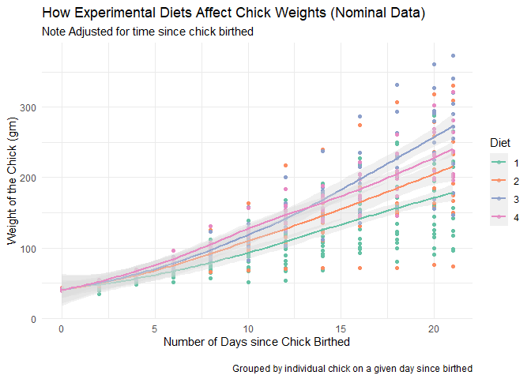
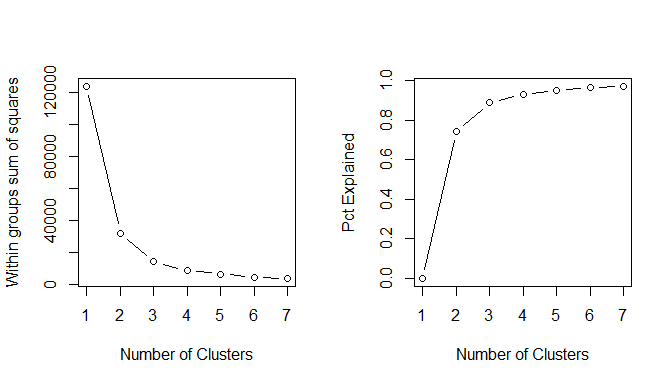
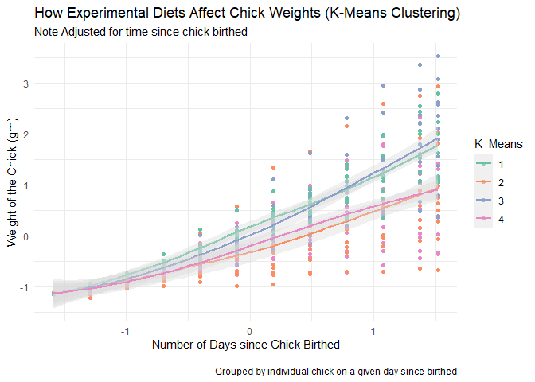
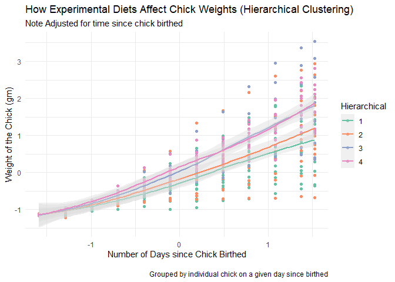
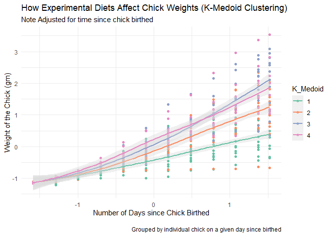

ISE 5103 Intelligent Data Analytics
================
Daniel Carpenter
December 2022

- <a href="#data" id="toc-data">Data</a>
  - <a href="#general-description" id="toc-general-description">General
    Description</a>
  - <a href="#data-understanding" id="toc-data-understanding">Data
    Understanding</a>
    - <a href="#numeric-data-quality-report"
      id="toc-numeric-data-quality-report">Numeric Data Quality Report</a>
    - <a href="#factor-data-quality-report"
      id="toc-factor-data-quality-report">Factor Data Quality Report</a>
  - <a href="#review-actual-groupings-within-unadjusted-or-nominal-data"
    id="toc-review-actual-groupings-within-unadjusted-or-nominal-data">Review
    Actual Groupings within Unadjusted, or Nominal Data</a>
- <a href="#perform-clustering-analysis"
  id="toc-perform-clustering-analysis">Perform Clustering Analysis</a>
  - <a href="#discover-automically-suggested-number-of-clusters"
    id="toc-discover-automically-suggested-number-of-clusters">Discover
    Automically Suggested Number of Clusters</a>
  - <a href="#k-means-clustering" id="toc-k-means-clustering">K-Means
    Clustering</a>
    - <a href="#percentage-confusion-matrix"
      id="toc-percentage-confusion-matrix"><em>Percentage</em> Confusion
      Matrix</a>
    - <a href="#visualization-of-clusters"
      id="toc-visualization-of-clusters">Visualization of Clusters</a>
    - <a href="#interpretation" id="toc-interpretation">Interpretation</a>
  - <a href="#hierarchical-clustering"
    id="toc-hierarchical-clustering">Hierarchical Clustering</a>
    - <a href="#percentage-confusion-matrix-1"
      id="toc-percentage-confusion-matrix-1"><em>Percentage</em> Confusion
      Matrix</a>
    - <a href="#visualization-of-clusters-1"
      id="toc-visualization-of-clusters-1">Visualization of Clusters</a>
    - <a href="#interpretation-1" id="toc-interpretation-1">Interpretation</a>
  - <a href="#k-medoid-clustering" id="toc-k-medoid-clustering">K-Medoid
    Clustering</a>
    - <a href="#percentage-confusion-matrix-2"
      id="toc-percentage-confusion-matrix-2"><em>Percentage</em> Confusion
      Matrix</a>
    - <a href="#visualization-of-clusters-2"
      id="toc-visualization-of-clusters-2">Visualization of Clusters</a>
    - <a href="#interpretation-2" id="toc-interpretation-2">Interpretation</a>

``` r
# options(tinytex.install_packages = FALSE)

# Packages

## Data Wrangling
library(tidyverse)
library(skimr)
library(lubridate) # dates

## Aesthetics
library(knitr)
library(scales)
library(kableExtra)

## Data set 
library(datasets) # chick weights

## Clustering
library(cluster)  # provides more cluster algorithms than base R (e.g. PAM)
library(useful)   # provides a plot function for clusters and "FitKMeans" and "PlotHartigan" functions
library(NbClust)  # provides tons of tools for identifying the "right" number of clusters
```

# Data

> For general data preparation, please see conceptual steps below. See
> `.rmd` file for detailed code.

## General Description

- Data used within model is from the `datasets` R package, called
  `ChickWeights`. [Source of data located
  here.](https://www.rdocumentation.org/packages/datasets/versions/3.6.2/topics/ChickWeight)

- This data represents an experiment performed on 50 recently hatched
  chicks.

- The experimenter fed the chicks 4 separate diets while tracking their
  respective weights over the period of the trials.

- The four groupings of chicks had differing outcomes of weights, which
  can be seen later visuals.

- This model attempts to cluster the chicks based on their weight and
  the time performed, thus *predicting the diet fed to each*.

``` r
# Read data from datasets package
data("ChickWeight")
df.base <- ChickWeight; rm(ChickWeight) # copy

# Make data set of `numeric` variables called `df.base.numeric`
df.base.numeric <- df.base %>%

  # selecting all the numeric data
  dplyr::select_if(is.numeric) %>%

  # converting the data frame to tibble
  as_tibble()

# Make data set of `factor` variables called `df.base.factor`
df.base.factor <- df.base %>%

  #selecting all the numeric data
  dplyr::select_if(is.factor) %>%

  #converting the data frame to tibble
  as_tibble()
```

## Data Understanding

> Create a data quality report of `numeric` and `factor` data

``` r
# Function for data report
dataQualityReport <- function(df) {
  
  # Function to remove any columns with NA
  removeColsWithNA <- function(df) {
    return( df[ , colSums(is.na(df)) == 0] )
  }
  
  # Create Comprehensive data report using skimr package
  # This is done a bit piece-wise because PDF latex does not like the skimr package
  # Very much. So Instead of printing `skim(df)`, I have to pull the contents manually
  # Unfortunately. This is not an issue with html typically.
  dataReport <- skim(df) %>%
    rename_all(~str_replace(.,"skim_","")) %>%
    arrange(type, desc(complete_rate) ) # sort data 
  
  # Filter to the class types
  dataReport.numeric <- dataReport %>% filter(type == 'numeric') # numeric data
  dataReport.factor  <- dataReport %>% filter(type == 'factor' ) # factor  data
  
  # Remove columns that do not apply to this type of data -----------------------
  
  # numeric data
  dataReport.numeric <- removeColsWithNA(dataReport.numeric)  %>%
    
    # Clean column names by removing numeric prefix, 
    rename_all(~str_replace(.,"numeric.","")) 
    
  # factor  data
  dataReport.factor  <- removeColsWithNA(dataReport.factor ) %>%
  
    # Clean column names by removing factor  prefix
    rename_all(~str_replace(.,"factor.",""))  
  
  
  # Set up options for Display the reports
  options(skimr_strip_metadata = FALSE)
  options(digits=2)
  options(scipen=99)
  
  # Numeric report <- Get summary of data frame --------------------------------
  
    # data frame stats
    dfStats.num <- data.frame(Num_Numeric_Variables = ncol(df %>% select_if(is.numeric)),
                              Total_Observations    = nrow(df) )
    
    # Now see individual column statistics
    dfColStats.num <- dataReport.numeric %>% 
      dplyr::select(-type, -hist)
    
  
  # Factor report <- Get summary of data frame --------------------------------
  
    # Get summary of data frame
    dfStats.factor <- data.frame(Num_Factor_Variables = ncol(df %>% select_if(is.factor)),
                                 Total_Observations   = nrow(df) )
    
    # Now see individual column statistics
    dfColStats.factor <- dataReport.factor  %>% 
      dplyr::select(-type, -ordered) 
    
    
  # Return the data frames
  return(list('dfStats.num'       = dfStats.num,    
              'dfColStats.num'    = dfColStats.num,
              'dfStats.factor'    = dfStats.factor, 
              'dfColStats.factor' = dfColStats.factor))
}
```

### Numeric Data Quality Report

``` r
# Get the factor and numeric reports
initialReport <- dataQualityReport(df.base)

# Numeric data frame stats
initialReport$dfStats.num %>% kable()
```

<table>
<thead>
<tr>
<th style="text-align:right;">
Num_Numeric_Variables
</th>
<th style="text-align:right;">
Total_Observations
</th>
</tr>
</thead>
<tbody>
<tr>
<td style="text-align:right;">
2
</td>
<td style="text-align:right;">
578
</td>
</tr>
</tbody>
</table>

``` r
# Numeric column stats
initialReport$dfColStats.num %>%
  kable() #%>% kable_styling(font_size=7, latex_options = 'HOLD_position') # numeric data
```

<table>
<thead>
<tr>
<th style="text-align:left;">
variable
</th>
<th style="text-align:right;">
n_missing
</th>
<th style="text-align:right;">
complete_rate
</th>
<th style="text-align:right;">
mean
</th>
<th style="text-align:right;">
sd
</th>
<th style="text-align:right;">
p0
</th>
<th style="text-align:right;">
p25
</th>
<th style="text-align:right;">
p50
</th>
<th style="text-align:right;">
p75
</th>
<th style="text-align:right;">
p100
</th>
</tr>
</thead>
<tbody>
<tr>
<td style="text-align:left;">
weight
</td>
<td style="text-align:right;">
0
</td>
<td style="text-align:right;">
1
</td>
<td style="text-align:right;">
122
</td>
<td style="text-align:right;">
71.1
</td>
<td style="text-align:right;">
35
</td>
<td style="text-align:right;">
63
</td>
<td style="text-align:right;">
103
</td>
<td style="text-align:right;">
164
</td>
<td style="text-align:right;">
373
</td>
</tr>
<tr>
<td style="text-align:left;">
Time
</td>
<td style="text-align:right;">
0
</td>
<td style="text-align:right;">
1
</td>
<td style="text-align:right;">
11
</td>
<td style="text-align:right;">
6.8
</td>
<td style="text-align:right;">
0
</td>
<td style="text-align:right;">
4
</td>
<td style="text-align:right;">
10
</td>
<td style="text-align:right;">
16
</td>
<td style="text-align:right;">
21
</td>
</tr>
</tbody>
</table>
<!-- \newpage -->

### Factor Data Quality Report

- Note that there are four distinct values within the factor field
  “Diet”.

- Later we will attempt to replicate these 4 groupings through
  clustering.

``` r
# factor data frame stats
initialReport$dfStats.factor %>% kable()
```

<table>
<thead>
<tr>
<th style="text-align:right;">
Num_Factor_Variables
</th>
<th style="text-align:right;">
Total_Observations
</th>
</tr>
</thead>
<tbody>
<tr>
<td style="text-align:right;">
2
</td>
<td style="text-align:right;">
578
</td>
</tr>
</tbody>
</table>

``` r
# factor column stats
initialReport$dfColStats.factor %>%
  kable() #%>% kable_styling(font_size=7, latex_options = 'HOLD_position') # numeric data
```

<table>
<thead>
<tr>
<th style="text-align:left;">
variable
</th>
<th style="text-align:right;">
n_missing
</th>
<th style="text-align:right;">
complete_rate
</th>
<th style="text-align:right;">
n_unique
</th>
<th style="text-align:left;">
top_counts
</th>
</tr>
</thead>
<tbody>
<tr>
<td style="text-align:left;">
Chick
</td>
<td style="text-align:right;">
0
</td>
<td style="text-align:right;">
1
</td>
<td style="text-align:right;">
50
</td>
<td style="text-align:left;">
13: 12, 9: 12, 20: 12, 10: 12
</td>
</tr>
<tr>
<td style="text-align:left;">
Diet
</td>
<td style="text-align:right;">
0
</td>
<td style="text-align:right;">
1
</td>
<td style="text-align:right;">
4
</td>
<td style="text-align:left;">
1: 220, 2: 120, 3: 120, 4: 118
</td>
</tr>
</tbody>
</table>
## Review Actual Groupings within Unadjusted, or Nominal Data

- Below shows data grouped by each chick over multiple periods of time
  within the study.

- The color associates with the diet few to the four groupings of
  chicks.

- The four lines indicate the general trend of weight gain from the diet
  provided to the chicks. For example,

  - Diet 1 provides the least amount of weight gain over all periods,
    relative to the other diet groups.
  - Diet 2 offers the second least weight gain over all periods.
  - Diet 3 and 4 stimulate similar weight gain until \~14 days since the
    chick hatched; however, diet 3 surpasses diet 4 after day 14.

``` r
df.base %>%
  ggplot(aes(y     = weight,
             x     = Time,
             color = Diet
             )) +

  # The points  
  geom_point() +
  
  # Direction of the trend.
  # Generally the higher the diet, the larger the weight
  # Diet 3 is exceptional to that statement
  geom_smooth(fill = 'grey85') +
  
  # Labels
  labs(title    = 'How Experimental Diets Affect Chick Weights (Nominal Data)',
       subtitle = 'Note Adjusted for time since chick birthed',
       x        = 'Number of Days since Chick Birthed',
       y        = 'Weight of the Chick (gm)',
       caption  = '\nGrouped by individual chick on a given day since birthed') + 
  
  # Colors and aesthetics
  scale_color_brewer(palette = 'Set2') +
  theme_minimal()
```

<!-- -->

# Perform Clustering Analysis

- Simply, the model will attempt cluster the chicks by the diet fed to
  them, without knowing what diet was actually given to them.

- The three models will display how the cluster of chicks’ weights trend
  over time, as the past graph has shown.

## Discover Automically Suggested Number of Clusters

- Using the “elbow” method, a plot can visually indicate the number of
  potential clusters that exist within the data set (assuming we do no
  know the actual number).

- The below elbow plots, as well the hidden results of the `NbClust`
  function suggest that there are around 3-5 clusters present within the
  data (based on the time, weight, and chick identifier).

- Knowing that there are 4 distinct clusters, as well the suggestion of
  the elbow point below, the k-mean and k-medoid models will attempt to
  discover four clusters.

``` r
# Elbow plot function provided in lecture
# create our own plot function to look for "Within cluster Sum of square error 'elbow' plot"
# defaults to 15 as clusters max

wssplot <- function(data, nc=15){                    

  par(mfrow=c(1,2))
  
  wss <- NULL  
  pctExp <-NULL
  
  for (k in 1:nc)
  {
     kclus <- kmeans(data, centers=k)
     wss[k] <- kclus$tot.withinss      #store the total within SSE for given k
     pctExp[k] <- 1-wss[k]/kclus$totss
  }
  
  plot(1:nc, wss, type="b", xlab="Number of Clusters",
       ylab="Within groups sum of squares")

  plot(1:nc, pctExp, type="b", xlab="Number of Clusters",
       ylab="Pct Explained")
  
  par(mfrow=c(1,1))
}
```

``` r
# Data prep
df <- df.base # copy to produce altered data (liking scaling)

set.seed(5013) # for similar reproducing

# center and scale dat
df[, c('weight', 'Time')] <- scale( df[, c('weight', 'Time')] )
```

``` r
# Clustering analysis - identify number of clusters

# Check for "elbow" using lecture method
wssplot(df[, 1:3], nc=7)
```

<!-- -->

``` r
# Now try nbClust to see how kmeans identifies it
df.temp <- df
df.temp$Chick <- as.numeric(df$Chick) # needs to be numeric, not factor. so temp change
```

``` r
# Find the suggested number of clusters
# NbClust(df.temp[, 1:3], method="kmeans") # commented for speed of repition.

# Actual cluster - using the above number of suggested clusters 
# Most suggested between (3-5), so try to 4

NUM_CLUSTERS = 4
```

## K-Means Clustering

### *Percentage* Confusion Matrix

- Note that this confusion matrix shows the *percentage* of diet
  classified as the correct or incorrect class.

``` r
# function to show percent confusion matrix
percentConfusionMat <- function(actual, predicted) {
  propTable <- prop.table(table( actual, predicted ), margin = 1)
  
  return( round(propTable, 2) )
}
```

``` r
cl <- kmeans(df[,1:3], NUM_CLUSTERS, nstart=100)
df$K_Means <- as.factor(cl$cluster)

# Check the clustering if it lined up using cofusion matrix
# A few line up, but not necessariliy ordered well
percentConfusionMat( df$Diet, df$K_Means )
```

    ##       predicted
    ## actual    1    2    3    4
    ##      1 0.00 0.24 0.00 0.76
    ##      2 0.00 0.70 0.30 0.00
    ##      3 0.10 0.00 0.90 0.00
    ##      4 1.00 0.00 0.00 0.00

### Visualization of Clusters

``` r
# Create a plot to compare against original diet
df %>%
  ggplot(aes(y     = weight,
             x     = Time,
             color = K_Means
             )) +

  # The points  
  geom_point() +
  
  # Direction of the trend.
  geom_smooth(fill = 'grey85') +
  
  # Labels
  labs(title    = 'How Experimental Diets Affect Chick Weights (K-Means Clustering)',
       subtitle = 'Note Adjusted for time since chick birthed',
       x        = 'Number of Days since Chick Birthed',
       y        = 'Weight of the Chick (gm)',
       caption  = '\nGrouped by individual chick on a given day since birthed') + 
  
  # Colors and aesthetics
  scale_color_brewer(palette = 'Set2') +
  theme_minimal()
```

<!-- -->

### Interpretation

- Note that this model performs the clustering 100 times with 100
  different initial seeds.

- As seen visually or within the confusion matrix, diet 1 and 4
  incorrectly clustered 100% of the time. Diets 2 and 3 separated well,
  given by the percentage-based confusion matrix.

## Hierarchical Clustering

### *Percentage* Confusion Matrix

``` r
# hiearchial clustering 

# hiearchial clustering requires a distance matrix
di <- dist(df[, 1:3], method="euclidean")   # with hiearchical clustering, only need distance matrix

hc.dward <- hclust(di, method="ward.D")

df$Hierarchical <- as.factor(cutree(hc.dward, k=NUM_CLUSTERS)) 

# quick check to see how our 'natural clusters' align with Diet data using ### *Percentage* Confusion Matrix
# Does a GREAT job!
percentConfusionMat( df$Diet, df$Hierarchical ) 
```

    ##       predicted
    ## actual    1    2    3    4
    ##      1 0.88 0.12 0.00 0.00
    ##      2 0.00 0.90 0.10 0.00
    ##      3 0.00 0.00 0.77 0.23
    ##      4 0.00 0.00 0.00 1.00

### Visualization of Clusters

``` r
df %>%
  ggplot(aes(y     = weight,
             x     = Time,
             color = Hierarchical
             )) +

  # The points  
  geom_point() +
  
  # Direction of the trend.
  geom_smooth(fill = 'grey85') +
  
  # Labels
  labs(title    = 'How Experimental Diets Affect Chick Weights (Hierarchical Clustering)',
       subtitle = 'Note Adjusted for time since chick birthed',
       x        = 'Number of Days since Chick Birthed',
       y        = 'Weight of the Chick (gm)',
       caption  = '\nGrouped by individual chick on a given day since birthed') + 
  
  # Colors and aesthetics
  scale_color_brewer(palette = 'Set2') +
  theme_minimal()
```

<!-- -->

### Interpretation

- As seen visually or within the confusion matrix, diet 1, 2, and 3 have
  poor levels of clustering prediction.

- Diet 4 was correctly classified 100% of the time. E.g., the model was
  certain when predicting that the chicks within the diet 4 group were
  fed diet 4.

## K-Medoid Clustering

### *Percentage* Confusion Matrix

``` r
# k mediods (https://www.datanovia.com/en/lessons/k-medoids-in-r-algorithm-and-practical-examples/)
kMed <- pam(df, NUM_CLUSTERS)

df$K_Medoid <- as.factor(kMed$clustering)  

# quick check to see how our 'natural clusters' align with Diet data using ### *Percentage* Confusion Matrix
percentConfusionMat( df$Diet, df$K_Medoid ) 
```

    ##       predicted
    ## actual    1    2    3    4
    ##      1 0.73 0.27 0.00 0.00
    ##      2 0.00 0.80 0.20 0.00
    ##      3 0.00 0.00 0.90 0.10
    ##      4 0.00 0.00 0.00 1.00

### Visualization of Clusters

``` r
df %>%
  ggplot(aes(y     = weight,
             x     = Time,
             color = K_Medoid
             )) +

  # The points  
  geom_point() +
  
  # Direction of the trend.
  geom_smooth(fill = 'grey85') +
  
  # Labels
  labs(title    = 'How Experimental Diets Affect Chick Weights (K-Medoid Clustering)',
       subtitle = 'Note Adjusted for time since chick birthed',
       x        = 'Number of Days since Chick Birthed',
       y        = 'Weight of the Chick (gm)',
       caption  = '\nGrouped by individual chick on a given day since birthed') + 
  
  # Colors and aesthetics
  scale_color_brewer(palette = 'Set2') +
  theme_minimal()
```

<!-- -->

### Interpretation

- As seen visually or within the confusion matrix, the model predicted
  accuracy is the following:
  - Diet : 84% correct. Misclassification between diets 1 and 2.
  - Diet : 90% correct. Misclassification between diets 2 and 3
  - Diet : 100% correct
  - Diet : 100% correct
- Overall, the K-Medoid model offers the highest level of accuracy when
  clustering the chicks into their fed diets, given their
  identification, weight, and time since birthed.
